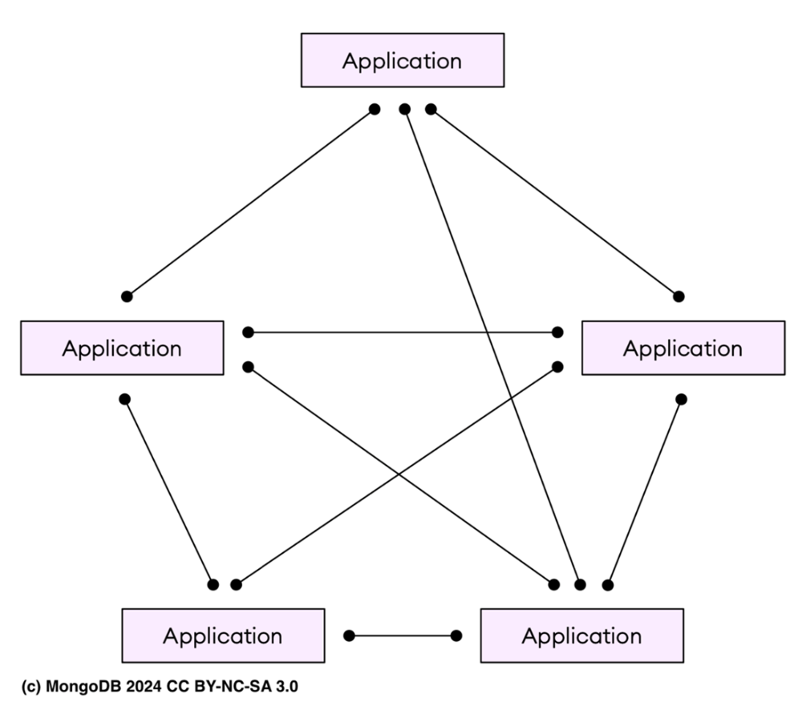
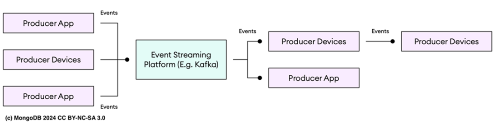
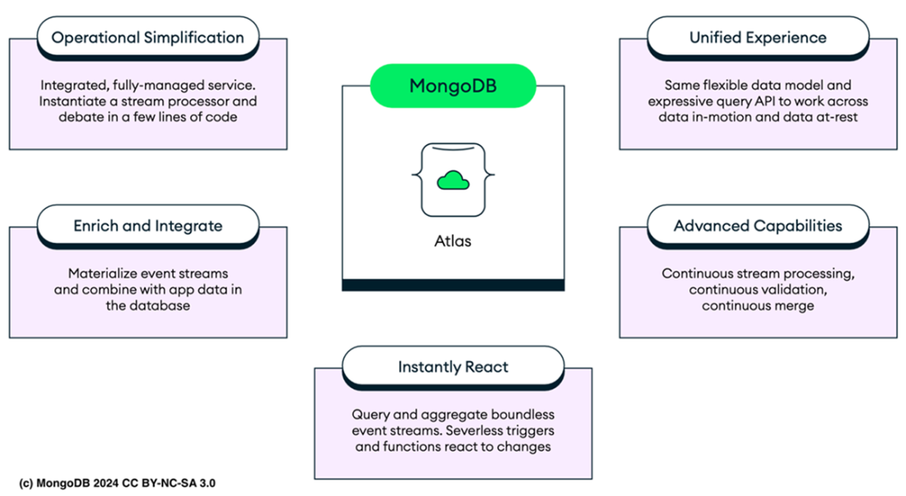
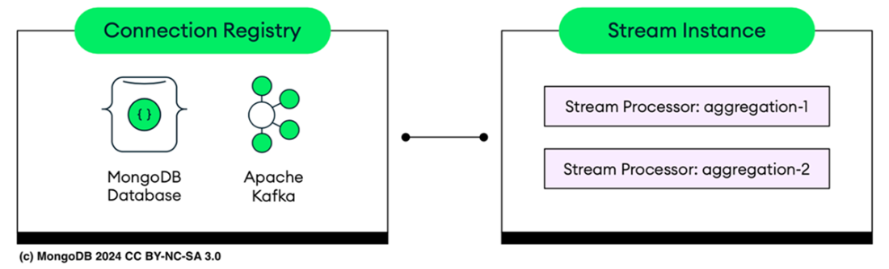
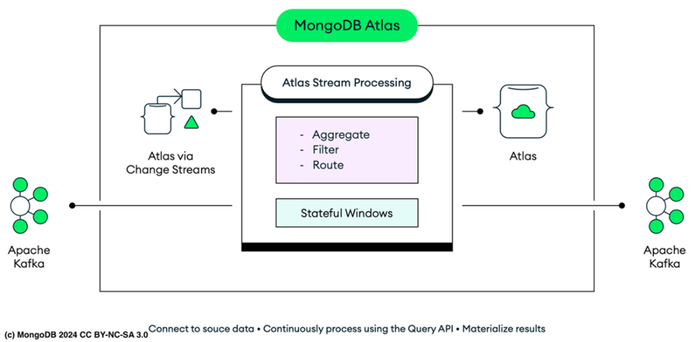

# Chapter 15: Building event-driven applications

This chapter covers the shift to **Event-Driven Architecture**, the concepts of **Stream Processing**, and how **MongoDB Atlas Stream Processing (ASP)** enables real-time data handling.





## 15.1 Understanding event-driven technology
*   **Request/Response vs. Event-Driven:**
    *   **Traditional:** Tightly coupled services polling each other (latency, dependencies).
    *   **Event-Driven:** Decoupled. Services communicate via events (real-time notification).
*   **Event Processing Models:**
    *   **In-app:** Logic embedded in code (hard to scale/maintain).
    *   **In-database:** Send to DB first (adds latency for ingestion/indexing).
*   **Event Streaming Platforms (Kafka):**
    *   Decouples Producers and Consumers.
    *   Stores events persistently on disk in order.
    *   **Figure 15.1 (Description):** Tightly coupled "Point-to-point" system with chaotic web of dependencies.
    *   **Figure 15.2 (Description):** Event-driven system using a platform (like Kafka). Producers send to platform -> Platform manages logs -> Consumers read at their own pace.

## 15.2 Examining the concepts of stream processing

### 15.2.1 Event Time vs. Processing Time
*   **Event Time:** When the event *actually occurred* (more accurate for analytics).
*   **Processing Time:** When the system *processed* the event (easier to implement, less accurate).

### 15.2.2 Using time windows
*   **Tumbling Windows:**
    *   **Non-overlapping**.
    *   Event belongs to exactly one window.
    *   *Use case:* Hourly sales reports.
*   **Hopping Windows:**
    *   **Overlapping**. Defined by Duration + Hop Interval.
    *   Event can belong to multiple windows.
    *   *Use case:* 5-minute moving average of stock prices.

## 15.3 Starting with MongoDB Atlas stream processing
Traditional stream processors (Flink, Kinesis) often have API fragmentation (separate APIs for Stream vs DB) and rigid schemas.

It is worth to mention that the document data model is good for building event-driven applications due to its natural alignment with event structures, both in motion and at rest. Unlike traditional tabular data, documents map directly to event objects in code, making it easier for you to represent and manage complex data without needing additional mapping layers. The model’s flexibility allows you to handle sparse data and adapt document structures as application needs change.



**Benefits of Atlas Stream Processing (ASP):**
*   **Unified API:** Uses the same JSON document model and Aggregation Pipeline for data *in-motion* as data *at-rest*.
*   **Flexible:** Handles complex, nested, or sparse data naturally without rigid tabular conversions.
*   **Figure 15.3 (Description):** Atlas ASP allows easy instantiation of stream processors using the same data model/API for both Database and Stream.

## 15.4 Exploring Atlas Stream Processing



### 15.4.1 Discovering Atlas Stream Processing components
ASP dynamically scales by allocating **workers** (virtual resources with CPU/RAM) as you launch new processors. It prioritizes assigning processors to existing available workers before creating new ones.

#### 1. Connection Registry (Key Store)
Holds configuration details (endpoints, auth credentials) to enable **secure and reliable communication** between the stream processor and external systems.
*   **Scope:** Connections are exclusive to the SPI instance where they are defined.
*   **Usage:**
    *   One connection can support multiple stream processors.
    *   A stream processor can have **only one** data source and **only one** data sink.
    *   Connections are flexible and can act as either source or sink.

#### 2. Stream Processor
Essentially a **MongoDB Aggregation Pipeline** that runs *continuously* against a data stream.
*   **Independence:** Functions as an independent pipeline, **separate from your Atlas cluster**.
*   Acts as a modular unit where data processing pipelines are created and managed.
*   Consists of specialized aggregation stages that **control how events flow** from source to destination (filters, validations, time-based windowing).

#### 3. Stream Processor Instance (SPI)
A designated namespace linked to a cloud region, provider, connection string, and optionally, a **security context** for added protection.
*   **Scaling:**
    *   Manages up to **4 active stream processors**.
    *   Automatically scales **workers** based on the number of *active* processors (defined but inactive processors are ignored).
    *   Workers can be deprovisioned when all their processors are stopped.
*   **Resources:** The amount of RAM and CPU allocated to workers is determined by the **tier** of the stream processing instance.
*   **Infrastructure:** Operates in dedicated customer containers on shared, multi-tenant infrastructure.
*   **Components:** Workers, Cloud Region, Connection Registry, Security Framework, and a unique Connection String.
    *   **Figure 15.4 (Description):** SPI contains multiple processors (e.g., `aggregation-1`). A bidirectional arrow to the Connection Registry signifies dynamic interaction where the instance relies on the registry for credentials/configuration.

### 15.4.2 Capabilities visualization



*   **Figure 15.5 (Description):**
    *   **Ingestion:** Data ingested from Apache Kafka or Atlas Change Streams.
    *   **Processing:** Passed to ASP for continuous operations (aggregation, filtering, routing) using **stateful windows** for time-based analysis.
    *   **Output:** Results materialized into an Atlas Database or sent back to external systems like Kafka.

**With Atlas Stream Processing, you can:**
1.  **Real-time Pipelines:** Create aggregation pipelines that process streams in real-time, eliminating batch processing delays.
2.  **Schema Validation:** Perform ongoing validation to ensure correct formatting, detect corruption, and identify late-arriving data.
3.  **Continuous Output:** Continuously push results to Atlas collections or Kafka clusters for up-to-date views.

**Supported Regions (Table 15.1):**
| Region | Location |
| :--- | :--- |
| **us-east-1** | Virginia, USA |
| **us-west-2** | Oregon, USA |
| **eu-west-1** | Ireland |
| **eu-central-1** | Frankfurt, Germany |
| **ap-southeast-2** | Sydney, Australia |
| **ap-southeast-2** | Sydney, Australia |
(And others: Sao Paulo, London, Mumbai, Tokyo, Singapore, Canada Central)

---

## 15.5 Structuring a stream processor aggregation pipeline
A stream pipeline **must** start with `$source` and can end with `$emit` (Kafka) or `$merge` (Atlas DB).

> **Note:** `$emit` and `$merge` are the **only** stages allowed to persist data to external destinations. Standard writing stages like `$out` are **not** supported.

Subsequent stages process records sequentially and fall into three categories:

1.  **Validation:** (`$validate`) Ensures ingested documents match a schema. Optional.
2.  **Stateless Operations:** Process, transform, and forward documents *individually* (e.g., `$match`, `$project`). Can be placed anywhere.
3.  **Stateful Operations:** Process *sets* of documents (e.g., `$group`, `$avg`). Require **bounded sets** (Windows) to operate.

### 15.5.1 The `$source` stage
**Rule:** Must be the first stage. Only one per pipeline.
**Input Format:** Valid JSON or EJSON.

The `$source` aggregation pipeline stage defines a connection from the Connection Registry to stream data.

#### 1. Apache Kafka Broker
Streams messages from a Kafka topic.
```json
{
  "$source": {
    "connectionName": "<registered-connection>",
    "topic": "<source-topic>",
    "timeField": {
      "$toDate": "<expression>" // or $dateFromString
    },
    "tsFieldName": "<timestamp>",
    "partitionIdleTimeout": {
      "size": <duration>,
      "unit": "<unit>"
    },
    "config": { //Additional configuration settings
      "auto_offset_reset": "earliest", // or 'latest'
      "group_id": "<group-id>",
      "keyFormat": "string", // or 'json', 'binary'
      "keyFormatError": "dlq" // 'discard'
    }
  }
}
```
**Key Configuration Points:**
*   `registered-connection`: Name in Registry for the Kafka broker.
*   `source-topic`: Kafka topic to stream from.
*   `timeField`: Authoritative timestamp field.
    *   `expression`: Format definition (`$toDate` or `$dateFromString`).
*   `tsFieldName`: Overrides default timestamp field name.
*   `partitionIdleTimeout`: Duration a partition can remain idle before being ignored in watermark calculations.
*   `config`:
    *   `auto_offset_reset`: Start event (`earliest`/`latest`).
    *   `group_id`: Consumer group ID.
    *   `keyFormat`: Deserialization type (`string`, `json`, `binary`).
    *   `keyFormatError`: Error handling for deserialization (e.g., write to `dlq`).


#### 2. MongoDB Change Stream (Collection or Database)
Streams real-time changes from Atlas.
```json
{
  "$source": {
    "connectionName": "<registered-connection>",
    "db": "<source-db>",
    "coll": ["<source-coll>"], // Optional: omit for whole DB stream
    "config": {
      "startAfter": "<start-token>", // or startAtOperationTime
      "fullDocument": "updateLookup", // 'required', 'whenAvailable'
      "fullDocumentOnly": false, // boolean
      "fullDocumentBeforeChange": "off", // 'required', 'whenAvailable'
      "pipeline": [] // Filter stream at source
    }
  }
}
```
**Key Configuration Points:**
*   `registered-connection`: Name in Registry for the Atlas cluster.
*   `db`/`coll`: Target database and collection(s) to monitor.
*   `config`:
    *   `startAfter`/`startAtOperationTime`: Resume token or timestamp.
    *   `fullDocument`: Return full document on update (`updateLookup`, `required`).
    *   `fullDocumentOnly`: Return *only* the full document (boolean).
    *   `fullDocumentBeforeChange`: Pre-change document state.
    *   `pipeline`: Aggregation pipeline to filter event stream *at the source*.

#### 3. Document Array (Debugging)
Injects static data for testing/debugging (no external connection required).
```json
{
  "$source": {
    "documents": [
      {"id": 1, "val": "A"},
      {"id": 2, "val": "B"}
    ]
  }
}
```
**Features:**
*   No external connection required.
*   Ideal for testing logic or debugging pipeline behavior with constrained, known inputs.

### 15.5.2 The `$validate` stage
Ensures data conforms to a schema and defines **handling** for documents that fail (e.g., discard or DLQ). Can be placed anywhere after `$source`.
```json
{
  "$validate": {
    "validator": {
      "$and": [
        { "fieldA": { "$exists": true, "$type": "string" } },
        { "fieldB": { "$gte": 10 } }
      ]
    },
    "validationAction": "discard" // or "dlq" (Dead Letter Queue)
  }
}
```
**Key Configuration:**
*   `validator`: A simplified JSON schema or query expression (using standard MongoDB query operators) to enforce structure.
*   `validationAction`:
    *   `discard`: Silently drops invalid documents.
    *   `dlq`: Routes invalid documents to the configured Dead Letter Queue for later inspection.

### 15.5.3 Supported Aggregation Types
**ASP-Specific Stages (Table 15.2):**
*   `$emit`: Sends processed messages to a stream or time series collection as defined in the Connection Registry.
*   `$merge`: Persists output to a MongoDB collection.
*   `$lookup`: Executes a left outer join with a specified collection, pulling in documents from the "joined" collection for further processing
*   `$source`, 
*   `$validate`.
*   `$hoppingWindow`: Defined by window duration and hop interval.
*   `$tumblingWindow`: Defined primarily by a time interval (fixed, non-overlapping windows).

**Standard MongoDB Stages (Table 15.3):**
*   **Anywhere:** `$match`, `$project`, `$addFields`, `$set`, `$unset`, `$lookup`.
*   **Window-Only:** `$group`, `$sort`, `$limit`, `$count` (Must receive finite data sets from a Window stage).

---

## 15.6 Mastering Atlas stream processing

### 15.6.1 Management Methods (`mongosh`)
| Method | Description |
| :--- | :--- |
| `sp.createStreamProcessor()` | Creates a named processor. |
| `sp.process()` | Creates a temporary (ephemeral) processor for testing. |
| `sp.processor.start()` | Starts a persisted processor. |
| `sp.processor.stop()` | Stops a running processor. |
| `sp.processor.stats()` | Returns statistics (throughput, state size). |
| `sp.processor.sample()` | Returns distinct result samples from a running processor. |
| `sp.listConnections()` | Lists available connections in the registry. |

### 15.6.2 Atlas CLI Management
Create an instance using the CLI:
```bash
atlas streams instances create MongoDB-in-Action-SPI --provider AWS --region FRANKFURT_DEU
```
Connect via shell:
```bash
mongosh "mongodb://atlas-stream-URI..." --tls --authenticationDatabase admin --username <user>
```

### 15.6.3 Creating your first stream processor
Use the built-in `sample_stream_solar` connection for testing.
```javascript
let s = {$source: {connectionName: "sample_stream_solar"}}
let processor = [s]
sp.process(processor) // Streams data to console until CTRL+C
```

### 15.6.4 Anatomy of Stream Processor (Examples)

#### 1. Basic Skeleton (Listing 15.2)
```javascript
// A processor is essentially a sequence of stages organized in an array,
// and it can be constructed incrementally using variables within the
// mongosh shell. Right now, this is an empty processor, meaning nothing is
// defined yet.
let processor = [] 
// The first stage must always be a source. The source retrieves data from
// a connection, which is defined in the connection registry.
// For now, the source is empty.
let source = {$source:{}} 
// Add the source to the processor. This creates the first stage in the
// processor pipeline.
processor = [source] 
// At this point, the processor is useful to inspect the source data.
// We can preview the data in the shell by running .process() command.
// This will display the results continuously to the shell.
sp.process(processor) 
// The sink is the final stage. It specifies where the data should go, such
// as sending it to a MongoDB collection using $merge or to a Kafka topic
// using $emit.
let sink = {$merge: {}} 
// This simple processor transfers data from a source to a sink without
// modifying it.
processor = [source, sink] 
// Between the source and the sink, you can add any number of stages to
// process the data. These stages work like standard MongoDB aggregation
// stages, such as $match, $addFields, etc.
processor = [source, stageA, stageB, ..., sink]
// Finally, processors can be saved with a name for future use.
// You can start or stop them as needed.
// When started, they run continuously in the background.
sp.createStreamProcessor('myProcessor', processor); 
sp.myProcessor.start(); 
```

#### 2. Validation with Logic (Listing 15.3)
Discard invalid documents.
```javascript
// Initially, the processor is empty.
let processor = [] //
// The first stage is a source that retrieves data from a MongoDB connection. It’s a placeholders, not actually defined.
let source = {
    $source: {
        connectionName: "myMongoConnection", // placeholder connection name for MongoDB
        db: "myDB",
        coll: "myCollection"
    }
} //
// Database name
// Collection name
// Add the source to the processor.
processor = [source] //
// $validate stage to check that each document has a required structure.
let validate = {
    $validate: {
        validator: {
            $and: [
                {
                    name: { $exists: true, $type: "string" } // Name must be a string and is required
                },
                {
                    age: { $exists: true, $type: "int", $gte: 18 } // Age must be >= 18 and an integer
                },
                {
                    email: { $exists: true, $regex: "^.+@.+\\..+$" } // Email must match a valid pattern
                }
            ]
        },
        validationAction: "discard"
    }
}
// Add the validation stage to the processor.
processor.push(validate) //
// The sink is the final stage. It specifies where the validated data should go.
let sink = {
    $merge: {
        into: {
            connectionName: "validatedDataConnection", // Connection name for MongoDB placeholders, not actually defined.
            db: "validatedDB", // Database name for storing validated data
            coll: "validatedCollection" // Collection name for storing validated data
        }
    }
} //
// Add the sink to the processor.
processor.push(sink) //
// The complete processor transfers data from a source, validates it, and sends it to a sink.
sp.createStreamProcessor('validatedProcessor', processor)
// Start the processor, which will now run continuously in the background.
sp.validatedProcessor.start()
```

#### 3. Dead Letter Queue (DLQ) (Listing 15.4)
Route invalid data to a separate queue instead of discarding.
```javascript
// Initially, the processor is empty.
let processor = [] //
// The source retrieves data from a placeholder connection.
let source = {
    $source: {
        connectionName: "salesDataConnection", // source connection name
        topic: "dailySales"
    }
} //
// Kafka topic as the data source
// Add the source to the processor. This creates the first stage.
processor = [source] //
// Add a $validate stage to ensure the incoming data meets the required structure.
let validate = {
    $validate: {
        validator: {
            $and: [
                {
                    productId: { $exists: true, $type: "string" }, // productId must be a string and is required
                },
                {
                    quantity: { $exists: true, $type: "int", $gte: 1 }, // quantity must be an integer >= 1
                },
                {
                    price: { $exists: true, $type: "double", $gte: 0 } // price must be a positive number
                }
            ]
        },
        validationAction: "dlq" // If validation fails, send data to the Dead Letter Queue (DLQ).
    }
} //
// Add the validation stage to the processor.
processor.push(validate) //
// The sink is the final stage. It specifies where the valid data should go.
let sink = {
    $merge: {
        into: {
            connectionName: "validatedSalesData", // The destination placeholder connection for valid data
            db: "salesDB", // MongoDB database
            coll: "validatedSales" // MongoDB collection
        }
    }
} //
// Add the sink to the processor.
processor.push(sink) //
// The complete processor transfers data from a source, validates it,
// and sends valid data to the MongoDB collection,
// with invalid data sent to the DLQ.
sp.createStreamProcessor('salesDataProcessor', processor) //
// Start the processor, which will run continuously.
sp.salesDataProcessor.start()
```

#### 4. Data Enrichment (`$lookup`) (Listing 15.5)
Join stream data with static Atlas data.
```javascript
let lookup = {
    $lookup: {
        from: {
            connectionName: "atlasConn",
            db: "inventoryDB",
            coll: "products"
        },
        localField: "productId",
        foreignField: "_id",
        as: "productDetails"
    }
}
// Validate AFTER lookup ensures enrichment worked
```

#### 5. Time Windows (`$hoppingWindow`) (Listing 15.6)
Calculate overlapping averages (30s window, hop every 10s).
```javascript
let hoppingWindow = {
    $hoppingWindow: {
        interval: { size: 30, unit: "second" },
        hopSize: { size: 10, unit: "second" },
        pipeline: [
            {
                $group: {
                    _id: "$_id",
                    avgTemperature: { $avg: "$temperature" }
                }
            }
        ]
    }
}
```

#### 6. Debugging with Document Array (Listing 15.7)
Test logic with static data. This is especially useful for debugging and testing because it offers full control over the input and allows for quick validation of your pipeline logic. By using static data, you can focus on testing how each stage of the pipeline processes the data, without the unpredictability of live data sources
```javascript
let source = {
    $source: {
        "documents": [
            { sensor: "A", temp: 45 }, // HIGH warning
            { sensor: "B", temp: 5 }   // LOW warning
        ]
    }
}
// Add projection logic...
sp.process([source, project, filter])
```

### 15.6.5 Setting up Connection Registry
List connections:
```javascript
sp.listConnections()
// Returns array: [{ name: 'mongodb-in-action-connection', type: 'atlas', ... }]
```

### 15.6.6 Persistent Stream Processor (Aggregation)
Example: Calculate max temp and avg watts every 10 seconds.
1.  **Define Source:**
    ```javascript
    let s = {
      $source: { connectionName: "sample_stream_solar", timeField: { $dateFromString: { dateString: '$timestamp' } } }
    }
    ```
2.  **Define Window & Group:**
    ```javascript
    let t = {
      $tumblingWindow: {
        interval: { size: 10, unit: "second" },
        pipeline: [
          {
            $group: {
              _id: "$group_id",
              avg_watts: { $avg: "$obs.watts" },
              max_temp: { $max: "$obs.temp" }
            }
          }
        ]
      }
    }
    ```
3.  **Define Sink:**
    ```javascript
    let m = { $merge: { into: { connectionName: "myConn", db: "spiDB", coll: "spiColl" } } }
    ```
4.  **Create & Start:**
    ```javascript
    sp.createStreamProcessor("calcStats", [s, t, m])
    sp.calcStats.start()
    ```
5.  **Monitor:**
    *   `sp.calcStats.stats()`: View throughput, state size, watermark.
    *   `sp.calcStats.sample()`: View a real-time output document.

---

## 15.7 Controlling the stream processing flow

### 15.7.1 Checkpointing
ASP uses **checkpoint documents** to bookmark progress. If restarted, it resumes from the last committed checkpoint to ensure "at least once" or "exactly once" processing semantics (depending on configuration).

### 15.7.2 Dead Letter Queue (DLQ)
Capture malformed, invalid, or late data without stopping the pipeline.

**Listing 15.8: DLQ Configuration**
```javascript
let dlqConfig = {
  dlq: {
    connectionName: "mongodb-in-action-connection",
    db: "ErrorLogs",
    coll: "TransactionErrors"
  }
}
// Pass config as 3rd argument
sp.createStreamProcessor("TransactionProc", pipeline, dlqConfig)
```

**Triggers for DLQ:**
1.  **Malformed Data:** Data that can't be serialized from JSON to BSON (e.g., binary data from Kafka).
2.  **Failed Validation:** Data that doesn't pass a `$validate` stage checking for schema violations.
3.  **Late Data:** Data arriving after the allowed lateness period in window stages.
4.  **Pipeline Errors:** Runtime errors during processing, such as divide-by-zero.

Define a DLQ for any processor where it’s essential to ensure all data is either processed or sent to the DLQ. This is especially important for production-level stream processors. Use MongoDB Atlas tools, like the Atlas UI and alerts, to monitor DLQ collections and track issues. Capped collections are ideal for preventing DLQs from growing too large in cases with frequent errors. Atlas Database Triggers can be set up on DLQ collections to enable automatic reprocessing and various handling options.

---

## 15.8 Securing Atlas stream processing
*   **Roles:**
    *   **Project Stream Processing Owner:** Full management of instances/registries/DBs.
    *   **Database User Privileges:** Granular actions (`processStreamProcessor`, `startStreamProcessor`, `listConnections`).
*   **Network Access:**
    *   Atlas connections are automatic.
    *   External (Kafka): Whitelist Atlas IPs or use VPC Peering.
*   **Auditing:** Logs authentication and management events.

---

## 15.9 Summary
*   **Event-Driven:** Decouples services using events (Kafka). ASP brings MongoDB's flexible document model to streams.
*   **ASP Architecture:** SPIs run processors that connect via the Registry.
*   **Pipeline:** Starts with `$source`, processes with stages (Stateless or Windowed), ends with `$merge`/`$emit`.
*   **Windows:** `$tumblingWindow` (non-overlapping) vs `$hoppingWindow` (sliding).
*   **Management:** `mongosh` `sp` helper methods make creation and monitoring easy.
*   **Reliability:** Checkpointing and DLQs ensure robustness.


