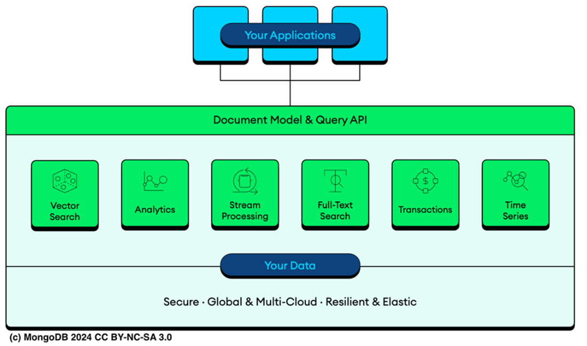
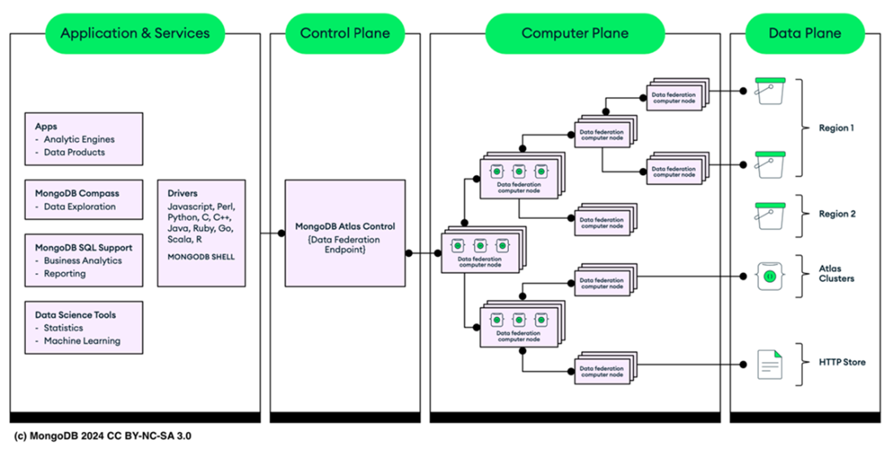

# Chapter 16: Optimizing data processing with Atlas Data Federation

This chapter covers the **Unified Query API**, the architecture of **Atlas Data Federation**, and how to deploy and manage federated database instances to query data across MongoDB Atlas and external cloud storage.

## 16.1 Querying AWS S3 and Azure Blob Store Data via MongoDB Query API

**Atlas Data Federation** is a distributed query engine that allows you to unifiedly query, transform, and analyze data across:
*   MongoDB Atlas Clusters
*   Atlas Online Archives
*   Cloud Storage (AWS S3, Azure Blob Store)
*   HTTP/HTTPS Endpoints

### Key Benefits
*   **Virtual Databases:** Create a single view of your data without moving it.
*   **Eliminate ETL:** Run real-time queries on data in S3/Azure without complex Extract-Transform-Load pipelines.
*   **Unified API:** Use the standard **MongoDB Query Language (MQL)** or **SQL** to access diverse data sources.

**(Description of Figure 16.1):** Validates the concept where the Unified Query API sits between the user and raw data sources (like AWS S3). You write standard MQL queries, and the API translates them to retrieve data from object storage.

---

## 16.2 Atlas Data Federation architecture

The architecture consists of four distinct planes that work together to provide a seamless query experience.

**(Description of Figure 16.2):**
*   **Layer 1 (App & Services):** Tools like Compass, Drivers, and Charts.
*   **Layer 2 (Control Plane):** Orchestrates requests and aggregates final results.
*   **Layer 3 (Compute Plane):** Elastic pool of compute nodes that process data.
*   **Layer 4 (Data Plane):** The actual storage (S3, Atlas, Azure) accessed via secure connectors.

### Component Breakdown
1.  **Application & Services:** Interface for interaction (Drivers, Compass).
2.  **Control Plane:** Manages orchestration and aggregation of results.
3.  **Compute Plane:** Process data requests. Crucially, these nodes are **strategically placed close to data sources** to minimize latency (Data Locality).
4.  **Data Plane:** The physical storage. Supports Role-Based Access Control (RBAC) and connects to:
    *   AWS S3
    *   Azure Blob Storage
    *   Atlas Clusters
    *   HTTP/HTTPS endpoints

### Capabilities
*   **Copy Data:** Archive data from Atlas to S3/Azure as Parquet or CSV.
*   **Federated Query:** Query across multiple clusters and archives instantly.
*   **Materialization:** Run aggregations on S3 data and store the results back into an Atlas cluster.

> **TIP:** To avoid high data transfer charges/latency, always set up your Atlas Data Federation instance in the **same region** as your S3 bucket or Azure Blob Store.
> *   AWS Federated Instances -> Query AWS S3.
> *   Azure Federated Instances -> Query Azure Blob.

> **TIP:** The **Atlas SQL Interface** is enabled by default, allowing you to use standard SQL to query your federated data.

---

## 16.3 Deploying Atlas Federated Database instance

Follow these steps to set up a Federated Database in the Atlas UI:

1.  **Navigate:** Go to the **Data Federation** tab in the Atlas sidebar.
2.  **Create:** Click **Create New Federated Database**.
3.  **Configure:**
    *   **Name:** Assign a unique name to your virtual database.
    *   **Data Sources:** Drag and drop sources (e.g., an Atlas Cluster or an AWS S3 Bucket).
        *   *For S3:* You must authorize the connection using an **AWS IAM Role**.
    *   **Collections:** Choose to map all collections or specific ones.
4.  **Define Storage Configuration:**
    *   Map your virtual collections to the physical paths (buckets/databases).
    *   Configure file formats (JSON, BSON, CSV, Parquet).
5.  **Finalize:** Click **Create**.

Once deployed, you can connect using a standard MongoDB connection string, but the "database" you connect to is a virtual web of your distributed data.

---

## 16.4 Limitations of Data Federation

While powerful, Data Federation has specific constraints:

*   **Authentication:** Only supports SCRAM, X.509, OIDC, and AWS IAM.
*   **No Monitoring:** Standard Atlas monitoring tools do **not** support federated instances.
*   **Single AWS Account:** A federated instance cannot span S3 buckets associated with *multiple* AWS accounts.
*   **Document Size:** Maximum **16MB** per document (queries exceeding this on a single doc will fail).
*   **Ordering:** Document order is **not guaranteed** between queries unless explicitly sorted.
*   **Concurrency Limits:**
    *   **Connections:** Max 60 simultaneous connections per region.
    *   **Queries:** Max 30 simultaneous queries.
*   **Indexes:** You **cannot create indexes** on federated instances (performance depends on data layout/partitions).

> **TIP:** A cursor is automatically terminated if it processes less than **16 MiB** of results per minute.

---

## 16.5 Charges of Data Federation

Costs are split into two categories:

### 1. Data Processing
*   **Rate:** **$5.00 per TB** of data processed.
*   **Minimum:** 10 MB per query.
*   **Optimization:** Partitioning is critical.
    *   *Example:* If you query a 10 GB unpartitioned file, you pay for 10 GB processed. If partitioned into 10 x 1GB files and you only need data from one, you only pay for 1 GB.

### 2. Data Transfer
*   **Incurred for:**
    *   Results returned to the client.
    *   Data moved between internal query nodes.
    *   Writes during `$out` or `$merge`.
*   **Rate:** Depends on the Cloud Provider (e.g., AWS ~$0.01 per GB).

---

## 16.6 Summary

*   **Concept:** Atlas Data Federation is a distributed query engine merging Atlas clusters, S3/Azure Blob, and HTTP endpoints into **Virtual Databases**.
*   **No ETL:** Allows direct analysis of archived/lake data using MQL or SQL.
*   **Architecture split:**
    *   **Compute Plane:** Processes queries (elasticity).
    *   **Data Plane:** Stores data (S3, Atlas).
*   **Deployment:** Easy setup via Atlas UI; requires AWS IAM/Azure roles for external access.
*   **Constraints:** No indexes, strict connection limits, and specific authentication methods.
*   **Cost Efficiency:** Partition your data to minimize the "Data Processed" bill ($5/TB).
