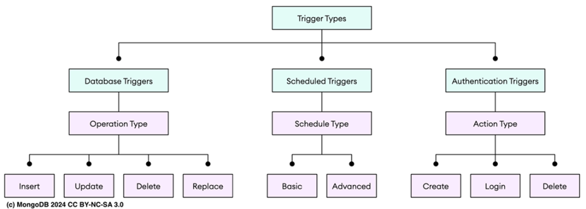

# Chapter 19: Creating Atlas charts, database triggers, and functions

This chapter covers **Atlas Charts** for data visualization and **Atlas Application Services** (Triggers & Functions) for implementing serverless, event-driven backend logic.

## 19.1 Visualizing data with Atlas Charts

**Atlas Charts** is a native data visualization tool that lets you build dashboards directly from your MongoDB data without moving it to external BI tools.

**(Description of Figure 19.1):** A dashboard showing movie statistics (Average Metacritic score, Ratings distribution, Top Genres/Languages) to verify the diverse visualization capabilities.

### Key Components
*   **Data Source:** Connects to Collections or Views.
*   **Charts:** Single visualizations (Bar, Line, Heatmap, Geospatial, etc.).
*   **Dashboards:** Collections of charts.

### 19.1.1 Natural Language Mode (AI)
You can generate charts by typing plain English queries (e.g., *"What are the top 10 cuisines by restaurant count?"*).

**(Description of Figure 19.2):** A chart generated by AI showing American cuisine dominating in Manhattan.

*   **Privacy:** Queries, Schema, and Sample data are sent to the AI provider (Azure OpenAI), but credentials remain secure.
*   **Behind the Scenes:** Atlas automatically generates complex aggregation pipelines to fulfill the request.

**Example Generated Aggregation:**
```javascript
{ "$group": { ... } }, // Groups restaurants by cuisine
{ "$sort": { "__agg_sum": -1 } }, // Sorts by count
{ "$limit": 10 } // Takes top 10
```

### 19.1.2 Billing Dashboards
Charts can visualize your **Atlas usage costs**.
*   **Metrics:** Total spend, Top spenders, Cost by SKU/Category.
*   **Use Case:** Budget management and spotting anomalies in cloud spending.

**(Description of Figure 19.3):** A billing dashboard visualizing daily spending trends and project-level cost breakdowns.

### Pricing Rules
*   **Free Tier:** 1 GB of data transfer per month (~500k renders).
*   **Overage:** $1.00 per GB thereafter.
*   **Hosting:** Hosted in AWS `us-east-1` (Virginia).

---

## 19.2 Atlas Application Services

This suite enables **Reactive, Event-Driven** applications using **Triggers** and **Functions**.

### 19.2.1 Atlas Database Triggers



Triggers allow you to execute server-side logic automatically in response to database events (Insert, Update, Delete).

**(Description of Figure 19.4):** Shows the three trigger types: Database, Scheduled, and Authentication.

Atlas MongoDB triggers run on a separate serverless computing layer, which scales independently from the database server itself. Triggers can automatically invoke Atlas functions and also send events to external services using AWS EventBridge.

Database triggers utilize MongoDB change streams to monitor real-time changes within a collection.
When multiple triggers are enabled on the same collection, they all use a single, shared change stream.

**Trigger Types:**
1.  **Database:** Fires on document changes (uses Change Streams).
2.  **Scheduled:** Runs on a timer (CRON).
3.  **Authentication:** Fires on User Login/Creation/Deletion.

**Performance:**
*   **Ordered:** Processes events sequentially (one at a time).
*   **Unordered:** Processes in parallel (up to 10k concurrently).

#### Creating a Trigger
**(Description of Figure 19.5):** The "Add Trigger" interface where you execute configuration (Name, Type, Source Collection, Operation Types).

**Example: Logging Trigger (Listing 19.1)**
A function that acts as an audit log, recording every change to a separate `logs` collection.
```javascript
exports = async function(changeEvent) {
  const { operationType, documentKey } = changeEvent;
  const logs = context.services.get("Cluster0").db("db").collection("logs");

  if (operationType === 'insert') {
    await logs.insertOne({
      op: "insert",
      docId: documentKey._id,
      time: new Date()
    });
  }
  // Logic for update/delete...
};
```

### 19.2.2 Writing Atlas Functions
**Functions** are serverless JavaScript (Node.js) code snippets. They abstract infrastructure, allowing you to focus on logic.

*   **Context:** Functions run with a `context` object providing access to:
    *   `context.services`: Access MongoDB Atlas clusters.
    *   `context.user`: Detailed info on the invoking user.
    *   `context.http`: For making external API calls.

**Example: Calling External API (Listing 19.2)**
Fetches user data from a 3rd party API and returns formatted info.
```javascript
exports = async function fetchUserData() {
  try {
    // 1. Get User ID from context
    const userId = context.user.custom_data.id;

    // 2. Make HTTP Request
    const response = await context.http.get({
      url: `https://api.example.com/user/${userId}`
    });

    // 3. Parse & Return
    const data = JSON.parse(response.body.text());
    return `User: ${data.name}, Email: ${data.email}`;

  } catch (err) {
    return "Error fetching data";
  }
};
```

**Common Use Cases:**
*   Data Validation/Transformation.
*   Calling external APIs (e.g., OpenAI, Twilio).
*   Scheduled maintenance tasks (via Scheduled Triggers).

---

## 19.3 Summary
*   **Atlas Charts:** Powerful, no-code visualization tool.
    *   Supports **Natural Language** queries for instant insights.
    *   **Billing Dashboards** act as cost-control centers.
*   **App Services:**
    *   **Triggers:** The "Event Listeners" of your database. Can watch data changes (Database), time (Scheduled), or users (Auth).
    *   **Functions:** The "Serverless Logic" executed by triggers. Support standard JS/Node.js and external dependencies.
*   **Integration:** Together, they enable you to build **Reactive Apps** that visualize data in real-time and respond instantly to user actions or data changes without managing servers.
