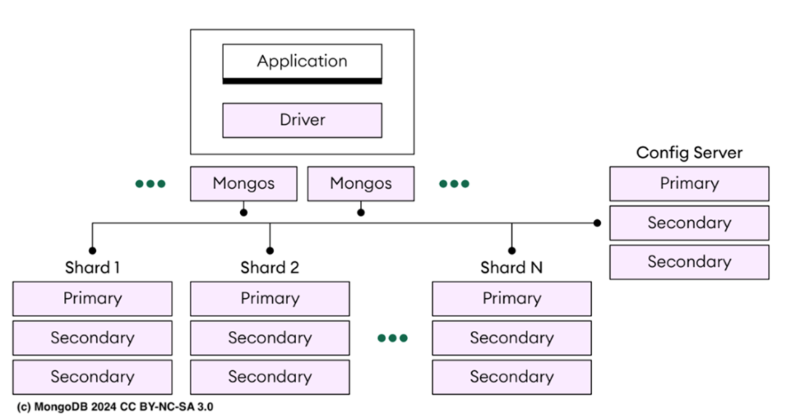
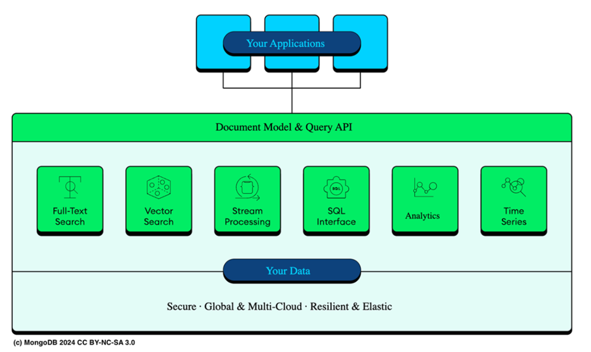

### Chapter 1: Understanding the world of MongoDB - Summary

This chapter introduces **MongoDB** as a next-generation NoSQL database designed for modern applications requiring flexibility, scalability, and performance. it covers the document-oriented data model, horizontal scaling via sharding, and the broader MongoDB ecosystem, including **MongoDB Atlas**. It highlights new features in **MongoDB 8.0**, such as enhanced memory management with TCMalloc, and explores the capabilities of the **MongoDB Query API (MQL)**.

---

### 1.1 Examining the document-oriented data model

The core of MongoDB is its **document-oriented** nature, which simplifies persistence by aligning how data is stored with how it is represented in application code (objects).

*   **Persistence:** In modern development, objects (customers, invoices, etc.) are ephemeral. Persistence is the process of storing them permanently.
*   **Document Databases:** Allow direct storage of objects without significant transformation (unlike relational databases which require mapping to table rows). This aligns with Object-Oriented Programming (OOP) but also supports functional paradigms.
*   **Flexible Schema:** Unlike relational databases with strict schemas (tables, rows), MongoDB does not require a predefined structure.
    *   **Dynamic Structure:** Documents in the same collection can have different fields.
    *   **Co-location:** Related data can be embedded (nested), reducing the need for joins and separate tables.
    *   **Use Cases:** Ideal for content management, e-commerce, and real-time analytics where data structures evolve rapidly.
*   **BSON (Binary JSON):** MongoDB stores data in BSON, a binary-encoded serialization of JSON.
    *   Maintains JSON's lightweight nature but adds support for more data types (e.g., dates, binary data).
    *   Maps naturally to language-specific structures like maps, hashes, or dictionaries.

#### Document Structure Example

Listing 1.1 shows a typical MongoDB document featuring key/value pairs, arrays, and nested documents.

```json
/* Listing 1.1 A MongoDB document with arrays and nested documents */
{
  "_id": 1,
  "title": "MongoDB 8.0 in Action",
  "publisher": "Manning Publications",
  "status": "Available",
  "focusAreas": [
    "MongoDB Database System",
    "Atlas Platform"
  ],
  "publicationYear": 2025,
  "additionalDetails": {
    "embeddedDocument": {
      "description": "A comprehensive guide to mastering MongoDB 8.0, including working with the Atlas Platform and learning the latest features"
    }
  }
}
```

#### Basic Query Examples (MQL)

The **MongoDB Query API (MQL)** is used for all database operations.

*   **Find a book by title:**
    ```javascript
    db.books.find({ "title": "MongoDB 8.0 in Action" })
    ```
    *Returns documents where the title matches.*

*   **Update the publisher:**
    ```javascript
    db.books.updateOne(
      { "title": "MongoDB 8.0 in Action" },
      { $set: { "publisher": " Manning Publications Co" } }
    )
    ```
    *Updates the publisher field for the matching document.*

*   **Remove documents based on status:**
    ```javascript
    db.books.deleteMany({ "status": "out of print" })
    ```
    *Deletes all books with "out of print" status.*

---

### 1.2 Scaling data horizontally

As data volumes grow into terabytes, databases must scale.
*   **Scale Up (Vertical):** Bigger servers. Has cost/physical limits.
*   **Scale Out (Horizontal):** Partitioning data across multiple machines (Sharding). Cost-effective but complex.

MongoDB is optimized for **scaling out** via **Sharding**.
*   **Sharding:** Distributes data across multiple machines (shards).
*   **Self-contained Data:** Because documents are self-contained, MongoDB can easily distribute them without complex joins across servers.
*   **Automation:** MongoDB automates data balancing and load distribution.

*   **Description:** Figure 1.1 illustrates the horizontal scaling architecture. Data is distributed across multiple servers (shards), with routers directing traffic.
    

#### Components of a Sharded Cluster

1.  **Application and Driver:** Connects to *mongos*. The driver handles connection logic.
2.  **Mongos (Query Routers):**
    *   Route queries to the correct shard using metadata.
    *   **Client Affinity (Sticky Sessions):** If using a load balancer, ensure it directs a client to the same *mongos* instance to maintain session consistency.
    *   **Limit:** Keep *mongos* instances below 30 to avoid performance degradation from frequent Config Server communication.
3.  **Config Servers (Replica Set):** Store metadata (shard layout, data location). Critical for cluster management.
4.  **Shard (Replica Set):**
    *   Acts as a single data partition.
    *   Function as a **Replica Set** for high availability (Primary + Secondaries). If the primary fails, a secondary takes over.

> **TIP:** Starting with **MongoDB version 8.0**, you can simplify cluster management by integrating configuration servers with data nodes (shards). You can configure a config server to store application data in addition to the usual sharded cluster metadata, reducing operational overhead and costs.

---

### 1.3 Exploring the MongoDB ecosystem

MongoDB offers editions for different needs:
*   **Community Edition:** Free, for developers/small teams.
*   **Enterprise Advanced:** Includes security (Kerberos, LDAP, Auditing), Ops Manager, BI Connector, and Kubernetes Operator.
*   **MongoDB Atlas:** Fully managed cloud service (DBaaS).

#### 1.3.1 Core MongoDB Server Features
These features are available across all editions:
*   **Indexes:** Generic secondary, unique, compound, geospatial, and text indexes. Supports indexing nested docs and arrays.
*   **Aggregation Framework:** Processes data records and returns computed results (grouping, reshaping). similar to SQL `GROUP BY` but more powerful.
*   **Change Streams:** Subscribe to real-time data changes on a collection, database, or deployment.
*   **Special Collections:**
    *   **TTL Indexes:** Auto-expire data.
    *   **Capped Collections:** Fixed size, useful for logs.
    *   **Partial Indexes:** Index only documents meeting specific criteria.
*   **Time Series Collections:** Optimized storage/retrieval for timestamped data (metrics, logs).

#### 1.3.2 MongoDB Atlas Concepts
Atlas extends the core server with cloud-native features accessible via the Unified Query API.

*   **Atlas Search:** Embedded full-text search built on Apache Lucene (custom scoring, facets, fuzzy search).
*   **Atlas Vector Search:** Stores vector embeddings for semantic search (RAG, Recommendation engines).
*   **Atlas Stream Processing:** Processes complex data streams using MQL.
*   **Atlas Data Federation:** Queries and aggregates data across Atlas clusters, Online Archives, and cloud object storage (S3).
*   **Atlas SQL Interface:** SQL-92 compatible dialect (*mongosql*) for analyzing Atlas data with standard BI tools.
*   **Atlas Database Triggers:** Server-side logic execution on data changes.

*   **Description:** Figure 1.2 shows the high-level architecture of Atlas, highlighting its multi-cloud nature (AWS, Azure, GCP), unified API, and integration of Search, Stream, and Analytics features.
    

---

### 1.4 Enhanced TCMalloc version

**MongoDB 8.0** introduces an enhanced version of **TCMalloc** (Thread-Caching Malloc).

*   **Change:** Switches from **per-thread caches** to **per-CPU caches**.
*   **Benefit:**
    *   Minimizes memory fragmentation.
    *   Improves resilience under heavy workloads.
    *   Aligns memory allocation with CPU core operations, boosting efficiency in high-concurrency environments.

---

### 1.5 Discovering MongoDB Query API

The **MongoDB Query API** supports two main interaction modes:

1.  **CRUD Operations:** Create, Read, Update, Delete.
2.  **Aggregation Pipelines:** Multi-stage data processing for translation and analysis.

**Capabilities:**
*   **Dynamic Queries:** via *mongosh*, Compass, or Drivers.
*   **Data Reshaping:** via Aggregation pipelines.
*   **Document Joins:** `$lookup` and `$unionWith`.
*   **Geospatial & Graph:** `$geoWithin`, `$geoNear`, `$graphLookup`.
*   **Full-Text Search:** `$search` (Lucene based).
*   **Vector Search:** `$vectorSearch` (KNN, pre-filters).
*   **Stream Processing:** `$source` stage.
*   **Time Series Analysis:** Optimized for time-based data.
