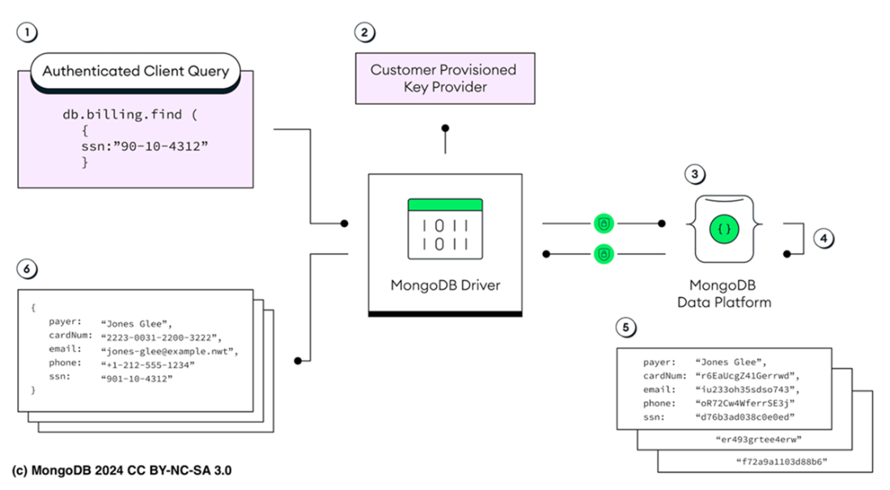

# Chapter 20: Understanding Atlas and MongoDB security features

This chapter covers the comprehensive security framework of MongoDB Atlas, detailing how to secure data through shared responsibility, authentication, authorization, auditing, encryption, and network isolation.

## 20.1 Understanding a Shared Responsibility Model
Security requires collaboration between the Customer, MongoDB, and the Cloud Provider.

**(Description of Figure 20.1):** A diagram showing the hierarchy of responsibility. 
-   **Customer (Top)**: Data access, User accounts, configurations.
-   **MongoDB (Middle)**: Platform security, Encryption enforcement, Database operations.
-   **Cloud Provider (Bottom)**: Physical data centers, Hardware, Basic capabilities.

| Responsibility Area | Customer Responsibility | MongoDB Responsibility |
| :--- | :--- | :--- |
| **Cloud Infrastructure** | Select Provider/Region/Tier. | Provision VPC/Firewalls. |
| **Data & Identity** | Manage data, accounts, MFA. | Secure access tools. |
| **Network** | Configure IP Access Lists, Peering. | Provision Endpoints/Peering containers. |
| **Database Access** | Auth Users, Roles (RBAC), API Keys. | Always-on Auth (SCRAM/x509), Audit logs. |
| **Encryption** | Config KMS (BYOK), Client-Side encryption. | Encryption At-Rest/In-Transit (Always on). |

---

## 20.2 Managing Authentication
Verifying *who* is accessing the system.

### 20.2.1 Authentication Methods (Table 20.2)
*   **SCRAM**: Default password-based auth. Salts/Hashes passwords.
*   **X.509 Certificates**: Uses PKI (Public Key Infrastructure). Good for machine-to-machine mutual auth.
*   **OAuth 2.0 / OIDC**: Setup SSO with Google/Microsoft/Okta.
*   **AWS IAM**: Passwordless auth for AWS services (EC2/Lambda) using IAM roles.
*   **LDAP**: Centralized directory access (Active Directory). **Warning:** LDAP auth/authorization is deprecated starting in MongoDB 8.0.

### 20.2.2 HashiCorp Vault Integration
Generates **dynamic, short-lived credentials**.
*   **How it works**: You request access → Vault generates a user with a TTL (Time-To-Live) → User expires and is deleted automatically.
*   **Benefit**: Eliminates risk of long-lived static passwords.

---

## 20.3 Handling Authorization
Determining *what* an authenticated user can do via **Role-Based Access Control (RBAC)**.

### 20.3.1 Principle of Least Privilege
Always grant the *minimum* permissions necessary.
*   **Example**: A backup service should only read, not write.

### 20.3.2 MongoDB Roles
*   **Built-in Roles**: `atlasAdmin`, `readWriteAnyDatabase`, `readAnyDatabase`, `clusterMonitor`, `read`.
*   **Custom Roles**: Tailored permissions (e.g., "Read `sales` collection but Update `routes` collection").

**Creating a Custom Role (CLI):**
```bash
atlas customDbRoles create customReadUpdateRole \
  --privilege 'UPDATE@sample_training.routes' \
  --privilege 'FIND@sample_supplies.sales'
```
*   **Result**: Grants strict UPDATE access only to *routes* and FIND access only to *sales*.

**Inheriting Roles:**
```bash
atlas customDbRoles create readWriteAnalyticsRole \
  --privilege 'INSERT@sample_analytics' \
  --inheritedRole 'read@sample_analytics'
```

**Assigning a Role to a New User:**
Once the role exists, you can assign it to a user.
```bash
atlas dbusers create \
  --username "analyticsUser" \
  --password "securePassword123" \
  --role "readWriteAnalyticsRole" \
  --database "sample_analytics"
```
*   **Best Practice**: Create unique users for each application service (Service Accounts) rather than sharing credentials.

---

## 20.4 Auditing
Monitoring database activity (WHO did WHAT and WHEN).

*   **Control Plane Auditing**: Logs UI/API actions (User creation, Config changes).
*   **Database Auditing**: Logs database operations (`find`, `insert`, `delete`).

**Event Types:**
*   `authenticate`: Login attempts (Success/Failure).
*   `authCheck`: Authorization checks for operations (Read/Write).

**Warning:** Enabling `auditAuthorizationSuccess` logs *every* successful read/write, which can degrade performance.

**Sample Audit Log (JSON):**
```json
{
  "atype": "authCheck",
  "local": { "ip": "192.168.1.1" },
  "param": {
    "ns": "sample_training.routes",
    "command": "find",
    "result": 1 // Success
  },
  "users": [{ "user": "sampleUser", "db": "admin" }]
}
```

**Filtering Logs:**
You can reduce noise by filtering specific users or namespaces.
```json
{
  "users.user": { "$nin": ["backup", "__system"] },
  "$or": [
    { "atype": "authenticate" },
    {
      "atype": "authCheck",
      "param": {
        "command": { "$in": ["find", "insert", "delete"] },
        "ns": { "$nin": [{ "$regex": "^local\\." }] }
      }
    }
  ]
}
```

---

## 20.5 Encrypting Data

### 20.5.1 In Transit
*   **Protocol**: TLS (Transport Layer Security) is always on (TLS 1.2+ recommended).
*   **Process**: Encrypts data moving between client ↔ server and node ↔ node.

### 20.5.2 At Rest
*   **Method**: Volume-level encryption using **AES-256**.
*   **Key Management**: Data Encryption Keys (DEK) are encrypted by a Master Key.
*   **CMK / BYOK**: You can use your own Customer Master Key via AWS KMS, Azure Key Vault, or Google Cloud KMS (Figure 20.2 Architecture).

### 20.5.3 In Use (Client-Side)
Processing sensitive data (SSN, Credit Cards) securely.

#### 1. Client-Side Field Level Encryption (CSFLE)
Fields are encrypted by the driver *before* leaving the application. Atlas sees only ciphertext.
*   **Constraint**: Only supports **equality matches** on deterministically encrypted fields.

**Comparison:**
*   *Plain*: `{"ssn": "123-45-6789"}`
*   *Encrypted*: `{"ssn": {"$binary": "AE4F0F..."}}`

**Configuration Sample (JSON Schema):**
To enable automatic encryption, you define a schema in your client driver.
```json
"properties": {
  "ssn": {
    "encrypt": {
      "keyId": ["UUID-OF-YOUR-KEY"],
      "bsonType": "string",
      "algorithm": "AEAD_AES_256_CBC_HMAC_SHA_512-Deterministic"
    }
  }
}
```

#### 2. Queryable Encryption



Allows **searching** on encrypted data without decrypting it first.
*   **Advantage**: Eventually supports Range queries (unlike CSFLE).

**(Description of Figure 20.3)**: The detailed workflow for securely querying encrypted data.

**Step-by-Step Flow:**
1.  **Query Submission**: An authenticated client submits a query with sensitive data (e.g., `find({ ssn: "123..." })`).
2.  **Analysis & Key Request**: The MongoDB Driver analyzes the query, sees the target field is encrypted, and requests the necessary keys from your **Key Management Service (KMS)** (AWS/GCP/Azure/Vault).
3.  **Query Encryption**: The Driver encrypts the query parameters locally using the retrieved keys.
4.  **Processing**: The encrypted query is sent to the MongoDB Server. The server performs the search on the encrypted data *without* ever decrypting it.
5.  **Return Results**: The server returns the matching documents in their encrypted form.
6.  **Decryption**: The Driver decrypts the results locally before passing the plaintext back to the client application.

---

## 20.6 Securing the Network

### 20.6.1 IP Access Lists
Whitelisting IP addresses. By default, no internet access is allowed. Use specific IPs or small ranges (avoid broad CIDRs).

**CLI Example:**
Allow a specific IP (e.g., your office VPN) and set an expiry for temporary access.
```bash
atlas accessLists create 192.168.1.5/32 \
  --comment "Temporary Office Access" \
  --deleteAfter "2024-12-31T23:59:59Z"
```

### 20.6.2 VPC Peering
Connects your Cloud VPC to the Atlas VPC internally.
*   **Benefit**: Traffic never inspects public internet. Lower latency.
*   **(Description of Figure 20.4)**: Application VPC (10.0.0.0/16) peered directly with Atlas VPC (172.31.248.0/21) across Availability Zones.

### 20.6.3 Private Endpoints (PrivateLink)
Unidirectional secure connection. Atlas can receive traffic from your VPC but cannot initiate connections back. Most secure option.

---

## 20.7 Implementing Defense in Depth
Defense in Depth is a strategy of layering multiple defensive mechanisms. If an attacker breaches one layer (e.g., steals a password), additional controls (e.g., MFA, IP Whitelist, Encryption) prevent full system compromise.

### Key Layers of Defense
1.  **Network Isolation**:
    *   **VPC Peering / Private Endpoints**: Ensure traffic never traverses the public internet.
    *   **IP Access Lists**: strictly limit entry points to known trusted IPs (e.g., VPNs, App Servers).
2.  **Authentication & Authorization**:
    *   **MFA (Multi-Factor Authentication)**: Mandatory for all human access.
    *   **Principle of Least Privilege**: Use Granular Custom Roles. A reporting tool should have `read` access to *only* the specific collections it analyzes, not the whole DB.
3.  **Data Protection (Encryption)**:
    *   **At Rest**: Use Customer Managed Keys (CMK) via cloud KMS (BYOK).
    *   **In Use**: Implement **Client-Side Field Level Encryption (CSFLE)** or **Queryable Encryption** for PII/PHI. This ensures that even if database admin credentials are stolen, the sensitive data remains encrypted ciphertext.
4.  **Observability (Intrusion Detection)**:
    *   **Auditing**: configure filters to log sensitive actions (e.g., `authCheck` on `financials` collection).
    *   **Monitoring**: Set up real-time alerts for failed login spikes or configuration changes (e.g., IP whitelist modification).
5.  **Resilience**:
    *   **Secure Backups**: Automated, encrypted snapshots provide a recovery point against ransomware or corruption.
6.  **Secure Configuration**:
    *   **Updates**: Enforce minimum TLS versions (1.2+) and apply security patches automatically.

**Scenario: Securing a Healthcare App (High Sensitivity)**
| Layer | Implementation Details |
| :--- | :--- |
| **Network** | **Private Endpoint** (AWS PrivateLink) only. No public IP access. |
| **Auth** | **X.509 Certificates** for mTLS between app and DB. |
| **Data** | **Queryable Encryption** for Patient IDs (allows searching without decrypting). |
| **Audit** | Log **all** `authCheck` events on `patients` collection. |

---

## 20.8 Summary
*   **Shared Responsibility**: Security is a joint effort. You own your data and access controls; MongoDB owns the platform; Cloud Providers own the hardware.
*   **Authentication**: Supports diverse methods (SCRAM, LDAP, IAM, Vault). **Vault** enables dynamic, temporary credentials.
*   **Authorization**: RBAC allows granular control. Use **Custom Roles** to restrict users to specific actions on specific collections.
*   **Encryption**: Comprehensive protection. **Queryable Encryption** is a game-changer, allowing search on fully encrypted data without server-side decryption.
*   **Network**: Keep traffic private using **Peering** or **Private Endpoints**.
*   **Strategy**: Adopt **Defense in Depth**—never rely on a single control.
