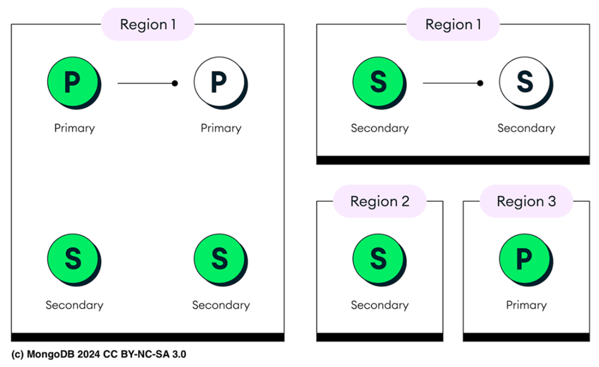

# Chapter 21: Operational excellence with MongoDB Atlas

This chapter covers the essential tools and practices for managing healthy, secure, and resilient MongoDB Atlas databases, focusing on Backups, Restoration, Performance Monitoring, and Maintenance.

## 21.1 Crafting Backup Strategies
Backups are not just for accidental collection drops; they are your primary defense against **Ransomware**, **Data Corruption**, and ensuring **Regulatory Compliance** (e.g., Finance audits).

### 21.1.1 MongoDB Atlas Backup Methods
Atlas Cloud Backup uses native cloud snapshots (AWS/Azure/GCP).
*   **Locality**: Backups are stored in the same region as the cluster.
*   **Encryption**: Snapshots are encrypted. Supports Customer Managed Keys (CMK).

#### Backup Capabilities by Cluster Tier
1.  **M0 (Free)**: No Cloud Backup.
    *   **Method**: Manual `mongodump` & `mongorestore`.
    *   **Limitations**: Cannot export Users/Roles (`--dumpDbUsersAndRoles` unsupported). No Oplog dumping.
2.  **Flex (Shared)**: Limited.
    *   **Schedule**: Daily snapshots only (Retained for 8 days). No On-Demand.
    *   **Restore**: No Point-in-Time (PIT) recovery. UI Only (No CLI).
3.  **Dedicated (M10+)**: Full Feature Set.
    *   **Features**: Scheduled, On-Demand, and Continuous Backups.
    *   **Policy**: Hourly, Daily, Weekly, Monthly, Yearly retention.

**Creating an M10 Cluster with Backups (CLI):**
```bash
atlas cluster create "MongoDB-in-Action-M10" \
  --backup --provider GCP --region CENTRAL_US \
  --tier M10
```

**Checking Schedule:**
```bash
atlas backups schedule describe MongoDB-in-Action-M10
```
*   **Output**: Shows Interval (Hourly/Daily) and Retention (7 Days / 4 Weeks).

### Continuous Cloud Backups (Oplog)
For M10+ clusters, this captures the **Oplog** (record of all writes) continuously.
*   **Mechanism**: Stores a real-time log of all write operations.
*   **Benefit**: Enables **Point-in-Time Recovery (PITR)** to any specific second within your defined retention window.
*   **Storage**: Oplogs are stored in **Block Storage** as objects (AWS S3, Azure Blob, GCS).
*   **Cost**: Increases with larger retention windows due to storage/processing needs.
*   **Encryption**: Fully supports Customer Managed Keys (CMK) for encrypting backup data.

*   **Storage**: Oplogs are stored in object storage (S3/Blob/GCS).

### Backup Order Logic
Atlas uses specific algorithms to determine *which node* to snapshot to minimize impact.

**Single-Region Clusters:**
1.  **Secondary Preferred**: Tries a secondary node first.
2.  **Lowest Priority**: If unavailable, picks the node with the lowest priority score.
3.  **Tie-Breaker**: Lexicographically smallest hostname.

**Multi-Region Clusters:**
1.  **Highest Priority Region**: Tries a node in the region with the highest priority first.
2.  **Secondary Preferred**: Within that region, tries a secondary.
3.  **Tie-Breaker**: Incremental snapshot capability (same disk) -> Smallest hostname.



**(Description of Figure 21.1):** Single-Region Backup Strategy. Primary (P) and Secondaries (S) are in Region 1. Snapshots are taken from Secondaries to reduce load and stored in the same Region 1 volume.

### Fallback Snapshots
If a standard scheduled snapshot fails, Atlas automatically attempts to create a **Fallback Snapshot**.
*   **Purpose**: Emergency recovery option when standard snapshots are unavailable.
*   **Warning**: They are created via a different, manual-like process and may be less consistent or accurate than regular snapshots. Use them only as a last resort.

---

## 21.1.2 Restoring MongoDB Atlas Cluster
Restoration is the process of reverting a cluster to a previous state.
*   **Process**: Target cluster is **wiped** -> Snapshot/Oplog applied -> Cluster comes online.

> **TIP:** Regularly test restore procedures to ensure their reliability and identify potential issues. Testing reduces the risk of data loss and downtime during an actual recovery.

### Restoring M0 (Free) Clusters
Since M0 clusters lack Cloud Backup, you must use manual tools.
*   **Tool**: `mongorestore` (restores data dumped by `mongodump`).
*   **Limitations**:
    *   `--restoreDbUsersAndRoles`: Not supported (Users/Roles must be recreated manually).
    *   `--oplogReplay`: Not supported (No Point-in-Time recovery).
    *   `--preserveUUID`: Not supported (Restored collections get new UUIDs).

### Restoring Flex Clusters
Flex clusters have distinct limitations compared to M10+.
*   **Method**: Atlas UI Only (CLI `atlas backups restores` is **Not Supported**).
*   **Source**: Daily automated snapshots (available after first 24h).
*   **Restriction**: Flex snapshots can ONLY be restored to **Replica Sets** (Not Sharded Clusters).

### Restoring Dedicated Clusters (+M10)
Atlas CLI (`atlas backups restores`) is fully supported for M10+ tiers. When performing an automated restore, Atlas first deletes all existing data in the target cluster to ensure it mirrors the state saved in the selected snapshot
*   **Modes**: Automated, Point-in-Time, and Download.
*   **Verification**: Always wait for the job to complete. Use `atlas backups restores watch <job-id>` to track progress.

#### 1. Automated Restore (Snapshot)
You can restore to the *same* cluster (Overwrite) or a *different* cluster (Testing/Validation).

**Scenario: Restore to a New Cluster (Testing)**
```bash
atlas backups restores start automated \
  --clusterName "ProductionCluster" \
  --snapshotId 6725be13eae896510f35a553 \
  --targetClusterName "RestoredBackupDemo" \
  --targetProjectId <project-id>
```
*   **Result**: "RestoredBackupDemo" is created with data from the snapshot. "ProductionCluster" is untouched.

### 2. Point-in-Time Restore (PITR)
Using Continuous Backup to target a specific Unix Timestamp. Useful for undoing a mistake made at a precise time (e.g., bad deployment at 2:00 PM).

**CLI Command:**
```bash
atlas backups restores start pointInTime \
  --clusterName "ProductionCluster" \
  --pointInTimeUTCSeconds 1588523147 \
  --targetClusterName "RecoveryCluster"
```
*   **Precision**: You can also use `--oplogInc` to specify the exact operation ordinal within a second.

---

## 21.2 Inspecting performance of your Atlas cluster

### 21.2.1-2 Performance Tools
1.  **Performance Advisor**:
    *   **Function**: Analyzes slow logs and suggests **Indexes**.
    *   **Threshold**: Dynamic by default (based on cluster avg) or Fixed (e.g., 100ms).
    *   **Workflow**:
        *   **Step 1: List Processes (Nodes)**. You need the specific hostname (`processName`) to query metrics, as issues often isolate to specific shards or replicas.
            ```bash
            atlas processes list
            # Output: atlas-shard-00-00...:27017 (ID/ReplicaName/ShardName/Version)
            ```
        *   **Step 2: Find Slow Namespaces**. List up to 20 collections with high latency.
            ```bash
            atlas performanceAdvisor namespaces list --processName <process-id>
            ```
        *   **Step 3: Get Index Suggestions**. Returns suggestions with an **Average Query Targeting** score (1.0 = Perfect efficiency).
            ```bash
            atlas performanceAdvisor suggestedIndexes list --processName <process-id>
            ```
        *   **Step 4: View Slow Logs**. Retrieve log entries for deep analysis.
            ```bash
            atlas performanceAdvisor slowQueryLogs list --processName <process-id>
            ```
2.  **Query Profiler** (M10+):
    *   **Function**: Visualizes slow operations (Find/Update) over time.
    *   **Diff**: Query Profiler = Log based. Database Profiler = Introspective level settings.
3.  **Real-Time Performance Panel (RTPP)**:
    *   **Function**: Live view of Hardware (CPU, Disk IO, RAM) and DB (Connections, OpCounters).
    *   **Use Case**: Identifying immediate bottlenecks (e.g., Disk IO saturation vs CPU usage).
4.  **Namespace Insights**:
    *   **Function**: Latency metrics per **Collection**. Identifying which specific collection is slowing down the app.

### 21.2.2 Improving your Schema
Performance bottlenecks are often due to poor data modeling, not just lack of indexes.
*   **Schema Suggestions**: Atlas analyzes **high-traffic collections** and **slow queries** to suggest structural changes.
*   **Common Issues Detected**:
    *   **Deep Nesting**: Recommends flattening structures to simplify query paths.
    *   **High Cardinality/Unindexed Fields**: Recommends adding indexes or changing access patterns.
    *   **Inconsistent Data Types**: Recommends normalizing fields to improve storage/query efficiency.
*   **Process**: Available in UI. It samples documents to understand structure and proposes actionable changes aligned with best practices.

### 21.2.3 Diagnostic Commands
Native commands run via `mongosh` for direct server introspection.

**1. `db.serverStatus()`**
The "Health Check" command. Returns a massive document with key metrics:
*   **Instance**: Hostname, Version, Uptime.
*   **Connections**:
    *   `current`: Active connections.
    *   `available`: Remaining capacity.
*   **Network**: Incoming/Outgoing traffic stats.
*   **OpCounters**: Counts of Insert, Query, Update, Delete.
*   **WiredTiger (Storage Engine)**:
    *   **Tickets**: Controls concurrency. Separate for Read/Write.
    *   **Logic**: In Mongo 7.0+, tickets adjust dynamically. Zero availability *momentarily* is fine; *prolonged* zero means overload.
    *   **Check**: `db.serverStatus().wiredTiger.concurrentTransactions`.
*   **Global Lock Queue**:
    *   `currentQueue`: If > 100, operations are waiting for resources (Potential bottleneck).

**2. `db.currentOp()`**
Snapshots active operations (Queries, Updates, Admin tasks). Useful for finding blocks.
**Output Example:**
```json
{
  "active": true,
  "opid": 12345,
  "secs_running": 45, // Operation running for 45 seconds 
  "ns": "myDB.myCol",
  "command": { "find": "myCol", "filter": { "status": "active" } },
  "client": "127.0.0.1:56789",
  "waitingForLock": false
}
```
**Filtering Examples:**
```javascript
// Ops running > 60 seconds
db.currentOp({ "secs_running": { "$gt": 60 } })

// Only Insert operations
db.currentOp({ "op": "insert" })
```

**3. `db.killOp()`**
Terminates an operation.
```javascript
// Kill operation with ID 12345
db.killOp(12345)
```
*   **Warning**: Use cautiously. Can cause partial writes.

**4. `db.runCommand({ top: 1 })`**
Tracks cumulative time spent Reading/Writing *per collection*.
*   **Purpose**: Identify which specific collection is the "Hot" bottleneck.
**Output Example:**
```javascript
{
  "sample_training.routes": {
    "total": { "time": 12000, "count": 150 }, // High Load
    "readLock": { "time": 7000, "count": 80 },
    "writeLock": { "time": 5000, "count": 70 },
    "queries": { "time": 7000, "count": 80 },
    "update": { "time": 4000, "count": 60 }
  }
}
```
*   **Analysis**: In this example, `total.time` (12000ms) indicates heavy load on `routes` collection, split between reads/writes.

**5. `dbStats` and `collStats`**
*   **Purpose**: Get storage size, index size, and count metrics.
*   **Database Level**: `db.runCommand({ dbStats: 1 })`
*   **Collection Level**: `db.runCommand({ collStats: "myCollection" })`
*   **Usage**: Check storage efficiency or verify if index size is growing too large for RAM.

**6. Monitoring Replication**
*   **Whole Replica Set**: `rs.printReplicationInfo()`
    *   **Checks**: Oplog size and time range (Window). Determine if Secondaries can handle downtime without falling too far behind to catch up.
*   **Secondary Status**: `rs.printSecondaryReplicationInfo()`
    *   **Checks**: **Replication Lag**. High lag means users reading from secondaries see stale data.

> **TIP:** Run `db.runCommand({ listCommands: 1 })` to see *all* available server commands and their descriptions.

---

## 21.3 Alerting and Logging

### 21.3.1 Setting Alert Conditions
Alerts allow you to respond to issues *before* they cause downtime.
**Key Metrics to Monitor:**
*   **CPU Steal**: (AWS EC2 burstable). Measures if you are exceeding your guaranteed baseline. >10% triggers concern.
*   **Queues (Locks)**: Tracks operations waiting for resources.
    *   **Threshold**: If global lock queue > 100, your DB is bottlenecked.
*   **Query Targeting**: The ratio of **Scanned Objects** to **Returned Documents**.
    *   **Threshold**: > 1000 means inefficient index usage (Scanning 1000 docs to find 1 is bad).
*   **Connection Limits**: Alerts when nearing capacity (e.g., > 80%).
    *   **Action**: Scale up or fix connection leaks in the application app.

**Creating an Alert via CLI:**
Alert me if a query scans >1000 objects per returned document (Inefficient Index).
```bash
atlas alerts settings create --event OUTSIDE_METRIC_THRESHOLD --enabled \
  --metricName QUERY_TARGETING_SCANNED_OBJECTS_PER_RETURNED \
  --metricOperator GREATER_THAN --metricThreshold 1000 \
  --metricUnits RAW --notificationType EMAIL ...
```

### 21.3.2 Logging in Atlas
Atlas logs are your primary source for forensic analysis and debugging.
*   **Log Types**:
    *   **Database Logs (`mongodb.gz`)**: Standard `mongod` logs (queries, connections, errors). Retained for **30 Days**.
    *   **Audit Logs (`mongodb-audit-log.gz`)**: Security events (Authentication/Crucial ops).
    *   **Trigger Logs**: Logs for serverless functions/triggers. Retained for **10 Days**.
*   **Availability**: Downloadable logs are **not available** for M0/Flex clusters.
*   **Log Forwarding**:
    *   You can push logs to external services (AWS CloudWatch, Datadog) or S3 Buckets for long-term retention beyond 30 days.

**Downloading Logs:**
```bash
# Download mongodb.gz for a specific host
atlas logs download <hostname> mongodb.gz
```

---

## 21.4 Upgrading your Atlas Cluster
Regular maintenance ensures security and performance.

1.  **Minor Upgrades** (e.g., 8.0.3 -> 8.0.5):
    *   **Auto**: Applied automatically during maintenance windows.
    *   **Rolling**: One node at a time (Zero downtime).
2.  **Major Upgrades** (e.g., 7.0 -> 8.0):
    *   **Manual**: You must initiate this via UI/API.
    *   **Prerequisites**: Healthy cluster, No on-demand snapshots running.
    *   **Driver Check**: **Critical**. Ensure your application drivers (Java, Python, Node) support the new version *before* upgrading.
