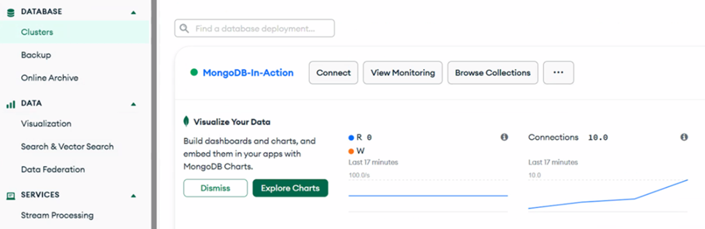
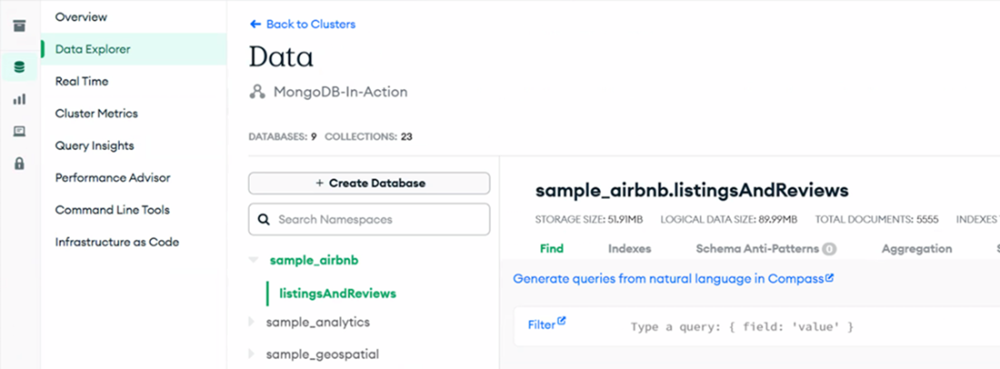
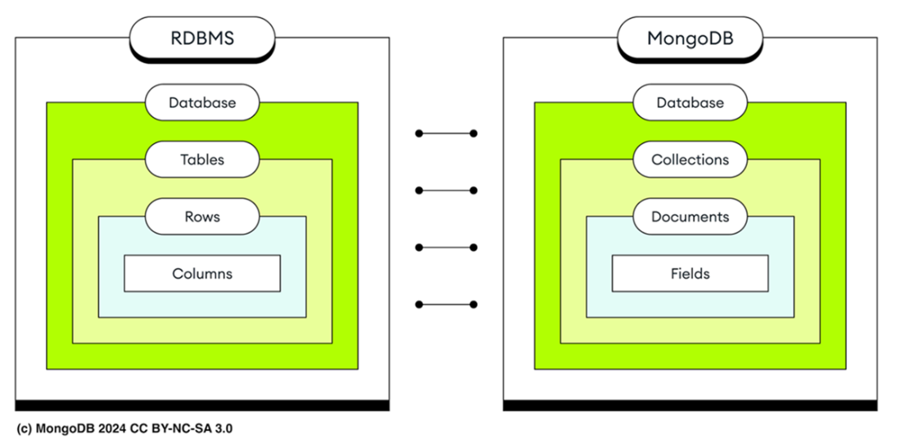

### Chapter 2: Getting started with Atlas and MongoDB data - Summary

This chapter covers the practical steps of setting up a **MongoDB Atlas** environment using the **Atlas CLI**, loading sample data, and interacting with the database using the **MongoDB Shell (`mongosh`)**. It also expands on core data management concepts such as databases, collections (including specialized types like Capped and Time Series), and documents.

---

### 2.1 Setting up Your First Atlas cluster using Atlas CLI

The **Atlas CLI** allows programmatic interaction with the Atlas platform (Search, Vector Search, cluster management) directly from the terminal.

#### 2.1.1 Installing the Atlas CLI
Installation via Homebrew (macOS/Linux/WSL):
```bash
# Install Homebrew (if not already installed)
/bin/bash -c "$(curl -fsSL https://raw.githubusercontent.com/Homebrew/install/HEAD/install.sh)"

# Install Atlas CLI
brew install mongodb-atlas
```
*   **Alternative methods:** Yum (Red Hat), Apt (Debian), Chocolatey (Windows), Docker, or direct binary download.

#### 2.1.2 Creating an Atlas account
Register via the CLI (redirects to browser for authentication via Email, GitHub, or Google):
```bash
# Register
atlas auth register

# Login (if account exists)
atlas login
```
> **TIP:** If your company uses Federated Authentication, use your company's email address.

#### 2.1.3 Creating an organization
An **Organization** is the top-level container for multiple projects.
```bash
# Create an organization
atlas organizations create "Manning Publications"

# List organizations to get the ID
atlas organizations list

# Set the organization ID in your default profile to avoid repeating flags
atlas config set org_id <your_organization_id>
```
> **NOTE:** Profile settings are stored in `config.toml`.
> *   **Windows:** `%AppData%/atlascli`
> *   **macOS:** `/Users/{username}/Library/Application Support/atlascli`
> *   **Linux:** `$XDG_CONFIG_HOME/atlascli` or `$HOME/.config/atlas`

#### 2.1.4 Creating an Atlas project
A **Project** groups deployments (clusters) and shares billing/security settings.
```bash
# Create a project
atlas project create "MongoDB 8.0 in Action"

# List projects and set the ID in the profile
atlas project list
atlas config set project_id <your_project_id>
```
> **TIP:** Environment variables `MONGODB_ATLAS_ORG_ID` and `MONGODB_ATLAS_PROJECT_ID` are also supported but are overridden by profile settings and CLI flags.

#### 2.1.5 Creating a MongoDB Atlas cluster
Create a free tier (**M0**) cluster on a specific provider (e.g., GCP, AWS, Azure).
```bash
atlas cluster create "MongoDB-in-Action" --provider GCP --region CENTRAL_US --tier M0
```
*   **Verification:** `atlas clusters list`
*   **Free Tier Constraints:** Cannot choose MongoDB version; auto-upgraded by Atlas.

*   **Description:** Figure 2.1 shows the Atlas UI dashboard for the "MongoDB-in-Action" cluster, highlighting the DATABASE, DATA, and SERVICES navigation sections.
    

#### 2.1.6 Navigating the Atlas user interface
*   **Database:** Clusters, Performance, Backups, Online Archive.
*   **Data:** Atlas Charts, Atlas Search/Vector Search, Data Federation.
*   **Services:** Stream Processing, Triggers, Migration tools.
*   **Security:** IAM (User roles), Audit logs, Project settings.

---

### 2.2 Loading a sample data set
Atlas provides a sample dataset for learning purposes.
```bash
atlas clusters sampleData load "MongoDB-in-Action"
```
*   **Description:** Figure 2.2 displays the Data Explorer in Atlas UI showing the loaded `sample_airbnb` database and its collections.
    

---

### 2.3 Adding an IP address to the project access list
You must whitelist your IP to connect.
```bash
# Add current IP
atlas accessList create --currentIp

# List allowed IPs
atlas accessList list
```

---

### 2.4 Creating a user
Create a database user with specific roles.
```bash
# Create user 'manning' with 'atlasAdmin' role
atlas dbusers create --role atlasAdmin --username manning
```
> **TIP:** Adopt the **principle of least privilege**. Avoid granting `atlasAdmin` for normal application users; create custom roles with necessary permissions only.

---

### 2.5 Establishing a connection to MongoDB through MongoDB Shell (`mongosh`)
`mongosh` is a JavaScript/Node.js-based REPL for interacting with MongoDB.

#### Installation
```bash
brew install mongosh
# Verify version
mongosh --version
```

#### Connecting
Get the connection string from Atlas CLI:
```bash
atlas clusters connectionStrings describe "MongoDB-in-Action"
```

Connect using the string and user created earlier:
```bash
/* Listing 2.1 Connecting with mongosh to MongoDB deployment */
mongosh "mongodb+srv://mongodb-in-action.fpomkk.mongodb.net" --apiVersion 1 --username 'manning'
```

#### Basic Inspection
```javascript
// Show available databases
show dbs
```

**Table 2.1 Description of sample databases**

| Database | Description |
| :--- | :--- |
| **sample_airbnb** | AirBnB listings. |
| **sample_analytics** | Mock financial services data. |
| **sample_geospatial** | Shipwreck data. |
| **sample_guides** | Planet data. |
| **sample_mflix** | Movies data (theaters, users, comments). |
| **sample_restaurants** | Restaurant data. |
| **sample_supplies** | Mock office supply store data. |
| **sample_training** | MongoDB training services dataset (grades, etc). |
| **sample_weatherdata** | Weather reports. |

---

### 2.6 Managing Data with databases, collections, and documents

**Hierarchy:**
*   **MongoDB:** Database -> Collection -> Document
*   **Relational:** Database -> Table -> Row -> Column

*   **Description:** Figure 2.3 compares the terminology structure of MongoDB (Databases, Collections, Documents) vs. Relational Databases (Databases, Tables, Rows).
    

#### 2.6.1 Working with dynamic schema
MongoDB allows documents in the same collection to have different structures (polymorphism).
*   **Pros:** Flexible, rapid development, easy handling of heterogeneous data.
*   **Cons:** Slower queries due to scanning mixed shapes, complex indexing, harder validation.

**Best Practices:**
1.  **Separate by type:** Store similar documents in the same collection.
2.  **Schema Design:** Design documents with future queries in mind.
3.  **Validation:** Use schema validation at the collection level.

#### 2.6.2 Working with databases
*   **Create/Switch:** `use <db_name>` (Created lazily upon first write).
*   **Internal Databases:**
    *   `admin`: System collections, user auth/authorization.
    *   `local`: Instance-specific data, not replicated (e.g., oplog).
    *   `config`: Sharding metadata and session info.

#### 2.6.3 Working with collections
*   **Explicit Creation:** `db.createCollection()` (Optional, usually created on first write).
*   **Accessing:** `db.getCollection("name_with_specials")` if name contains special characters.

**Listing 2.2 Inspecting collections in `mongosh`**
```javascript
use sample_mflix
db.getCollectionNames() // Returns array of collection names
// OR
show collections
```

**Listing 2.3 Displaying Namespace**
The namespace is `<database>.<collection>`. Limit: 255 bytes.
```javascript
db.getCollection("embedded_movies") 
// Output: sample_mflix.embedded_movies
```

#### Specialized Collections and Views

**1. Capped Collections:**
Fixed-size collections that work like circular buffers (FIFO). Oldest documents are overwritten when full.
*   **Use Cases:** High-volume logs, caching.
*   **Limitations:** Cannot delete individual docs, no size-changing updates, no sharding.
*   **Creation:** `db.createCollection("logs", { capped: true, size: 100000 })`

**2. Time Series Collections:**
Optimized for data recorded at regular intervals (time, metadata, measurements). Groups data points into buckets for compression and performance.
*   **Use Cases:** Sensor readings, stock prices, logs.

```javascript
/* Listing 2.4 Create a Time Series Collection */
db.createCollection(
  "my_time_series_collection",
  {
    timeseries: {
      timeField: "timestamp",
      metaField: "metadata"
    }
  }
)

/* Listing 2.5 List Time Series Collections */
db.runCommand({ listCollections: 1, filter: { type: "timeseries" } })
```

**3. Views:**
Queryable, read-only entity defined by an aggregation pipeline. Not stored on disk; computed on query.
*   **Use Cases:** Security (hiding fields), simplifying complex data, data integration.

```javascript
/* Listing 2.6 Create a MongoDB View */
use sample_training
db.createView(
  "aerocondorRoutesView", // View Name
  "routes",               // Source Collection
  [
    { $match: { "airline.id": 410 } } // Aggregation Pipeline
  ]
);
```

**4. On-Demand Materialized Views:**
stored result of an aggregation pipeline (`$out` or `$merge`). stored on disk for performance but requires manual refresh.

#### 2.6.4 Working with documents
*   **Format:** BSON (Binary JSON).
*   **Max Size:** 16MB per document.
*   **`_id` Field:** Primary key. Unique, immutable. Defaults to `ObjectId` if not specified.
    *   **ObjectId:** 12 bytes (4 timestamp + 5 random + 3 counter).

**Listing 2.7 Displaying single MongoDB document**
```javascript
use sample_training
db.grades.findOne()
/* Output:
{
  _id: ObjectId('56d5f7eb604eb380b0d8d8ce'),
  student_id: 0,
  scores: [
    { type: 'exam', score: 78.40446309504266 },
    { type: 'quiz', score: 73.36224783231339 }
  ],
  class_id: 339
}
*/
```
