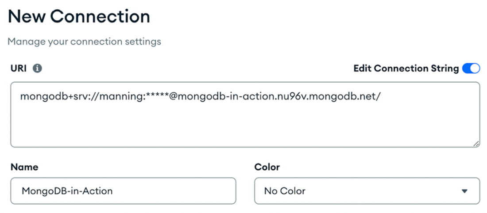
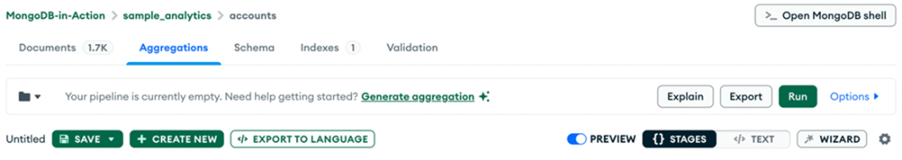

### Chapter 3: Communicating with MongoDB - Summary

This chapter covers the fundamentals of interacting with MongoDB, ranging from the low-level Wire Protocol to user-friendly tools like **mongosh** and **Compass**, and finally handling programmatic access via **Node.js**, **Python**, and **Ruby** drivers.

---

### 3.1 Interacting via MongoDB Wire Protocol

The **MongoDB Wire Protocol** is the backbone of data exchange between clients and servers.
*   **Transport:** TCP/IP sockets, typically on port **27017**.
*   **Byte Order:** Little-endian.
*   **OP_MSG:** A flexible opcode key to the protocol's efficiency.
    *   **Structure:**
        ```cpp
        OP_MSG {
            MsgHeader header;       // standard message header
            uint32 flagBits;        // message flags
            Sections[] sections;    // data sections (allows concurrent processing)
            optional<uint32> checksum; // CRC-32C checksum
        }
        ```
    *   **Benefits:** Reduces overhead by combining multiple operations into a single message, maximizing throughput.

---

### 3.2 Discovering MongoDB Shell (`mongosh`)

`mongosh` is the default CLI client, operating as a **JavaScript and Node.js REPL**. It provides features like syntax highlighting, autocomplete, and contextual help.

#### 3.2.1 & 3.2.2 Connecting
*   **Atlas (SRV):** Uses `mongodb+srv://` which allows auto-discovery of nodes.
    ```bash
    mongosh "mongodb+srv://Cluster...net/" --apiVersion 1 --username USER --password PASS
    ```
    *   `--apiVersion 1`: Enables **Stable API**, ensuring future server upgrades don't break the application.
*   **Self-hosted:** Uses `mongodb://`.

#### 3.2.3 Performing operations
*   **Basic Commands:**
    *   `db`: Show current database.
    *   `show dbs`: List databases.
    *   `use <db>`: Switch database.
    *   `db.getSiblingDB('<db>')`: Access another database without switching context.
*   **Help:**
    *   `help`: General help.
    *   `db.help()`: Database methods.
    *   `db.collection.help()`: Collection methods.
    *   `db.<collection>.<method>`: Typing without `()` shows implementation details (e.g., `db.collection.countDocuments`).

**Listing 3.1 Snippet of help command**
```javascript
test> help
Shell Help:
  use      Set current database
  show     'show databases'/'show dbs': Print a list of all available databases.
...
```

#### 3.2.4 Logs
*   **Format:** NDJSON (Newline Delimited JSON).
*   **Locations:**
    *   Logs: `~/.mongodb/mongosh/<LogID>_log`
    *   History: `~/.mongodb/mongosh/mongosh_repl_history` (or `%UserProfile%` on Windows).
*   **Retention:** Keeps 100 log files for 30 days.

#### 3.2.5 Running scripts
*   **`load(path)`:** Executes a JS file in the shell context.
*   **`require(module)`:** Loads Node.js modules (built-in or npm).

**Listing 3.2 Display MongoDB Server Information function**
A script (`mongodb-script.js`) using the `dayjs` library to print server stats.
```javascript
function printMongoDBDetailsSimplified() {
  const dayjs = require('dayjs');
  const relativeTime = require('dayjs/plugin/relativeTime');
  dayjs.extend(relativeTime);
  try {
    const adminDB = db.getSiblingDB('admin');
    const serverStatus = adminDB.serverStatus();
    console.log("MongoDB Version:", serverStatus.version);
    console.log("Host:", serverStatus.host);
    console.log("Uptime:", dayjs().subtract(serverStatus.uptime, "second").fromNow(true));
    console.log("Currently open connections:", serverStatus.connections.current);
  } catch (err) {
    console.error("Failed to retrieve status. Error:", err.message);
  }
}
printMongoDBDetailsSimplified();
```
*   **Execution:**
    *   Inside shell: `load("/path/to/script.js")`
    *   From terminal: `mongosh "connection_string" --file mongodb-script.js`

#### 3.2.6 Configuring mongosh
Settings are persistent.
*   **View Config:** `config` command.
*   **Modify Config:** `config.set("editor", "vi")` or `config.set("historyLength", 3000)`.

#### 3.2.7 Using .mongoshrc.js
A JavaScript file in the users HOME directory executed on startup. Ideal for custom prompts or helper functions.

Prompt is object that is displayed before each command in the shell before input cursor.
**Listing 3.4 Customizing the prompt**
```javascript
prompt = function() {
  const version = db.version();
  const collectionsCount = db.getCollectionNames().length;
  return "Uptime:" + db.serverStatus().uptime +
         " | Documents:" + db.stats().objects +
         " | Version:" + version +
         " | Collections:" + collectionsCount +
         " > ";
};
```
*   **Result:** `Uptime:122765 | Documents:1843009 | Version:8.0.3 | Collections:218 >`

The below script swtiches by default to the `sample_training` database before running any command.

**Listing 3.5 Auto-switch database script**
```javascript
const targetDatabase = "sample_training";
function switchToDatabase() {
  const currentDatabase = db.getName();
  if (currentDatabase !== targetDatabase) {
    print(`Switching to database: ${targetDatabase}`);
    db = db.getSiblingDB(targetDatabase);
  }
}
switchToDatabase();
```

**Tip:** You can prevent .mongoshrc.js from being loaded by using the --norc option.

---

### 3.3 Playing with MongoDB Compass

**MongoDB Compass** is a free GUI for visual interaction.

*   **Key Features:**
    *   **Aggregation Pipeline Builder:** Visual stage-by-stage pipeline construction (See Figure 3.2).
    *   **CRUD Operations:** Visual interface for data manipulation.
    *   **Schema Visualization:** Graphical representation of data distribution.
    *   **Performance Profiling:** Visual explain plans.
    *   **GenAI:** Generate queries using natural language.
    *   **Embedded Shell:** Run `mongosh` inside Compass.

*   **Description:** Figure 3.1 shows the connection screen in Compass where you input the URI.
    

*   **Description:** Figure 3.2 displays the Aggregations tab, illustrating the visual pipeline builder.
    

---

### 3.4 Connecting using MongoDB drivers

MongoDB supports official drivers for many languages (C#, Go, Java, Python, Node.js, etc.).

### 3.5 Using Node.js driver

*   **Setup:**
    ```bash
    mkdir mongodb_book_project
    cd mongodb_book_project
    npm init -y
    npm install mongodb@6.5
    ```

**Listing 3.6 Node.js MongoDB query example**
Finds routes from JFK with airline ID 3201.
```javascript
const { MongoClient } = require("mongodb");
const uri = "<connection string uri>";
const client = new MongoClient(uri);

const run = async () => {
  try {
    const database = client.db("sample_training");
    const routes = database.collection("routes");
    const query = { src_airport: "JFK", "airline.id": 3201 };
    const route = await routes.findOne(query);
    console.log(route);
  } catch (error) {
    console.error(error);
  } finally {
    await client.close();
  }
};
run().catch(console.error);
```
*   **TypeScript:** Supported via transpilation (requires Node.js driver v4.0+).

---

### 3.6 Employing Python drivers

Python offers two main drivers: **PyMongo** (Synchronous) and **Motor** (Asynchronous).

#### 3.6.1 PyMongo (Synchronous)
*   **Install:** `python3 -m pip install pymongo`
*   **Use Case:** Sequential execution, scripts, simpler debugging.

**Listing 3.8 PyMongo usage example**
```python
from pymongo.mongo_client import MongoClient
from pymongo.server_api import ServerApi
from pprint import pprint

uri = "<connection_string>"
# Connect with Stable API
client = MongoClient(uri, server_api=ServerApi('1'))
database = client['sample_training']
routes_collection = database['routes']

query = {"src_airport": "JFK", "airline.id": 3201}

try:
    route = routes_collection.find_one(query)
    if route:
        print("Found a route:")
        pprint(route)
    else:
        print("No route found from JFK.")
except Exception as e:
    print(f"An error occurred: {e}")
finally:
    client.close()
```

#### 3.6.2 Motor (Asynchronous)
*   **Install:** `python3 -m pip install motor`
*   **Use Case:** Non-blocking I/O, high concurrency, web servers (e.g., using `asyncio`).

**Listing 3.10 Motor usage example**
```python
import asyncio
from motor.motor_asyncio import AsyncIOMotorClient
from pymongo.server_api import ServerApi
from pprint import pprint

uri = "<connection_string>"

async def find_route():
    client = AsyncIOMotorClient(uri, server_api=ServerApi('1'))
    try:
        database = client['sample_training']
        routes_collection = database['routes']
        query = {"src_airport": "JFK", "airline.id": 3201}
        
        # Await the async find_one operation
        route = await routes_collection.find_one(query)
        if route:
            print("Found a route:")
            pprint(route)
        else:
            print("No route found from JFK.")
    except Exception as e:
        print(f"An error occurred: {e}")
    finally:
        client.close()

asyncio.run(find_route())
```

| Feature | PyMongo | Motor |
| :--- | :--- | :--- |
| **Model** | Synchronous (Blocking) | Asynchronous (Non-blocking) |
| **Best For** | Scripts, Data Analysis, Simple Apps | Web Apps, High Concurrency, I/O Bound |
| **Complexity** | Low | Higher (Event loop, async/await) |

---

### 3.7 & 3.8 Integrating Ruby drivers

#### Ruby Driver
*   **Install:** `gem install mongo`
*   **Features:** SCRAM/X.509 auth, TLS support.
*   **Tip:** Use version 2.6.1+ for Atlas TLS improvements.

**Listing 3.11 Ruby Driver usage**
```ruby
require 'mongo'
uri = "< connection string uri >"
client = Mongo::Client.new(uri)

begin
  database = client.use("sample_training")
  routes = database[:routes]
  query = { 'src_airport' => 'JFK' }
  route = routes.find(query).first
  puts route
rescue => error
  puts error.message
ensure
  client.close
end
```

#### Mongoid (ODM)
*   **Definition:** Object-Document Mapper (like Active Record for MongoDB).
*   **Install:** `gem 'mongoid', '~> 8.1.0'`
*   **Benefits:**
    *   High-level object interface.
    *   Schema validation.
    *   Associations and Transaction support.
    *   Familiarity for Rails developers.
