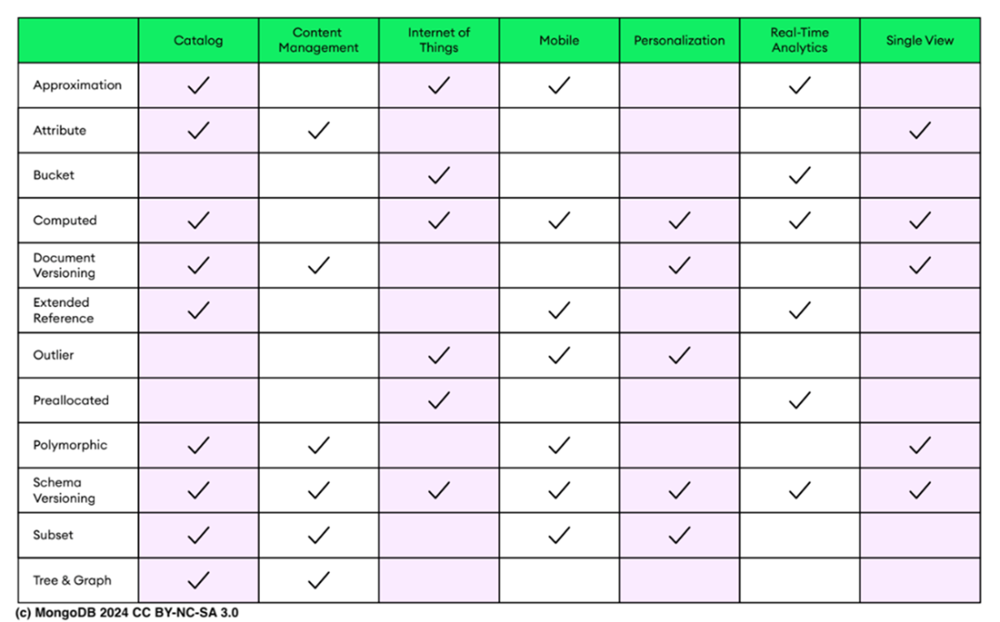

### Chapter 5: Designing MongoDB schema

**Designing an effective MongoDB schema** is crucial for optimizing performance, scalability, and maintainability. While MongoDB has a flexible schema, thoughtful data modeling is required to handle relationships, support query patterns, and anticipate data evolution.

#### 5.1 Organizing the MongoDB data model

Designing a data model involves four key steps:
1.  **Determine the workload**: Understand the most common operations.
2.  **Map relationships**: How objects relate to each other.
3.  **Implement design patterns**: Apply proven structures for specific problems.
4.  **Create indexes**: Optimize query performance (Covered in Chapter 8).

##### 5.1.1 Determining the workload
Analyze current and future functionalities. Create a table of essential queries.

**Table 5.1 Example Workload: Airline Route Management System**

| Action | Type | Information | Frequency | Priority |
| :--- | :--- | :--- | :--- | :--- |
| **Add new route** | Write | `flight_id`, `airline`, `src_airport`, `dst_airport`, `airplane`... | 150/day | High |
| **Search Flights** | Read | `src_airport`, `dst_airport` | 22,000/day | High |
| **Update route details** | Write | `flight_id`, `src_airport`, `dst_airport`, `airline` | 100/day | Medium |
| **Check Route Info** | Read | `src_airport`, `dst_airport`, `airplane`, `stops` | 40,000/day | High |

**Relational vs. Document Databases:**
*   **Relational:** Schema defined *before* data insertion. Data joined from multiple tables. Hard to change schema (migrations).
*   **Document (MongoDB):** Schema evolves with app. Data stored how it's accessed (reducing joins). Focus on *access patterns* rather than logical connections.

It's also important to emphasize that in NoSQL databases like MongoDB, the data model should be de-
signed based on how the data will be displayed and accessed, rather than how it is logically connected

##### 5.1.2 Mapping the schema relationship
Three primary relationship types:
1.  **One-to-one:** Unique correspondence (e.g., User -> Profile).
2.  **One-to-many:** Single parent, multiple children (e.g., Airline -> Routes).
3.  **Many-to-many:** Multiple associations (e.g., Airports <-> Routes).

**Embedding vs. Referencing:**
*   **Embedding (Denormalized):** Store related data in a single document.
    *   *Best for:* "Contains" relationships, One-to-many where children are accessed with parent.
    *   *Pros:* Single read operation, atomic updates.
    *   *Cons:* Document size limit (16MB), data duplication.
*   **Referencing (Normalized):** Store related data in separate documents/collections.
    *   *Best for:* Many-to-many, frequently accessed standalone entities, large/unbounded datasets.
    *   *Pros:* Avoids duplication, smaller documents.
    *   *Cons:* Requires `$lookup` or multiple queries (application-side joins).

In MongoDB the preferred strategy for managing related data is embedding it in a sub-document.
Embedding allows your application to retrieve necessary information through a single read operation.

**Scenario: Airline Route Management**
*   **Airline to Routes (One-to-Many):** *Embed* airline info into routes. Airline data is small and static.
*   **Airports to Routes (Many-to-Many):** *Reference* airports. Airport data is extensive (facilities, location) and used by many routes.

**Sample Documents:**
*   **Routes (with embedded Airline):**
    ```json
    {
      "flight_id": "FL123",
      "airline": { "id": 410, "name": "Delta Airlines", "alias": "2B" },
      "src_airport": "JFK",
      "dst_airport": "LAX"
    }
    ```
*   **Airports (Separate Collection):**
    ```json
    {
      "_id": "JFK",
      "name": "JFK International Airport",
      "facilities": ["Wi-Fi", "Lounge"]
    }
    ```

Embedding large documents or multiple documents may result in bloated documents with loads of infor-
mation that it is unlikely going to be accessed together, which may end up exceeding the max BSON size.

When to store data in a separate collection:
1. When the reference entity is frequently accessed on its own.
2. When embedding could lead to data duplication without offering significant read performance bene-
fits that justify the duplication.
3. To accurately represent complex many-to-many relationships.


#### Methods for integrating data across collections


Methods for integrating data across collections:
*   `$lookup`: This stage performs a left outer join to another collection in the same database, allowing for combining documents based on a join condition similar to relational databases.
*   `$graphLookup`: Introduced for complex aggregations, this stage facilitates recursive lookups, enabling the exploration of relationships within datasets that have a hierarchical or graph-like structure.

Methods for relating documents:
*   Manual references: This method involves storing the _id field of one document in another document
as a reference. The application must execute a second query to fetch the related data
*   DBRefs: These references link one document to another using the _id field of the first document, the
collection name, and optionally the database name, among other fields. DBRefs are particularly useful
for referencing documents spread across multiple collections or databases. Resolving DBRefs requires
additional queries to retrieve the linked documents, ensuring data consistency across complex struc-
tures. This kind of reference may contain some extra fields.

Example of dbref:
```json
{
    "_id": ObjectId("56e9b39b732b6122f877fa35"),
    "flight_id": "FL123",
    "src_airport": {
        "$ref": "airports",
        "$id": "JFK",
        "$db": "airportData",
        "YourExtraField" : "Can be anything"
    },
    "airline": "Delta Airlines",
    "airplane": "Boeing 737",
    "stops": 0
}
```

**Figure 5.3** categorizes patterns by use case (Performance, Data Management, etc.).



##### 1. Approximation Pattern
*   **Concept:** Estimate values (e.g., page views) using sampling instead of writing every single update.
*   **Use Case:** High-write scenarios where exact precision isn't critical (e.g., analytics).
*   **Pros:** Drastically reduces write operations.
*   **Cons:** Data is approximate.

```json
{
"page_id": "12345",
"estimated_views": 1500,
"sampling_rate": 0.05,
"last_updated": "2024-04-20T12:00:00Z"
// This document estimates page views to reduce database writes.
}
```

##### 2. Archive Pattern
*   **Concept:** Move old, cold data to a separate collection or cold storage (like S3/Atlas Online Archive).
*   **Use Case:** Logs, historical data where only recent data is "hot".
*   **Pros:** Keeps active collection small and fast (smaller indexes).

##### 3. Attribute Pattern
*   **Concept:** Turn many unique fields into an array of key-value pairs.
*   **Use Case:** E-commerce products with diverse/rare attributes (e.g., "waterproof" vs "processor_speed").
*   **Example:**
    ```json
    "rare_attributes": [
      { "key": "warranty_years", "value": 3 },
      { "key": "processor", "value": "13th Gen" }
    ]
    ```
*   **Pros:** Reduces index count (index `rare_attributes.key` and `value` instead of 50 different fields).

##### 4. Bucket Pattern
*   **Concept:** Group stream of data (time-series) into a single document ("bucket") per time period.
*   **Use Case:** Sensor data, IoT (Time Series Collections do this automatically).
*   **Example:** One document per hour containing an array of readings.
*   **Pros:** Reduces total document count, improves index performance, pre-aggregation.

> TIP
Time series collections automatically implement the bucket pattern, making them suitable for most appli-
cations that require organizing time series data into buckets

##### 5. Computed Pattern
*   **Concept:** Pre-compute values on write rather than calculate on read.
*   **Use Case:** Read-heavy workloads requiring aggregation (e.g., `total_revenue`, `average_rating`).
*   **Pros:** Decreases CPU usage on reads.

##### 6. Document Versioning Pattern
*   **Concept:** Keep history of document changes.
*   **Use Case:** Auditing, regulatory compliance.
*   **Structure:**
    ```json
            {
            "document_id": "456",
            "version": 3,
            "content": "Latest content here.",
            "previous_versions": [
                {
                    "version": 2,
                    "content": "Older content here.",
                    "date_modified": "2023-12-01"
                },
                {
                    "version": 1,
                    "content": "Original content here.",
                    "date_modified": "2023-11-01"
                }
            ],
        }
    ```
*   **Cons:** Doubles write operations (or increases doc size).

##### 7. Extended Reference Pattern
*   **Concept:** Embed *just enough* info from a referenced document to avoid a join for common views.
*   **Use Case:** Displaying a User's name/avatar on a Post without fetching the full User profile.
*   **Pros:** Faster reads, fewer joins.
*   **Cons:** Data duplication (requires management if embedded data changes).

##### 8. Outlier Pattern
*   **Concept:** Handle "normal" documents one way and "large" (outlier) documents differently to avoid performance penalties for the majority.
*   **Use Case:** Social media "influencers" with 1M followers vs. normal users with 100.
*   **Implementation:** Use a flag `has_extra_readings: true` and spill over to a separate collection.
*   **Advantages of the outlier pattern:**
    *   Prevents a few documents or queries from determining an application’s solution.
    *   Focuses on typical use cases while accommodating exceptional scenarios.
*   **Disadvantages of the outlier pattern:**
    *   Typically optimized for specific queries, which may result in poor performance for ad hoc queries.
    *   Relies heavily on application code for implementation.

##### 9. Pre-allocation Pattern
*   **Concept:** Create empty structure placeholders at insertion.
*   **Use Case:** Monthly daily planners, reserving array slots.
*   **Pros:** Design simplification when structure is known.

##### 10. Polymorphic Pattern
*   **Concept:** Store slightly different objects in the same collection.
*   **Use Case:** "Athletes" collection containing "Tennis Player" and "Soccer Player" documents.
*   **Pros:** Single collection for queries.

##### 11. Schema Versioning Pattern
*   **Concept:** Use a `schema_version` field to track document structure.
*   **Use Case:** Rolling deployments, avoiding downtime/mass-migration.
*   **Example:** App code checks `if version == 2 { ... } else { ... }`.
*   **Advantages of a schema versioning pattern:**
    *   No downtime needed during schema migration.
    *   Reduced future technical debt.
*   **Disadvantages of a schema versioning pattern:**
    *   Might need two indexes for the same field during migration.

##### 12. Subset Pattern
*   **Concept:** Store the "working set" (frequently used part) in the main document, reference the rest (some info + id).
*   **Use Case:** Product reviews (store top 5 reviews on product, reference the rest in a `reviews` collection).
*   **Pros:** Smaller working set, faster disk access.
*   **Cons:** Extra round trip for full data.

##### 13. Tree Pattern
*   **Concept:** Represent hierarchy within the document.
*   **Use Case:** Org charts, categories.
*   **Implementation:** `reports_to` (array of ancestors) or `direct_reports` (array of children).
*   **Advantages of a tree pattern:**
    *   Increased performance by avoiding multiple JOIN operations.
*   **Disadvantages of a tree pattern:**
    *   Updates to the graph need to be managed in the application.

Sources:
https://learn.mongodb.com/courses/schema-design-patterns
https://www.mongodb.com/docs/manual/data-modeling/


#### 5.4 Schema validations

Validation rules enforce data integrity despite the flexible schema.

**Methods:**
*   `validator` option in `db.createCollection`.
*   `collMod` command for existing collections.

**Listing 5.1 JSON Schema Validator Example**
```javascript
db.runCommand({
  collMod: "routes",
  validator: {
    $jsonSchema: {
      bsonType: "object",
      required: ["flight_id", "airline", "src_airport", "dst_airport"],
      properties: {
        flight_id: {
          bsonType: "string",
          pattern: "^FL\\d+$", // Must start with FL followed by numbers
          description: "must be a string starting with 'FL'..."
        },
        airline: {
          bsonType: "object",
          properties: {
            id: { bsonType: "int", minimum: 1 }
          }
        }
      }
    }
  },
  validationLevel: "moderate", // Apply to new/modified docs only
  validationAction: "error"    // Reject invalid docs
});
```

**Validation Levels:**
*   `strict` (Default): Apply to all inserts/updates.
*   `moderate`: Apply to existing valid documents and new documents. Ignores existing invalid docs until they are modified.

**Validation Actions:**
*   `error` (Default): Reject operation.
*   `warn`: Allow operation but log warning.

**Bypassing Validation:**
Bypass rules (e.g., for restoring backups) using `{ bypassDocumentValidation: true }` in `insert`, `update`, `findAndModify`.


Existing documents that do not match the rules are not required to pass validation unless they are modified.

#### 5.5 MongoDB schema anti-patterns

Avoid these common mistakes:
1.  **Massive Arrays:** Unbounded growth leads to performance degradation (16MB limit, moving docs on disk). -> Use **Bucket** or **Subset**.
2.  **Bloated Documents:** Storing unused data. -> Use **Subset**.
3.  **Massive Number of Collections:** thousands of unused collections hurt performance.
4.  **Unnecessary Indexes:** Slows down writes.
5.  **Separating Data Accessed Together:** Breaking data into relational style unnecessarily causes expensive joins. -> **Embed** instead.

#### 5.6 Summary
*   **Flexibility:** Schema evolves with the app, but design is still critical.
*   **Modeling:** Based on *access patterns* (Read/Write ratio), not just logical relationships.
*   **Patterns:** Use patterns like Attribute, Bucket, Extended Reference to solve specific scaling/performance issues.
*   **Validation:** Use JSON Schema validation to enforce rules (types, patterns) where necessary.
*   **Anti-patterns:** Beware of massive arrays and relational habits (separating related data) that hurt performance.
