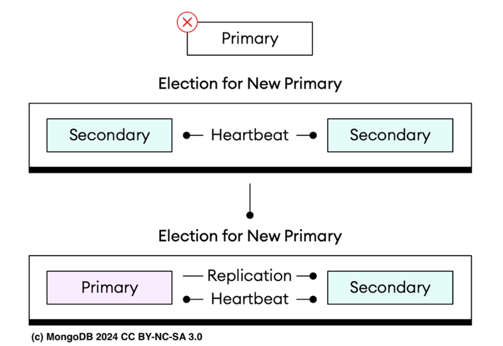
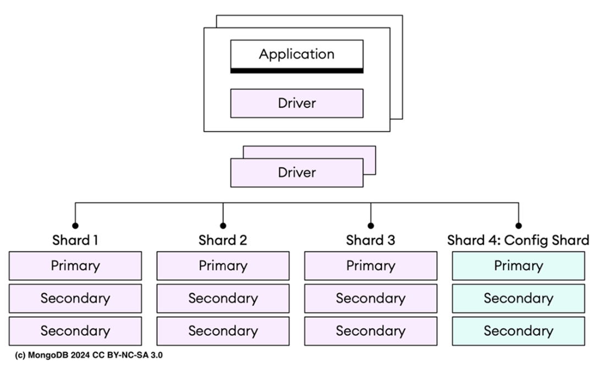
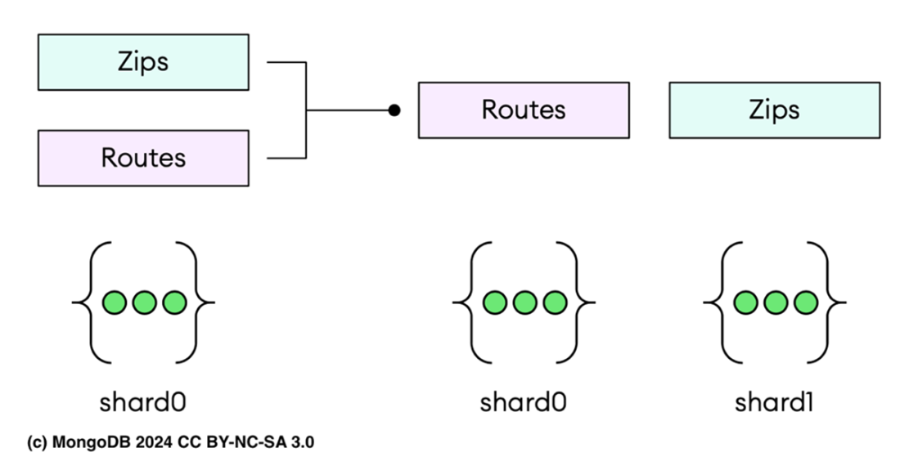

### Chapter 9: Using replication and sharding

**Replication vs Sharding:**
*   **Replication:** Copies data/operations from primary to secondaries. Purpose: High Availability (HA), Disaster Recovery, Read Scaling. Write bottleneck remains on Primary.
*   **Sharding:** Partitions data into smaller segments (shards) across multiple servers. Purpose: **Horizontal Scaling** (Write/Read throughput, Storage capacity). Each shard should implement replication for HA.

---

### 9.1 Ensuring data high availability with replication

A **Replica Set** is a group of `mongod` processes holding identical data sets.

#### 9.1.1 Distinguishing replica set members
Command to check status:
```javascript
db.adminCommand("replSetGetStatus") // or rs.status() for JSON format
```

**Table 9.1: Replica Set Member States**
| State | Name | Description |
| :--- | :--- | :--- |
| 0 | STARTUP | Initial state. Parsing config. |
| 1 | **PRIMARY** | Accepts writes. Eligible to vote. |
| 2 | **SECONDARY** | Replicates data. Eligible to vote. |
| 3 | RECOVERING | Self-checks, rollback, or resync. No reads. Votes. |
| 4 | STARTUP2 | Initial sync. Can't vote. |
| 5 | UNKNOWN | State not known by others. |
| 6 | **ARBITER** | Only votes. No data. Can't become primary. |
| 7 | DOWN | Unreachable. |
| 8 | ROLLBACK | Reverting changes. No reads. Votes. |
| 9 | REMOVED | Removed from set. |

**Configuration:**
View config with `rs.config()` or `db.adminCommand("replSetGetConfig")`.

Sample output:
```javascript
db.adminCommand("replSetGetConfig").config.members.map((m) => ({ host: m.host, arbiterOnly: m.arbiterOnly, hidden: m.hidden, priority: m.priority, secondaryDelaySecs: m.secondaryDelaySecs,votes: m.votes }))
[
    {
        host: ' ac-5dhjxpf-shard-00-00.fpomkke.mongodb.net:27017',
        arbiterOnly: false,
        hidden: false,
        priority: 1,
        secondaryDelaySecs: Long("0"),
        votes: 1
    },
    {
        host: 'ac-5dhjxpf-shard-00-01.fpomkke.mongodb.net:27017',
        arbiterOnly: false,
        hidden: false,
        priority: 1,
        secondaryDelaySecs: Long("0"),
        votes: 1
    },
    {
        host: 'ac-5dhjxpf-shard-00-02.fpomkke.mongodb.net:27017',
        arbiterOnly: false,
        hidden: false,
        priority: 1,
        secondaryDelaySecs: Long("0"),
        votes: 1
    }
]
```

*   **arbiterOnly**: Boolean. Participates in elections but holds no data.
*   **hidden**  Visible in set but invisible to client apps. Good for backups/analytics. Can vote. Operations can run on hidden members without impacting the operational performance of the primary or other secondary members visible to clients
*   **priority**: 0 = Cannot become primary. Higher value = Higher chance.
*   **secondaryDelaySecs**: Delayed replication (must be hidden). Acts as a rolling backup (e.g., 1 hour delay to recover from human error).
*   **votes**: Usually 1. Max 7 voting members. Max 50 total members.

Given that a replica set may comprise up to 50 members, with a limitation of only 7 members eligible to vote.

#### 9.1.2 Electing primary replica set member



*   **Protocol:** Version 1 (PV1) based on **Raft** consensus.
*   **Triggers:** Adding/removing nodes, initialization, missed heartbeats (default 10s).
*   **Process:** Secondaries vote. Member with most up-to-date write timestamp and highest priority is preferred.
*   **Election Timeout:** Typically < 12 seconds.This period includes the necessary steps of recognizing the primary as unavailable, commencing the election, and concluding it with the selection of a new primary. Configurable via `settings.electionTimeoutMillis`.

This approach reduces the likelihood of needing to perform a rollback when a former primary is reintegrated into the set. The election also takes into account the term, a monotonically increasing number representing the number of election attempts. The term prevents double voting as well enabling faster detection of simultaneous primaries and for multiple successful elections in a short period of time. After an election, there is a "freeze" period implemented where nodes are prevented from starting another election, aiming to avoid frequent and successive elections that could disrupt system stability.

Once an election concludes, MongoDB's algorithm prioritizes high-priority secondaries to initiate subsequent elections.

It's crucial for your application's connection handling strategy to accommodate automatic failovers and subsequent elections. MongoDB drivers are designed to detect the loss of the primary and can automatically retry certain read or write operations once.

#### 9.1.3 Understanding oplog collection
The **Oplog** (`local.oplog.rs`) is a capped collection recording all logical writes.
*   **Mechanism:** Primary logs writes -> Streams to Secondaries -> Secondaries apply.
*   **Idempotent:** Applying operations multiple times has the same effect.
*   **Chained Replication:** Secondary has option for replicating from another Secondary (reduces primary load, may increase lag). Such a decision arises under circumstances where a secondary member prioritizes replication targets by ping time, leading to situations where the nearest available member is, in fact, another secondary. Chained replication can also reduce load on the primary. But chained replication can also result in increased replication lag, depending on the topology of the network.

**Monitoring Oplog:**
```javascript
db.getReplicationInfo() // View oplog size and time window
db.printSecondaryReplicationInfo() // View replication lag
```

Sample output for `db.getReplicationInfo()`:
```javascript
db.getReplicationInfo()
{
    configuredLogSizeMB: 4096, 
    logSizeMB: 4096,
    usedMB: 4074.63,
    timeDiff: 635133,
    timeDiffHours: 176.43,
    tFirst: 'Wed Mar 20 2024 10:44:15 GMT+0000 (Coordinated Universal Time)',
    tLast: 'Wed Mar 27 2024 19:09:48 GMT+0000 (Coordinated Universal Time)',
    now: 'Wed Mar 27 2024 19:09:49 GMT+0000 (Coordinated Universal Time)'
}
```

Sample oplogs:
```javascript
{
    op: 'd', // delete operation
    ns: ' sample_mflix.sessions' // namespace
    ui: new UUID("99f8f10f-e144-4419-a543-da211dd1a2de"), // unique identifier
    o: { _id: ObjectId("65b1a0a4edf7e1f8d9ccc396") }, // original document
    ts: Timestamp({ t: 1710267182, i: 5 }), // timestamp
    t: Long("38"), // term
    v: Long("2"), // version
    wall: ISODate("2024-03-12T18:13:02.838Z") // wall clock time
}

```

The term (t) indicates the replica set election term during which the operation was logged,
and the version (v) signifies the oplog entry format

```javascript
{
    op: 'i', // insert operation
    ns: 'sample_mflix.sessions', // namespace
    ui: new UUID("b2d3f810-g234-5239-b543-da211dd1a3cd"), // unique identifier
    o: { // data
        _id: ObjectId("5fc8a1d3bcf1b3298b3fdb78"),
        user_id: "12345",
        jwt: "token123456"
    },
    ts: Timestamp({ "t": 1720567182, "i": 1 }),
    t: Long("39"),
    v: Long("2"),
    wall: ISODate("2024-03-15T10:20:30.123Z")
}
```


**Oplog Sizing:**
*   **Default:** For the In-Memory Storage Engine, the oplog size is set to 5% of the physical memory, with a minimum of 50 MB and a maximum of 50 GB. The WiredTiger Storage Engine calculates the oplog size based on 5% of the available disk space, with a lower limit of 990 MB and an upper limit of 50 GB.
*   **Resize:** `replSetResizeOplog` command (no restart needed).
*   **Retention:** Can set `minSnapshotHistoryWindowInSeconds` or `oplogMinRetentionHours`.

`db.printSecondaryReplicationInfo()` shows lag
```javascript
    db.printSecondaryReplicationInfo()
    source: ac-5dhjxpf-shard-00-00.fpomkke.mongodb.net:27017
    {
    syncedTo: 'Wed Mar 27 2024 18:21:52 GMT+0000(Coordinated Universal Time)',
    replLag: '0 secs (0 hrs) behind the primary '
    }
    ---
    source: ac-5dhjxpf-shard-00-01.fpomkke.mongodb.net:27017
    {
    syncedTo: 'Wed Mar 27 2024 18:21:53 GMT+0000(Coordinated Universal Time)',
    replLag: '10 secs (0 hrs) behind the primary '
    }
```

If your application mainly performs read operations with few writes, a smaller oplog might suffice.However, if your replica set's activity is expected to follow any of these patterns, consider using an oplog larger than the default size:
*   **Batch document updates:** For maintaining idempotency, the oplog needs to break down batch up- dates into separate actions, consuming substantial oplog space without necessarily increasing data or disk usage.
*   **Equal volumes of data deletions and insertions:** When data deletion volume matches data inser- tion, disk usage remains stable, yet the oplog size can significantly expand.
*   **Frequent in-place updates:** When many updates alter existing documents without enlarging them, the database logs numerous operations, keeping the data volume on disk constant

**Oplog Window:**
The oplog window must be large enough to hold all new entries generated during the **Logical Initial Sync Process**. If the window is too short, entries might be purged before the secondary can apply them.
*   **Retention Policy:** By default, MongoDB trims the oldest entries to fit the max size.
*   **Minimum Retention:** You can enforce a minimum time window (entries are only deleted if *both* size limit is hit AND age > limit).
    *   Set via `storage.oplogMinRetentionHours` in configuration or `--oplogMinRetentionHours` command line.

**Initial Sync Process:**
When a new member joins or re-joins (if it fell off the oplog), it must sync.
*   **Resumable:** Initial sync is resumable.
    *   **Logical (24h window):** Resumes if network fails transiently.
    *   **File-Based (10m window):** Faster but shorter resume window.

**Logical Initial Sync Steps:**
1.  **Clone:** Scans and inserts data from all non-local databases (collections).
2.  **Index Build:** Builds indexes *concurrently* with document copying.
3.  **Oplog Buffer:** Pulls ongoing oplog entries during the copy to a temp buffer.
4.  **Apply:** Applies the buffered oplog entries to catch up to the current state.
5.  **Completion:** Member transitions from `STARTUP2` to `SECONDARY`.

**Sync Methods:**
1.  **Standard (Logical):** Restart `mongod` with an empty data directory. Simple but slower.
2.  **Disk Copy:** Stop a member, copy its data directory to the new member, restart. Faster but manual.
3.  **File-Based (Enterprise/Atlas):** Uses `initialSyncMethod: fileCopyBased`. Ideal for 1TB+ datasets.


---


### 9.2 Understanding change streams

Real-time, event-driven stream of data changes (inserts, updates, deletes).
*   **Benefits:** Respects ACLs, durable (committed to majority of the replica set), ordered, resumable (via `_id` resume token).
*   **Prerequisites:** WiredTiger, ReplSet PV1.
*   **Scope:** Collection, Database, or Deployment.

**Example: Monitoring with `mongosh`**
```javascript
// Watch a database
watchCursor = db.getSiblingDB("sample_mflix").watch()

// Iterate
while (!watchCursor.isClosed()) {
   let next = watchCursor.tryNext();
   while (next !== null) {
      printjson(next);
   }
}
```

Sample output:
```javascript
{
    _id: {
        _ddata: '8266073FD1000000022B022C0100296E5A1004E43C0CEEB6D74D84814318056E6EECDC46645F6964006466073FD1359139DDFE70B1D70004'
    },
    operationType: 'insert',
    clusterTime: Timestamp({
        t: 1720567182,
        i: 1
    }),
    wallTime: ISODate("2024-03-29T22:25:21.073Z"),
    fullDocument: {
        _id: ObjectId('65d9867e1234567890abcdef'),
        title: 'The Great Gatsby',
        author: 'F. Scott Fitzgerald',
        year: 1925,
        genre: 'Novel',
        rating: 4.2,
        reviews: [
            {
                user: 'user1',
                score: 5,
                comment: 'Classic!'
            },
            {
                user: 'user2',
                score: 4,
                comment: 'Good read'
            }
        ],
        metadata: {
            pages: 180,
            language: 'English'
        }
    },
    ns: {
        db: 'sample_mflix',
        coll: 'movies'
    },
    documentKey: {
        _id: ObjectId('65d9867e1234567890abcdef')
    }
}
```

**Example: Node.js with Filtering**
You can control the output of the change stream by providing an array of one or more pipeline stages during its setup. These stages could include $addFields, $match, $project, $replaceRoot, $replaceWith, $redact, $set, and $unset, allowing for extensive customization of the data received from the change stream

```javascript
const { MongoClient } = require('mongodb');
const uri = "<connection string uri>"

async function monitorChangeStream() {
    const client = new MongoClient(uri, { apiVersion: '1' });
    await client.connect();
    const sessionsCollection = client.db("sample_mflix").collection('sessions');
    const pipeline = [
        { $match: { 'fullDocument.user_id': '12345' } },
        { $addFields: { newField: 'this is an added field!' } }
    ];
    const changeStream = sessionsCollection.watch(pipeline);
    changeStream.on('change', next => {
        console.log("Received a change in the sessions collection:", next);
    });
}
monitorChangeStream();
```
  
> **Tip:** Do not modify the `_id` field in the pipeline; it is the resume token.

---

### 9.3 Scaling data horizontally through sharding



**Architecture:**
*   **Shared Cluster:** Collection of Shards.
*   **Shard:** Replica Set holding a subset of data.
    *   **Recommendation:** Each shard should be **<= 1 TB**.
    *   **Reason:** Faster index building, faster initial sync, better backup/restore efficiency.
*   **mongos:** Router. App connects here.
    *   **Function:** Routes requests to appropriate shards, amalgamates results into a unified response.
    *   **HA:** Always operate *multiple* `mongos` instances in production for High Availability.
*   **Config Servers:** Stores metadata (routing table).
    *   **Content:** Composition of sharded data (list of collections, routing info).
    *   **Role:** Vital for query management and direction.
    *   **New in MongoDB 8.0:** Can be embedded in sharded clusters (Config Shard) to reduce cost/complexity.

**Sharding Mechanics:**
*   **Collection Level:** Sharding happens per collection. A database can have mixed sharded and unsharded collections.
*   **Unsharded Collections:** Live on a **Primary Shard** assigned to that database.
    *   **MongoDB 8.0+:** Unsharded collections can be moved to other shards using `moveCollection`.
*   **Sharded Collections:** Split and dispersed across shards.

**Management Tools:**
*   **Ops Manager:** Uses agents on each server to automate lifecycle (start/stop, upgrade, backup) and monitoring.
*   **Kubernetes Operator:** Orchestrates sharded clusters on Kubernetes using native capabilities (often combined with Ops Manager).

**Creating Cluster via Atlas CLI:**
```bash
atlas clusters create "Sharded-Cluster" --tier M30 --type SHARDED --shards 2 --mdbVersion 8.0
```

#### 9.3.3 Working with shard key
*   **Definition:** One or more fields used to disperse documents across shards.
*   **Importance:** Pivot decision.
    *   **Good Key:** Even distribution, supports query patterns.
    *   **Bad Key:** Load imbalance, poor performance, creation of **"Hot Shards"** (bottlenecks).

*   **Considerations for Ranged Sharding:**
    1.  **Query Pattern Analysis:** Key should cover most frequent read/write operations to avoid scatter-gather queries.
    2.  **Cardinality:** Needs high cardinality (many unique values) to allow splitting.
    3.  **Frequency:** Avoid keys with common values (e.g., `status: 'active'`) which cause data skew/bottlenecks.
    4.  **Monotonically Changing Keys:** Avoid strictly increasing keys (e.g., timestamps) for *Ranged* sharding. They force all inserts to the "MaxKey" chunk (single shard bottleneck).

**Strategies:**
1.  **Ranged Sharding:** Partitions by continuous key ranges. Excellent for range queries.
2.  **Hashed Sharding:** Computes hash of the field.
    *   **Benefit:** Even random distribution even for close numerical values or monotonic keys (like `ObjectId` or timestamps).
    *   **Trade-off:** **Not** suitable for range-based queries.

**Shard Key Index:**
*   Can be: Single ascending, Compound (starting with shard key), or Hashed.
*   **RESTRICTIONS:** Shard key index CANNOT be:
    *   Descending.
    *   Partial.
    *   Geospatial, Multikey, Text, or Wildcard.

#### 9.3.5 Shard Key Analyzer (Starting v7.0)
Use `analyzeShardKey` to test a key before sharding.

**Process:**
1.  **Enable Sampling:** `db.coll.configureQueryAnalyzer({ mode: "full", samplesPerSecond: 1 })`
2.  **Create Index:** Create a compound index on the proposed fields.
    ```javascript
    db.routes.createIndex({ src_airport: 1, dst_airport: 1, "airline.name": 1 })
    ```
3.  **Run Queries:** Generate trial traffic that mimics real usage.
    ```javascript
    db.routes.find({"src_airport": "YRB", "dst_airport": "YGZ", "airline.name": "Askari Aviation" })
    ```
4.  **Analyze:**
    ```javascript
    db.routes.analyzeShardKey({ src_airport: 1, dst_airport: 1, "airline.name": 1 })
    ```
    **Sample Output:**
    ```javascript
    {
      keyCharacteristics: {
        numDocsTotal: Long('66985'),
        avgDocSizeBytes: Long('184'),
        numDocsSampled: Long('66985'),
        isUnique: false, // Key is not unique
        numDistinctValues: Long('66984'), // High cardinality
        mostCommonValues: [
          { value: { src_airport: 'HAM', dst_airport: 'AMS', 'airline.name': 'Eurowings' }, frequency: Long('2') },
          // ...
        ],
        monotonicity: {
          recordIdCorrelationCoefficient: 0.0163877874, // Low correlation = Not monotonic
          type: 'not monotonic'
        }
      },
      readDistribution: {
        sampleSize: { total: Long('525'), find: Long('525'), ... },
        percentageOfSingleShardReads: 84.1904761905, // High % = Good Isolation
        percentageOfMultiShardReads: 12.1904761905,
        percentageOfScatterGatherReads: 3.6190476191,
        // ...
      },
      ok: 1
    }
    ```
    *   **Interpretation:**
        *   `isUnique`: False (in this case).
        *   `numDistinctValues`: High usually means good distribution (66,984 out of 66,985).
        *   `monotonicity`: `recordIdCorrelationCoefficient` near 0 means "not monotonic" (Good to avoid write hotspots).
        *   `readDistribution`:
            *   `percentageOfSingleShardReads`: High % (e.g., 84%) is excellent (strong query isolation).
            *   `percentageOfMultiShardReads`: Low % is better.
            *   `percentageOfScatterGatherReads`: Low % is better.

**Action:** If satisfied, shard the collection:
```javascript
sh.shardCollection("sample_training.routes", { src_airport: 1, dst_airport: 1, "airline.name": 1 })
```

> **Tip:** Use `sh.status()` for a report on the configuration and chunks.

#### 9.3.6 Detecting Imbalance
Use these methods to identify if shards have significantly different data volumes or chunk counts.
*   `sh.status()`: Summary overview.
*   `db.collection.getShardDistribution()`: Detailed size/count per shard.
*   `$shardedDataDistribution`: Aggregation stage (MongoDB 8.0+: only details primary shard if it has chunks/orphans).

**Aggregation to check chunk balance:**
```javascript
db.getSiblingDB("config").chunks.aggregate([
  { $group: { _id: "$shard", totalSize: { $sum: "$size" }, count: { $sum: 1 } } }
])
```

#### 9.3.7 Resharding
Change shard key of an existing collection (Supported from MongoDB 5.0+).

**Mechanics:**
*   Creates a new, implicitly empty collection with the new key.
*   Transfers data chunk by chunk (Application remains online).
*   Requires a 2-second lock at the end to switch.
*   **Duration:** Depends on collection size (larger = longer).

**Prerequisites (CRITICAL):**
The database does **NOT** enforce these, but failure to meet them can cause crashes/slowdowns.
1.  **Disk Space:** Must have **1.2x** the collection size available (e.g., 1TB collection needs 1.2TB free).
2.  **I/O Capacity:** Should be `< 50%`.
3.  **CPU Usage:** Should be `< 80%`.
> **Tip:** Reshard during low traffic.

**Constraints:**
*   Cannot reshard while an index is being built.
*   `deleteOne()`, `findAndModify()`, `updateOne()` will fail unless *both* old and new shard keys are in the filter.
*   Only **one** collection can be resharded at a time.
*   Topology changes (`addShard`, `removeShard`) are blocked.
*   New shard key **cannot** be unique.

**Command:**
```javascript
db.adminCommand({
    reshardCollection: "<database>.<collection>",
    key: <new shardkey>
})
```

**Monitoring:**
```javascript
db.getSiblingDB("admin").aggregate([
  { $currentOp: { allUsers: true, localOps: false } },
  { $match: { type: "op", "originatingCommand.reshardCollection": "db.coll" } }
])
```

> **Tip:** If using **Atlas Search**, search indexes become unavailable and must be manually rebuilt after resharding.

**MongoDB 8.0+ Features:**
*   **4x Faster:** Uses parallel reads/writes.
*   **Unsharded Move:** Move unsharded collections between shards seamlessly (`moveCollection`).
*   **Force Redistribution:** Can reshard to the *same* key to force balance data.

#### 9.3.8 Understanding chunks balancing
*   **Chunk Definition:** Continuous range of shard key values. Defined by Lower Bound (inclusive) and Upper Bound (exclusive).
*   **Size:** Defaults to **128 MB** (since v5.2).
*   **Split Behavior (v6.1+):** Chunks *only* split when transferred. No more auto-splitting on size.
*   **Balancing Logic (v6.0.3+):** Balances based on **Data Size**, not chunk count.
*   **Concurrency:**
    *   Limit: 1 migration per shard at a time.
    *   Cluster Limit: `n/2` concurrent migrations (where `n` = number of shards).
*   **Threshold:** Migration triggers when difference > 3x range size (e.g., > 384 MB diff for 128 MB chunks).

**Managing the Balancer Window:**
Schedule balancing during off-peak hours to avoid performance impact.
```javascript
use config
sh.startBalancer() // Ensure it's on
db.settings.updateOne(
   { _id: "balancer" },
   { $set: { activeWindow : { start : "02:00", stop : "06:00" } } },
   { upsert: true }
)
```
*   **Check Status:** `sh.getBalancerState()` or `sh.isBalancerRunning()`.

#### 9.3.9 Administrating chunks (Manual)
In most cases, the automatic balancer handles everything. However, for **bulk ingestion** or when using **monotonically changing keys**, you may need to intervene to prevent hotspots.

**1. Pre-splitting (Empty Collections):**
*   **Why?** To create chunks *before* data exists. If you insert data into an empty sharded collection without pre-splitting, all data goes to one shard until the balancer reacts (too slow for bulk loads).
*   **Best Practice:** Only pre-split on **empty** collections.

**Example Script: Pre-splitting by Route**
```javascript
// Define meaningful split points (e.g., common high-traffic routes)
var splitPoints = [
    { "src_airport": "JFK", "dst_airport": "LHR", "airline.name": "British Airways" },
    { "src_airport": "LAX", "dst_airport": "NRT", "airline.name": "Japan Airlines" },
    { "src_airport": "DXB", "dst_airport": "SYD", "airline.name": "Emirates" }
];

// Loop through points and split the chunk at that middle point
splitPoints.forEach(function(point) {
    db.adminCommand({
        split: "sample_training.routes",
        middle: point
    });
});
```

**2. Manual Moving (Distributing):**
*   **Why?** Splitting creates chunks, but they stay on the *primary shard* initially. You must move them to other shards to actually distribute the write load.

**Example Script: Round-Robin Distribution**
```javascript
// Define available shards
var shards = ["shard0000", "shard0001", "shard0002", "shard0003"];
var splitPoints = [ /* ... same points as above ... */ ];

splitPoints.forEach(function(point, index) {
    // Calculate bounds for the current chunk
    var lowerBound = (index === 0) ? { "src_airport": MinKey, "dst_airport": MinKey, "airline.name": MinKey } : splitPoints[index - 1];
    var upperBound = point;

    // Move chunk to a new shard in round-robin fashion
    db.adminCommand({
        moveChunk: "sample_training.routes",
        find: lowerBound, // Identifies the chunk by its lower bound
        to: shards[index % shards.length], // Target shard
        bounds: [lowerBound, upperBound]
    });
});
```

**3. Handling Edge Cases:**
*   **Jumbo Chunks:** Chunks > max size that cannot split automatically.
    *   **Fix:** `sh.splitAt()` or `sh.splitFind()`.
*   **Invisible Chunks:** Tagged as jumbo but actually small (often single-key ranges).
    *   **Fix:** Clear the flag:
    ```javascript
    db.adminCommand({ clearJumboFlag: "db.coll", find: { "shardKey": "value" } })
    ```

#### 9.3.10 Automatic Chunk Merging (AutoMerger)
**New in MongoDB 7.0**, the AutoMerger is a background process that automatically combines small, contiguous chunks into larger ones to reduce metadata overhead and improve performance.

**Why Merge?**
Excessive small chunks increase config server load and routing complexity. Merging simplifies the routing table.

**Merge Criteria:**
The AutoMerger (or manual command) scans for chunks that:
1.  **Reside on the same shard** (must be contiguous ranges).
2.  **Are NOT Jumbo** (Jumbo chunks cannot be moved or merged easily).
3.  **Satisfy History Safety:** Enough time must have passed since the last migration to ensure snapshot reads/transactions are valid (controlled by `minSnapshotHistoryWindowInSeconds`).

**Example Scenario:**
Imagine the following chunk distribution for `sample_training.routes`:
| Chunk | Range | Shard |
| :--- | :--- | :--- |
| A | [min, 10) | **Shard0** |
| B | [10, 20) | **Shard0** |
| C | [20, 30) | **Shard0** |
| D | [30, 40) | Shard1 |

Chunks A, B, and C are contiguous and on the same shard. They are candidates for merging.

**Manual Merge Command:**
To force a merge of all eligible chunks on a specific shard:
```javascript
db.adminCommand({
    mergeAllChunksOnShard: "sample_training.routes",
    shard: "Shard0"
})
```
*Result:* Chunks A, B, and C merge into a single chunk `[min, 30)` on Shard0.

**Controlling AutoMerger:**
You can manage the background process with these shell helpers:
```javascript
sh.startAutoMerger()    // Start the process
sh.stopAutoMerger()     // Stop the process
sh.enableAutoMerger()   // Enable (persistently)
sh.disableAutoMerger()  // Disable (persistently)
```

---

### 9.4 MongoDB 8.0 Sharded Cluster Features

1.  **Embedded Config Servers:** Config servers run on shards (Config Shard) instead of separate servers. Saves 3 nodes.
    *   Transition: `db.adminCommand({ transitionFromDedicatedConfigServer: 1 })`
2.  **Move Unsharded Collections:**
    ```javascript
    db.adminCommand({ moveCollection: "db.coll", toShard: "shard1" })
    ```
3.  **Unsharding Collections:**
    Moves all data to a single shard and removes sharding definition.
    ```javascript
    db.adminCommand({ unshardCollection: "db.coll", toShard: "shard-id" })
    ```

**TIP:** Use dedicated config servers if you have more than three shards.

#### MOVE UNSHARDED COLLECTIONS SEAMLESSLY BETWEEN SHARDS



Use it to move an unsharded collection to a different shard without sharding the collection or selecting a shard key.
```javascript
db.adminCommand({ moveCollection: "sample_training.zips", toShard: "shard1" })
```

Figure 9.4 illustrates the process of moving the unsharded collection `sample_training.zips` from `shard0` to `shard1`. Before the move, both the `sample_training.zips` and `sample_training.routes` collections are located on `shard0`. After executing the command, the `sample_training.zips` collection is relocated to `shard1`, while the `sample_training.routes` collection remains on `shard0`.

There are certain use cases where moving collections between shards could impact performance:

*   Moving the collection that a view, whose definition and collection are on different shards, uses away from the primary shard.
*   Moving the collection that a view with `$lookup` between collections on different shards uses on separate shard.
*   Moving the collection that an on-demand materialized view uses (with `$out`).
*   When implicitly creating unsharded collections.


#### FRAGMENTATION

Defragmentation is performed automaically.


#### FOUR TIMES FASTER RESHARDING
Resharding is now significantly faster (up to 4x) and supports time series collections.
*   **Key Improvement:** Can reshard to the *same* shard key using `forceRedistribution: true`.
    *   **Use Case:** Balancing zones or fixing fragmentation without changing the key.

**Command:**
```javascript
db.adminCommand({
    reshardCollection: "database.collection",
    key: { fieldName: "hashed" },
    forceRedistribution: true
})
```

**Table 9.3: Resharding Performance (Pre-8.0 vs 8.0+)**
| Feature | Pre-8.0 | 8.0+ |
| :--- | :--- | :--- |
| **Source Scan** | `_id` scan (Random I/O reads). | **Natural Order** scan (Faster sequential reads). |
| **Index Build** | Incremental maintenance (Random I/O writes). | **Bulk-build** at the end. |
| **Read Parallelism** | Sequential reads across shards. | Recipient shards read from all donor shards **in parallel**. |

#### 3. UNSHARDING COLLECTIONS (`unshardCollection`)
Consolidate a sharded collection back onto a single shard (Primary Shard).

**Command:**
```javascript
db.adminCommand({
    unshardCollection: "<database>.<collection>",
    toShard: "<shard-id>" // Optional: Defaults to shard with least data
})
```

**Prerequisites & Constraints:**
1.  **Blocking:** Application writes to the collection are blocked for ~2 seconds during switch.
2.  **Storage:** Target shard needs **2x** the space (Collection + Indexes).
3.  **Resources:** CPU < 80%, I/O < 50%.
4.  **Duration:** Minimum 5 minutes.
5.  **Blocks Topology Changes:** Cannot add/remove shards or change config servers during unsharding.
6.  **Search Indexes:** Atlas Search indexes must be rebuilt manually after completion.

**Summary:**
Sharding allows specific horizontal scaling for TB-scale data, but requires careful key selection. MongoDB 8.0 provides powerful tools (`reshardCollection`, `unshardCollection`, `moveCollection`) to correct architecture mistakes without downtime.

---

### 9.5 Managing data consistency and availability
**Read/Write Concern** and **Read Preference** allow you to configure trade-offs between durability, consistency, availability, and performance.
*   **Advice:** If reading your own writes on primary, use **Read Concern: "majority"** and **Write Concern: { w: "majority" }**.
*   **Defaults:** Read Concern: "local", Write Concern: "majority".

#### 9.5.1 Write Concern
Specifies how many replica set members must acknowledge a write before it is considered successful.
Format: `{ w: <value>, j: <boolean>, wtimeout: <number> }`

**1. `w: <value>` (Acknowledgment Level)**
*   `w: 1`: **Primary Only**. Fast, but less durable. Risk of rollout if primary fails before replication. (e.g., Likes/Counters).
*   `w: "majority"` (**Default**): **Majority of Voters**. Strong durability. Data is preserved if primary fails. (e.g., Orders/Transactions).
*   `w: 0`: **None**. Fire-and-forget. Max speed, zero durability guarantee. (e.g., Non-critical Logging).
*   `w: "all"`: **All Members**. Highest durability, slowest. Fails if *any* node is down. (e.g., Critical Banking).

**2. `j: <boolean>` (Journaling)**
*   `j: true`: Wait for on-disk journal sync. Ensures recovery after crash.
*   `j: false`: Memory-only acknowledgment initially. Faster, less safe.

**3. `wtimeout: <number>`**
Time limit (ms) to wait for acknowledgment. Prevents indefinite blocking if nodes are slow/down. For example, in a globally distributed system, if a replica in another region is slow to respond, the wtimeout option ensures that the write operation doesn’t hang indefinitely.

Write Concern in MongoDB can be defined in several places. You can set it per operation (e.g., during an insert, update, or delete operation), at the connection level in mongosh or the MongoDB driver, or globally for a replica set using setDefaultRWConcern.

**Example: Operation Level (Insert)**
```javascript
db.routes.insertOne(
    { src_airport: 'MUC'},
    { writeConcern: { w: "majority", j: true, wtimeout: 5000 } }
)
```

#### 9.5.2 Read Concern
Controls consistency/isolation of read data (Replica Sets & Sharded Clusters).
*   `local` (**Default**): Reads from current node. Fast. Data might roll back.
*   `available`: Lowest latency. No replication check. (Useful in sharding, can return orphaned documents).
*   `majority`: Data acknowledged by majority. Durable.
*   `linearizable`: Strictest. Returns *latest* data acknowledged by majority. High overhead. This can be used in critical systems where consistency is paramount, such as financial transactions, but may introduce performance overhead.
*   `snapshot`: Point-in-time view. Critical for multi-document transactions.

**Example: Query Level**
```javascript
db.routes.find({ src_airport: 'MUC' }).readConcern('majority')
```

#### 9.5.3 Read Preference
Determines *which* nodes are read from.
Format: `readPref(mode)`

*   `primary` (**Default**): **Strong Consistency**. Always reads from Primary.
*   `primaryPreferred`: Primary if up, else Secondary. High availability.
*   `secondary`: **Eventual Consistency**. Reads only from Secondaries. Good for offloading analytics/reporting.
*   `secondaryPreferred`: Secondary if up, else Primary.
*   `nearest`: Lowest network latency node (Primary or Secondary). Good for geo-distributed apps.

**Example: Query Level**
```javascript
db.routes.find({ src_airport: 'MUC' }).readPref('secondaryPreferred')
```

#### 9.5.4 Setting Global Defaults
Set defaults for the entire replica set to ensure consistent behavior without per-operation config.

**Set Defaults:**
```javascript
db.adminCommand({
  "setDefaultRWConcern": 1,
  "defaultWriteConcern": { "w": 2 }, // 2 nodes must acknowledge write
  "defaultReadConcern": { "level": "majority" }
})
```

**View Defaults:**
```javascript
db.adminCommand({ "getDefaultRWConcern": 1 })
```
