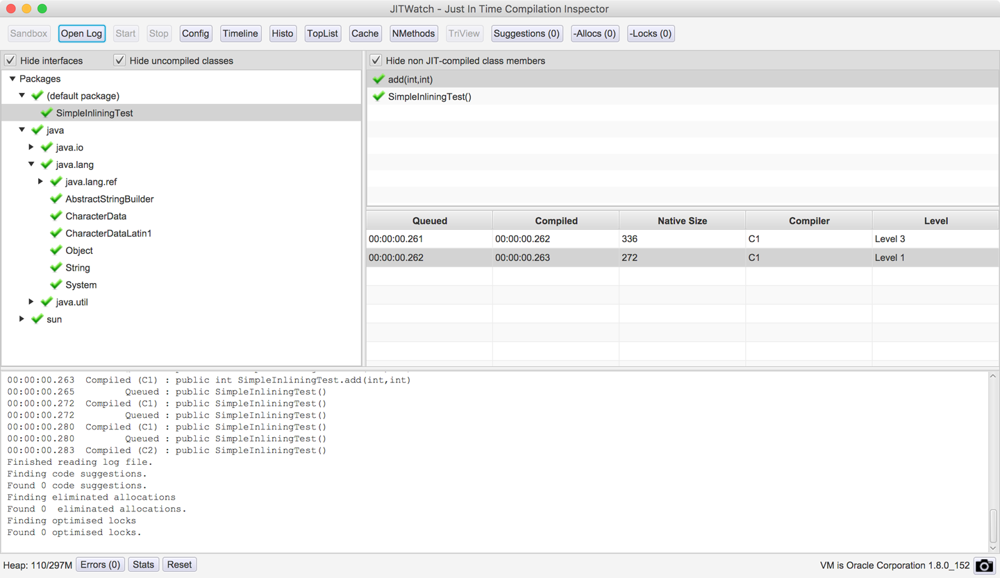
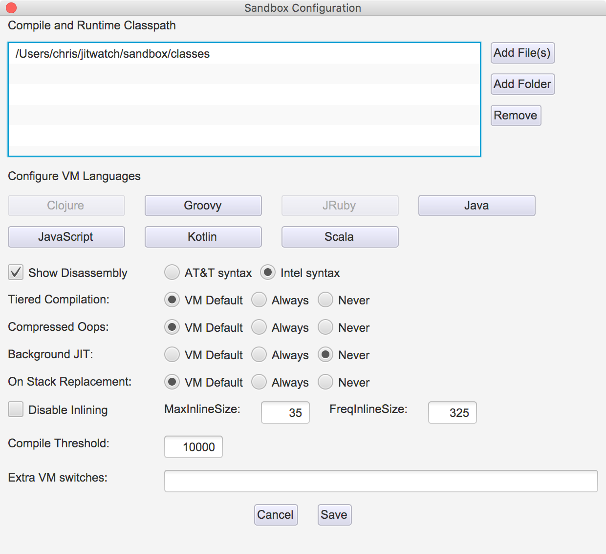
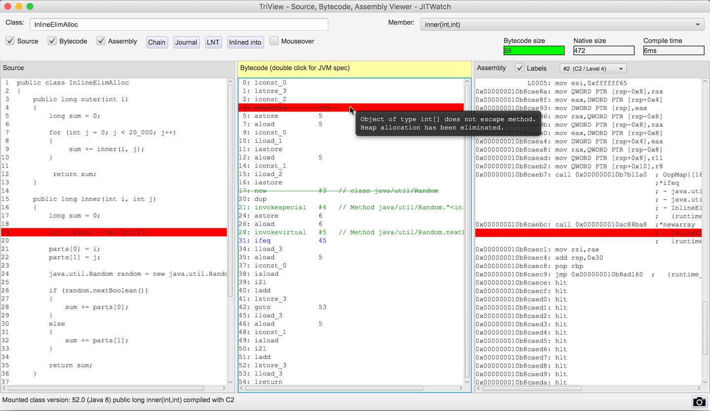
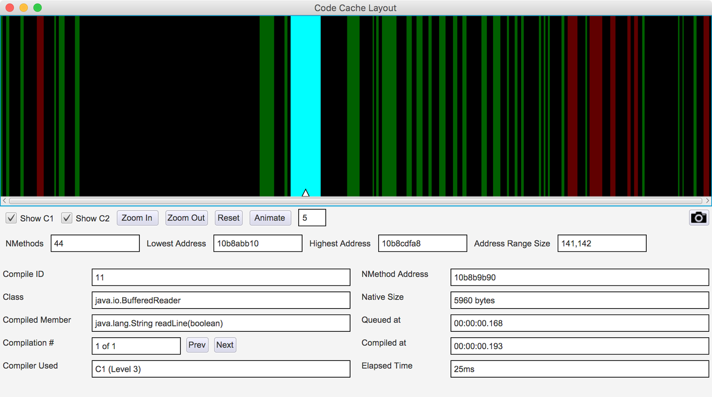
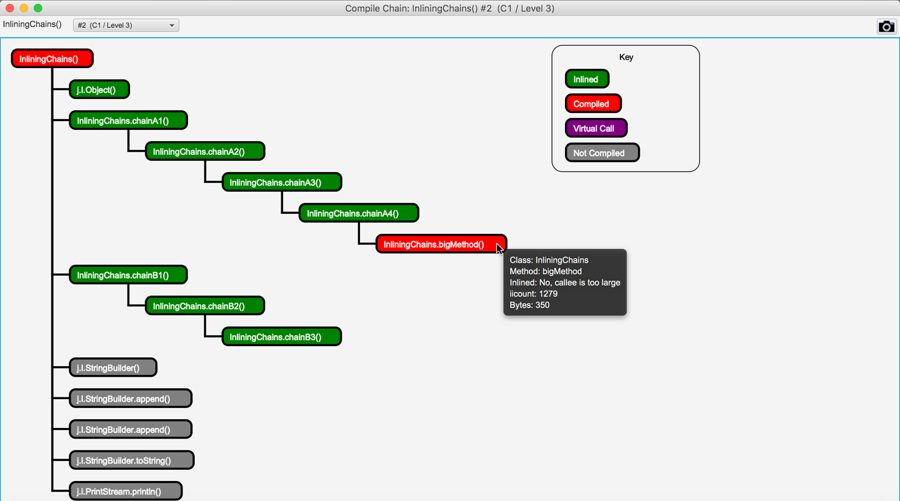
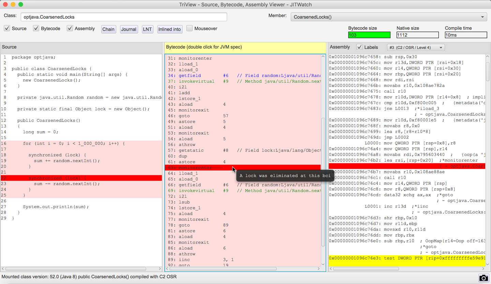
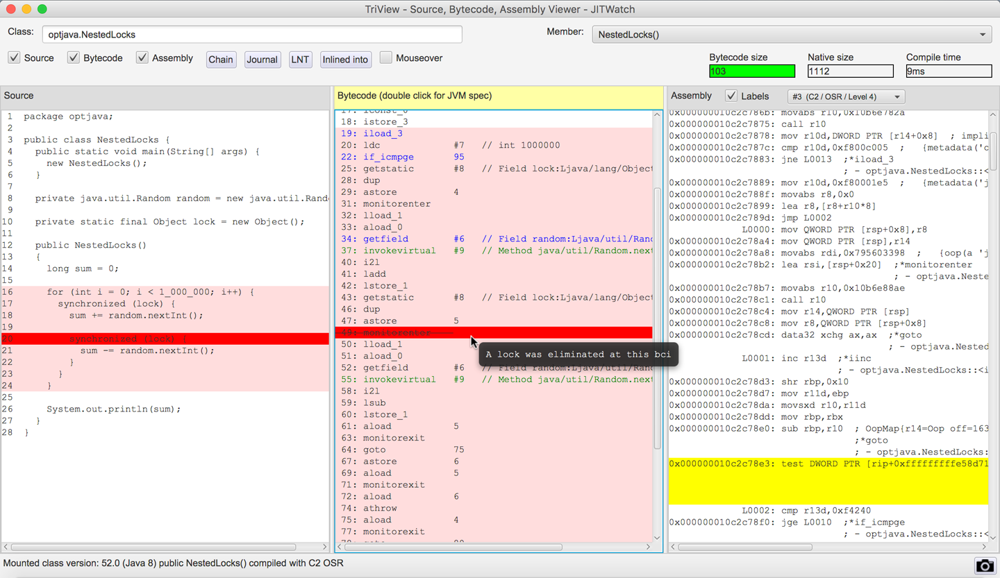
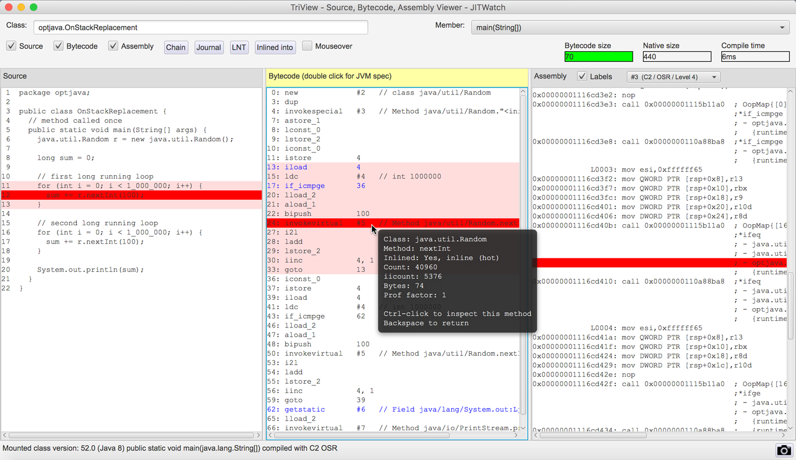

### Chapter 10: Understanding JIT Compilation - Summary

This chapter provides a deep dive into the inner workings of the HotSpot Just-in-Time (JIT) compiler, using the **JITWatch** tool to visualize and understand its behavior. It moves beyond the basics of JIT to explain the specific, powerful optimization techniques that are responsible for Java's high performance. The chapter systematically introduces and explains each major optimization, demonstrating its effects with code examples, benchmarks, and JITWatch visualizations.

The core optimizations covered are:
*   **Inlining:** The "gateway optimization" that eliminates method call overhead and enables other optimizations.
*   **Loop Unrolling:** A technique to reduce branching costs in counted loops.
*   **Escape Analysis:** A powerful analysis that can eliminate heap allocations entirely for non-escaping objects (scalar replacement) and optimize locks (lock elision and coarsening).
*   **Monomorphic Dispatch:** A speculative optimization that dramatically speeds up virtual method calls based on the observed runtime type at a call site.
*   **Intrinsics:** The use of pre-written, highly tuned native code for critical JDK methods.
*   **On-Stack Replacement (OSR):** A mechanism to JIT-compile hot loops inside otherwise cold methods.

The chapter emphasizes that these optimizations are highly dependent on runtime profiling and that developers should write clean, idiomatic Java code, trusting the JIT to optimize it. It concludes by discussing the practical limits of JIT, such as maximum method sizes for inlining and compilation, and provides concrete examples of how to work with or around these limits.

---

### Introducing JITWatch

JITWatch is an open-source JavaFX tool for visualizing and analyzing the compilation decisions made by the HotSpot JIT. It parses the detailed compilation log to show how source code is transformed into bytecode and then into native assembly.

The sandbox can be incredibly useful, so you should pay attention to the warning presented in the edit window. Always remember that code run inside the sandbox may behave very differently from that in a real application.


**Required Flags for JITWatch:**
To generate the necessary log file (`hotspot.log`), run your application with these flags:
`-XX:+UnlockDiagnosticVMOptions -XX:+TraceClassLoading -XX:+LogCompilation`

**Key JITWatch Views:**
*   **Main Window:** An overview of all compiled methods in the application run.
    
*   **Sandbox:** An experimental environment to write small code snippets and immediately see how the JIT compiles them. Useful for quick tests but not a substitute for analyzing a real application.
    
    
*   **TriView:** The most powerful view, showing a synchronized side-by-side display of Java source, the corresponding bytecode, and the final native assembly generated by the JIT.
    
*   **Code Cache View:** Visualizes how compiled methods are laid out in the code cache. In Java 9+, this view shows the new segmented code cache.
    

**Debug JVMs and hsdis:**
*   To see the disassembled native code, you need a disassembler plugin like `hsdis` installed in your JRE.
*   Enable disassembly output with the flag: `-XX:+PrintAssembly`. This is an expensive operation and should not be used in production.

---

### Core JIT Optimizations

HotSpot's JIT compilers perform a wide range of modern compiler optimizations. The decision to apply them is guided by runtime profiling data stored in **Method Data Objects (MDOs)**. The C2 compiler makes heavy use of **speculative optimization**, where it makes an assumption based on profiling data (e.g., "this branch is never taken") and generates highly optimized code based on that assumption. This code is protected by a **guard**; if the assumption is ever violated at runtime, the guard fails, and the code is safely **deoptimized** back to the interpreter.

Counters that record the “hotness” of a profiled property are maintained, and the values in them are decayed during profiling. This ensures that methods are compiled only if they are still hot when they reach the head of the compilation queue.

#### Inlining
*   **What it is:** The process of copying a called method's body directly into the caller's method, eliminating the method call overhead.
*   **Gateway Optimization:** It's the most important optimization because by removing method boundaries, it exposes a much larger block of code to the compiler, enabling other optimizations like escape analysis and loop unrolling to be more effective.
*   **Limits:** The JIT has limits to prevent excessive inlining. These are based on the bytecode size of the method and the current inlining depth. Without these constraints the compiler could become tied up inlining very deep call chains or filling up the code cache with huge native methods. 
    

*   **Tuning Inlining:**

| Switch                | Default (JDK 8) | Explanation                                               |
| --------------------- | --------------- | --------------------------------------------------------- |
| `-XX:MaxInlineSize=<n>`   | 35 bytes        | Inline any method up to this size.                        |
| `-XX:FreqInlineSize=<n>`  | 325 bytes       | Inline *hot* methods up to this larger size.            |
| `-XX:MaxInlineLevel=<n>`  | 9               | Do not inline past this call chain depth.                 |
| `-XX:InlineSmallCode=<n>` | 1,000 bytes of native code (non-tiered) 2,000 bytes of native code (tiered) | Do not inline methods where there is already a final-tier compilation that occupies more than this amount of space in the code cache. |
 
HotSpot considers several factors when determining whether to inline a method, including:
* The bytecode size of the method to be inlined
* The depth of the method to be inlined in the current call chain
* The amount of space in the code cache already taken up by compiled versions of this method


#### Loop Unrolling
*   **What it is:** The compiler duplicates the body of a loop to reduce the number of back-branches, which can cause CPU pipeline stalls. In general, the shorter the loop body, the higher the relative cost of the back branch. 
*   **Conditions:** HotSpot is most effective at unrolling counted loops with `int` counters and constant strides. Loops with `long` counters are typically not unrolled.
*   **Bounds Check Elimination:** For array loops, the JIT can often eliminate array bounds checks for the main, unrolled portion of the loop, yielding significant speedups.

*JMH Benchmark: `int` vs `long` counter*
A loop using an `int` counter is ~64% faster because the JIT can unroll it and remove safepoint polls. The `long` version is not unrolled.
```java
// Slower version
@Benchmark
public long longStride1() {
    long sum = 0;
    for (long l = 0; l < MAX; l++) {
        sum += data[(int) l];
    }
    return sum;
}
```

Removing safepoint polls further reduces the work done each loop iteration.

#### Escape Analysis
*   **What it is:** A JIT analysis to determine if an object allocated within a method "escapes" that method's scope (i.e., is returned, stored in a field, or passed to a non-inlined method).
*   **Escape States:**
    1.  `NoEscape`: The object does not escape the method at all.
    2.  `ArgEscape`: The object is passed as an argument to another call but does not escape globally.
    3.  `GlobalEscape`: The object escapes the method and can be seen by other threads.
*   **Scalar Replacement:** For `NoEscape` objects, the JIT can perform **scalar replacement**. It breaks the object down into its primitive fields and treats them as local variables. The object allocation on the heap is **completely eliminated**.
*   **Lock Elision and Coarsening:** Escape analysis also enables lock optimizations.
    *   **Lock Elision:** If a `synchronized` block uses an object that is proven to be `NoEscape`, the JIT can completely **remove the lock**, as no other thread could possibly contend for it.
    *   **Lock Coarsening:** The JIT can merge adjacent `synchronized` blocks that use the same lock object into a single, larger locked region to reduce locking overhead.
    * It collapses nested blocks
    * The locks from java.util.concurrent are not eligible for these optimizations.
    
    
*   **Limitations:**
    *   **Array Size:** By default, arrays larger than 64 elements are not eligible for scalar replacement. This can be changed with `-XX:EliminateAllocationArraySizeLimit=<n>`.
    *   **No Partial Escape:** If an object escapes on *any* code path, it is considered escaping for all paths. The optimization is not applied.


More details about method dispatch are here: https://shipilev.net/blog/2015/black-magic-method-dispatch/

#### Monomorphic Dispatch
*   **The Observation:** At any given virtual call site (e.g., `shape.getSides()`), the actual runtime type of the receiver (`shape`) is very often the same every single time.
*   **The Optimization:** If the JIT observes only a single receiver type (`monomorphic`), it speculatively optimizes the virtual call. It replaces the expensive vtable lookup with a fast type check (the guard) followed by a direct call to the compiled method.
*   **Bimorphic/Megamorphic:** If two types are seen (`bimorphic`), the JIT can handle it. If more than two are seen (`megamorphic`), the optimization is abandoned, and it reverts to a standard virtual call.
*   **"Peeling" Technique:** If you have a megamorphic call site with a few dominant types, you can manually "peel" them off with `instanceof` checks to create monomorphic/bimorphic call sites, which the JIT can then optimize.

#### Intrinsics
*   **What they are:** A highly tuned, platform-specific native implementation of a core Java method that the JVM knows about. When the JIT encounters a call to an intrinsified method, it substitutes the call with its own optimized assembly instead of compiling the method's Java code.
*   **Examples:** `System.arraycopy()`, `System.currentTimeMillis()`, many `java.lang.Math` methods, and cryptographic functions are common intrinsics.
*   **Example: `Math.log10()` on x86_64**
    The JIT replaces the call with two FPU instructions (`fldlg2`, `fyl2x`), which is far faster than a generic implementation.

For example, we could conceive of intrinsics that perform basic arithmetic identities, such as the sum of the first n numbers. Traditional Java code would require O(n) operations to calculate this value, but it has a trivial formula that will calculate it in O(1) time.

#### On-Stack Replacement (OSR)
*   **The Problem:** A method isn't called often enough to be JIT-compiled, but it contains a very long-running loop.
*   **The Solution:** The interpreter counts loop back-branches. If a loop becomes "hot," the JIT can compile **just the loop** and transfer execution from the interpreted frame directly into the middle of the new compiled native code.
    

---

### Safepoints Revisited

As we've seen, many critical VM operations require all application threads to be paused at a consistent state, known as a **safepoint**.

*   **Operations Requiring a Safepoint:**
    *   Garbage Collection (STW phases)
    *   Deoptimizing a method
    *   Creating a heap dump
    *   Revoking a biased lock
    *   Redefining a class (e.g., for instrumentation)
*   **Safepoint Checks in Compiled Code:** The JIT compiler is responsible for emitting safepoint polling checks in the generated native code. In HotSpot, these are typically placed at:
    *   Loop back branches
    *   Method return points
*   **Time to SafePoint (TTSP):** A thread can only be stopped once it reaches a safepoint. TTSP is the time it takes for *all* application threads to reach a safepoint after the VM requests one. A long TTSP can be a hidden source of application pauses.
    *   **Cause:** A long TTSP can be caused by a thread executing a long, computationally intensive loop that has no method calls and has been optimized by the JIT to remove internal safepoint polls. While one thread is busy, all other threads that have already reached their safepoints must wait for it.
*   **Monitoring Safepoints:**
    *   `-XX:+PrintGCApplicationStoppedTime`: Shows the total time the application was stopped.
    *   `-XX:+PrintSafepointStatistics`: Provides detailed information on each safepoint, including the time taken for threads to reach it.

---
### Core Library Methods and JIT Limits

*   **Inlining Limits:** Some core JDK methods are too large to be inlined by default. For example, `String.toUpperCase()` is over 400 bytes of bytecode (the limit for hot methods is 325) because it must handle complex locale-specific casing rules. If your domain is simple (e.g., ASCII), you can write a smaller, domain-specific version that the JIT *can* inline, resulting in a significant performance boost.

```java
package optjava.jmh;

import org.openjdk.jmh.annotations.*;
import java.util.concurrent.TimeUnit;

@State(Scope.Thread)
@BenchmarkMode(Mode.Throughput)
@OutputTimeUnit(TimeUnit.SECONDS)
public class DomainSpecificUpperCase {

    private static final String SOURCE =
          "The quick brown fox jumps over the lazy dog";

    public String toUpperCaseASCII(String source) {
        int len = source.length();
        char[] result = new char[len];
        for (int i = 0; i < len; i++) {
            char c = source.charAt(i);
            if (c >= 'a' && c <= 'z') {
                c -= 32;
            }
            result[i] = c;
        }
        return new String(result);
    }

    @Benchmark
    public String testStringToUpperCase() {
        return SOURCE.toUpperCase();
    }

    @Benchmark
    public String testCustomToUpperCase() {
        return toUpperCaseASCII(SOURCE);
    }
}
```

*   **Compilation Limits (`HugeMethodLimit`):** HotSpot will not attempt to JIT-compile any method larger than **8,000 bytes** of bytecode. This is rarely an issue for human-written code but can be hit by auto-generated code (e.g., from parsers or complex queries). Methods that exceed this limit will run in the interpreter forever.

---

### Actionable Tips from Chapter 10

> **1. Use JITWatch to See What the Compiler Is Doing.** Don't guess about optimizations. Use `-XX:+LogCompilation` and load the log into JITWatch to get a visual, evidence-based understanding of inlining, escape analysis, and other transformations.

> **2. Write Small, Clean Methods to Encourage Inlining.** Inlining is the gateway to most other major optimizations. Keeping methods small (well under the 325-byte FreqInlineSize limit) gives the JIT the best chance to be effective.

> **3. Trust Escape Analysis; Don't Obsess About Allocation.** Write idiomatic Java code that uses small, temporary objects. Trust that for non-escaping objects, the JIT's scalar replacement will eliminate the heap allocation entirely. Only optimize allocation manually when profiling proves it's a bottleneck.

> **4. Be Aware of Optimization Limits.** Know the default limits, such as the 64-element array size for escape analysis and the 8000-byte `HugeMethodLimit` for compilation. If a critical hot path is unexpectedly slow, check if it's hitting one of these limits.

> **5. Help the JIT with `instanceof` for Megamorphic Calls.** If you have a performance-critical polymorphic call site that sees 3-4 different types, you can often gain performance by "peeling" off the most common types with `instanceof` checks, leaving a bimorphic or monomorphic path that the JIT can aggressively optimize.

> **6. Check for Intrinsics Before Re-Implementing Core Methods.** If a core library method seems slow or has a non-optimal implementation in Java, check if it's an intrinsic. The JIT may be replacing it with highly optimized assembly code, making a custom Java implementation slower.
