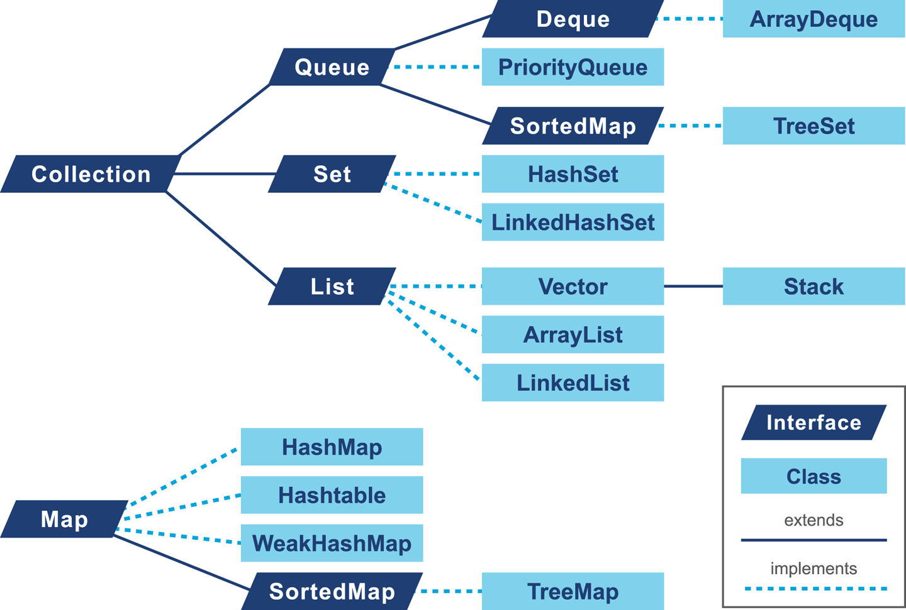
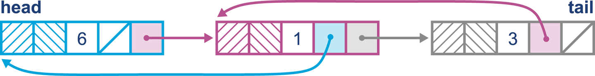
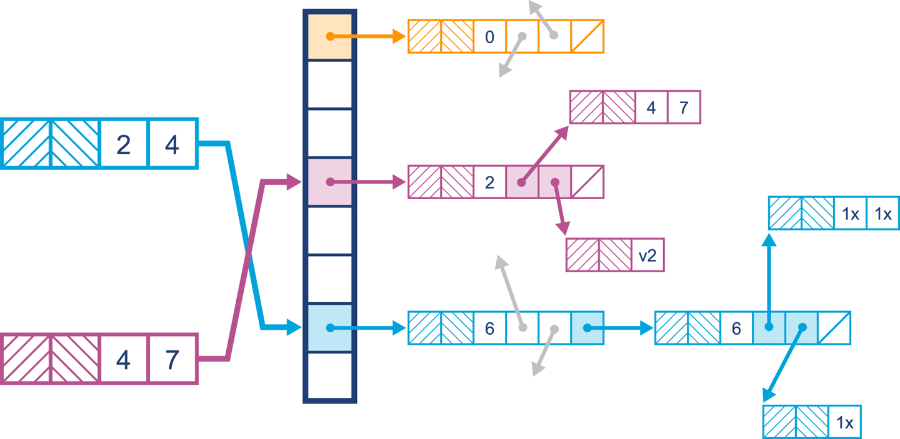
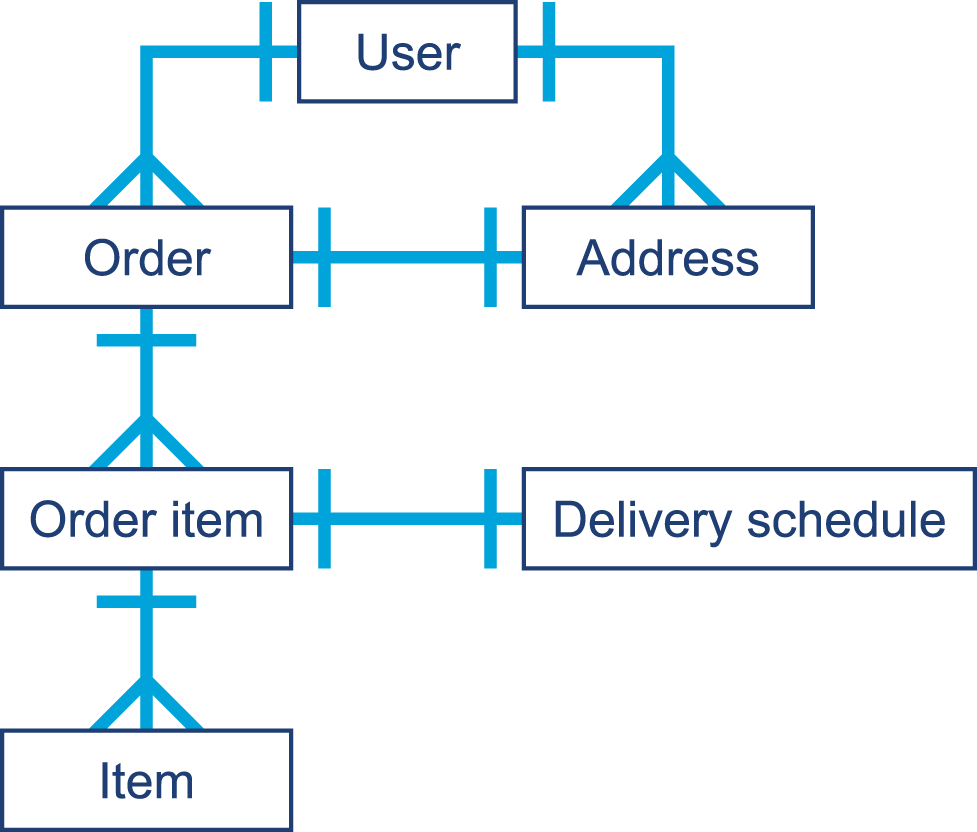
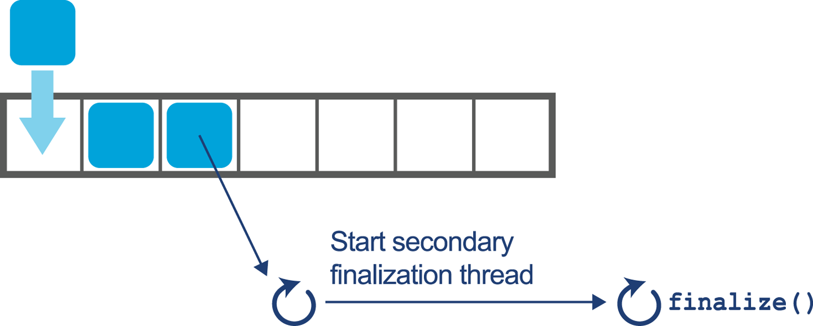

### Chapter 11: Java Language Performance Techniques - Summary

This chapter shifts the focus from the JVM's internal mechanisms to the developer's own code, exploring how language-level choices and design patterns impact performance. It argues that while the JVM is remarkably adept at optimizing even suboptimal code, a developer's understanding of core APIs and language features is crucial for building truly high-performance applications.

The chapter begins with an in-depth analysis of the **Java Collections API**, providing a detailed performance comparison of common `List`, `Map`, and `Set` implementations. It emphasizes the importance of selecting the right data structure for the job by understanding its underlying implementation (`ArrayList`'s backing array vs. `LinkedList`'s nodes) and access patterns (random access vs. insertion/deletion).

Next, it discusses **domain objects**, explaining how their lifecycle and relationships can affect garbage collection and how simple heap analysis can reveal potential memory leaks. A significant portion of the chapter is dedicated to a critical examination of resource management, strongly advising against the use of Java's flawed and deprecated **`finalize()`** mechanism. It details why finalization is non-deterministic and dangerous, contrasting it with the modern, correct, and compile-time-safe **`try-with-resources`** construct.

Finally, the chapter introduces **Method Handles**, the modern, type-safe, and high-performance alternative to reflection. It explains how they are used by `invokedynamic` and how their unique "signature polymorphic" nature allows the JIT compiler to optimize dynamic calls in a way that is impossible with traditional reflection.

---

### Optimizing Collections

The choice of data structure is a fundamental performance decision. Java's collections store references, not the objects themselves, which has performance implications compared to a C-style array of structs.



#### Optimization Considerations for Lists

The two primary `List` implementations have starkly different performance characteristics.

**`ArrayList`**
*   Backed by an array of a fixed size.
*   When the array fills, a new, larger array is allocated, and the old elements are copied over. This resizing operation has a performance cost.
*   **Tip:** If the approximate size is known, always initialize an `ArrayList` with a capacity to avoid resizing.
*   **Performance:**
    *   Excellent for random access (`get(index)`), which is an O(1) operation.
    *   Appending is amortized constant time, but insertion or deletion in the middle of the list is O(n) because it requires shifting all subsequent elements.

*JMH Benchmark: Sized vs. Resizing `ArrayList`*
This benchmark shows that pre-sizing an `ArrayList` results in significantly higher throughput for insertions, as the cost of repeated array copying is eliminated.

```java
@Benchmark
public List<String> properlySizedArrayList() {
	List<String> list = new ArrayList<>(1_000_000);
	for(int i=0; i < 1_000_000; i++) {
		list.add(item);
	}
	return list;
}

@Benchmark
public List<String> resizingArrayList() {
	List<String> list = new ArrayList<>();
	for(int i=0; i < 1_000_000; i++) {
		list.add(item);
	}
	return list;
}
```
*Result:*
```
Benchmark                             Mode  Cnt    Score     Error  Units
ResizingList.properlySizedArrayList  thrpt   10  287.388  ± 7.135   ops/s
ResizingList.resizingArrayList       thrpt   10  189.510  ± 4.530   ops/s
```

**`LinkedList`**
*   Implemented as a doubly linked list of nodes.
*   Each insertion creates a new node and updates references. Appending is always O(1).
*   **Performance:**
    *   Excellent for adding or removing elements at the beginning or end of the list.
    *   Terrible for random access, which is an O(n) operation as it requires traversing the list from the beginning or end.



***ArrayList* vs. *LinkedList* Benchmarks**

*Insertion at the beginning:* `LinkedList` is orders of magnitude faster.
```
Benchmark                     Mode  Cnt    Score    Error   Units
InsertBegin.beginArrayList   thrpt   10    3.402 ±  0.239  ops/ms
InsertBegin.beginLinkedList  thrpt   10  559.570 ± 68.629  ops/ms
```

*Random access by index:* `ArrayList` is orders of magnitude faster.
```
Benchmark                        Mode  Cnt       Score       Error   Units
AccessingList.accessArrayList   thrpt   10  269568.627 ± 12972.927  ops/ms
AccessingList.accessLinkedList  thrpt   10       0.863 ±     0.030  ops/ms
```

**Warning:** The `Vector` class is a legacy, synchronized `ArrayList` and should not be used in new code.

---

#### Optimization Considerations for Maps

**`HashMap`**
*   A classic hash table implementation. Performance depends on two factors:
    1.  **`initialCapacity`**: The number of buckets. Should be set if the size is known to avoid costly rehashing.
    2.  **`loadFactor`**: A percentage threshold (default 0.75) that, when reached, triggers a resize.
*   **Rehashing:** The process of creating a new, larger bucket array and redistributing all existing entries.
*   **Treeifying:** Since Java 8, if a single bucket becomes too populated (due to a poor hash function or hash collisions), its internal linked list is converted into a balanced red-black tree. This improves worst-case lookup performance from O(n) to O(log n) but uses more memory.

*Simplified `HashMap.get()` Logic*
```java
public Object get(Object key) {
    int hash = key.hashCode();
    int i = indexFor(hash, table.length); // Find the bucket
    // Traverse the linked list in the bucket
    for (Entry e = table[i]; e != null; e = e.next) {
        Object k;
        if (e.hash == hash && ((k = e.key) == key || key.equals(k)))
            return e.value;
    }
    return null;
}
```



**`LinkedHashMap`**
*   A subclass of `HashMap` that also maintains a doubly linked list running through all its entries.
*   Preserves insertion order (default) or can be configured for access order. Use only when order is a requirement.

**`TreeMap`**
*   A red-black tree implementation.
*   Keeps entries sorted by key, according to their natural ordering or a provided `Comparator`.
*   Provides O(log n) performance for `get()`, `put()`, and `remove()`.
*   Excellent for range-based queries (e.g., "get all entries with keys between X and Y").

---

#### Optimization Considerations for Sets

Set implementations are simple wrappers around their corresponding `Map` implementations.
*   **`HashSet`:** Backed by a `HashMap`. Offers O(1) performance.
*   **`LinkedHashSet`:** Backed by a `LinkedHashMap`. Preserves insertion order.
*   **`TreeSet`:** Backed by a `TreeMap`. Keeps elements sorted.

*`HashSet.add()` implementation:*
The set element is used as the key in the backing map, with a shared dummy object as the value.

```java
public class HashSet<E> ... {
	private transient HashMap<E,Object> map;
    private static final Object PRESENT = new Object();

	public HashSet() {
		map = new HashMap<>();
	}

    public boolean add(E e) {
        return map.put(e, PRESENT)==null;
    }
}
```

---

### Domain Objects

Domain objects represent core business concepts (`Order`, `Customer`, etc.).

*Code Example: E-commerce Domain Objects*
```java
public class Order {
    private final long id;
    private final List<OrderItem> items = new ArrayList<>();
    private DeliverySchedule schedule;
    // ... methods
}

public class OrderItem {
    private final long id;
    private final String description;
    private final double price;
    // ... methods
}

public final class DeliverySchedule {
    private final LocalDate deliveryDate;
    private final String address;
    private final double deliveryCost;
    // ... methods
}
```



**Performance Considerations:**
*   **Memory Leaks:** Because they represent core business entities, domain objects are often involved in memory leaks. Use a heap histogram tool (`jmap -histo`, VisualVM). If your domain objects appear in the top 30 entries by memory volume or instance count, it is a potential sign of a leak.
*   **GC Mark Times:** A leak can manifest as a single long-lived object keeping alive a very large graph of other objects, increasing GC marking time.

To see why, we need to consider a couple of basic facts about the Java heap:
* The most commonly allocated data structures include strings, char arrays, byte arrays, and instances of Java collection types.
* Data that corresponds to a leak will show up as an anomalously large dataset in jmap.


---

### Avoid Finalization

The `finalize()` method was Java's attempt to provide C++-style RAII (Resource Acquisition Is Initialization). It is fundamentally flawed and has been **deprecated in Java 9**.

**Why `finalize()` is Broken:**
1.  **Non-Deterministic:** It is invoked by the garbage collector, which runs at unpredictable intervals. There is no guarantee *when* (or even *if*) `finalize()` will be called. Resources can remain open for long, indeterminate periods.
2.  **Performance Penalty:** Objects with a `finalize()` method have a much slower allocation path. They also must survive at least one extra GC cycle before being reclaimed.
3.  **Complex Lifecycle:** A finalizable object, when found to be unreachable, is not reclaimed. Instead, it is put on a queue to be processed by a low-priority "Finalizer" thread. Only after the `finalize()` method completes can the object be collected in a *future* GC cycle.
4.  **Error Swallowing:** Any exception thrown from within a `finalize()` method is caught by the finalizer thread and silently ignored.



---

### `try-with-resources`

Introduced in Java 7, this is the correct, safe, and deterministic way to manage resources.

*   **Mechanism:** Any object that implements `AutoCloseable` can be declared in the `try(...)` block. The compiler automatically generates the necessary `finally` block to call `close()` on the resource, even if exceptions occur.
*   **Benefit:** It is pure syntactic sugar. The generated bytecode is simple and has no special runtime overhead, unlike the complex machinery of finalization. It prevents resource leaks caused by developers forgetting to write `finally` blocks.

*Code Comparison: Manual `finally` vs. `try-with-resources`*

**Before Java 7 (Manual Cleanup):**
```java
public void readFirstLineOld(File file) throws IOException {
    BufferedReader reader = null;
    try {
        reader = new BufferedReader(new FileReader(file));
        String firstLine = reader.readLine();
        System.out.println(firstLine);
    } finally {
        if (reader != null) {
            reader.close();
        }
    }
}
```
**Java 7+ (`try-with-resources`):**
```java
public void readFirstLineNew(File file) throws IOException {
    try (BufferedReader reader = new BufferedReader(new FileReader(file))) {
        String firstLine = reader.readLine();
        System.out.println(firstLine);
    }
}
```

---

### Method Handles

Introduced in Java 7, `java.lang.invoke.MethodHandle` is a modern, high-performance, and type-safe alternative to reflection.

*   **Motivation:** Provides the underlying mechanism for `invokedynamic`.
*   **Comparison to Reflection:**
    *   **Performance:** Method handle invocation is much faster because it can be more effectively optimized by the JIT compiler.
    *   **Type Safety:** A method handle's type (`MethodType`) is known at compile time. The compiler emits a strongly-typed `invokevirtual` call, unlike reflection's `invoke`, which takes `Object` and `Object[]`, requiring runtime checks and boxing.
    *   **Access Control:** Method handles use a `MethodHandles.Lookup` object that respects the accessibility rules of the context where it was created. This is safer than reflection's `setAccessible(true)` hack.
*   **Signature Polymorphism:** The `invoke()` methods on `MethodHandle` are special. The compiler can generate a call to them with *any* signature, and the JVM will link it correctly at runtime. This is a unique feature that applies only to method handles and is key to their performance.

*Bytecode Comparison*

**Reflection `invoke` bytecode (untyped):**
```
invokevirtual #3 // Method java/lang/reflect/Method.invoke:(Ljava/lang/Object;[Ljava/lang/Object;)Ljava/lang/Object;
```
*   **Comment:** The signature is always `(Object, Object[]) -> Object`.
*   All arguments must be boxed and packed into an `Object[]`.
*   The return value is always `Object` and must be cast.
*   The JIT has very little static information to optimize this call.

**Method Handle `invoke` bytecode (strongly typed):**
```
invokevirtual #9 // Method java/lang/invoke/MethodHandle.invoke:(Ljava/lang/String;)I
```
*   **Comment:** The signature is `(String) -> int`, matching the target method (`String.hashCode()`).
*   Arguments are passed directly on the stack without boxing or array allocation.
*   The return type is the specific primitive `int`, requiring no casting.
*   The JIT has full type information for this call site, allowing for aggressive optimizations like inlining.

---

### Actionable Tips from Chapter 11

> **1. Prefer `ArrayList` over `LinkedList`.** Unless your primary operation is adding/removing elements from the head of a list, `ArrayList`'s superior random access performance makes it the better default choice.

> **2. Pre-size Your Collections.** If you know the approximate number of elements you'll be storing, initialize your `ArrayList` or `HashMap` with an appropriate capacity to avoid the performance cost of repeated resizing.

> **3. Understand Your Data Structure's Performance Guarantees.** Know the Big-O complexity of the operations you are performing. Using a `TreeMap` (O(log n)) when you only need a `HashMap` (O(1)) can be a needless performance penalty if you don't require ordering.

> **4. Monitor Your Domain Objects in the Heap.** Use a heap histogram (`jmap -histo`) as a quick check for memory leaks. If your application-specific classes are at the top of the list, it warrants further investigation.

> **5. NEVER Use `finalize()`.** It is a broken, deprecated, and non-deterministic mechanism. For all resource management, use the `try-with-resources` statement, which is safe, deterministic, and has no runtime overhead.

> **6. Refactor Away from `Vector`.** If you encounter `java.util.Vector` in a legacy codebase, plan to replace it with `ArrayList`. `Vector`'s method-level synchronization is a coarse-grained approach to concurrency that is rarely what you actually need and is a performance bottleneck.

> **7. Use Method Handles for Dynamic Code, Not Reflection.** For any new code that requires dynamic method invocation, prefer the Method Handles API. It is safer, faster, and the modern foundation for dynamic behavior on the JVM.
