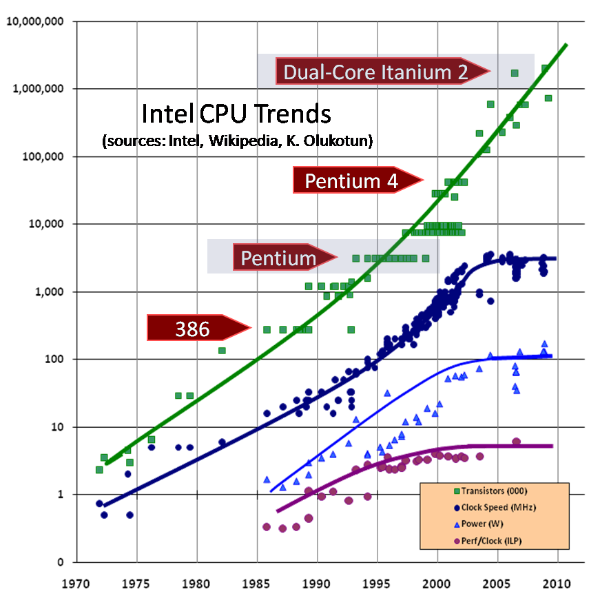
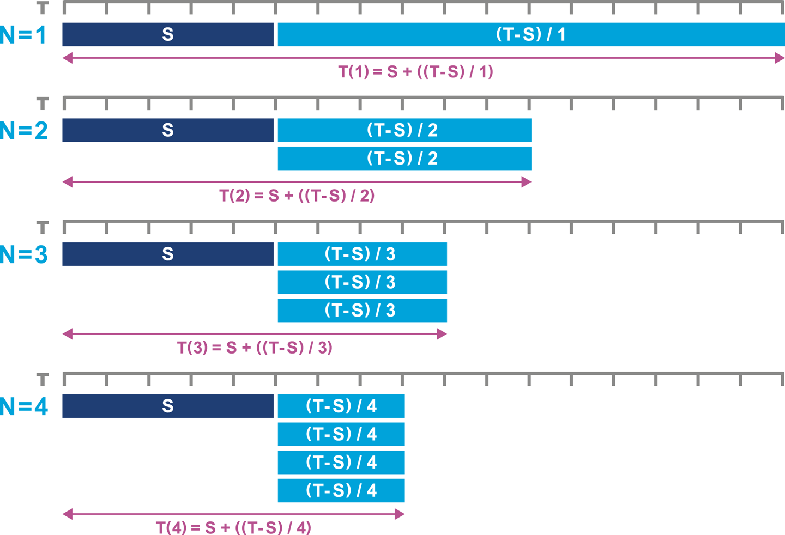
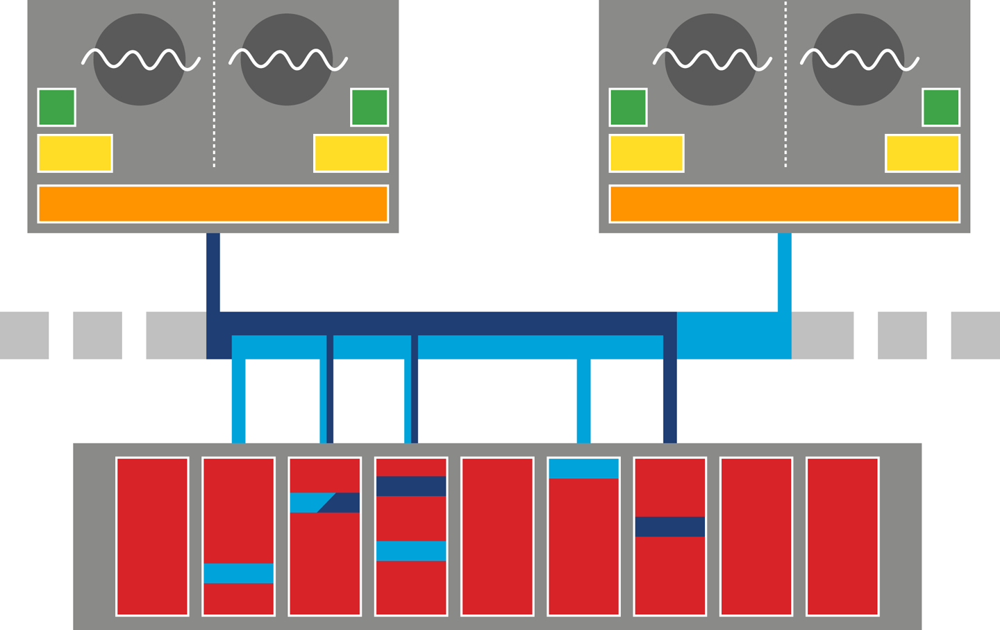
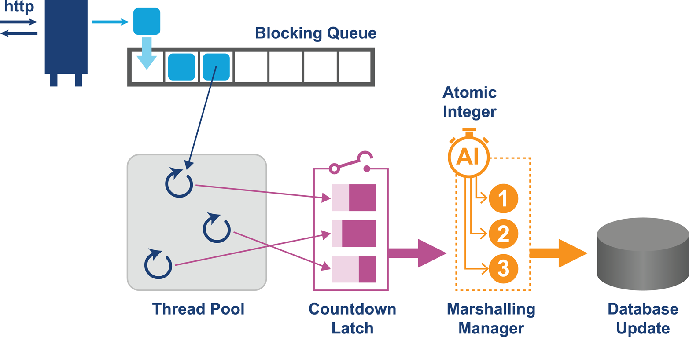
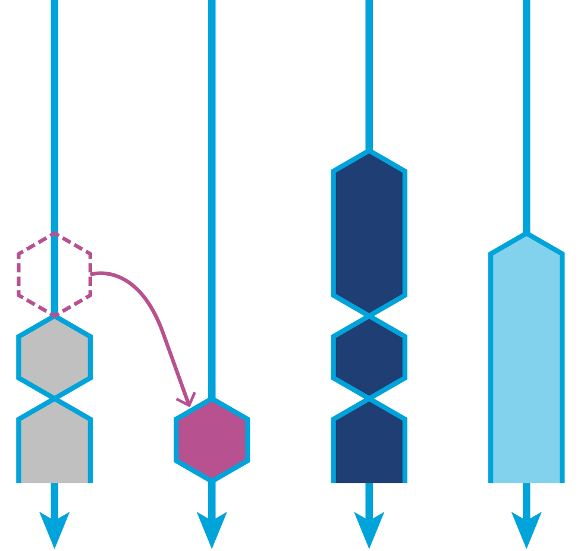

### Chapter 12: Concurrent Performance Techniques - Summary

This chapter explores the critical role of concurrency in modern high-performance Java applications. It begins by acknowledging the end of "The Free Lunch"—the era where single-core clock speeds doubled regularly—and the necessity of utilizing multicore architectures. The chapter introduces fundamental concepts like **Amdahl's Law**, which sets the theoretical limit on speedup based on the serial portion of a task, and the **Java Memory Model (JMM)**, which defines the rules for visibility and ordering in concurrent execution.

The text provides a practical guide to Java's concurrency tools, moving from low-level primitives (volatile, synchronized) to the robust **`java.util.concurrent`** library (Locks, Atomics, Executors, Concurrent Collections). It explains the mechanics of **CAS (Compare-And-Swap)** and how it enables lock-free programming. The chapter also covers modern abstractions like **Parallel Streams** and the **Fork/Join** framework, while warning against their blind usage. Finally, it introduces advanced concepts like **Lock-Free techniques** (Disruptor pattern) and **Actor-based models** (Akka), encouraging developers to move away from raw thread management toward higher-level abstractions.

---

### Introduction to Parallelism

*   **The Free Lunch Is Over:** Single-core performance plateaued around 2005. Future performance gains must come from concurrency.
    

*   **Amdahl's Law:** A formula that predicts the maximum theoretical speedup of a task when using multiple processors.
    *   `T(N) = S + (1/N) * (T - S)`
    *   Where `S` is the serial part (cannot be parallelized) and `T` is the total time.
    *   **Key Insight:** If the serial portion is even 5%, the maximum speedup is capped at 20x, regardless of how many thousands of cores you add.
    

*   **Embarrassingly Parallel:** Workloads with no shared state or communication needs. These scale perfectly but are rare in complex applications.

---

### Fundamental Java Concurrency

Concurrency introduces bugs that don't exist in sequential code, such as **Lost Updates**.

*   **The Increment Problem:** `i++` is not atomic. It is a read-modify-write operation.
    *   Bytecode: `getfield` -> `iconst_1` -> `iadd` -> `putfield`.
    *   If two threads interleave during these steps, one update will overwrite the other.

*   **Volatile is Not Enough:** The `volatile` keyword guarantees visibility (updates are seen by other threads) but **does not guarantee atomicity**. It cannot prevent lost updates in composite operations like increment.

*   **Testing:** "Testing shows the presence, not the absence of bugs." Concurrent bugs are non-deterministic and hard to reproduce.

---

### Understanding the JMM (Java Memory Model)

The JMM answers: "When does a write by one thread become visible to another?"

*   **Weak Memory Model:** Java does not guarantee a "strong" model where all cores see the same value instantly. This allows for hardware optimizations (caches, reordering) and easier porting.
    

*   **Key Concepts:**
    *   **Happens-Before:** A guarantee that one event is visible to another.
    *   **Synchronizes-With:** An action that synchronizes a thread's local view with main memory.
    *   **Synchronized:** Ensures both **mutual exclusion** (locking) and **visibility** (flushing caches to/from main memory).
    *   **Rule:** If you write to a variable without synchronization, there are **no guarantees** when other threads will see it.


The JMM enforces this behavior and offers various guarantees that can be assumed about Java and memory safety. However, the traditional Java synchronized lock has several limitations, which have become increasingly severe:
* All synchronized operations on the locked object are treated equally.
* Lock acquiring and releasing must be done on a method level or within a synchronized block within a method.
* Either the lock is acquired or the thread is blocked; there is no way to attempt to acquire the lock and carry on processing if the lock cannot be obtained.


JMM for compiler writers: https://gee.cs.oswego.edu/dl/jmm/cookbook.html

JMM nice article: https://shipilev.net/blog/2016/close-encounters-of-jmm-kind/

---

### Building Concurrency Libraries

Java 5 introduced `java.util.concurrent` (JUC), moving away from intrinsic locks (`synchronized`) toward more flexible, high-performance library classes.

There is also another library JCTools that has great concurrency tools : https://github.com/JCTools/JCTools



#### CAS (Compare and Swap)
A hardware primitive that enables lock-free concurrency.
1.  Read a value.
2.  Compute a new value.
3.  Atomically update the memory location **only if** it still holds the original value.
4.  If it fails (another thread updated it), retry.

*   **`sun.misc.Unsafe`:** The internal, unsupported API that provides access to CAS and raw memory. It is the foundation for high-performance frameworks but should not be used directly by application developers.
    *   **Capabilities:**
        *   Allocate objects without running constructors.
        *   Access raw memory and perform pointer arithmetic.
        *   Use processor-specific features like CAS.
        *   Implement custom memory fences.
    *   **Role:** While not part of the standard API, it is a de facto standard used by frameworks for fast serialization, thread-safe native memory access, and atomic operations.
    *   **Warning:** It is unsupported and could be removed or modified in future Java versions (e.g., moved to `jdk.unsupported` module in Java 9).


#### Atomics
Classes like `AtomicInteger` use CAS to provide thread-safe, lock-free operations.

*Code Example: Atomic Increment using Unsafe (Simplified logic of AtomicInteger)*
```java
public class AtomicIntegerExample extends Number {

    private volatile int value;

    // setup to use Unsafe.compareAndSwapInt for updates
    private static final Unsafe unsafe = Unsafe.getUnsafe();
    private static final long valueOffset;

    static {
        try {
            valueOffset = unsafe.objectFieldOffset(
                 AtomicIntegerExample.class.getDeclaredField("value"));
        } catch (Exception ex) {
            throw new Error(ex);
        }
    }

    public final int get() {
        return value;
    }

    public final void set(int newValue) {
        value = newValue;
    }

    public final int getAndSet(int newValue) {
        return unsafe.getAndSetInt(this, valueOffset, newValue);
    }
   // ...

public final int getAndSetInt(Object o, long offset, int newValue) {
    int v;
    do {
        // Read volatile ensures visibility
        v = getIntVolatile(o, offset);
    // Loop until CAS succeeds
    } while (!compareAndSwapInt(o, offset, v, newValue)); 
    return v;
}
```
*   **Tip:** Never write your own "retry loop" for atomics; use the methods provided by the standard library.

#### Locks and Spinlocks
*   **OS Lock:** Suspends the thread. Good for long waits, but context switching is expensive.
*   **Spinlock:** The thread sits in a tight loop ("spins") checking if the lock is free. Burns CPU but avoids context switching. Good for very short waits. Modern locks (like `ReentrantLock`) often use a hybrid approach.

Spinlock assembly implementaton sample:
```asm
locked:
     dd      0

spin_lock:
     mov     eax, 1
     xchg    eax, [locked]
     test    eax, eax
     jnz     spin_lock
     ret

spin_unlock:
     mov     eax, 0
     xchg    eax, [locked]
     ret
```

---

### `java.util.concurrent` Components

#### Locks
The `Lock` interface offers more flexibility than `synchronized`:
*   **`tryLock()`:** Attempt to acquire lock without blocking.
*   **`lockInterruptibly()`:** Acquire lock but allow interruption.
*   **`ReentrantReadWriteLock`:** Allows multiple simultaneous readers but only one writer. Crucial for read-heavy workloads (like caches) to improve throughput.

*Code Example: Read/Write Lock*
```java
public class AgeCache {
    private final ReentrantReadWriteLock rwl = new ReentrantReadWriteLock();
    private final Lock readLock = rwl.readLock();
    private final Lock writeLock = rwl.writeLock();
    private Map<String, Integer> ageCache = new HashMap<>();

    public Integer getAge(String name) {
        readLock.lock();
        try { return ageCache.get(name); } 
        finally { readLock.unlock(); }
    }

    public void updateAge(String name, int newAge) {
        writeLock.lock();
        try { ageCache.put(name, newAge); } 
        finally { writeLock.unlock(); }
    }
}
```

#### Semaphores
Controls access to a shared resource using a set of "permits."
*   `acquire()` takes a permit (blocks if none available).
*   `release()` returns a permit.
*   Useful for pooling resources (e.g., database connections).

#### Concurrent Collections
Designed for high throughput.
*   **`ConcurrentHashMap`:** Uses lock striping (segments) so multiple threads can read/write simultaneously without locking the entire map. Reads are generally lock-free.
*   **`CopyOnWriteArrayList`:** Mutating operations create a new copy of the backing array. Iterators are snapshot-safe and never throw `ConcurrentModificationException`. Excellent for read-heavy lists (e.g., listener lists).

#### Latches and Barriers
*   **`CountDownLatch`:** Allows threads to wait until a set of operations (the "count") completes. Single-use.
*   **`CyclicBarrier`:** Allows a set of threads to wait for each other to reach a common barrier point. Reusable.

---

### Executors and Task Abstraction

Directly creating `new Thread()` is expensive and hard to manage. `ExecutorService` abstracts execution policy from task submission.

*   **Task:** `Runnable` (no result) or `Callable<V>` (returns result, throws exception).
*   **Executors Factory Methods:**
    *   `newFixedThreadPool(n)`: Reuse a fixed number of threads. Good for preventing resource exhaustion.
    *   `newCachedThreadPool()`: Creates threads as needed, reuses them, kills idle ones. Good for many short-lived tasks.
    *   `newSingleThreadExecutor()`: Ensures tasks run sequentially.
*   **`Future<V>`:** Represents the result of an asynchronous computation.

---

### Fork/Join Framework (Java 7+)

Designed for divide-and-conquer algorithms.
1.  **Task Subdivision:** A `ForkJoinTask` splits itself into smaller subtasks.
2.  **Work Stealing:** If a thread finishes its own deque of work, it "steals" a task from the tail of another thread's deque. This balances the load dynamically.
    

*   **Common Pool:** `ForkJoinPool.commonPool()` is used by Parallel Streams.
*   **Sizing:** Defaults to `availableProcessors() - 1`. Can be tuned with `-Djava.util.concurrent.ForkJoinPool.common.parallelism=N`.

---

### Modern Java Concurrency

#### Streams and Parallel Streams (Java 8)
*   **Stream:** Immutable sequence of data elements.
*   **`parallelStream()`:** Automatically splits the work using a `Spliterator` and executes it on the common Fork/Join pool.
*   **Warning:** Do not simply replace every `.stream()` with `.parallelStream()`. Parallelism has overhead (splitting/merging). For small datasets or simple operations, serial is often faster. **Measure, don't guess.**

#### Lock-Free Techniques (The Disruptor)
*   **Premise:** Blocking is expensive (context switches).
*   **Disruptor Pattern:** A high-performance ring buffer design that uses **spinlocks** and **mechanical sympathy** (optimizing for hardware cache lines) to achieve massive throughput.
*   **Trade-off:** Spinning consumes 100% of a CPU core even when idle. Great for latency, bad for power efficiency.

#### Actor-Based Techniques (Akka)
*   **Actors:** Independent units of state and behavior that communicate *only* via immutable, asynchronous messages.
*   **Benefits:**
    *   No shared mutable state (eliminates locks).
    *   Location transparency (actors can be on remote machines).
    *   Self-healing (supervision hierarchies for error handling).
*   **Use Case:** Complex distributed systems or systems requiring high fault tolerance.

---

### Actionable Tips from Chapter 12

> **1. Prefer `java.util.concurrent` over `synchronized`.** The standard library classes (locks, concurrent collections, executors) are tuned for performance and offer far more flexibility than low-level primitives.

> **2. Use `ConcurrentHashMap`.** It is the go-to structure for shared maps. It offers excellent scalability compared to `Collections.synchronizedMap()`.

> **3. Understand Amdahl's Law.** Parallelizing code has diminishing returns. If your task has a significant serial component (synchronization, I/O), throwing more cores at it won't help.

> **4. Use Thread Pools (Executors).** Never create threads manually for tasks. Use a fixed thread pool to control resource usage or a cached pool for short, bursty tasks.

> **5. Be Careful with `parallelStream()`.** It is not a magic "go faster" switch. It runs on the shared common pool and adds overhead. Only use it for computationally expensive tasks on large datasets, and **verify** the speedup with benchmarks.

> **6. Minimize Shared Mutable State.** The best way to solve concurrency problems is to avoid them. Use immutable objects, local variables, or actor-based models to reduce the need for locks.

> **7. Measure Before Locking.** Lock-free isn't always faster (spinning burns CPU). Fine-grained locking isn't always better (overhead). Profile your specific workload.

