### Chapter 13: Profiling - Summary

This chapter provides a comprehensive guide to profiling Java applications, focusing on two main types: **Execution Profiling** (CPU usage) and **Allocation Profiling** (memory usage). It emphasizes the critical importance of understanding *how* profilers work, as they are prone to biases and can misrepresent application behavior.

The chapter warns against "profiling blindness"—using tools without understanding their limitations. It introduces the concept of **Safepointing Bias**, a major flaw in traditional sampling profilers where stack traces are only collected at JVM safepoints, leading to distorted data.

A wide range of tools is surveyed, from basic developer tools like **VisualVM** to powerful commercial suites like **JProfiler** and **YourKit**, and operational tools like **New Relic** and **Red Hat Thermostat**. It highlights modern, low-overhead profilers like **Honest Profiler**, **perf**, and **Async Profiler** that avoid safepointing bias. Finally, it covers techniques for tracking memory allocation, including bytecode instrumentation and TLAB-driven sampling, and discusses the role of heap dump analysis.

---

### Introduction to Profiling

Profiling aims to identify specific code that can be optimized. However, it should only be the **second** step in performance analysis.

1.  **Diagnosis First:** Confirm that the application is actually CPU-bound (user space CPU ~100%). If the CPU is idle or dominated by kernel time, or if GC logs show high activity, execution profiling is the wrong tool.
2.  **Cognitive Bias:** Be aware of confirmation bias. Don't just look for what you expect to see.

> "A good programmer…will be wise to look carefully at the critical code; but only after that code has been identified." — Donald Knuth

---

### Sampling and Safepointing Bias

Most profilers work by **sampling**: taking snapshots of thread stack traces at regular intervals (e.g., every 100ms). This is a trade-off between overhead and accuracy.

*   **Safepointing Bias:** Standard profilers use the JVM's `GetCallTrace()` API, which requires threads to be at a **safepoint**.
    *   **Consequence 1:** High overhead. All threads must stop for a sample to be taken.
    *   **Consequence 2:** Distorted data. Samples are only taken when code is *able* to stop. Code running in tight loops (e.g., unrolled loops) may not contain safepoint polls and will therefore be invisible to the profiler.

*   **Monitoring Safepoint Overhead:** Use `-XX:+PrintGCApplicationStoppedTime` to track how much time is spent stopping the world for safepoints (GC or profiling).

---

### Execution Profiling Tools

#### Developer Tools

*   **VisualVM:** A free, simple tool good for dev/QA but limited for deep analysis.
    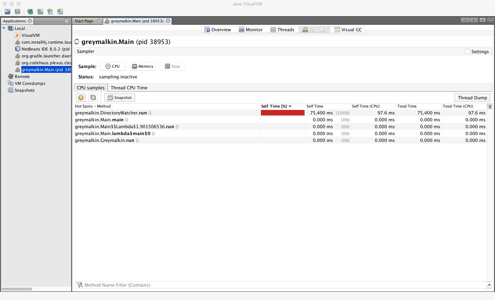

*   **JProfiler (Commercial):** A comprehensive suite with excellent UI. Supports attach mode and detailed call tree analysis.
    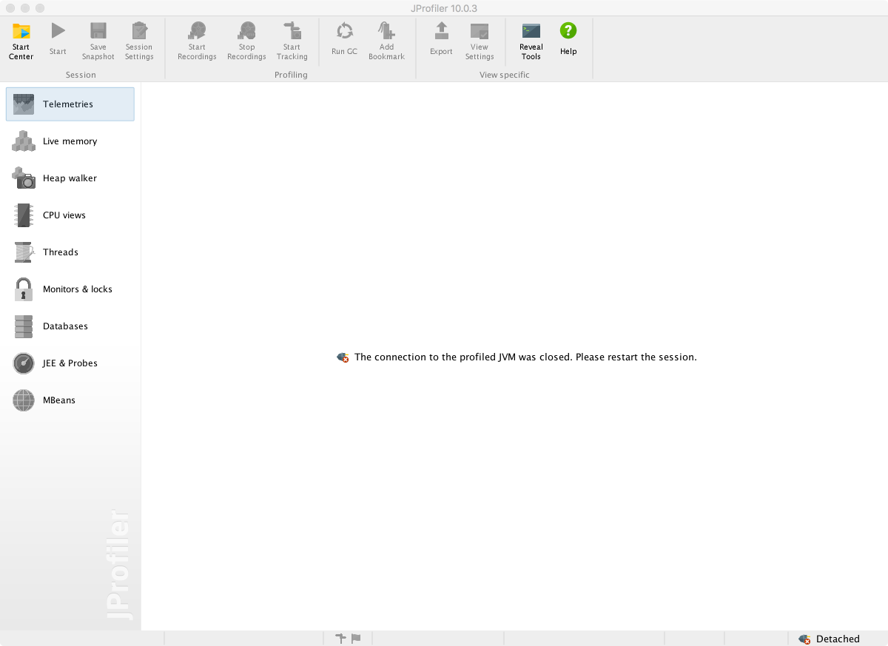
    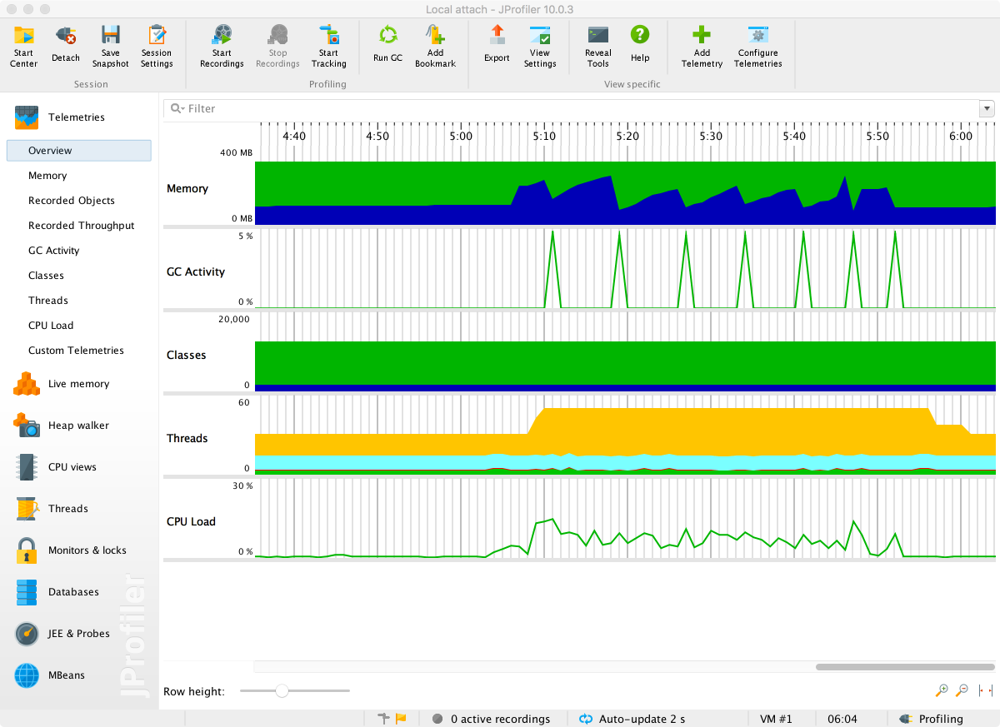
    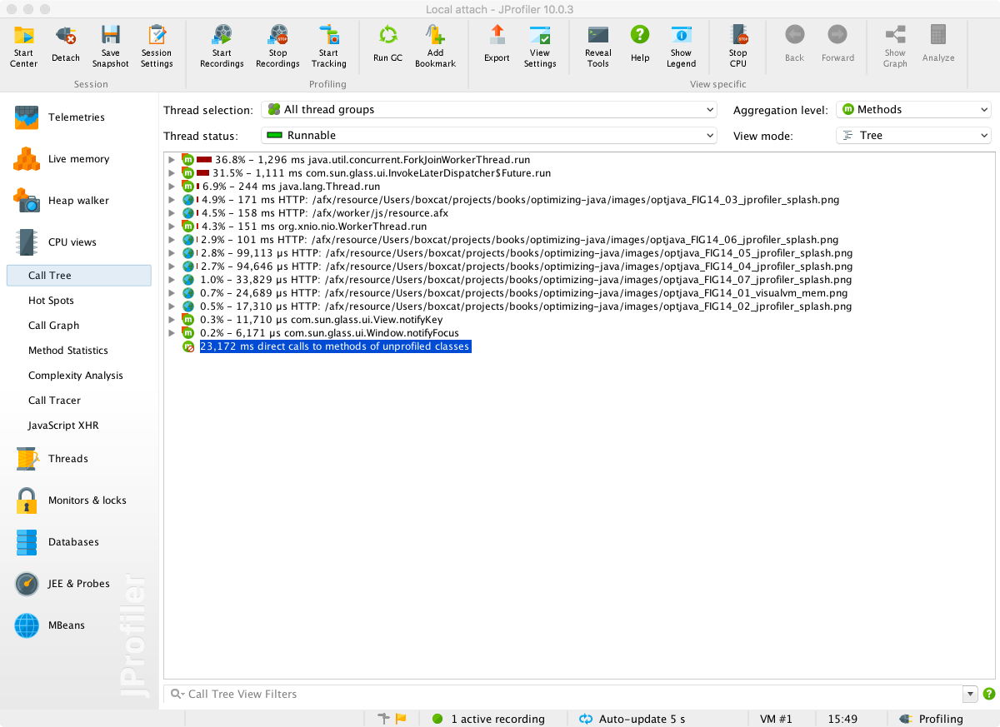

*   **YourKit (Commercial):** A powerful competitor to JProfiler with similar capabilities and deep CPU analysis views.
    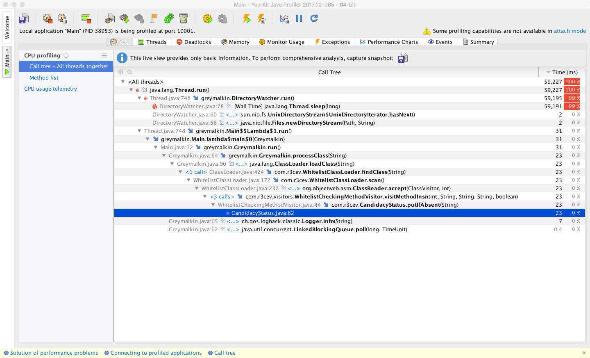

*   **Java Flight Recorder (JFR) & Mission Control (JMC):** Originally from JRockit, now part of Oracle JDK (and moving to OpenJDK). Low-overhead, built-in profiling suitable for production use.
    *   **Flags:** `-XX:+UnlockCommercialFeatures -XX:+FlightRecorder` (Java 8)
    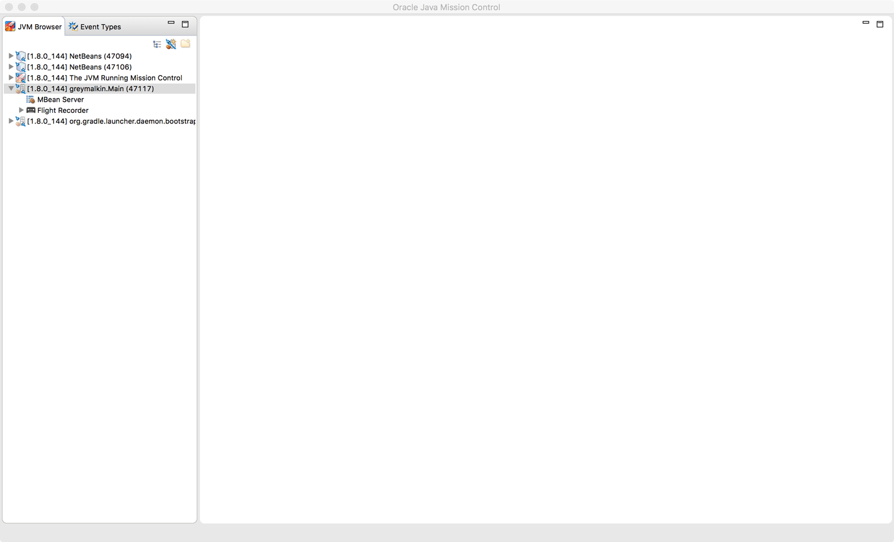
    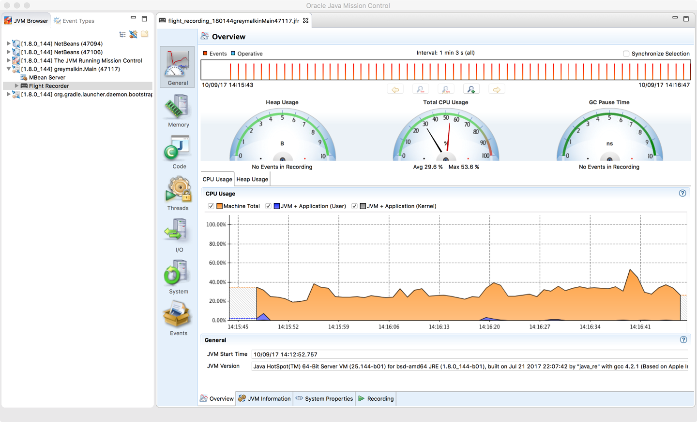

#### Operational Tools

These tools focus on system health and anomaly detection rather than deep code analysis.

*   **Red Hat Thermostat:** Open-source monitoring for clusters. Extensible via plugins.
    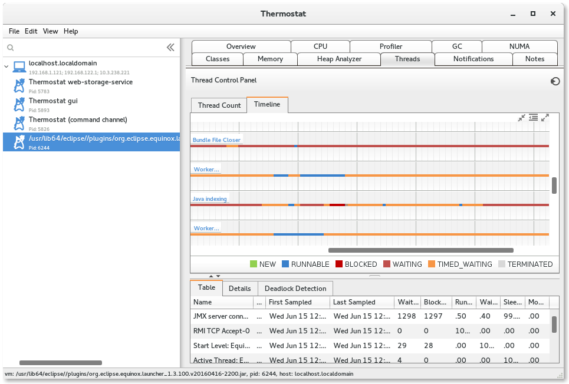

*   **New Relic:** SaaS-based full-stack monitoring. Excellent for trends and high-level overview but less detailed for JVM internals.
    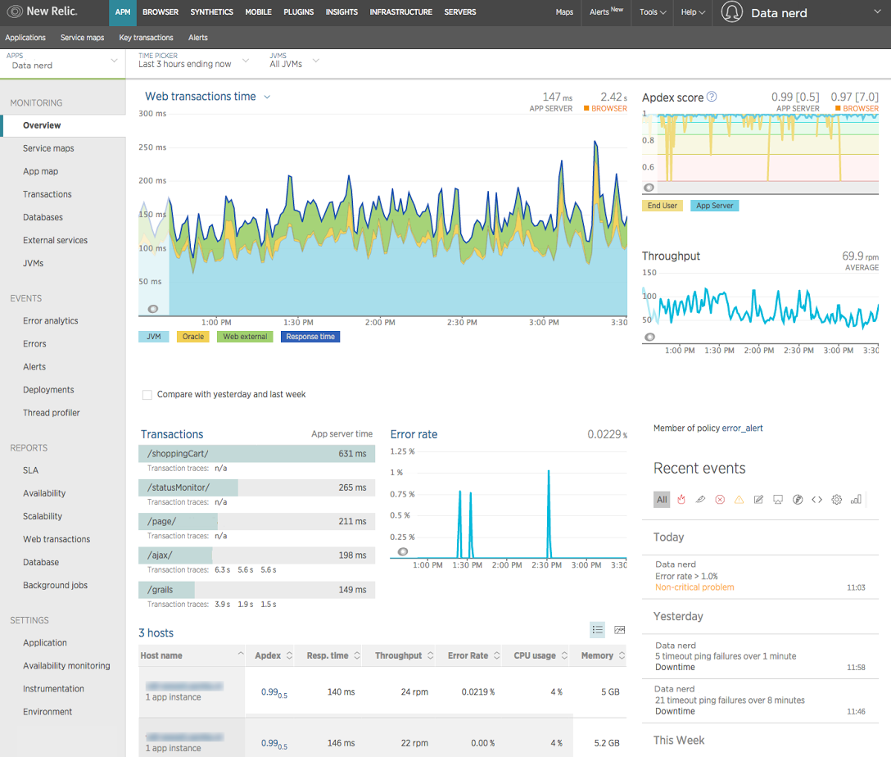

*   **jClarity Illuminate:** Uses machine learning to diagnose root causes of performance issues automatically, differentiating between app code, GC, and OS/Kernel issues.
    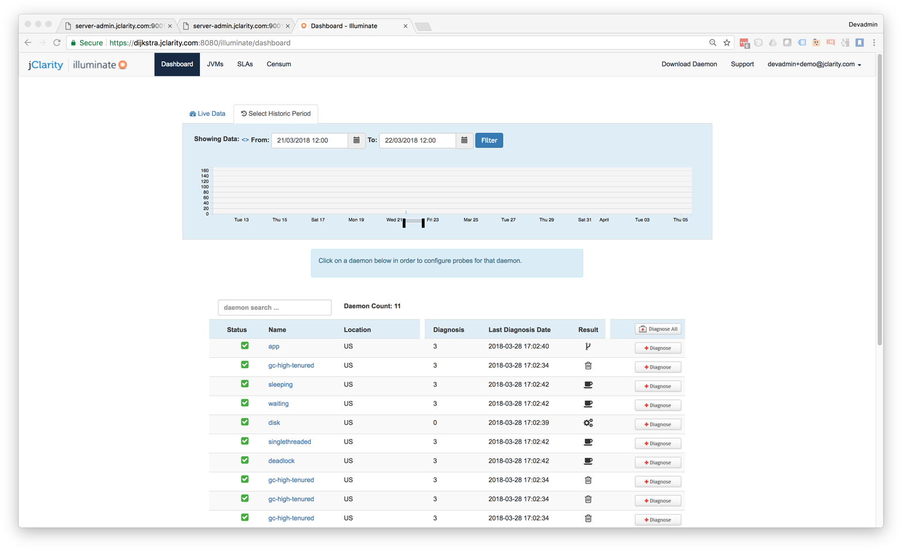

---

### Modern Profilers (No Safepoint Bias)

These tools use non-standard APIs or OS features to sample threads *without* requiring a global safepoint, providing higher accuracy and lower overhead.

*   **Honest Profiler:** An open-source tool that uses the private `AsyncGetCallTrace` API and Unix signals to sample threads without stopping the world.
    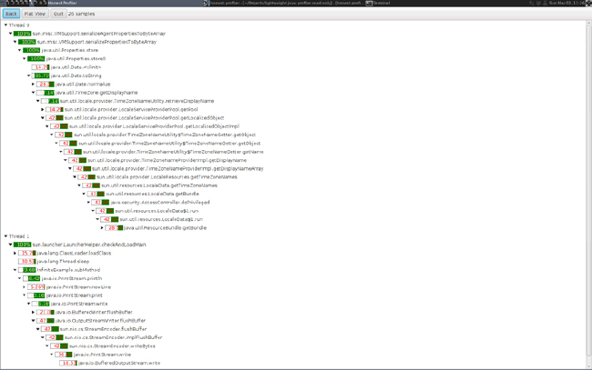

*   **perf:** A Linux kernel tool that reads hardware performance counters (CPU instructions, cache misses). It requires `perf-map-agent` to map JIT-compiled code symbols.
    *   **Flag:** `-XX:+PreserveFramePointer` (Java 8u60+) is needed for accurate stack walking, at a small (~3%) performance cost.
    *   **Flame Graphs:** A powerful visualization for `perf` data.
    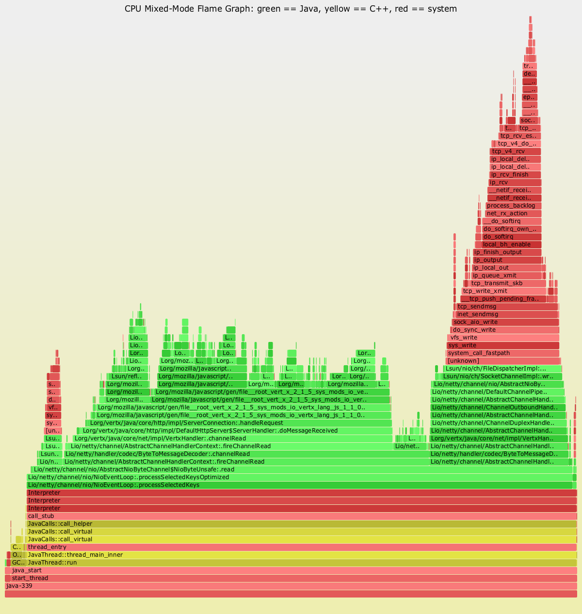

*   **Async Profiler:** Similar to Honest Profiler but also leverages `perf` events. Works only on Linux/HotSpot but is extremely powerful.

---

### Allocation Profiling

Memory profiling focuses on object allocation rates and locations.

*   **VisualVM & YourKit:** Provide simple views of live objects and allocation rates.
    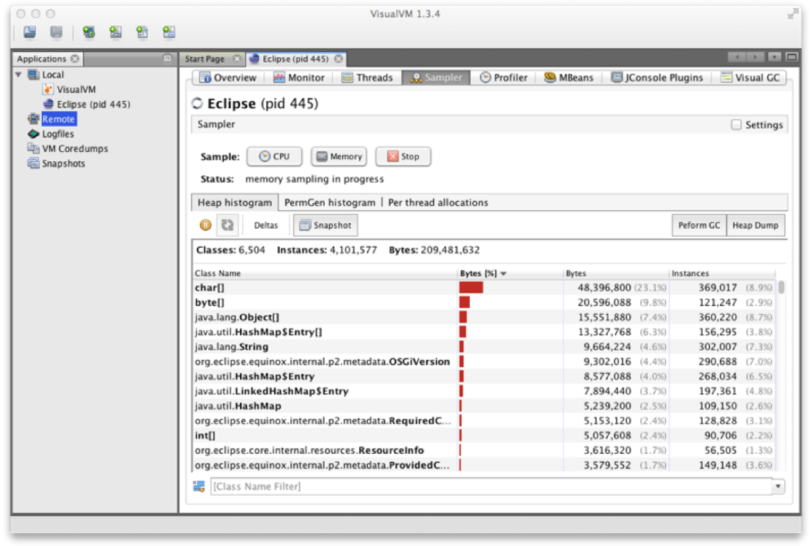
    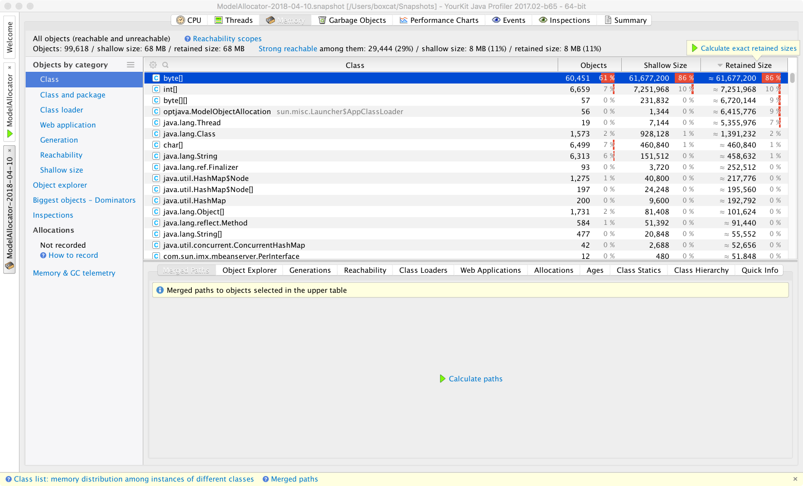

#### Bytecode Instrumentation Approach
One way to track allocations is to rewrite bytecode to insert tracking calls before every allocation opcode (`NEW`, `NEWARRAY`, `ANEWARRAY`).

*Code Example: Allocation Instrumentation with ASM*
This `MethodVisitor` intercepts allocation instructions and injects a call to a recording method.

```java
public final class AllocationRecordingMethodVisitor extends GeneratorAdapter {
    private final String runtimeAccounterTypeName =
        "optjava/bc/RuntimeCostAccounter";

    public AllocationRecordingMethodVisitor(MethodVisitor methodVisitor,
        int access, String name, String desc) {
        super(Opcodes.ASM5, methodVisitor, access, name, desc);
    }

    /**
     * This method is called when visiting an opcode with a single int operand.
     * For our purposes this is a NEWARRAY opcode.
     *
     * @param opcode
     * @param operand
     */
    @Override
    public void visitIntInsn(final int opcode, final int operand) {
        if (opcode != Opcodes.NEWARRAY) {
            super.visitIntInsn(opcode, operand);
            return;
        }

        // Opcode is NEWARRAY - recordArrayAllocation:(Ljava/lang/String;I)V
        // Operand value should be one of Opcodes.T_BOOLEAN,
        // Opcodes.T_CHAR, Opcodes.T_FLOAT, Opcodes.T_DOUBLE, Opcodes.T_BYTE,
        // Opcodes.T_SHORT, Opcodes.T_INT or Opcodes.T_LONG.
        final int typeSize;
        switch (operand) {
            case Opcodes.T_BOOLEAN:
            case Opcodes.T_BYTE:
                typeSize = 1;
                break;
            case Opcodes.T_SHORT:
            case Opcodes.T_CHAR:
                typeSize = 2;
                break;
            case Opcodes.T_INT:
            case Opcodes.T_FLOAT:
                typeSize = 4;
                break;
            case Opcodes.T_LONG:
            case Opcodes.T_DOUBLE:
                typeSize = 8;
                break;
            default:
                throw new IllegalStateException("Illegal op: to NEWARRAY seen: "
                    + operand);
        }
        super.visitInsn(Opcodes.DUP);
        super.visitLdcInsn(typeSize);
        super.visitMethodInsn(Opcodes.INVOKESTATIC, runtimeAccounterTypeName,
            "recordArrayAllocation", "(II)V", true);
        super.visitIntInsn(opcode, operand);
    }

    /**
     * This method is called when visiting an opcode with a single operand, that
     * is a type (represented here as a String).
     *
     * For our purposes this is either a NEW opcode or an ANEWARRAY.
     *
     * @param opcode
     * @param type
     */
    @Override
    public void visitTypeInsn(final int opcode, final String type) {
        // opcode is either NEW - recordAllocation:(Ljava/lang/String;)V
        // or ANEWARRAY - recordArrayAllocation:(Ljava/lang/String;I)V
        switch (opcode) {
            case Opcodes.NEW:
                super.visitLdcInsn(type);
                super.visitMethodInsn(Opcodes.INVOKESTATIC,
                    runtimeAccounterTypeName, "recordAllocation",
                    "(Ljava/lang/String;)V", true);
                break;
            case Opcodes.ANEWARRAY:
                super.visitInsn(Opcodes.DUP);
                super.visitLdcInsn(8);
                super.visitMethodInsn(Opcodes.INVOKESTATIC,
                runtimeAccounterTypeName, "recordArrayAllocation",
                    "(II)V", true);
                break;
        }

        super.visitTypeInsn(opcode, type);
    }
}

```
*Note:* This adds significant overhead due to the method call on every object creation.

#### TLAB-Driven Sampling
A lower-overhead approach used by **Async Profiler** and **JFR**.
*   It hooks into the HotSpot runtime to get notified only when a new **TLAB** (Thread Local Allocation Buffer) is requested or when a large object is allocated directly in Eden.
*   This samples allocations (e.g., every few KB) rather than tracing every single object, making it viable for production.

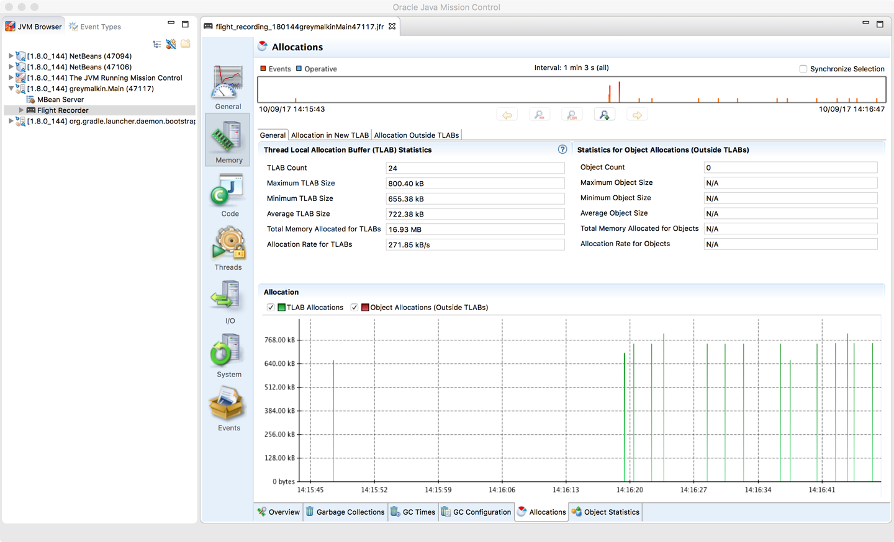

#### Heap Dump Analysis
Taking a full snapshot of the heap (`hprof` format).
*   **Pros:** Perfect visibility into the object graph, live set, and memory leaks.
*   **Cons:** Requires a full Stop-The-World pause. Dump files are huge (300-400% of heap size), making them hard to transfer and analyze.
    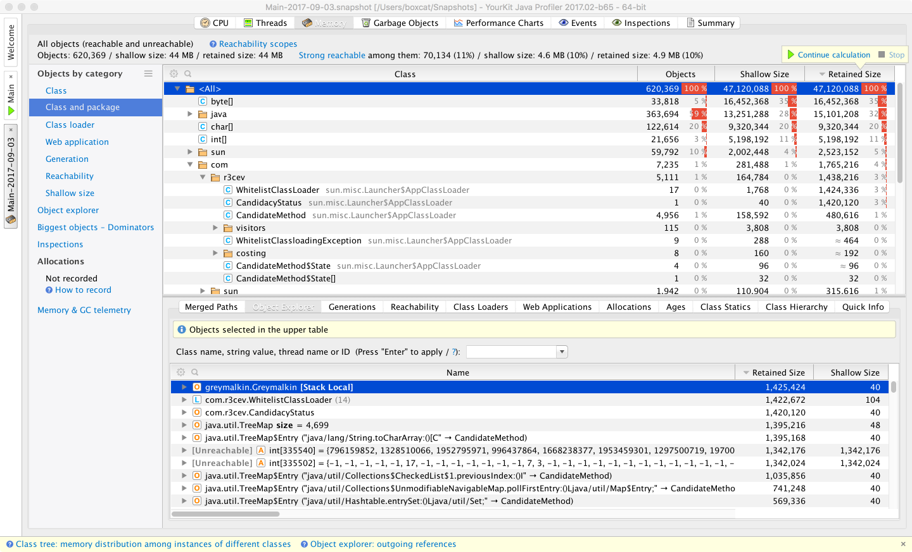

---

### Actionable Tips from Chapter 13

> **1. Don't Profile blindly.** Ensure you have a CPU-bound problem before firing up an execution profiler. Check GC logs and system metrics first.

> **2. Beware of Safepointing Bias.** Traditional profilers (VisualVM, JProfiler, YourKit) can distort data because they only sample at safepoints. If you see strange results or "missing" hot spots, try a non-safepointing profiler like Async Profiler.

> **3. Use the Right Tool for the Environment.** Use VisualVM for quick local checks. Use JFR/JMC for low-overhead production profiling on Oracle JDK. Use `perf`/Async Profiler for deep Linux-specific analysis.

> **4. Monitor Safepoint Time.** Use `-XX:+PrintGCApplicationStoppedTime` to see if profiling (or other VM operations) is pausing your application too frequently.

> **5. Allocation Profiling Matters.** Performance isn't just CPU. High allocation rates trigger GC, which kills throughput. Use TLAB profiling (JFR/Async Profiler) to find allocation hot spots with low overhead.

> **6. Enable `PreserveFramePointer` on Linux.** If you are on Linux and might need to use `perf`, run with `-XX:+PreserveFramePointer`. The small performance hit is worth the debuggability.

> **7. Avoid `hprof` for profiling.** The legacy `hprof` agent is deprecated and intended for demonstration only. Do not use it for production profiling; use JFR or agents instead.

