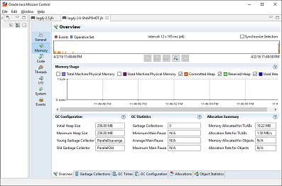
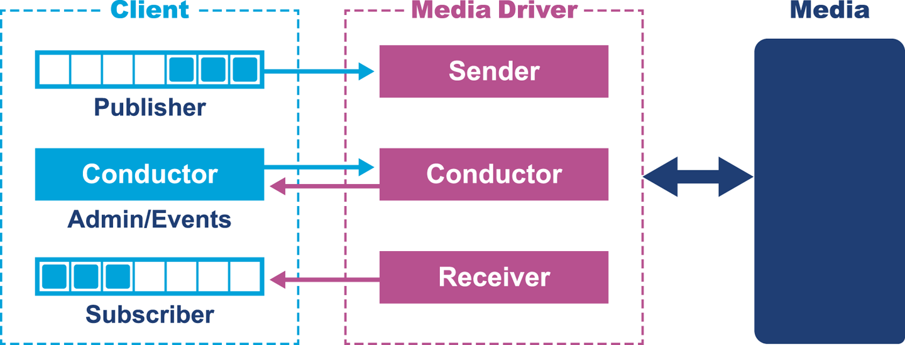
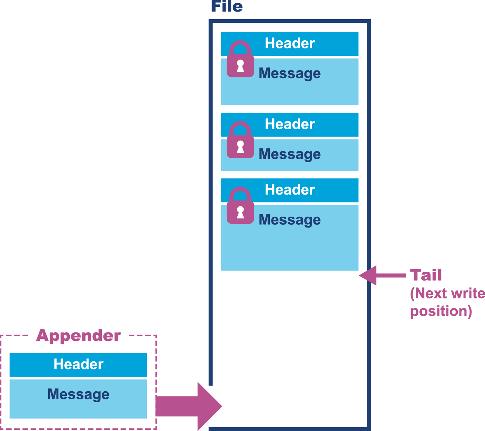

### Chapter 14: High-Performance Logging and Messaging - Summary

This chapter addresses the specific needs of low-latency, high-performance applications, challenging the notion that Java's managed environment makes it unsuitable for such tasks. It focuses on two critical infrastructure components: **Logging** and **Messaging**.

The chapter begins by critiquing common logging antipatterns and emphasizes that logging should be treated as a first-class citizen in system design. It presents microbenchmarks comparing major logging frameworks (`Logback`, `Log4j`, `java.util.logging`) and introduces the concept of **garbage-free logging**, a technique used in modern frameworks like Log4j 2.6+ to avoid GC pauses by reusing objects.

The second half delves into the **Real Logic** stack—a set of open-source libraries created by Martin Thompson that bring "mechanical sympathy" to Java. It details **Agrona** (low-level data structures and buffers), **Simple Binary Encoding (SBE)** (allocation-free binary codec), and **Aeron** (high-performance UDP/IPC transport). The chapter explains how these tools achieve massive throughput and consistent low latency by bypassing standard Java abstractions (like `ByteBuffer` and object serialization) in favor of cache-friendly, lock-free, and allocation-free designs.

---

### High-Performance Logging

Logging is often treated as an afterthought ("path of least resistance"), leading to technical debt. In low-latency systems, the logger must not become a bottleneck.

#### Logging Antipatterns
*   **The "10-year logger":** Copy-pasting ancient configurations without understanding them.
*   **The "Project-wide logger":** Wrapping the logger in a custom class, limiting flexibility.
*   **The "Firm-wide logger":** A monolithic solution for the whole company, often ill-suited for specific high-performance needs.

#### Logging Microbenchmarks
The chapter compares `Logback`, `Log4j 2`, and `java.util.logging` (JUL) across different formats.

*   **Key Findings:**
    *   **JUL is slow:** Consistently the worst performer, sometimes 2.5x slower than others.
    *   **Logback vs. Log4j:** Performance is generally close, with Logback slightly ahead in some pure execution tests on the iMac but comparable on AWS.
    *   **Format Matters:** The logging pattern used affects performance.
    *   **Warning:** Microbenchmarks only measure straight-line execution speed. They do *not* measure the impact on the rest of the application (e.g., GC pressure, CPU cache pollution).

Benchmarks repo: https://github.com/stephenc/java-logging-benchmarks

#### Designing a Lower-Impact Logger (Garbage-Free Logging)
Performance is not just about speed; it's about consistency. Standard loggers allocate temporary objects (Strings, events) for every log message, causing frequent GC pauses.

*   **Log4j 2.6+ Approach:**
    *   Uses **ThreadLocal** fields to reuse objects instead of creating new ones.
    *   Reuses buffers for String-to-byte conversion.
    *   **Result:** "Steady-state garbage-free logging." In tests, Log4j 2.6 produced **0 GC cycles** during a load test, compared to 141 cycles for version 2.5.




*   **Trade-off:** ThreadLocals can be dangerous in web containers (memory leaks on redeploy). Log4j disables them in web apps, falling back to other caching strategies.

---

### Low Latency with Real Logic Libraries

Real Logic libraries (Agrona, SBE, Aeron) focus on **Mechanical Sympathy**: understanding how hardware works to write efficient software.

Disruptor pattern: https://lmax-exchange.github.io/disruptor/

Mechanical sympathy: https://mechanical-sympathy.blogspot.com/

#### 1. Agrona (Data Structures & Utilities)
A library of building blocks for building low-latency services, offering alternatives to standard JDK classes that are too high-level or inefficient.

*   **Buffers:** Replaces `java.nio.ByteBuffer`. `ByteBuffer` is limited (no atomic operations, forces allocation on wrap). Agrona provides a hierarchy (`DirectBuffer`, `MutableDirectBuffer`, `AtomicBuffer`) that supports zero-copy wrapping and atomic CAS operations via `Unsafe`.
    

*   **Collections:** Maps and Sets that store primitives (`int`, `long`) directly, avoiding the boxing/unboxing overhead and object reference indirection of standard Java collections.

*   **Queues:** Lock-free, concurrent queues.
    *   **False Sharing Prevention:** Agrona queues explicitly pad cache lines to prevent "false sharing" (where writes to one variable invalidate the cache line for a nearby variable used by another thread).
    
    *Code Snippet: Padding in `AbstractConcurrentArrayQueue`*
    ```java
    class AbstractConcurrentArrayQueuePadding1 {
        protected long p1, p2, p3, p4, p5, p6, p7, p8, p9, p10, p11, p12, p13, p14, p15;
    }
    // ... The actual queue fields sit between these padding classes ...
    ```
    *   **OneToOne, ManyToMany, ManyToOne:** Specialized implementations for different producer/consumer ratios allow for removing coordination logic where it isn't needed (e.g., single-producer queues don't need CAS on the tail).

*   **Ring Buffers:** For IPC (Inter-Process Communication). Uses a standard message layout with a header to allow binary messages to be exchanged efficiently.

#### 2. Simple Binary Encoding (SBE)
A high-performance binary codec for financial messages (FIX), designed to replace XML/JSON/Protobufs in latency-critical paths.

Github: https://github.com/aeron-io/simple-binary-encoding

*   **Design Principles:**
    *   **Copy-Free:** Encodes/decodes directly to/from the underlying buffer. No intermediate objects.
    *   **Allocation-Free:** Uses the flyweight pattern. No `new` objects are created per message.
    *   **Streaming Access:** Processes data in forward order, which is friendly to CPU prefetchers.
    *   **Word Alignment:** Aligns fields to machine word boundaries for faster CPU access.

*   **Workflow:** Define message structure in XML schema -> Run `sbe-tool` -> Generate Java/C++ encoder/decoder classes.

#### 3. Aeron (Messaging Transport)
A reliable UDP/IPC message transport. It creates a replicated, persistent log of messages.

https://aeron.io/aeron-open-source/

Github: https://github.com/aeron-io/aeron/tree/master



*   **Architecture:**
    *   **Media Driver:** Manages the actual sending/receiving of data (can run in-process or as a separate daemon).
    *   **Conductor:** Handles admin tasks (setup, NAKs) away from the critical path.
    *   **Sender/Receiver:** Dedicated threads for moving bytes.
    *   **Client:** The application code that uses the `Aeron` API to publish/subscribe.

*   **The Log Buffer (Memory Mapped Files):**
    *   Aeron maps files into memory (often in `/dev/shm` for RAM-speed).
    *   **Tri-File Design:** Active (writing), Dirty (previous), Clean (next). Rotates files to handle infinite streams without fragmentation.
    *   **Lock-Free Writing:** Writers use atomic increments on the tail pointer to "reserve" space in the buffer, then write their message. A header is written *last* to indicate the message is complete.
    *   **Gap Detection:** Messages are identified by stream position. If a gap is detected (sequence number jump), the receiver sends a NAK (Negative Ack) to request retransmission, while continuing to receive newer messages into the buffer.



*   **Design Principles:**
    1.  **Garbage-free** in steady state.
    2.  **Smart Batching:** Bundles multiple messages into a packet if the network is busy.
    3.  **Lock-free algorithms** in the message path.
    4.  **Non-blocking I/O**.
    5.  **Single Writer Principle:** Queues are designed for a single writer to eliminate contention.

---

### Actionable Tips from Chapter 14

> **1. Treat Logging as Critical Infrastructure.** Don't just copy-paste configs. Profile your logger. In high-performance apps, bad logging is often the #1 bottleneck.

> **2. Use Garbage-Free Logging.** If you are on Log4j 2, upgrade to 2.6+ and configure it for garbage-free mode. This eliminates a major source of GC pauses.

> **3. Avoid `java.util.logging`.** It consistently performs worse than Logback or Log4j.

> **4. Look Beyond the JDK.** For low-latency systems, standard `ByteBuffer`, `Queue`, and `Serializable` are often too slow. Evaluate libraries like **Agrona** before writing your own low-level replacements.

> **5. Zero-Copy and Zero-Allocation.** The secret to consistent low latency is avoiding object creation and data copying. Tools like SBE and Aeron are built entirely around these principles.

> **6. Understand the Hardware.** "Mechanical Sympathy" matters. Understanding cache lines, false sharing, and memory alignment (handled by Agrona) allows you to write Java code that rivals C++ in performance.

