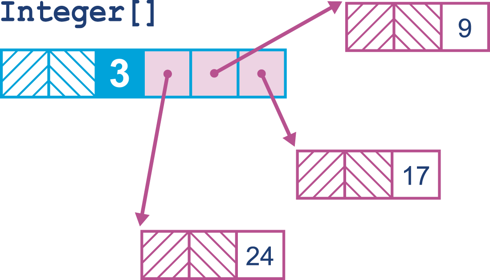
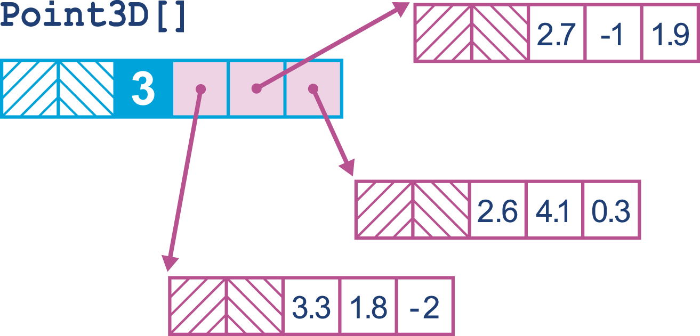
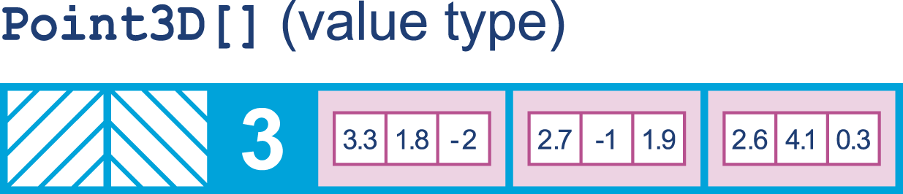

### Chapter 15: Java 9 and the Future - Summary

This final chapter explores the evolution of the Java platform, starting with the performance enhancements introduced in **Java 9** and looking forward to major initiatives that will shape the future of the JVM. While Java 9 is primarily known for **Modules (Project Jigsaw)**, the chapter focuses on the "everything else"—the smaller but significant performance improvements like **Compact Strings**, the **Segmented Code Cache**, and the use of `invokedynamic` for **String Concatenation**.

The chapter then discusses the shift to a **6-month release cadence** starting with Java 10, a move designed to deliver features faster. It surveys critical future projects: **Project Valhalla** (Value Types to improve memory layout), **Project Metropolis** (rewriting parts of the JVM in Java using **Graal** and **Truffle**), and **Project Loom** (lightweight concurrency via fibers/continuations). It concludes by examining the controversy around **`sun.misc.Unsafe`** and its modern replacement, **`VarHandles`**.

---

### Small Performance Enhancements in Java 9

#### Segmented Code Cache
*   **The Change:** The code cache is now split into three distinct regions:
    1.  **Non-method code:** Interpreter, adapters (never swept).
    2.  **Profiled code:** C1 compiled code (short-lived).
    3.  **Non-profiled code:** C2 compiled code (long-lived).
*   **Benefit:** Improves performance by reducing sweeper times (it can skip the non-method region) and improving data locality for optimized code.
*   **Risk:** One region might fill up while others have space.

#### Compact Strings
*   **The Problem:** Historically, Java `String` used `char[]` (UTF-16, 2 bytes per char). For ASCII/Latin-1 strings, this wasted 50% of the memory.
*   **The Solution:** `String` now uses `byte[]`. A `coder` field indicates if it's Latin-1 (1 byte) or UTF-16 (2 bytes).
*   **Impact:** Significant heap footprint reduction for applications with heavy string usage (e.g., logging, HTTP handling). Enabled by default (`-XX:+CompactStrings`).

#### New String Concatenation
*   **Before Java 9:** `javac` desugared `a + b` into a chain of `StringBuilder.append()` calls.
    ```java
    // Old Bytecode
    new StringBuilder()
    .append(a)
    .append(b)
    .toString()
    ```
*   **Java 9+:** `javac` now emits an `invokedynamic` instruction pointing to `StringConcatFactory.makeConcatWithConstants`.
    ```java
    // New Bytecode
    invokedynamic #2, 0 // makeConcatWithConstants
    ```
*   **Benefit:** The concatenation strategy can be changed at runtime without recompiling the source. It acts like a "prepared statement" for strings.

#### C2 Compiler Improvements (SIMD)
*   **SIMD:** Single Instruction, Multiple Data. Modern CPUs can process multiple data points in a single cycle.
*   **Intrinsics:** Java 9 added new compiler intrinsics to better utilize x86 AVX instructions for vector operations (e.g., `Math.sqrt`, array comparison).

#### G1 Garbage Collector
*   **Default:** G1 became the default collector in Java 9 (replacing Parallel GC).
*   **Changes:** The G1 implementation in Java 9 is different and theoretically more performant than the Java 8 version, though real-world results vary.

---

### Java 10 and the New Release Process

*   **Time-Based Releases:** Java now ships a "feature release" every 6 months (March/September).
*   **LTS (Long-Term Support):** Every 3 years (e.g., Java 11, Java 17), a release is designated LTS for long-term enterprise support.
*   **Java 10 Features:**
    *   **`var` (JEP 286):** Local variable type inference. Reduces boilerplate.
    *   **Parallel Full GC for G1 (JEP 307):** A critical fix. In Java 9, G1's fail-safe Full GC was single-threaded (slow). Java 10 makes it parallel.
    *   **Application Class-Data Sharing (JEP 310):** Extends CDS to application classes to improve startup time and reduce footprint.
    *   **Thread-Local Handshakes (JEP 312):** Allows the VM to stop *individual* threads rather than the whole world for certain operations, reducing latency.

---

### Unsafe and VarHandles

**`sun.misc.Unsafe`** is a critical but unsupported internal API used by high-performance libraries (like Agrona/Netty) for raw memory access and CAS.

*   **The Conflict:** Oracle wants to lock down internal APIs (Modules), but removing `Unsafe` would break the ecosystem.
*   **The Compromise:** Java 9 keeps `Unsafe` accessible via the `jdk.unsupported` module but warns against its use.
*   **The Solution (`VarHandles` - JEP 193):** A new, safe standard API in `java.lang.invoke` to replace `Unsafe`'s CAS and volatile access features.

*Code Example: Atomic Integer with VarHandles*
```java
public class AtomicIntegerWithVarHandles extends Number {
    private volatile int value = 0;
    private static final VarHandle V;

    static {
        try {
            // Lookup the handle once
            MethodHandles.Lookup l = MethodHandles.lookup();
            V = l.findVarHandle(AtomicIntegerWithVarHandles.class, "value", int.class);
        } catch (ReflectiveOperationException e) { throw new Error(e); }
    }

    public final int getAndSet(int newValue) {
        int v;
        do {
            // Safe volatile read
            v = (int)V.getVolatile(this);
        // Safe CAS loop
        } while (!V.compareAndSet(this, v, newValue));
        return v;
    }
}
```

---

### Project Valhalla and Value Types

*   **The Problem:** "Everything is an Object." An array of objects (`Point[]`) is an array of references, leading to pointer chasing and cache misses.
    
    

*   **The Goal:** **Value Types**. Structures that act like primitives (no identity, flattened in memory) but code like classes.
    *   **Memory Layout:** Flattened arrays (like C structs) for massive cache locality improvements.
    *   **No Overhead:** No object headers (savings of 12-16 bytes per instance).
    
    

---

### Graal and Truffle (Project Metropolis)

*   **The Problem:** The C2 compiler (C++) is old, complex, and hard to maintain.
*   **Graal:** A new high-performance JIT compiler **written in Java**.
    *   **JVMCI:** The interface allowing Java-based compilers to plug into HotSpot.
    *   **Benefits:** Safer (no C++ crashes), easier to maintain, capable of new optimizations (partial escape analysis).
*   **Truffle:** A framework for building language interpreters that run on Graal. It can automatically JIT-compile interpreted languages (Python, Ruby, JS) to high-performance machine code.
*   **SubstrateVM:** A way to compile Java applications *ahead-of-time (AOT)* into static native binaries for instant startup (the basis of Quarkus/Micronaut native images).

---

### Future Directions

#### Bytecode Evolution
*   **Constant Pool:** Expanded to support more types (MethodHandles, MethodTypes) to support `invokedynamic`.
*   **`invokedynamic`:** Increasingly used by the platform itself (lambdas, string concat) to delay binding decisions until runtime, allowing for optimizations that static compilation cannot achieve.

#### Project Loom (Concurrency)
*   **The Problem:** Java threads map 1:1 to OS threads. OS threads are heavy (MBs of stack) and context switching is expensive. This limits scalability to ~10k threads.
*   **The Solution:** **Fibers / Virtual Threads**. Lightweight, user-mode threads managed by the JVM, not the OS.
*   **Goal:** Millions of threads. Write synchronous, blocking code (easy to read) that performs like asynchronous code (high throughput).
*   **Mechanism:** Likely to use `ForkJoinPool` for scheduling, similar to Akka.

---

### Actionable Tips from Chapter 15

> **1. Adopt the New Release Cadence.** Get used to upgrading Java more frequently. You don't have to jump on every feature release, but don't stay stuck on an old LTS forever.

> **2. Test G1 on Java 9+.** If you migrate from Java 8, be aware that G1 is now the default. Benchmark your application to ensure no regressions.

> **3. Evaluate Compact Strings.** If your app processes a lot of ASCII text, upgrading to Java 9+ could yield an immediate, free memory reduction.

> **4. Start Migrating from `Unsafe`.** If you maintain a library using `Unsafe`, plan your migration to `VarHandles`. `Unsafe` will eventually go away.

> **5. Watch Graal.** Experiment with Graal as a JIT compiler (`-XX:+UseJVMCICompiler`) for potentially better performance, especially for Scala/modern Java code.

> **6. Prepare for Value Types.** While not here yet, Value Types will fundamentally change how we think about data locality in Java. Keep an eye on Project Valhalla.

