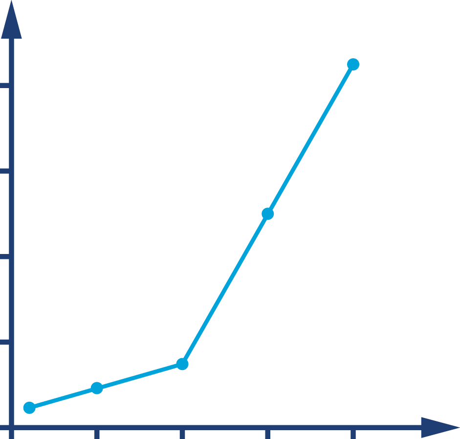
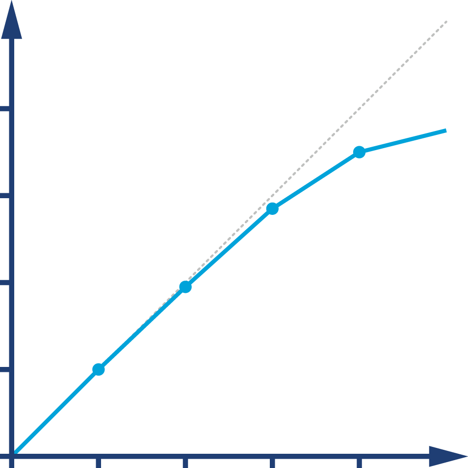
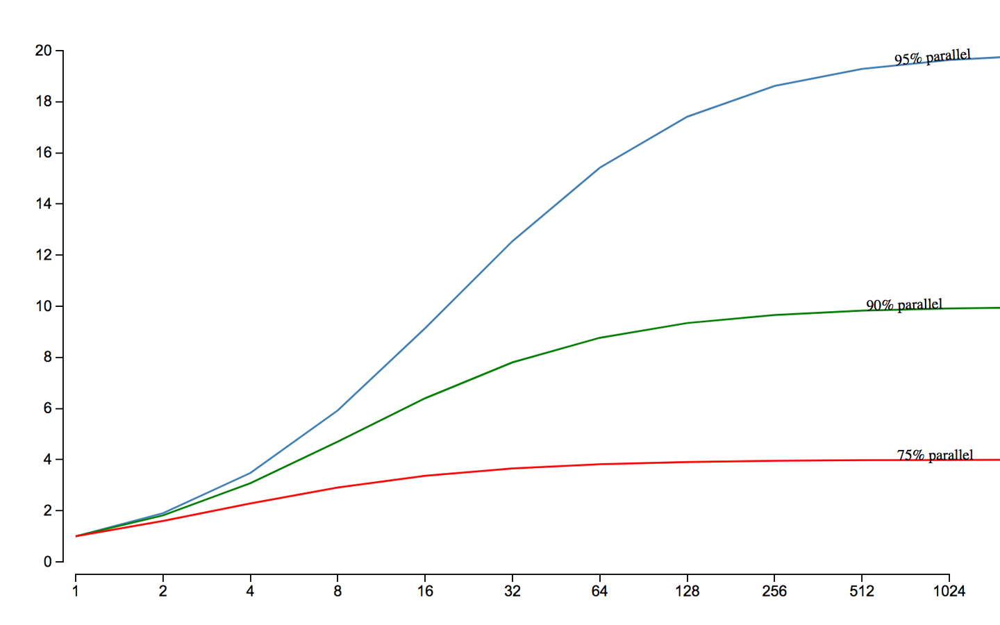
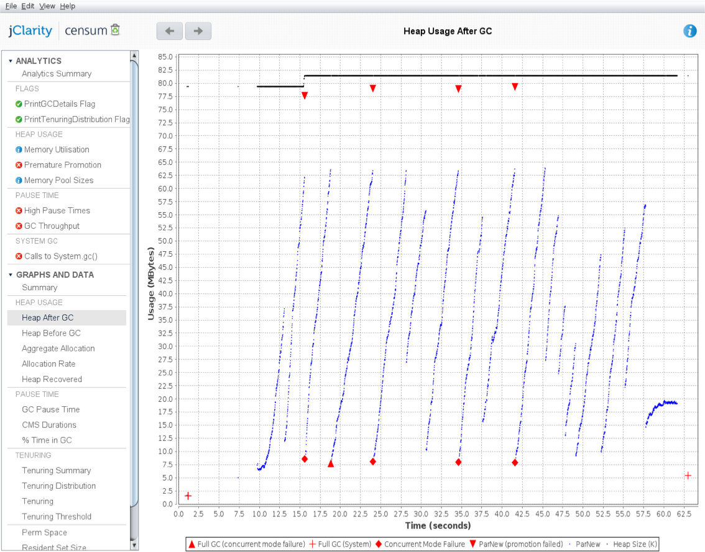
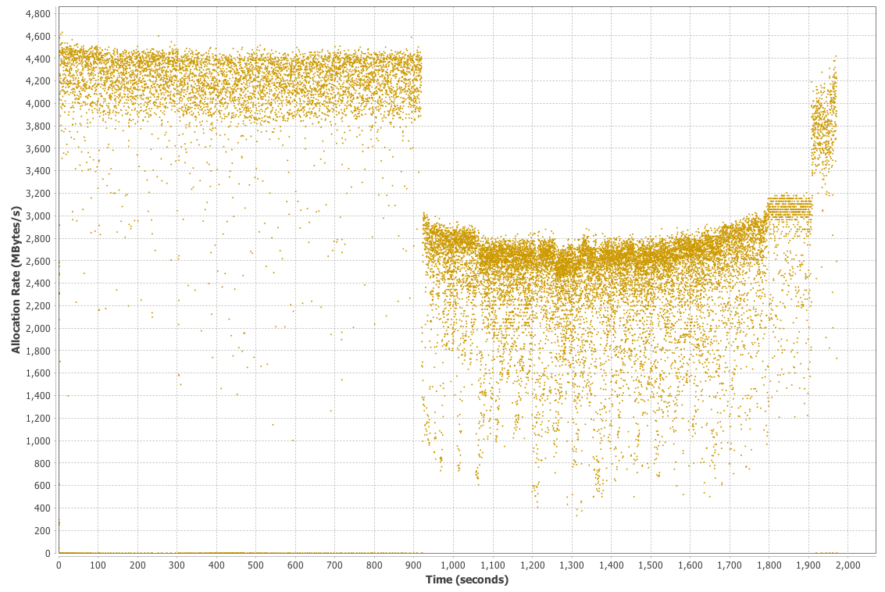
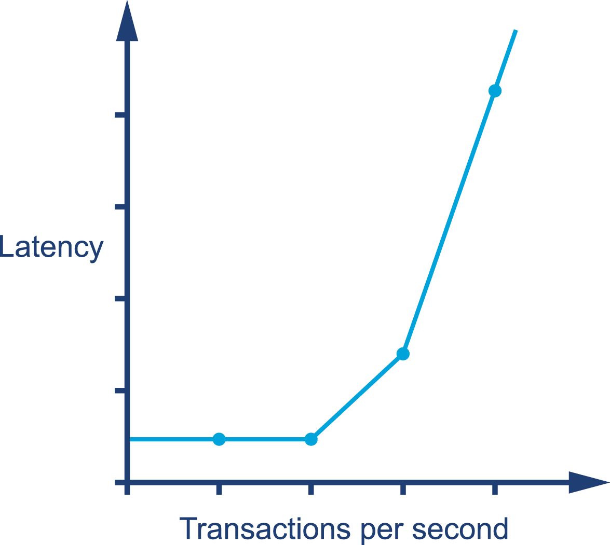

### Chapter 1: Optimization and Performance Defined - Summary

This chapter introduces the foundational concepts of Java performance optimization, arguing that it should be treated as a rigorous **empirical science** rather than a "dark art." It dispels common myths about "magic" fixes and warns against applying outdated tips and tricks, emphasizing that the JVM's complexity and dynamic nature make performance highly context-dependent. The core methodology proposed is a scientific process: define measurable goals, measure the existing system, form a hypothesis, make a change, and re-test to verify the outcome. The chapter establishes a clear vocabulary for performance metrics (Throughput, Latency, Capacity, etc.) and introduces common graphical patterns to help practitioners interpret performance data correctly.

---

### Java Performance—The Wrong Way

The chapter begins with a strong caution against blindly following performance advice found online, especially outdated information.

*   **Performance is Dynamic:** The performance of Java code is fundamentally tied to the underlying JVM. Old advice, such as avoiding small methods, is often detrimental on modern JVMs that use advanced JIT compilation and inlining, which favor smaller methods.
*   **There Are No Magic Bullets:** The author stresses that there are generally no simple "go faster" switches or secret tricks for the JVM. Effective optimization comes from a methodical approach, not a cookbook of tips.
*   **Complexity of Managed Subsystems:** The JVM uses many managed subsystems (like Garbage Collection), which add complexity to runtime behavior. This complexity means performance measurements are often not normally distributed, making basic statistical methods like standard deviation potentially misleading. Outliers can be very significant and cannot be ignored.

> **Tip:** Do not skip to code-level optimization techniques without understanding the context. Applying them incorrectly can do more harm than good.

---

### Performance as an Experimental Science

The correct approach to performance tuning is to treat it as a scientific experiment. This involves a clear, repeatable process.

**The Scientific Method for Performance Tuning:**
1.  **Define the Desired Outcome:** Establish clear, quantitative objectives (nonfunctional requirements). What specific metric needs to improve, and by how much?
2.  **Measure the Existing System:** Establish a baseline measurement of the current performance.
3.  **Determine What Is to Be Done:** Form a hypothesis about what change will achieve the desired outcome.
4.  **Undertake an Improvement Exercise:** Apply a single, specific change.
5.  **Retest:** Measure the system again under the exact same conditions as the baseline test.
6.  **Determine if the Goal Is Achieved:** Compare the new measurement to the baseline and the objective.

> "A measurement not clearly defined is worse than useless." - Eli Goldratt

---

### A Taxonomy for Performance

To define goals, you need a clear vocabulary. The chapter defines a standard set of performance metrics:

*   **Throughput:** The rate of work a system can perform (e.g., transactions per second).
*   **Latency:** The time taken to process a single unit of work from end to end.
*   **Capacity:** The amount of work that can be simultaneously ongoing in the system.
*   **Utilization:** The percentage of available resources (like CPU or memory) being used to do work.
*   **Efficiency:** A measure of throughput divided by the utilized resources. A system that produces the same throughput with fewer resources is more efficient.
*   **Scalability:** How throughput or capacity changes as resources are added to a system. "Perfect linear scaling" (doubling resources doubles throughput) is the ideal but is rarely achieved.
*   **Degradation:** The negative change in latency or throughput as the load on the system increases without adding new resources.

---

### Reading Performance Graphs

Visualizing data is key to understanding system behavior. The chapter introduces several common patterns seen in performance graphs.

*   **Figure 1-1: The Performance Elbow:** A graph showing latency remaining stable under increasing load, until it hits a critical point and suddenly degrades sharply. This indicates a resource has been exhausted.
    

*   **Figure 1-2: Near-Linear Scaling:** A graph showing throughput increasing almost in a straight line as more machines are added to a cluster. This is ideal behavior for stateless, easily parallelizable workloads.
    

*   **Figure 1-3: Amdahl's Law:** A graphical representation of the fundamental limit on scalability. It shows that the maximum possible speedup from adding more processors is limited by the portion of the task that must be performed serially.
    

*   **Figure 1-4: Healthy Memory Usage:** A "sawtooth" pattern on a memory graph, where memory usage steadily climbs and then sharply drops. This is the typical signature of a healthy garbage collection cycle.
    

*   **Figure 1-5: Problematic Allocation Rate:** A graph showing a sudden, sharp drop in memory allocation rate. This often indicates the application is struggling with garbage collection, as CPU contention from GC threads prevents the application from allocating new memory.
    

*   **Figure 1-6: Gradual Degradation:** A graph showing a resource leak, where latency slowly and steadily degrades as load increases, before hitting an inflection point where it degrades rapidly.
    

---

### Actionable Tips from Chapter 1

> **1. Treat Performance Tuning as a Science, Not an Art.** Follow a rigorous, empirical process: define goals, measure, hypothesize, change one thing, re-measure, and verify. Don't guess.

> **2. Beware of "Magic" Tips and Tricks.** Java performance is highly context-dependent on the JVM version, hardware, and workload. Outdated advice can be harmful. Never apply a change without measuring its impact on *your* system.

> **3. Define Your Goals with a Clear Vocabulary.** Before you start, define what "better performance" means using concrete metrics: Throughput, Latency, Capacity, Utilization, Efficiency, or Scalability.

> **4. Understand Tradeoffs.** Optimizing one metric (e.g., throughput) often comes at the cost of another (e.g., latency). Be clear about your priorities based on business requirements.

> **5. Don't Trust Basic Statistics Blindly.** JVM performance data is often not normally distributed, and outliers are significant. Using simple averages or standard deviations can be misleading. Consider using percentiles and viewing the full data distribution.

> **6. Recognize That Measurement Has an Overhead.** Be aware that the act of measuring performance (especially with high-frequency sampling) can impact the results you are recording.

> **7. Learn to Read the Patterns.** Familiarize yourself with common performance graphs—the "elbow," Amdahl's Law, sawtooth memory patterns—to quickly diagnose system behavior.

> **8. A Measurement Not Clearly Defined Is Worse Than Useless.** The first and most important step is to define the nonfunctional requirements and build a quantitative, measurable objective. 