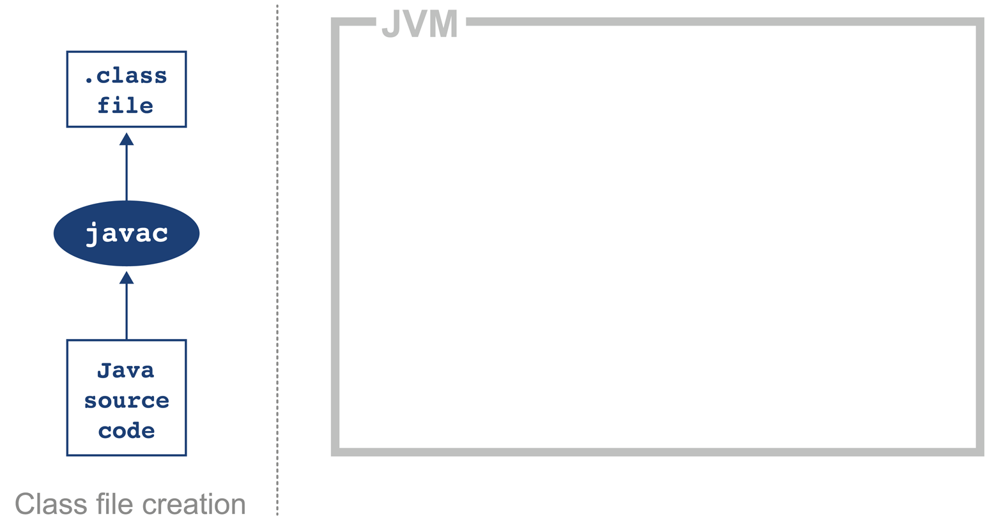
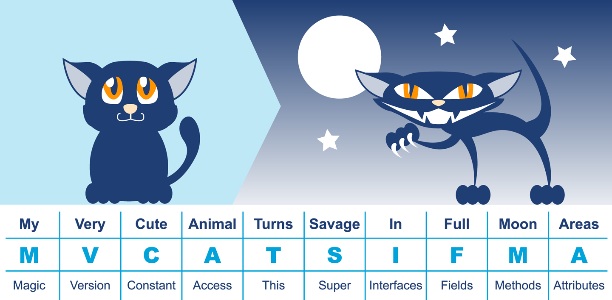
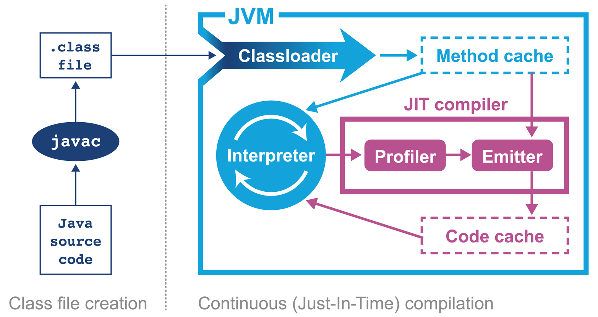
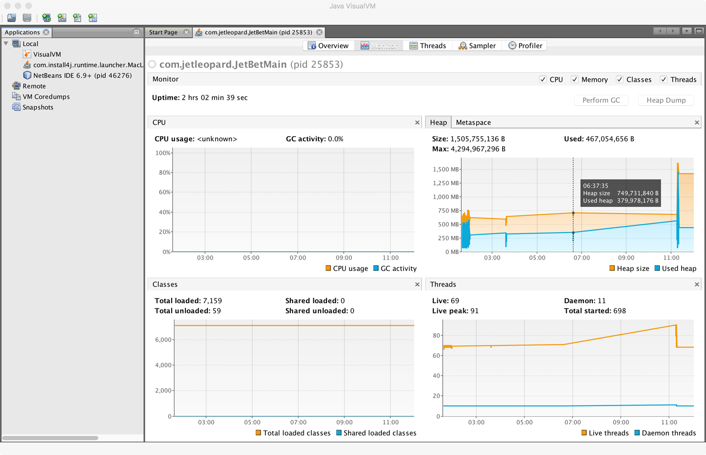

### Chapter 2: Overview of the JVM - Summary

This chapter provides a foundational overview of the Java Virtual Machine's architecture and execution model. It explains that the JVM is a stack-based interpreter that executes platform-independent bytecode. This bytecode is produced by a compiler (like `javac`) from source code. The chapter details the classloading hierarchy, the structure of a `.class` file, and the process of bytecode interpretation. It then introduces the most critical performance feature of modern JVMs: the **HotSpot engine** and its **Just-in-Time (JIT)** compiler, which translates frequently used bytecode into highly optimized native machine code at runtime. The chapter also touches upon other key subsystems essential for performance analysis, including automatic memory management (Garbage Collection), the Java Memory Model for threading, and the various monitoring tools available to inspect a running JVM.

---

### Interpreting and Classloading

The JVM begins by interpreting bytecode. To do this, it must first load the necessary classes.

*   **Stack-Based Machine:** The JVM doesn't use hardware registers like a physical CPU. Instead, it uses an evaluation stack to hold intermediate values for calculations.
*   **Classloading Hierarchy:** Java uses a chain of classloaders to load classes, following a parent-delegation model.
    1.  **Bootstrap Classloader:** The root loader, written in native code. It loads the core Java runtime classes (like `java.lang.Object`) from `rt.jar` (pre-Java 9) or the system modules (Java 9+).
    2.  **Extension Classloader:** Parent is Bootstrap. Loads classes from the extensions directory, typically for platform-specific features.
    3.  **Application Classloader:** Parent is Extension. Loads the user's application classes from the defined classpath.
*   **Class Identity:** A class is uniquely identified not just by its fully qualified name, but by the combination of its **name and the classloader instance** that loaded it. This means the same class can be loaded multiple times by different classloaders.

---

### Executing Bytecode

Java source code undergoes a two-stage transformation before it runs on the CPU.

#### Stage 1: Compilation to Bytecode
*   The `javac` compiler translates `.java` source files into `.class` files.
*   `.class` files contain **bytecode**, a platform-independent intermediate representation. This portability is a key feature of Java.
*   The JVM is language-agnostic. Any language (e.g., Scala, Kotlin, Groovy) that can be compiled into a valid `.class` file can run on the JVM.

#### Anatomy of a `.class` File
Every class file follows a strict specification to ensure it can be safely executed by the JVM.

| Component         | Description                                                                 |
| ----------------- | --------------------------------------------------------------------------- |
| Magic Number      | `0xCAFEBABE` - Identifies the file as a Java class file.                      |
| Version           | The major/minor version of the class file format, checked for compatibility.|
| Constant Pool     | A table of all constants (strings, class names, field names, etc.).         |
| Access Flags      | Modifiers for the class (e.g., `public`, `final`, `interface`).               |
| This Class        | An index into the constant pool for the name of the current class.          |
| Superclass        | An index for the name of the parent class.                                  |
| Interfaces        | A list of implemented interfaces.                                           |
| Fields & Methods  | Definitions for all fields and methods in the class.                        |
| Attributes        | Additional metadata, like the `Code` attribute which contains the bytecode. |

---

### Introducing HotSpot and Just-in-Time (JIT) Compilation

To achieve high performance, the JVM doesn't just interpret bytecode.

*   **HotSpot VM:** The high-performance, open-source JVM that powers most Java applications.
*   **Profile-Guided Optimization (PGO):** HotSpot's philosophy is to analyze the program *as it runs* and apply optimizations where they will have the most impact.
*   **Just-in-Time (JIT) Compilation:**
    1.  The program starts executing in the slow **interpreter**.
    2.  The JVM profiles the code, identifying "hot spots"—frequently executed methods and loops.
    3.  Once a method's "hotness" counter passes a threshold, the JIT compiler translates its bytecode into highly optimized **native machine code**.
    4.  Future calls to that method will execute the fast, compiled native code directly on the CPU.
*   **JIT Advantages:** Because compilation happens at runtime, the JIT compiler can use live profiling data to make optimizations that are impossible for an Ahead-of-Time (AOT) compiler (like in C++). These include dynamic inlining, devirtualization, and using CPU-specific instructions (**JVM Intrinsics**).

> **Key Insight:** The code actually being executed by the CPU can be vastly different from the original Java source code. This makes performance analysis complex and requires empirical measurement, not just "common sense" reasoning about the source.

---

### Core JVM Subsystems

*   **JVM Memory Management:** Java provides automatic memory management via **Garbage Collection (GC)**. This is a process that automatically finds and reclaims memory that is no longer in use. While this prevents many common programming errors, it introduces non-determinism and application pauses ("stop-the-world" events) that are a major focus of performance tuning. (Covered in Chapters 6-8).
*   **Threading and the Java Memory Model (JMM):** Java has built-in support for multithreading. Most JVMs map each Java `Thread` to a native OS thread. The JMM is a formal specification that defines how memory operations (reads/writes to fields) in one thread are guaranteed to be visible to other threads, which is critical for writing correct concurrent code. (Covered in Chapter 12).

---

### Meet the JVMs

While HotSpot is the most common, several JVM implementations exist, most of which are based on the OpenJDK source.
*   **OpenJDK:** The open-source reference implementation of Java.
*   **Oracle JDK:** Oracle's commercial build, based on OpenJDK.
*   **Azul Zulu:** A free, certified OpenJDK build from Azul Systems.
*   **Red Hat IcedTea:** A certified OpenJDK build from Red Hat.
*   **Azul Zing:** A proprietary, high-performance JVM from Azul, designed for large-heap server systems.
*   **IBM J9:** IBM's JVM, now open-source as Eclipse OpenJ9.

> For performance analysis, all HotSpot-based JVMs (OpenJDK, Oracle, Zulu, etc.) of the same version are effectively identical.

---

### Monitoring and Tooling for the JVM

The JVM provides a rich set of interfaces for tooling.

*   **Instrumentation Technologies:**
    *   **JMX (Java Management Extensions):** A general-_purpose framework for monitoring and managing a running application.
    *   **Java Agent (`-javaagent`):** A JAR file written in Java that can use the `java.lang.instrument` API to modify bytecode of loaded classes.
    *   **JVMTI (JVM Tool Interface):** A native (C/C++) interface for deeper monitoring and control. More powerful but harder to write and can crash the JVM.
    *   **Serviceability Agent (SA):** A set of tools for debugging live processes or analyzing crash dumps without running code inside the target VM.

*   **VisualVM:**
    *   A graphical tool formerly shipped with the JDK (now a separate download since Java 9).
    *   It provides a visual interface for monitoring CPU, heap, classes, and threads of a running Java application.
    *   It also includes basic sampling and profiling capabilities.
    *   It is the modern replacement for `jconsole`.

---

### Actionable Tips from Chapter 2

> **1. Write Idiomatic Java, Trust the JIT.** Don't try to outsmart the JIT compiler with manual micro-optimizations (like manually inlining methods). Modern JVMs are designed to optimize standard, well-structured code effectively.

> **2. Understand Your Classpath.** Ensure your compile-time classpath matches your runtime classpath to avoid `ClassNotFoundException` and `NoClassDefFoundError`.

> **3. A Class Is `(ClassLoader, PackageName, ClassName)`.** Remember that a class is uniquely identified by its name *and* its classloader. This can be a source of tricky issues (e.g., `ClassCastException` for two identical classes loaded by different loaders).

> **4. Know Your JVM.** Be aware of which JVM vendor and version you are using. While most are OpenJDK-based, be mindful of licensing, especially Oracle's restrictions on redistribution and commercial use.

> **5. Learn Your Basic Tools.** Familiarize yourself with `javap` to inspect bytecode and `VisualVM` to get a first look at a running application's health (CPU, heap, threads).

> **6. The JVM Is Always Multithreaded.** Even a simple "Hello World" application runs with multiple background threads started by the JVM (e.g., for JIT compilation, GC, finalization). This is a crucial consideration for any performance analysis. 