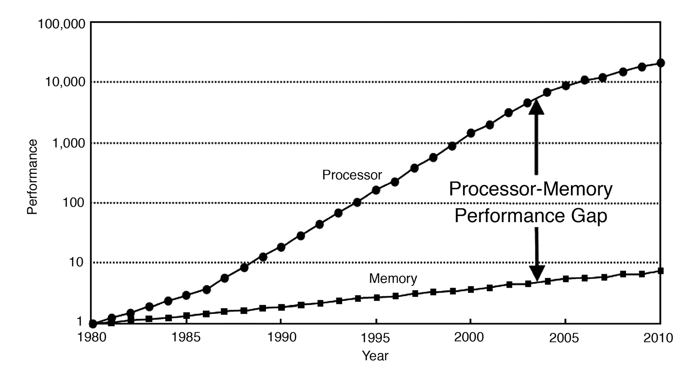
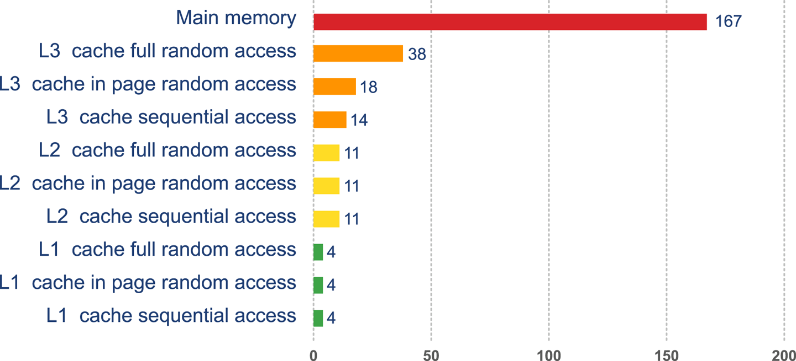
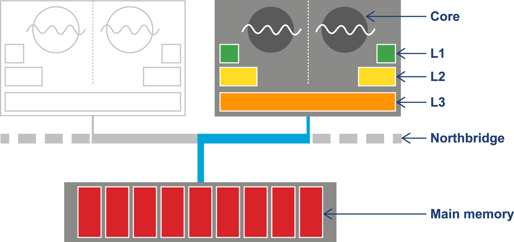
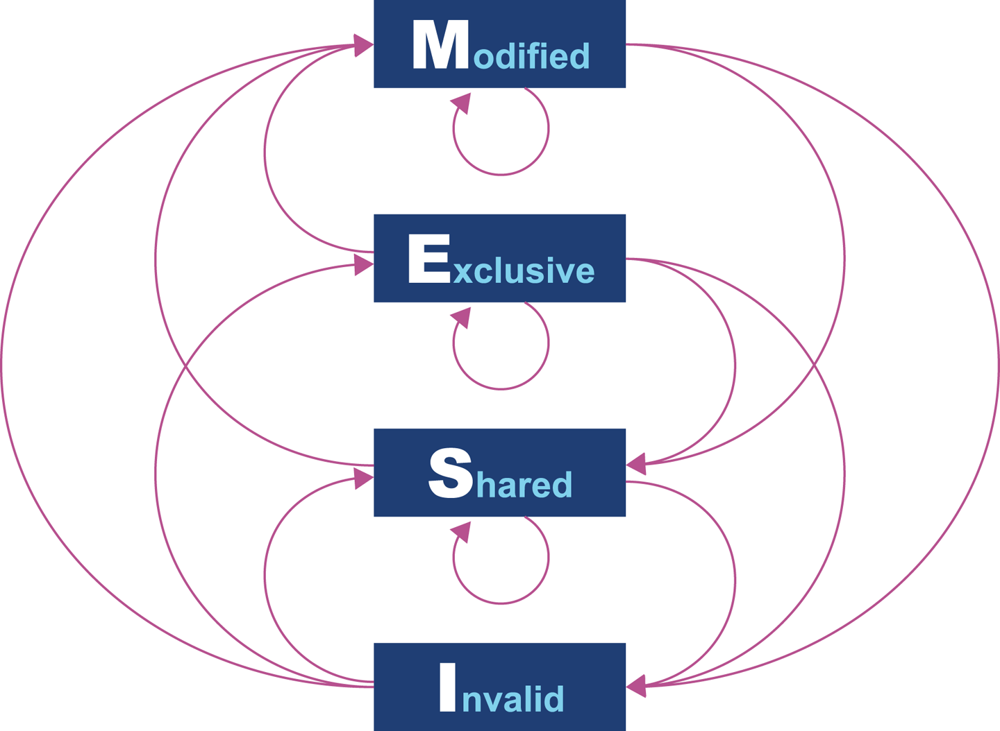
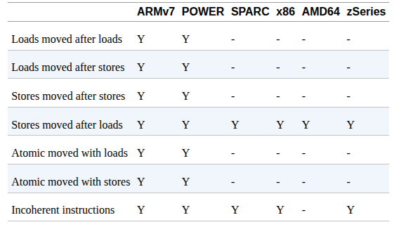
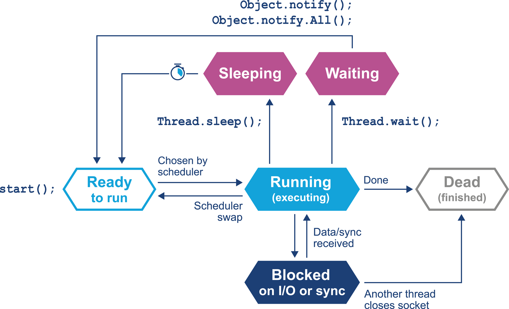
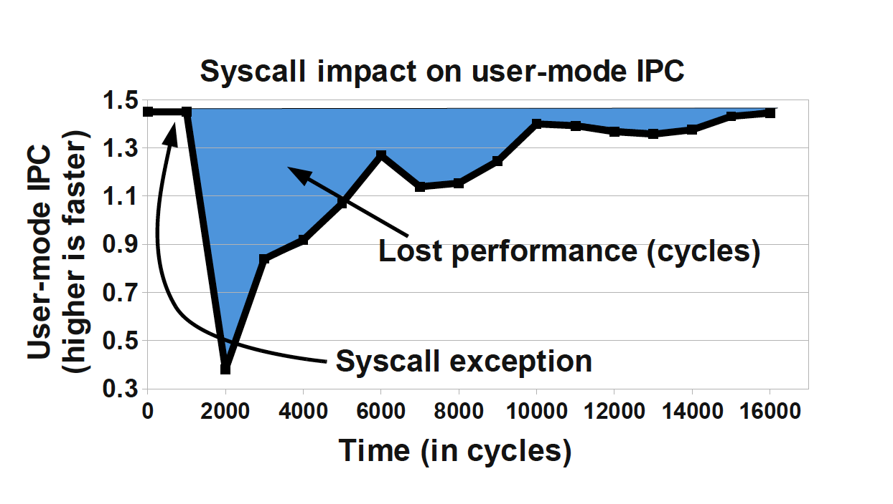
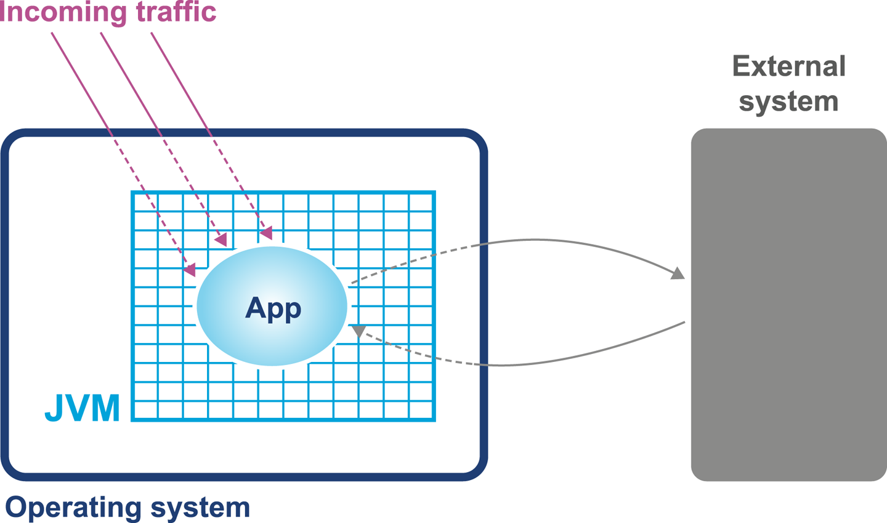
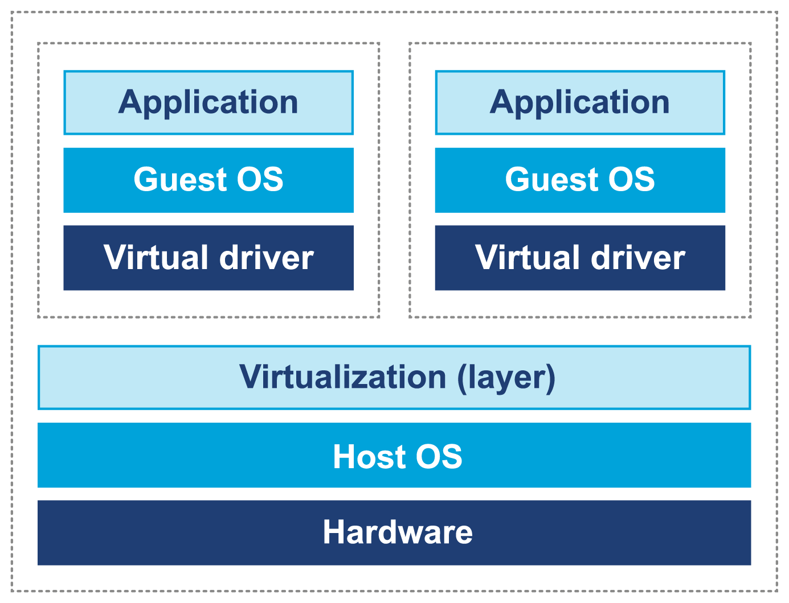

### Chapter 3: Hardware and Operating Systems - Summary

This chapter dives into the fundamental hardware and operating system concepts that every performance-conscious Java developer must understand. It argues that with the end of Moore's Law's free lunch (ever-faster single-core speeds), performance now comes from complex hardware features that software must leverage effectively. The chapter focuses heavily on the **memory hierarchy**, explaining that the enormous speed gap between CPUs and main memory (the "memory wall") makes **CPU caches** the single most important factor in modern performance. It details cache architecture, consistency protocols like MESI, and how these mechanisms make intuitive reasoning about code speed highly unreliable. The chapter then covers the role of the operating system, particularly the **process scheduler** and the high cost of **context switches**. It provides a simple model for system diagnosis and introduces basic command-line tools like `vmstat` as a first step in identifying resource bottlenecks. The core message is that developers need **"mechanical sympathy"**—an appreciation for the underlying platform—to understand performance measurements and write truly efficient code.

---

### Introduction to Modern Hardware and the Memory Wall

Modern hardware is incredibly complex. The primary driver for this complexity has been the need to overcome the growing disparity between processor speed and memory speed.

*   **The Memory Wall:** Processor speeds have increased exponentially for decades, but the speed of main memory (RAM) has not kept pace. This creates a massive bottleneck where the CPU is often idle, waiting for data to arrive from memory.
    

*   **CPU Caches:** To solve this, CPUs use multiple levels of small, extremely fast on-chip memory called caches.
    *   **L1 Cache:** Smallest and fastest, private to a single CPU core.
    *   **L2 Cache:** Larger and slightly slower, often also private to a core.
    *   **L3 Cache:** Largest and slowest of the caches, often shared among all cores on a CPU.
    *   **Main Memory (RAM):** The slowest tier in the hierarchy.

*   **Access Times:** Accessing data already in a cache is orders of magnitude faster than fetching it from main memory. The goal of high-performance code is often to maximize "cache hits" and minimize "cache misses."
    
    

---

### Cache Consistency and the MESI Protocol

With multiple cores, each having its own cache, a problem arises: how to ensure all cores have a consistent view of memory? This is solved by cache consistency protocols.

*   **MESI Protocol:** A common protocol that defines four states for each cache line (typically a 64-byte block of memory):
    *   **M**odified: This cache has the only valid copy, and it's different from main memory (it's "dirty").
    *   **E**xclusive: This cache has the only copy, and it matches main memory.
    *   **S**hared: The data exists in this cache and at least one other cache. It matches main memory.
    *   **I**nvalid: This cache line's data is invalid and cannot be used.
*   **How it Works:** When one core needs to write to a cache line, it broadcasts its intent. If other cores have that line in a `Shared` state, they must invalidate their copies (move to `Invalid`). This ensures that only one core can be modifying a piece of data at a time. This inter-core communication is a source of performance overhead.

---

### Advanced Processor Features

Modern CPUs use other tricks to improve performance:

*   **Branch Prediction & Speculative Execution:** To avoid stalling the instruction pipeline when encountering a conditional branch (`if`/`else`), the CPU predicts which path will be taken and starts executing it speculatively. If the guess is correct, time is saved. If it's wrong, the pipeline is flushed, and a penalty is paid.
*   **Hardware Memory Models & Reordering:** To optimize execution, compilers and CPUs are allowed to reorder instructions, as long as it doesn't change the result for a single thread. However, this can have surprising effects on other threads. The Java Memory Model (JMM) is designed to be a "weak" model that accounts for the fact that different CPU architectures (x86, ARM, POWER) allow different types of reordering.

---

### The Role of the Operating System

The OS manages access to shared resources, primarily CPU time and memory.

*   **The Scheduler:** The OS scheduler controls which thread gets to run on a CPU core and for how long (its "time quantum"). Threads that are ready to run but are not on a CPU wait in a **run queue**.
*   **Thread Lifecycle:** A Java thread maps to an OS thread. It can be running, waiting (in the run queue), sleeping, or blocked on I/O or a lock.
*   **Context Switch:** The process of the scheduler swapping one thread off a CPU core and swapping another one on. This is an expensive operation because it often requires flushing CPU caches (like the TLB for memory addresses), forcing the new thread to pay the cost of refilling them from slower memory.
*   **vDSO (Linux):** A mechanism to speed up certain system calls (like `gettimeofday`) by mapping a small kernel data area into user space, avoiding a full context switch.

---

### Diagnosing Performance with System Tools

A simple system model helps isolate problems. Performance issues can stem from hardware/OS, the JVM, application code, external systems, or incoming traffic.

*   **`vmstat`:** A basic but powerful Unix command-line tool for a real-time view of system health.
    *   `vmstat 1` provides a new line of statistics every second.
    *   **Key Columns:**
        *   `r`: Number of runnable processes (a consistently high number indicates CPU contention).
        *   `b`: Number of blocked processes (often points to I/O issues).
        *   `si`, `so`: Swapped in/out. Any significant activity here is very bad for performance.
        *   `us`, `sy`, `id`, `wa`: Percentage of CPU time spent in **us**er space, **sy**stem (kernel) space, **id**le, and **wa**iting for I/O.
*   **Interpreting CPU Usage:**
    *   **High `us` (user) time:** The CPU is busy running application code. If it's 100% `us`, the problem is likely in your application logic or, very commonly, the **Garbage Collector**.
    *   **High `sy` (system) time:** The CPU is busy inside the kernel. This is often caused by heavy I/O operations or a high rate of context switching.
    *   **High `wa` (wait) time:** The CPU is idle, waiting for slow I/O (like disk or network) to complete.
    *   **High `id` (idle) time:** If your application has low throughput but the CPU is idle, it's likely blocked waiting for an external system or a software lock.

---

### Mechanical Sympathy and Virtualization

*   **Mechanical Sympathy:** The idea that developers must have an appreciation for how the underlying hardware works to write high-performance code.
*   **False Sharing:** A classic example. Two different threads modify two different variables that happen to reside on the *same cache line*. The MESI protocol forces the cache line to be constantly invalidated and re-read from main memory for each thread, causing a "ping-pong" effect that kills performance, even though the threads aren't logically sharing data.
*   **Virtualization:** Running an OS inside a hypervisor adds another layer of complexity. The guest OS does not have direct access to hardware, and the hypervisor's scheduling adds another source of non-determinism and jitter to performance measurements.

---

### Actionable Tips from Chapter 3

> **1. Assume the Bottleneck Is Memory Access.** Modern CPUs are incredibly fast. The main constraint on performance is almost always the time it takes to get data from main memory into the CPU caches.

> **2. Your Intuition About Code Speed Is Probably Wrong.** Hardware features like caching, branch prediction, and instruction reordering mean you cannot reliably predict performance by looking at source code. Always measure.

> **3. Use Basic OS Tools First.** Before breaking out a complex profiler, use simple tools like `vmstat` and `iostat` to get a high-level view of system resource utilization (CPU, memory, I/O). This can quickly point you in the right direction.

> **4. Differentiate User vs. System CPU Time.** This is a critical first diagnostic step. High `us`er time points to your application or GC. High `sy`stem time points to I/O or other kernel-level contention.

> **5. Understand and Watch Context Switches.** A high context switch rate (`cs` in `vmstat`) is a clear sign of inefficiency. It means your application is either doing too much blocking I/O or suffering from heavy lock contention.

> **6. Enable GC Logging Always.** Garbage Collection activity happens entirely in user space. The GC log is the definitive source for diagnosing GC-related performance problems, and its overhead is negligible. It should be enabled on all production systems.

> **7. Beware of False Sharing.** When designing concurrent data structures, be mindful of how variables are laid out in memory. Padding fields to ensure contended variables are on different cache lines is a common mechanical sympathy technique.

> **8. Be Aware of Virtualization Overhead.** If your application is running in a virtualized or cloud environment, expect more performance "jitter." The hypervisor adds a layer of scheduling and resource contention that you cannot directly control. 