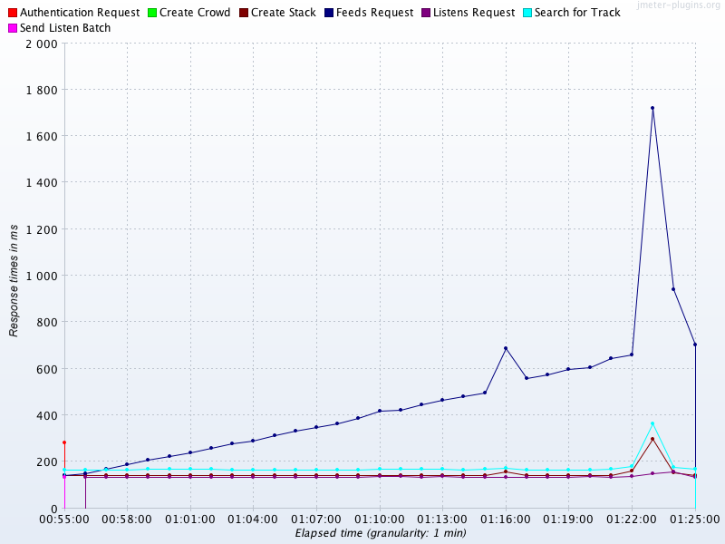

### Chapter 5: Microbenchmarking and Statistics - Summary

This chapter provides a stern warning about the dangers and complexities of measuring low-level Java performance, a practice known as **microbenchmarking**. It argues that due to the JVM's dynamic nature—with features like Just-in-Time (JIT) compilation, garbage collection, and aggressive code optimization—naive attempts to benchmark small code snippets almost always produce meaningless or misleading results. The chapter demonstrates these pitfalls with a simple sorting benchmark, showing how factors like JVM warmup and dead code elimination can invalidate results.

As a solution, it introduces the **Java Microbenchmark Harness (JMH)**, the OpenJDK-authored framework designed to correctly handle these complexities. It outlines the specific, rare use cases where microbenchmarking is appropriate (e.g., library development, low-latency finance) and explains how to use JMH correctly. The final part of the chapter transitions to the statistical analysis of performance data, emphasizing that JVM measurements produce **non-normal, long-tail distributions**. It explains why standard statistical tools like mean and standard deviation are misleading and introduces more robust techniques like logarithmic percentiles and specialized tools like **HdrHistogram** to properly analyze and interpret performance data.

---

### Introduction to Measuring Java Performance

Benchmarking Java code is like a science experiment: you must control all variables to get a repeatable, reliable result. However, the JVM's dynamic nature makes this incredibly difficult.

*   **The Uncontrolled Experiment:** A simple benchmark that just times a loop is flawed because it fails to control for critical JVM activities:
    *   **JIT Compilation:** The JVM compiles "hot" code from bytecode to optimized machine code *while the benchmark is running*. This means the code's performance changes during the measurement period.
    *   **Garbage Collection (GC):** GC can run at any time, introducing pauses that get mixed into the timing results.
    *   **Dead Code Elimination:** If the result of a benchmarked calculation is never used, the JIT compiler is smart enough to eliminate the entire calculation, resulting in a benchmark that measures nothing.

#### A Flawed "Classic" Benchmark Example

This simple benchmark attempts to measure the speed of `Collections.sort()`.

```java
// A naive and flawed microbenchmark. Do NOT use this pattern.
public class ClassicSort {

    private static final int N = 1_000;
    private static final int I = 150_000;
    private static final List<Integer> testData = new ArrayList<>();

    public static void main(String[] args) {
        Random randomGenerator = new Random();
        for (int i = 0; i < N; i++) {
            testData.add(randomGenerator.nextInt(Integer.MAX_VALUE));
        }

        System.out.println("Testing Sort Algorithm");

        // The timing loop starts immediately, with no warmup.
        double startTime = System.nanoTime();

        for (int i = 0; i < I; i++) {
            List<Integer> copy = new ArrayList<Integer>(testData);
            Collections.sort(copy);
            // The `copy` variable is never used, making it "dead code."
        }

        double endTime = System.nanoTime();
        double timePerOperation = ((endTime - startTime) / (1_000_000_000L * I));
        System.out.println("Result: " + (1 / timePerOperation) + " op/s");
    }
}
```

This code suffers from all the problems mentioned:
1.  **No Warmup:** The timing starts before the JIT compiler has had a chance to optimize the `sort` method. Running with `-XX:+PrintCompilation` shows the compiler working during the test.
2.  **GC Interference:** Running with `-verbose:gc` shows GC cycles happening during the timing loop, polluting the results.
3.  **Dead Code:** The `copy` list is never used after the sort, so a sufficiently clever JIT compiler could eliminate the `ArrayList` allocation and the `sort` call altogether.

---

### Introduction to JMH (The Java Microbenchmark Harness)

Because writing correct microbenchmarks is so hard, the OpenJDK engineers created JMH. It is the gold standard and should be the *only* tool you use if you absolutely must microbenchmark.

#### Heuristics for When to Microbenchmark

Microbenchmarking is an advanced and rarely needed technique. You should probably **NOT** be doing it. It is only appropriate in a few specific scenarios:
1.  You are developing a **general-purpose library** (like Google Guava) used in many unknown contexts.
2.  You are a **developer on the JDK/JVM** itself.
3.  You are developing an **extremely latency-sensitive application** (e.g., high-frequency trading) where execution times are under 100 microseconds and memory allocation is near zero.

> **Brian Goetz:** "The scary thing about microbenchmarks is that they always produce a number, even if that number is meaningless. They measure something; we’re just not sure what."

#### The JMH Framework

JMH solves the problems of naive benchmarking by generating harness code around your benchmark method. This handles warmup, iteration, forking, and dead code elimination for you.

*   **Setup:** You can set up a JMH project easily using a Maven archetype.
*   **Annotations:** You write benchmark code in a simple method and control its execution with annotations:
    *   `@Benchmark`: Marks a method as a benchmark.
    *   `@State(Scope.Thread/Benchmark)`: Defines state objects that hold data for the benchmark.
    *   `@Setup`: A method to initialize state.
    *   `@Warmup`, `@Measurement`: Control the number and duration of warmup and measurement iterations.
    *   `@Fork`: Runs the benchmark in a separate forked JVM process to ensure isolation.
*   **Blackholes:** To prevent dead code elimination, JMH uses a `Blackhole` object. You can either return a value from your benchmark method (which JMH implicitly consumes) or explicitly pass a `Blackhole` to your method and use `bh.consume()` on your results.

#### A Correct JMH Benchmark Example

This example correctly benchmarks three different sorting methods using JMH.

```java
@State(Scope.Benchmark)
@BenchmarkMode(Mode.Throughput)
@Warmup(iterations = 5, time = 1, timeUnit = TimeUnit.SECONDS)
@Measurement(iterations = 5, time = 1, timeUnit = TimeUnit.SECONDS)
@OutputTimeUnit(TimeUnit.SECONDS)
@Fork(1)
public class SortBenchmark {

    private static final int N = 1_000;
    private static final List<Integer> testData = new ArrayList<>();

    @Setup
    public static final void setup() {
        Random randomGenerator = new Random();
        for (int i = 0; i < N; i++) {
            testData.add(randomGenerator.nextInt(Integer.MAX_VALUE));
        }
    }

    // Returning the result prevents dead code elimination
    @Benchmark
    public List<Integer> classicSort() {
        List<Integer> copy = new ArrayList<Integer>(testData);
        Collections.sort(copy);
        return copy;
    }

    @Benchmark
    public List<Integer> standardSort() {
        return testData.stream().sorted().collect(Collectors.toList());
    }

    @Benchmark
    public List<Integer> parallelSort() {
        return testData.parallelStream().sorted().collect(Collectors.toList());
    }
}
```

Even with JMH, you must be careful. The output shows `classicSort` is fastest, but enabling the GC profiler (`.addProfiler(GCProfiler.class)`) reveals that the stream-based versions produce significantly more garbage collection, which is the real source of the performance difference. The benchmark is correct, but the interpretation requires extra investigation.

---

### Statistics for JVM Performance

Performance results are noisy and must be handled with statistical rigor.

#### Types of Error


*   **Systematic Error:** A flaw in the test setup that affects all measurements in a correlated way (e.g., measuring from a different continent adds a constant network latency to all results). This impacts **accuracy**.
*   **Random Error:** Unpredictable changes in the environment that affect results in an uncorrelated way. This impacts **precision**.




*   **Spurious Correlation:** Just because two metrics move together does not mean one causes the other. Be wary of drawing conclusions from plausible-looking but unproven correlations.


#### Non-Normal Statistics and Long Tails

The most important concept is that **JVM performance data is NOT normally distributed**.


*   **Long Tail:** The distribution has a "long tail" of slow outliers. A few transactions are much, much slower than the average. These are often the ones customers complain about.
*   **Mean and Standard Deviation are Useless:** Because the data is not normal, the average (mean) and standard deviation are highly misleading. They hide the impact of the outliers.
*   **Use Percentiles:** The correct way to report this data is with percentiles, focusing on the tail: 50% (median), 90%, 99%, 99.9%, etc. This gives a much clearer picture of the user experience.

#### HdrHistogram

For serious analysis of long-tail distributions, use the **HdrHistogram** library. It is specifically designed to accurately record and analyze data with a high dynamic range.

```java
// Example using HdrHistogram to analyze the time between GC events
public class BenchmarkWithHdrHistogram {
    private static final long NORMALIZER = 1_000_000;
    private static final Histogram HISTOGRAM = new Histogram(TimeUnit.MINUTES.toMicros(1), 2);

    public static void main(String[] args) throws Exception {
        final List<String> values = Files.readAllLines(Paths.get(args[0]));
        double last = 0;
        for (final String tVal : values) {
            double parsed = Double.parseDouble(tVal);
            double gcInterval = parsed - last;
            last = parsed;
            HISTOGRAM.recordValue((long)(gcInterval * NORMALIZER));
        }
        HISTOGRAM.outputPercentileDistribution(System.out, 1000.0);
    }
}
```


#### Interpretation: The "Hat/Elephant" Problem

A complex-looking distribution is often a combination of several simpler, distinct distributions. You must break down your data into meaningful sub-populations to understand it.


For example, a web server's response time histogram combines:
*   **Fast 404 errors** (Figure 5-10)
*   **Slow 500 server errors** (Figure 5-11)
*   **Successful 2xx responses**, which may themselves have multiple modes (Figure 5-12)

Combining these gives you the original, confusing "hat" shape (Figure 5-13).


---

### Actionable Tips from Chapter 5

> **1. Don't Microbenchmark.** Unless you fit one of the three specific use cases (JDK dev, library author, extreme low-latency), you should not be writing microbenchmarks. Focus on top-down, application-level testing.

> **2. If You MUST Microbenchmark, Use JMH.** Do not write your own harness. Use the tool written by the JVM experts that correctly handles warmup, forking, and dead code elimination.

> **3. You Are the Easiest Person to Fool.** Be deeply skeptical of your own results. Always question if an uncontrolled variable (GC, JIT, OS) is influencing your measurements.

> **4. Stop Using Average (Mean) for Performance Timings.** JVM performance data is non-normal. The average hides the outliers that matter most.

> **5. Use Percentiles, Especially the Tail.** Report performance using a range of percentiles: median (50th), 90th, 99th, 99.9th, and 99.99th. This accurately describes the user experience.

> **6. Use HdrHistogram for Serious Analysis.** When you need to accurately record and analyze latency distributions, use the HdrHistogram library.

> **7. Deconstruct Your Data.** If you see a complex or multimodal distribution, break down the data into meaningful sub-groups (e.g., by HTTP status code, by request type) to understand the underlying behavior.

> **8. Never Trust a Benchmark Without Analyzing the Generated Code.** An advanced technique, but for true experts, tools like JITWatch are necessary to see what machine code the JIT is actually producing from your benchmark. 