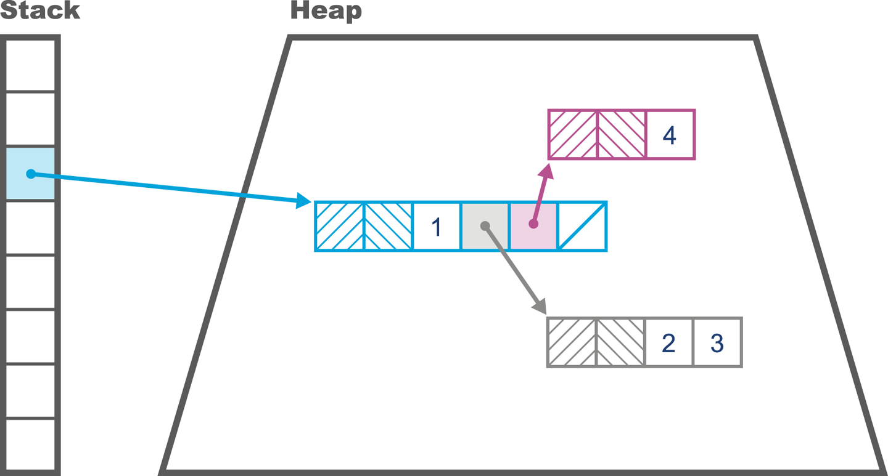
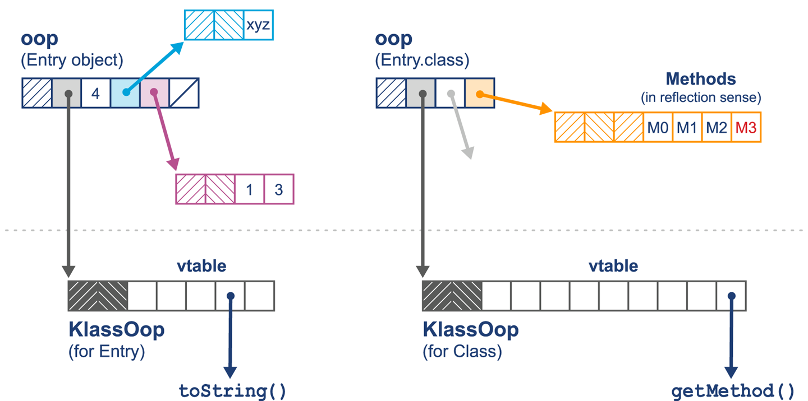
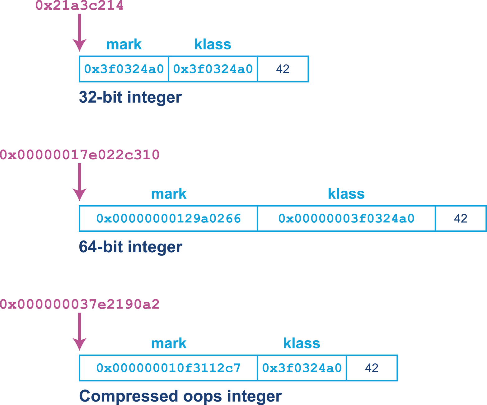
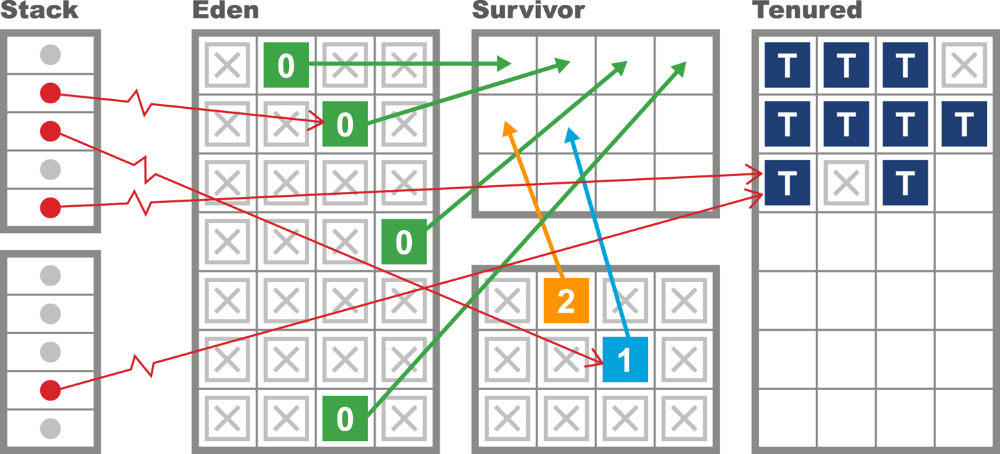
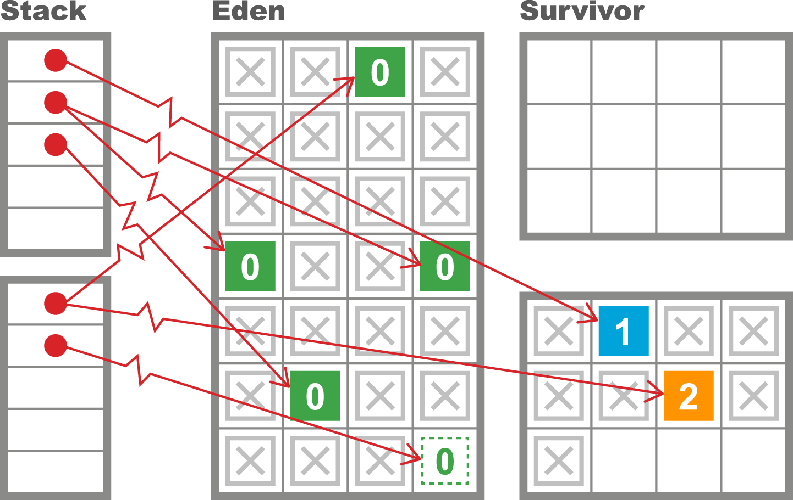
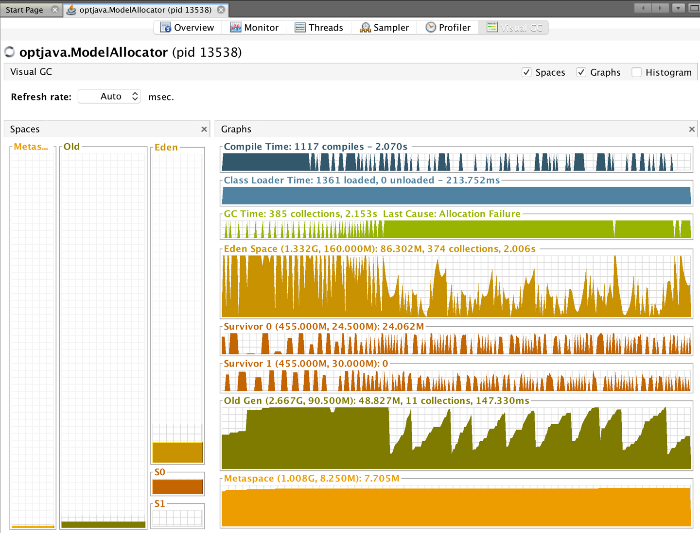
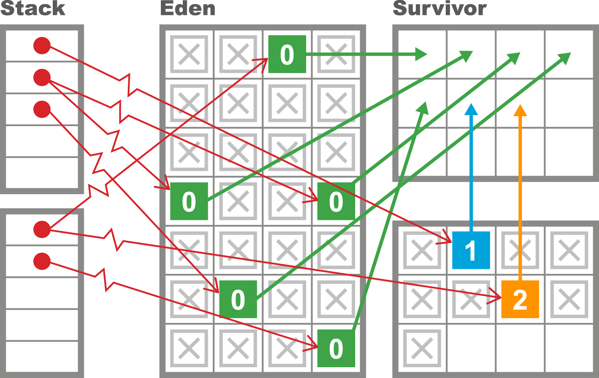
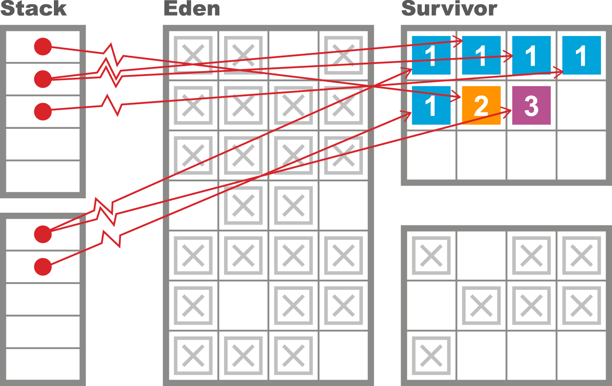
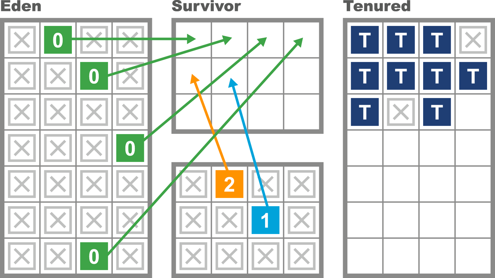
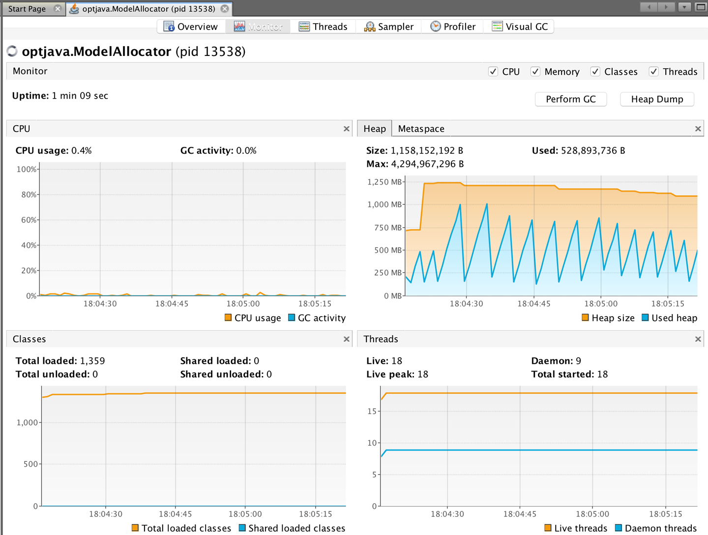

### Chapter 6: Understanding Garbage Collection - Summary

This chapter introduces the fundamental theory and practice of garbage collection (GC) in the Java Virtual Machine. It begins by justifying Java's managed, automatic approach to memory, contrasting it with manual methods and establishing the two fundamental rules of GC: collect all garbage and **never** collect a live object. The chapter then explains the classic **mark-and-sweep** algorithm as a conceptual basis.

It then dives into the specifics of the **HotSpot JVM's runtime**, detailing how objects are represented in memory as `oops` (ordinary object pointers) with `mark` and `klass` words, and the space-saving technique of compressed oops. A key focus is the **Weak Generational Hypothesis**—the observation that most objects are short-lived—which is the theoretical foundation for HotSpot's generational heap structure (Eden, Survivor, and Tenured spaces). The chapter explains the mechanisms that make this structure efficient, such as **Thread-Local Allocation Buffers (TLABs)** for fast, contention-free allocation and the **card table** for tracking old-to-young pointers.

Finally, it introduces the **parallel collectors** (Parallel GC and ParallelOld), the default collectors in Java 8 and earlier, which are optimized for throughput but are fully "stop-the-world." The chapter concludes by emphasizing that GC is driven by **allocation rate** and **object lifetime**, and that high or "bursty" allocation can lead to a common performance problem called **premature promotion**.

---

### Introduction to Mark and Sweep

The core idea of Java's GC is that the runtime tracks object usage and automatically reclaims memory from objects that are no longer required.

*   **Two Fundamental Rules of GC:**
    1.  Algorithms must collect all garbage.
    2.  No live object must ever be collected. (This is the most important rule).

A simplified mark-and-sweep algorithm works as follows:
1.  Loop through all allocated objects, clearing a "mark bit."
2.  Start from **GC roots** (known live pointers from outside the heap, like local variables on the stack) and traverse the graph of all reachable objects (the "live object graph").
3.  Set the "mark bit" on each reachable object.
4.  Loop through the allocated objects again. Any object whose mark bit is not set is garbage and can be reclaimed.



#### Heap Inspection Tools
*   `jmap -histo`: A command-line tool to show a histogram of live objects in the heap, broken down by class.
    ```
    num    #instances       #bytes  class name
    ----------------------------------------------
      1:        20839     14983608  [B
      2:       118743     12370760  [C
      3:        14528      9385360  [I
      4:          282      6461584  [D
      5:       115231      3687392  java.util.HashMap$Node
      6:       102237      2453688  java.lang.String
    ...
    ```
*   **VisualVM:** The Sampling tab provides a GUI view, and the **VisualGC** plug-in offers a real-time visualization of heap usage and GC activity.

---

### Garbage Collection Glossary

| Term           | Description                                                                                             |
| -------------- | ------------------------------------------------------------------------------------------------------- |
| Stop-the-world (STW) | All application threads are paused while GC occurs.                                                     |
| Concurrent     | GC threads run simultaneously with application threads. True concurrency is rare; most are "mostly concurrent." |
| Parallel       | Multiple threads are used to perform the GC work, shortening the STW pause.                               |
| Exact          | The GC has enough type information to distinguish pointers from other data (e.g., `int`s).                 |
| Conservative   | The GC lacks exact type info and must treat ambiguous patterns as potential pointers, leading to inefficiency. |
| Moving         | Objects can be relocated in memory during a collection. Their addresses are not stable.                 |
| Compacting     | Surviving objects are moved into a single contiguous block of memory, eliminating fragmentation.           |
| Evacuating     | All surviving objects are moved from one memory region to a completely different one.                     |

---

### Introducing the HotSpot Runtime

HotSpot has specific internal representations and mechanisms for managing memory.

#### Representing Objects at Runtime
*   **oops (ordinary object pointers):** The internal C-pointer representation of a Java object reference.
*   **Object Header:** Every object begins with a header containing two machine words:
    1.  **Mark Word:** Points to instance-specific metadata (e.g., locking information).
    2.  **Klass Word:** Points to class-wide metadata (e.g., the vtable).
*   **Compressed Oops:** On 64-bit JVMs, oops are compressed to 32 bits to save significant heap space. This is on by default (`-XX:+UseCompressedOops`).
*   **`klassOop` vs. `Class<?>`:** The internal `klassOop` contains the vtable for method dispatch, while the `java.lang.Class` object is used for reflection. They are not the same.




#### GC Roots and Arenas
*   **GC Roots:** Pointers that originate from *outside* the heap and point into it. These are the starting points for finding all live objects. Examples include:
    *   Local variables on thread stacks
    *   JNI references
    *   Static variables
*   **Arenas:** Low-level memory areas that HotSpot's GC works with. HotSpot manages the Java heap from user space, not with system calls.

---

### Allocation, Lifetime, and the Weak Generational Hypothesis

The behavior of any GC is driven by two application characteristics:
1.  **Allocation Rate:** The amount of memory created per unit of time (e.g., MB/sec).
2.  **Object Lifetime:** How long an object remains reachable.

This leads to the **Weak Generational Hypothesis**, the most important principle for JVM GC tuning:
> The distribution of object lifetimes on the JVM...is bimodal—with the vast majority of objects being very short-lived and a secondary population having a much longer life expectancy.

This observation leads to a **generational heap structure**:
*   New objects are created in a **young generation** (also called Eden or the Nursery).
*   GCs in the young generation are frequent and fast because most objects die quickly.
*   Objects that survive a few young GCs are **promoted** to an **old generation** (or Tenured space), which is collected much less frequently.



*   **Card Table:** To avoid scanning the entire old generation to find pointers into the young generation during a young GC, HotSpot uses a **card table**. This is a bitmap where a "dirty" card indicates that an old-generation object in that memory region might have a reference to a young-generation object.

---

### Garbage Collection in HotSpot

#### Thread-Local Allocation (TLABs)
To make allocation fast and avoid contention, Eden is partitioned into **Thread-Local Allocation Buffers (TLABs)**. Each application thread gets its own TLAB. When a thread creates a new object, it's a simple **pointer bump** within its private TLAB, making allocation an O(1) operation.



#### Hemispheric Collection (Survivor Spaces)
The young generation uses a **hemispheric evacuating collector**.
*   It consists of **Eden** and two **Survivor Spaces** (S1, S2).
*   At any time, one survivor space is empty.
*   During a young GC, live objects from Eden and the *used* survivor space are copied (evacuated) into the *empty* survivor space.
*   This is efficient but uses more memory, as one survivor space is always empty.



---

### The Parallel Collectors

The default collectors in Java 8 and earlier are optimized for **throughput**. They are fully **stop-the-world (STW)** but use multiple CPU cores to complete the collection as fast as possible.
*   **Young Parallel Collections (Parallel GC):**
    1.  STW pause is triggered when a thread can't allocate in Eden.
    2.  All live objects in Eden and the "from" survivor space are identified.
    3.  Surviving objects are evacuated to the "to" survivor space. Their age is incremented.
    4.  Eden and the "from" space are cleared.
    5.  Application threads resume.
    The pause time is proportional to the number of *surviving* objects, which is usually small.




*   **Old Parallel Collections (ParallelOld):**
    *   This is a **compacting** collector, not an evacuating one.
    *   After marking live objects in the old generation, it slides them to the beginning of the space to eliminate fragmentation.
    *   The STW pause time for a full GC scales roughly linearly with the size of the live data set in the old generation, which can lead to very long pauses for large heaps.



---

### The Role of Allocation

GC is not scheduled; it is triggered **on an as-needed basis**, almost always when an allocation request cannot be satisfied.
*   This means high allocation rates lead to more frequent GCs.
*   **Premature Promotion:** If the allocation rate is so high that the survivor spaces are too small to hold all the short-lived objects that are alive during a young GC, those objects will be promoted directly to the old generation. These "prematurely promoted" objects die shortly after, but they sit in the old generation as garbage until a much more expensive full GC can reclaim them. This is a very common cause of performance problems.



#### Allocation Simulator Code Example

This code simulates the Weak Generational Hypothesis. It allocates objects, most of which are short-lived, but a small percentage are given a much longer lifetime. This kind of simulation can be used to observe GC behavior under different allocation patterns.

```java
// Allocator that creates a mix of short-lived and long-lived objects
public class ModelAllocator implements Runnable {
    private volatile boolean shutdown = false;

    private double chanceOfLongLived = 0.02;
    private int multiplierForLongLived = 20;
    private int x = 1024;
    private int y = 1024;
    private int mbPerSec = 50;
    private int shortLivedMs = 100;
    private int nThreads = 8;
    private Executor exec = Executors.newFixedThreadPool(nThreads);

    public void run() {
        final int mainSleep = (int) (1000.0 / mbPerSec);

        while (!shutdown) {
            for (int i = 0; i < mbPerSec; i++) {
                ModelObjectAllocation to =
                    new ModelObjectAllocation(x, y, lifetime());
                exec.execute(to);
                try {
                    Thread.sleep(mainSleep);
                } catch (InterruptedException ex) {
                    shutdown = true;
                }
            }
        }
    }

    public int lifetime() {
        if (Math.random() < chanceOfLongLived) {
            return multiplierForLongLived * shortLivedMs;
        }

        return shortLivedMs;
    }
}

// Simple object that holds memory for a specified lifetime
public class ModelObjectAllocation implements Runnable {
    private final int[][] allocated;
    private final int lifeTime;

    public ModelObjectAllocation(final int x, final int y, final int liveFor) {
        allocated = new int[x][y];
        lifeTime = liveFor;
    }

    @Override
    public void run() {
        try {
            Thread.sleep(lifeTime);
            System.err.println(System.currentTimeMillis() +": "+ allocated.length);
        } catch (InterruptedException ex) {
        }
    }
}
```

---

### Actionable Tips from Chapter 6

> **1. Understand that GC is Driven by Allocation.** The frequency and impact of garbage collection are direct consequences of your application's allocation rate and object lifetimes. The first step in tuning is to understand these characteristics.

> **2. Trust the Generational Hypothesis.** The JVM's default heap structure is designed around the fact that most objects die young. Writing code that respects this (e.g., by avoiding creating unnecessary long-lived objects) will lead to better performance.

> **3. Appreciate that Allocation is Cheap (Thanks to TLABs).** Don't prematurely optimize to avoid object allocation. In HotSpot, creating new objects is extremely fast. The cost is paid later, during collection.

> **4. Know Your Collector's Trade-offs.** The default parallel collectors are great for throughput but can cause long stop-the-world pauses. Understand that this is their design, and if low pause times are a requirement, you will need to consider other collectors.

> **5. Watch for Premature Promotion.** If your application has high or bursty allocation rates, short-lived objects may be forced into the old generation, leading to heap bloat and more frequent, long full GCs. This is a key tuning area to investigate.

> **6. Use Basic Tools for a First Look.** Use tools like `jmap -histo` and VisualVM's VisualGC plug-in to get an initial feel for your application's memory behavior, but be aware that GC logs are required for a deep, accurate analysis.


