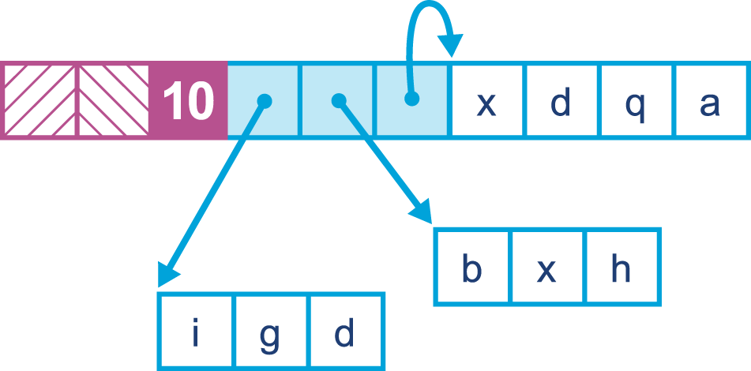

### Chapter 7: Advanced Garbage Collection - Summary

This chapter delves into the advanced garbage collectors available in the HotSpot JVM and beyond, moving from the basic theory of Chapter 6 into the practical trade-offs that performance engineers must navigate. It establishes that there is **no single best GC algorithm**; instead, the JVM provides **pluggable collectors**, each optimizing for different concerns like pause time, throughput, and memory overhead.

The chapter begins with the theory of concurrent collection, introducing two critical JVM-internal concepts: **JVM Safepoints**, the mechanism by which application threads are brought to a stop, and **Tri-Color Marking**, the fundamental algorithm that enables a collector to trace live objects while application threads are concurrently modifying the object graph.

It then provides a detailed exploration of HotSpot's two other mainstream collectors. The **Concurrent Mark Sweep (CMS)** collector is presented as an ultra-low-pause collector for the old generation, which achieves its goal at the cost of throughput and CPU overhead, and is susceptible to heap fragmentation and **Concurrent Mode Failures**. The **Garbage-First (G1)** collector is introduced as a modern, general-purpose collector that uses a region-based heap to provide a better balance of throughput and pause time on large heaps, becoming the default in Java 9. The chapter also provides a brief tour of other innovative collectors like **Shenandoah** (with its Brooks Pointer) and Azul's **C4** (with its Loaded Value Barrier), and IBM's **Balanced** collector (with its NUMA-awareness and arraylets), highlighting the different approaches to solving the low-pause GC problem. Finally, it lists legacy and deprecated collectors to ensure engineers can identify and remove outdated configurations.

---

### Tradeoffs and Pluggable Collectors

The Java specification does not mandate a specific GC implementation, allowing for a pluggable subsystem. This is because different algorithms are appropriate for different workloads, and every algorithm represents a compromise between competing concerns.

> There is no single general-purpose GC algorithm that can optimize for all GC concerns simultaneously.

The main concerns and trade-offs are:
*   **Pause time:** The duration of stop-the-world (STW) pauses.
*   **Throughput:** The percentage of total time the application spends doing useful work versus doing GC.
*   **Pause frequency:** How often pauses occur.
*   **Reclamation efficiency:** How effectively garbage is collected.
*   **Pause consistency:** The predictability of pause durations.

For many batch or big data workloads, throughput is far more important than pause time.

---

### Concurrent GC Theory

The goal of concurrent collectors is to address the nondeterministic and unpredictable nature of STW pauses by doing as much work as possible while application threads are still running. This reduces pause time but at the cost of reducing the processing power available to the application.

#### JVM Safepoints
To perform a STW collection, all application threads must be stopped at a **safepoint**, a point where their internal state is consistent.
*   The JVM is not fully preemptive; it relies on threads to cooperate to stop.
*   **Rules of Safepointing:**
    1.  The JVM **cannot force** a thread *into* a safepoint state.
    2.  The JVM **can prevent** a thread from *leaving* the safepoint state.
*   **Mechanism:** The JVM sets a global "time to safepoint" flag. Application threads periodically poll this flag (e.g., between bytecodes, on loop back-edges) and pause themselves if it is set. A thread is automatically at a safepoint if it is blocked on a monitor or executing JNI code.

#### Tri-Color Marking
The foundational algorithm for concurrent marking, it logically divides objects into three sets:
*   **White:** Objects that have not yet been visited (initial state, potential garbage).
*   **Gray:** Objects that have been visited, but whose children have not yet been scanned.
*   **Black:** Objects that have been visited, and all of their children have also been scanned (proven live).

**Algorithm:**
1.  Start with GC roots colored gray, all other objects white.
2.  Pick a gray object, scan its children, color them gray, and then color the parent object black.
3.  Repeat until there are no gray objects left.
4.  All remaining white objects are garbage.

**The Concurrent Problem:** While marking is in progress, an application (mutator) thread can change the object graph. Specifically, it can create a reference from an already-scanned **black** object to an unscanned **white** object, and then remove the last reference from any **gray** object to that same white object. This violates the **tri-color invariant** and could cause a live object to be collected.

> **Tri-color invariant:** No black object may hold a reference to a white object during concurrent marking.

**Solution:** Collectors use **write barriers**—a small piece of code executed on every reference field write—to detect and record these problematic mutations, ensuring correctness.

---

### CMS (Concurrent Mark Sweep)
CMS is a low-pause collector for the **old (Tenured) generation only**. It is typically paired with the `ParNew` young collector.

**CMS Phases:**
1.  **Initial Mark (STW):** A very short pause to find the initial set of live objects directly reachable from GC roots.
2.  **Concurrent Mark:** Traces the live object graph concurrently with the application.
3.  **Concurrent Preclean:** An intermediate concurrent phase to reduce work in the final remark.
4.  **Remark (STW):** A second, slightly longer pause to find objects that were missed during the concurrent mark due to application mutations.
5.  **Concurrent Sweep:** Reclaims the dead objects and adds the memory back to free lists, done concurrently.
6.  **Concurrent Reset:** Resets internal data structures for the next cycle.

**Trade-offs of CMS:**
*   **Pros:** Very short STW pause times in the old generation.
*   **Cons:**
    *   Reduced application throughput while concurrent phases are running.
    *   Uses more total CPU time than a parallel collector.
    *   **Does not compact the heap**, which can lead to fragmentation.
    *   Susceptible to **Concurrent Mode Failure (CMF)**.

**Concurrent Mode Failure (CMF):**
A CMF occurs when CMS fails to finish collecting the old generation before it runs out of space. The JVM must then fall back to a long, fully STW, single-threaded full GC. CMF has two primary causes:
1.  **Allocation Pressure:** The application promotes objects into the old generation faster than CMS can clear space.
    
2.  **Heap Fragmentation:** There is enough total free space, but no single free block is large enough to accommodate an object being promoted.
    

**Basic Flag:** `-XX:+UseConcMarkSweepGC`

---

### G1 (Garbage-First)
G1 is a modern, general-purpose collector designed to replace CMS. It became the default collector in Java 9. Its goal is to provide a better balance of pause time and throughput, especially on large heaps.

**G1 Heap Layout:**
*   The heap is partitioned into a set of equal-sized **regions** (typically 1MB-32MB).
*   Generations (Eden, Survivor, Old) are logical sets of these regions and are **not contiguous** in memory.
*   Objects larger than half a region are considered **humongous** and are allocated in special contiguous humongous regions.

**G1 Algorithm:**
*   It is an evacuating, compacting collector.
*   It uses a concurrent marking phase similar to CMS.
*   During a young GC, it may also choose to collect some of the "garbag-iest" old regions in the same pause (a "mixed collection").
*   **Remembered Sets (RSets):** G1 uses RSets to track references that point *into* a region from *outside* it. This allows a region to be collected without having to scan the entire heap.

**Basic Flags:**
*   `-XX:+UseG1GC` (to enable in Java 8 and earlier)
*   `-XX:MaxGCPauseMillis=200` (sets a pause time *goal*; not a guarantee)

---

### Other Collectors

*   **Shenandoah (Red Hat/OpenJDK):** An experimental collector developed by Red Hat within the OpenJDK project, designed for ultra-low pause times on large heaps by implementing **concurrent compaction**.
    *   **Key Feature: Brooks Pointer.** Shenandoah's core mechanism is a "forwarding pointer" located in each object's header. When an object is moved during concurrent compaction, this pointer is atomically updated (using a CAS operation) to point to the object's new location. Application threads that subsequently access the object will read this pointer, update their own reference to the new location, and then proceed. This allows the application to continue running while the heap is being compacted.
    *   **Phases:** The collection cycle includes a brief initial mark (STW), a concurrent marking phase, a final marking phase (STW) to handle roots, and the core **concurrent compaction** phase where objects are evacuated while application threads run.
    *   **Non-Generational:** An important design choice is that Shenandoah is not a generational collector, which has performance implications that will become clearer as it matures.
    
    
    

*   **C4 (Azul Zing):** The "Continuously Concurrent Compacting Collector" from Azul Systems' proprietary Zing JVM. It is a commercial, Linux-only product designed for extremely large heaps and consistent low-latency.
    *   **Key Feature: Loaded Value Barrier (LVB).** C4 uses a "self-healing" read barrier. Unlike Shenandoah's forwarding pointer, the LVB intercepts reads of object references. If a reference points to a location from which an object has been moved, the LVB logic forces the application thread to update its own reference to the object's new location *before* the read completes. This ensures each stale reference is fixed at most once, on first access after a move.
    *   **Object Layout:** Zing uses a single 64-bit header word per object (unlike HotSpot's two-word header), which contains a numeric class ID instead of a direct pointer. It does not use compressed oops, making its headers larger on smaller heaps.
    *   **Virtual Memory Integration:** C4 leverages the OS's virtual memory system to perform compaction. It copies objects to new physical pages and then remaps virtual addresses, freeing the old physical pages. The LVB handles any memory faults that occur when a thread tries to access an unmapped page.
    

*   **Balanced (IBM J9):** A region-based, NUMA-aware collector from IBM's J9 JVM (now Eclipse OpenJ9), designed for heaps larger than 4GB.
    *   **Region-Based:** Like G1, it divides the heap into regions and can collect a subset of them in a Partial Garbage Collection (PGC) to bound pause times.
    *   **Key Feature: Arraylets.** To avoid the need for large contiguous memory blocks, Balanced can split very large arrays into a "spine" object and multiple "leaf" blocks that hold the actual data. This is transparent to Java code but allows large arrays to be allocated in non-contiguous regions.
    *   **NUMA-Aware:** On servers with a Non-Uniform Memory Access architecture, Balanced can split the heap across NUMA nodes. It attempts to allocate objects on the same node as the thread that creates them and will migrate objects during a PGC to be closer to the threads that reference them, improving memory access times.
    
    
    

---

### Legacy and Deprecated Collectors

It is important to recognize and remove configurations that use obsolete collectors.
*   **Serial and SerialOld:** Single-threaded, fully STW collectors. Should not be used on modern servers.
*   **Incremental CMS (iCMS):** An older, complex variant of CMS. Removed in Java 9.

**Deprecated GC Combinations in Java 8 (Removed in Java 9):**

| Combination      | Flags                                                              |
| ---------------- | ------------------------------------------------------------------ |
| DefNew + CMS     | `-XX:-UseParNewGC -XX:+UseConcMarkSweepGC`                           |
| ParNew + SerialOld| `-XX:+UseParNewGC`                                                 |
| ParNew + iCMS    | `-Xincgc`                                                          |
| ParNew + iCMS    | `-XX:+CMSIncrementalMode -XX:+UseConcMarkSweepGC`                    |
| DefNew + iCMS    | `-XX:+CMSIncrementalMode -XX:+UseConcMarkSweepGC -XX:-UseParNewGC`   |
| CMS foreground   | `-XX:+UseCMSCompactAtFullCollection`                                 |
| CMS foreground   | `-XX:+CMSFullGCsBeforeCompaction`                                    |
| CMS foreground   | `-XX:+UseCMSCollectionPassing`                                     |

*   **Epsilon:** An experimental no-op collector that only allocates memory and never reclaims it. It is for performance testing and must **never** be used in production.

---

### Actionable Tips from Chapter 7

> **1. Choose a Collector Based on Your Primary Goal.** There is no "best" GC. Is your application a batch job that values throughput above all (use Parallel)? Or is it a user-facing service that needs low pause times (consider G1 or CMS)? Make a conscious choice based on your requirements.

> **2. Understand the Cost of Concurrency.** Concurrent collectors like CMS and G1 reduce pause time by doing work alongside your application, but this consumes CPU resources that would otherwise be used by your application. This trade-off means lower pauses often come at the cost of lower overall throughput.

> **3. Master Your Chosen Collector's Failure Modes.** For CMS, this means understanding and tuning to avoid Concurrent Mode Failures (CMFs). For G1, it means understanding how pause time goals can be missed if the application's allocation rate is too high.

> **4. Don't Be Afraid of G1.** G1 is the modern, general-purpose default. It is much easier to tune than CMS and handles large heaps more gracefully. For any application moving to Java 9+, a solid understanding of G1 is essential.

> **5. Know What a Safepoint Is.** Long "time to safepoint" pauses can be a hidden source of latency. If you see long pauses that aren't accounted for in GC logs, this is a potential culprit.

> **6. Clean Up Legacy Flags.** When taking over an existing application, audit the JVM flags. Remove any that enable deprecated or removed GC combinations to ensure you are running a supported and sensible configuration.

> **7. Don't Treat Pause Time as the Only Metric.** A collector might have low average pauses but also high variability or very long outlier pauses. Consider pause consistency and the impact on throughput to get a complete picture.
