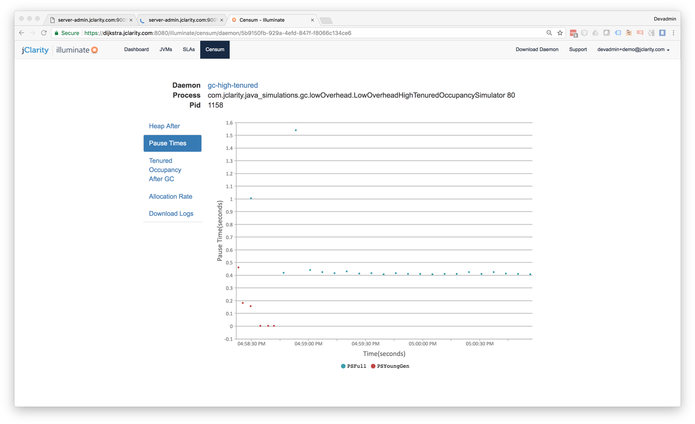
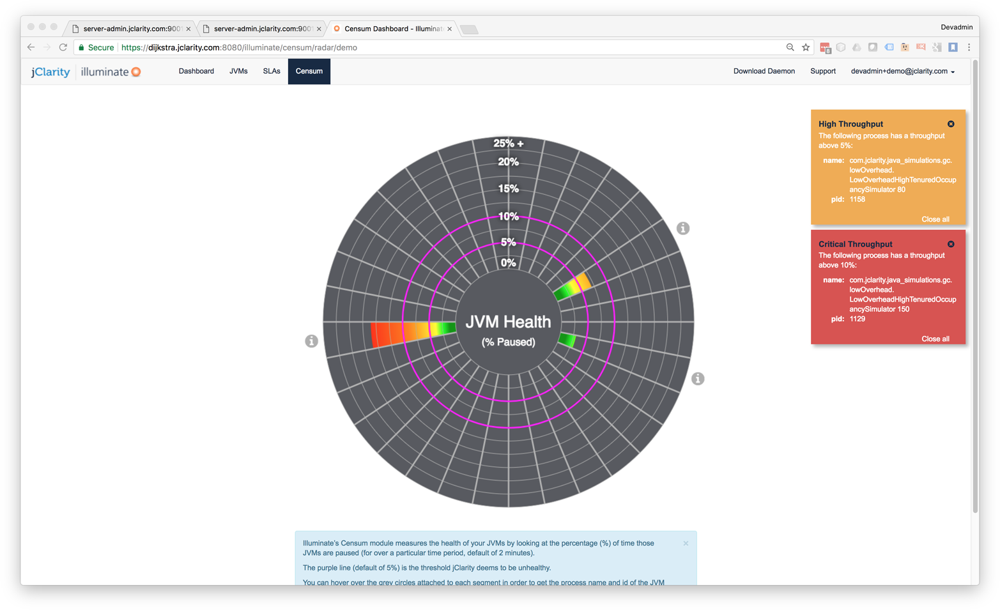
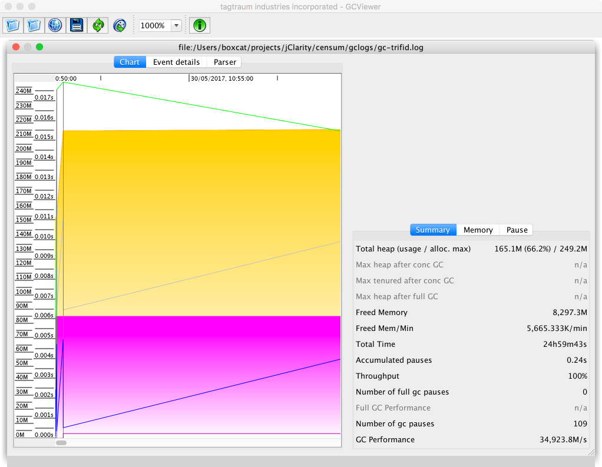
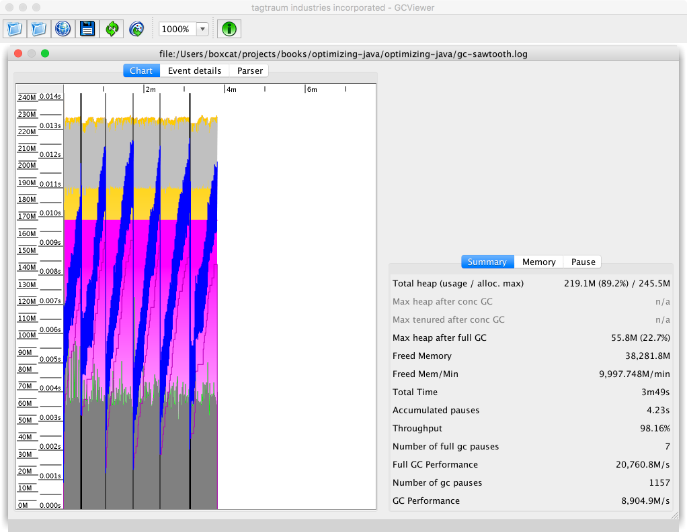
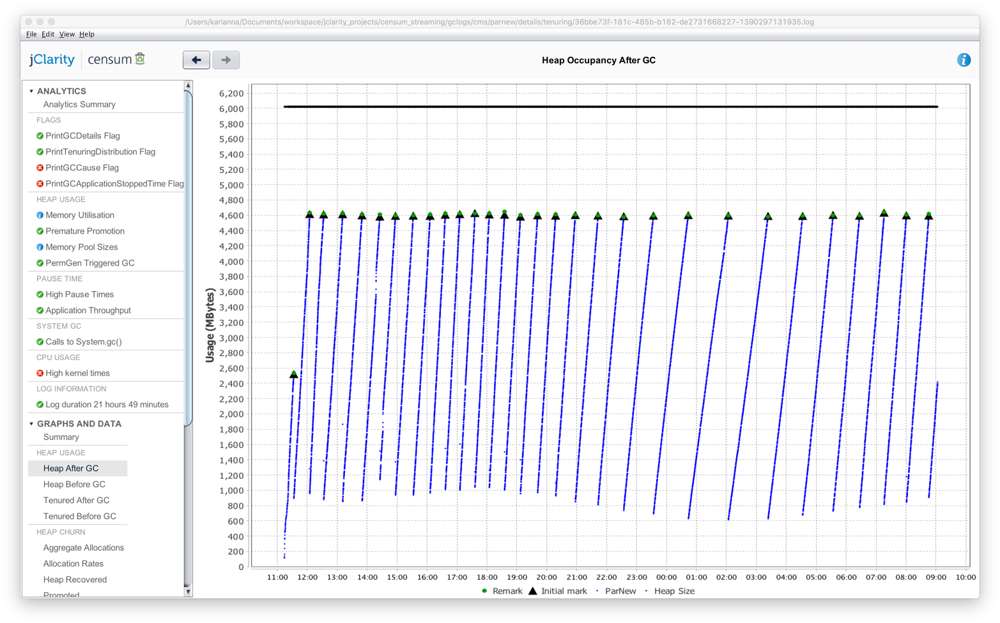
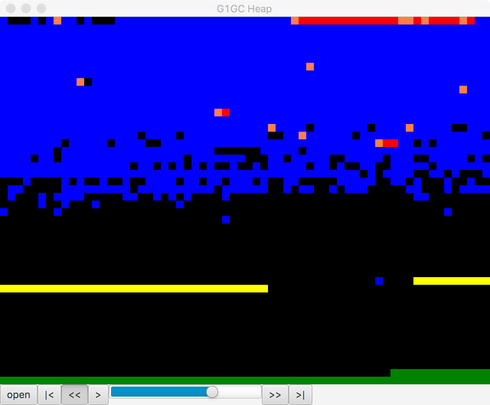
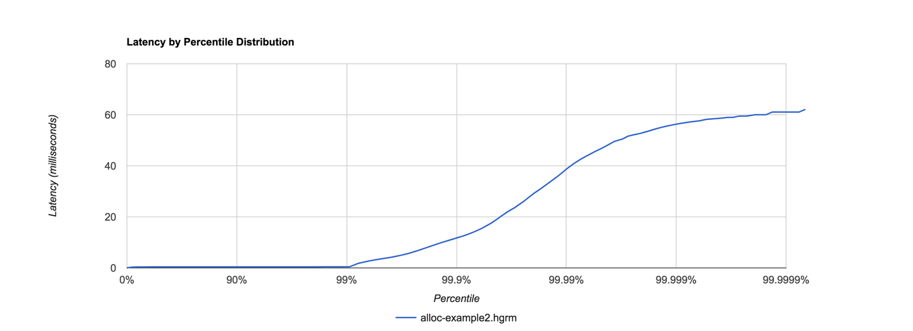
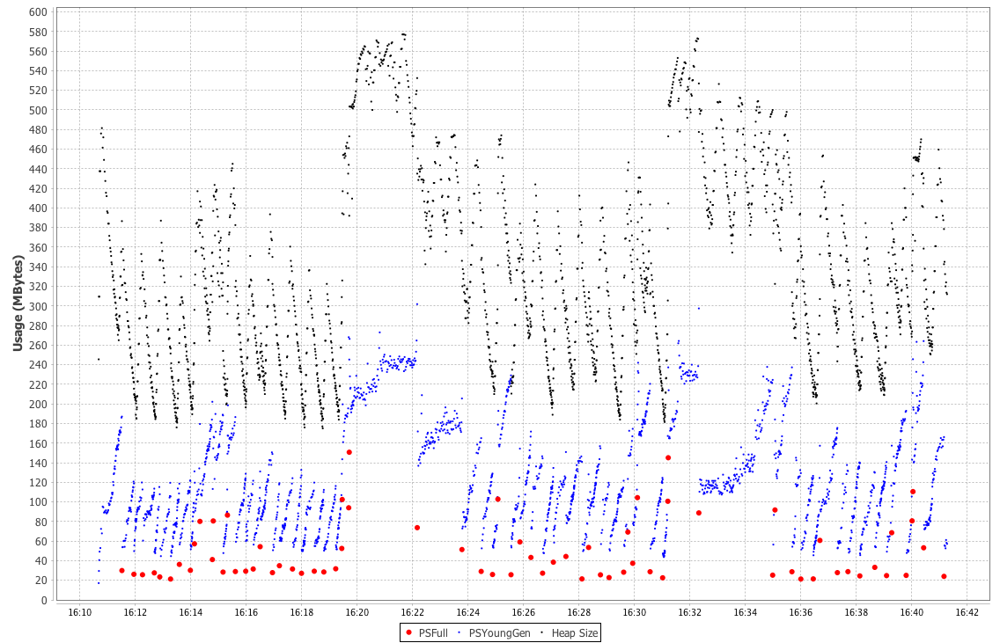

### Chapter 8: GC Logging, Monitoring, Tuning, and Tools - Summary

This chapter provides a practical guide to the essential discipline of Garbage Collection tuning. It asserts that the **GC log** is the single most important source of information for performance analysis, far superior to JMX-based sampling due to its event-driven nature, low overhead, and richness of data. The chapter begins by prescribing a set of **mandatory GC logging flags** that should be enabled on every serious production application.

Given the complexity and changing format of GC logs, the chapter strongly advises against writing custom parsers, instead recommending the use of specialized tools like the commercial **Censum** analyzer or the open-source **GCViewer**. It then outlines a systematic tuning methodology. The first step is diagnosis: using system tools like `vmstat` to confirm that high user-space CPU utilization is correlated with GC activity. The core of tuning then focuses on understanding the application's **allocation rate** and **pause time sensitivity**. High allocation rates (>1 GB/s) often indicate an application-level problem that GC tuning cannot fix.

The chapter provides collector-specific tuning advice for **Parallel GC** (which rarely needs tuning), **CMS** (a complex collector that requires careful management of headroom and fragmentation to avoid Concurrent Mode Failures), and **G1** (the modern default, tuned via pause time goals). Finally, it introduces **jHiccup**, a powerful tool for measuring all sources of JVM pauses ("hiccups"), providing a more holistic view of application responsiveness than GC logs alone.

---

### Introduction to GC Logging

The GC log is the primary source of data for analyzing and tuning memory management.
*   It should **always be enabled** for any serious application, especially in production.
*   It provides a detailed, event-driven record of every collection.
*   It has **negligible performance overhead** because it uses a non-blocking writer internal to the JVM.

#### Switching On GC Logging
Use this set of "mandatory" flags for any JVM process:
`-Xloggc:gc.log -XX:+PrintGCDetails -XX:+PrintTenuringDistribution -XX:+PrintGCTimeStamps -XX:+PrintGCDateStamps`

**Table 8-1. Mandatory GC flags**

| Flag                        | Effect                                                               |
| --------------------------- | -------------------------------------------------------------------- |
| `-Xloggc:gc.log`              | Controls which file to log GC events to                              |
| `-XX:+PrintGCDetails`         | Logs detailed information for each GC event. Replaces `-verbose:gc`. |
| `-XX:+PrintTenuringDistribution` | Adds survivor space age distribution, vital for premature promotion analysis. |
| `-XX:+PrintGCTimeStamps`      | Prints timestamps in seconds since VM start, for internal correlation. |
| `-XX:+PrintGCDateStamps`      | Prints wallclock timestamps, for correlation with application logs.    |

For production environments, log rotation is also recommended:

**Table 8-2. GC log rotation flags**

| Flag                         | Effect                                           |
| ---------------------------- | ------------------------------------------------ |
| `-XX:+UseGCLogFileRotation`    | Switches on logfile rotation                     |
| `-XX:+NumberOfGCLogFiles=<n>`  | Sets the maximum number of logfiles to keep      |
| `-XX:+GCLogFileSize=<size>`    | Sets the maximum size of each file before rotation |

---

### GC Logs Versus JMX

For deep GC analysis, logs are superior to JMX.
*   **Logs are Event-Driven:** Data is recorded for every single GC event.
*   **JMX is Sampling-Based:** JMX clients poll MBeans at intervals, missing the state of the heap immediately before and after a collection. This makes accurate allocation rate calculation impossible.
*   **Logs are Low-Overhead:** Writing to the log is extremely cheap.
*   **JMX has Overhead:** JMX uses RMI, which has network costs and can even *cause* full GCs due to its reliance on finalization.
*   **Logs are Richer:** Logs contain over 50 data points per event, compared to fewer than 10 for JMX.

> For a rough trend analysis of basic heap usage, JMX is a fairly quick and easy solution; however, for deeper diagnosis of problems it quickly becomes underpowered.

---

### Log Parsing Tools

The GC log format is not standardized and changes between JVM versions. **Do not attempt to parse GC logs yourself.** Use a dedicated tool.

*   **Censum (Commercial):** A tool from jClarity, available as a desktop app or SaaS. Provides best-in-class parsing for all collectors and JVM versions, plus automated analytics for detecting problems like premature promotion, memory leaks, and OS interference.
    
    
    

*   **GCViewer (Open Source):** A free desktop tool with basic parsing and graphing capabilities. It supports a limited number of log formats and provides no automated analysis.
    

Different tools visualize the same data differently, but should tell the same story.



---

### Basic GC Tuning

Tuning should be a systematic, data-driven process.

**Is GC the Problem?**
A quick check on a live system:
1.  CPU utilization is near 100% (`vmstat`).
2.  The majority of CPU time (>90%) is in **user space** (`us` column in `vmstat`).
3.  The GC log shows frequent activity.
If all three are true, GC is a likely cause and should be investigated.

**Key Factors to Study:**
1.  **Allocation Rate:** The most important factor.
2.  **Pause Sensitivity:** How much pause time can the application tolerate?
3.  **Throughput:** What is the impact on overall application work?
4.  **Object Lifetime:** What is the survival rate of objects?

**Basic Heap Sizing Flags:**

| Flag                          | Effect                                                |
| ----------------------------- | ----------------------------------------------------- |
| `-Xms<size>`                    | Sets the initial and minimum heap size.               |
| `-Xmx<size>`                    | Sets the maximum heap size.                           |
| `-XX:MaxPermSize=<size>`        | Sets max size for PermGen (Java 7 and earlier).       |
| `-XX:MaxMetaspaceSize=<size>`   | Sets max size for Metaspace (Java 8+).                |

---

### Understanding Allocation and Pause Time

**Allocation Rate Analysis**
Allocation rate is the amount of memory allocated by the application per unit of time (e.g., MB/s). It is the primary driver of GC frequency.
*   **Calculation:** It can be calculated from the GC logs by looking at the difference in young generation usage between the end of one collection and the start of the next, divided by the time elapsed. Tools calculate this automatically.
*   **The 1 GB/s Limit:** Experience suggests that sustained allocation rates **> 1 GB/s** usually indicate inefficient application code. Tuning the GC will not solve this; the code must be refactored to reduce allocation.
*   **Areas to Refactor:** To reduce allocation, focus on:
    *   **Trivial object creation:** Log messages, unnecessary temporary objects.
    *   **Boxing:** Autoboxing of primitives (`int` -> `Integer`) creates immense amounts of garbage.
    *   **Domain Objects:** While rare, sometimes core domain objects are created excessively.
    *   **Non-JDK Framework Objects:** Serializers (JSON/XML) and ORMs can be heavy allocators.
*   **Pretenuring:** Large objects (like arrays) may skip the young generation and be allocated directly in Tenured. This can be tuned with `-XX:PretenureSizeThreshold=<n>`, but default ergonomics are usually sufficient.

**Thread-Local Allocation (TLABs)**
*   **Mechanism:** To achieve O(1) allocation without lock contention, HotSpot gives each thread a private buffer in Eden called a TLAB.
*   **Allocation Path:**
    1.  **TLAB:** The thread attempts to allocate the object in its current TLAB using a simple pointer bump.
    2.  **New TLAB:** If the current TLAB is full, the thread requests a new one.
    3.  **Eden:** If the object is too large for a fresh TLAB, the VM attempts to allocate it directly in Eden (using locks).
    4.  **Tenured:** If the object is larger than `-XX:PretenureSizeThreshold`, it is allocated directly in the Old Generation. This is common for large byte/char arrays.
*   **Tuning:** While flags like `-XX:MinTLABSize=<n>` exist, HotSpot's dynamic resizing of TLABs is highly effective. Manual tuning is rarely necessary and should only be done with strong benchmark evidence.

This code illustrates how long card table scanning may take:

```java
@State(Scope.Benchmark)
@BenchmarkMode(Mode.Throughput)
@Warmup(iterations = 5, time = 1, timeUnit = TimeUnit.SECONDS)
@Measurement(iterations = 5, time = 1, timeUnit = TimeUnit.SECONDS)
@OutputTimeUnit(TimeUnit.SECONDS)
@Fork(1)
public class SimulateCardTable {

    // OldGen is 3/4 of heap, 2M of card table is required for 1G of old gen
    private static final int SIZE_FOR_20_GIG_HEAP = 15 * 2 * 1024 * 1024;

    private static final byte[] cards = new byte[SIZE_FOR_20_GIG_HEAP];

    @Setup
    public static final void setup() {
        final Random r = new Random(System.nanoTime());
        for (int i=0; i<100_000; i++) {
            cards[r.nextInt(SIZE_FOR_20_GIG_HEAP)] = 1;
        }
    }


    @Benchmark
    public int scanCardTable() {
        int found = 0;
        for (int i=0; i<SIZE_FOR_20_GIG_HEAP; i++) {
            if (cards[i] > 0)
                found++;
        }
        return found;
    }

}
```

**Premature Promotion**
*   **The Problem:** Spikes in allocation ("bursty" traffic) cause young GCs to run very frequently. Short-lived objects don't have enough time to die before the next collection.
*   **The Consequence:** These short-lived objects are copied to Survivor spaces. If they survive enough cycles (or if Survivor spaces overflow), they are promoted to the Old Generation. They effectively become "dead on arrival" in Tenured, but occupy space until a major GC occurs.
*   **Tenuring Threshold:** The JVM dynamically adjusts how many young GCs an object must survive (the tenuring threshold) to balance copying costs vs. promotion. The flag `-XX:MaxTenuringThreshold=<n>` sets the upper limit (default 15).
    *   **High Threshold:** Increases copying in young gen, but ensures only truly long-lived objects are promoted.
    *   **Low Threshold:** Reduces copying, but risks promoting short-lived objects (premature promotion).

**Understanding Pause Time**
Pause time tuning starts with a realistic assessment of requirements. Most human-facing applications can easily tolerate **100-200ms** pauses without users noticing.

**Heuristics for Collector Choice:**
Based on pause time tolerance and heap size, we can form a starting strategy:

**Table 8-4. Initial collector choice**

| Pause time tolerance | < 4 GB      | < 10 GB     | < 20 GB     | > 20 GB     |
| -------------------- | ----------- | ----------- | ----------- | ----------- |
| **> 1 s**            | Parallel    | Parallel/G1 | Parallel/G1 | G1          |
| **1 s–100 ms**       | Parallel    | Parallel/G1 | G1          | G1          |
| **< 100 ms**         | CMS         | CMS         | CMS         | CMS / Zing  |

*Note: As G1 matures, it is replacing Parallel/CMS in more of these slots.*

### Collector Threads and GC Roots

To understand GC pauses, it helps to "think like a GC thread." The time required to scan for GC roots is driven by several factors:

*   **Root Sources:**
    *   **Application Threads:** More threads mean more stack frames to scan and more time spent synchronizing to reach a global safepoint.
    *   **Code Cache:** JIT-compiled code contains references to objects. **Warning:** In Java 8, scanning the code cache for roots is single-threaded.
    *   **JNI Handles:** References held by native code.
*   **Object Graph Complexity:**
    *   **Large Arrays:** A single large `Object[]` must be scanned by a single thread (no work stealing), which can bottleneck the marking phase.
    *   **Deep Graphs:** Long chains of objects increase the marking time significantly compared to flat graphs.
*   **Cross-Generational Roots:**
    *   Generational collectors avoid scanning the entire Old Generation during a Young GC by tracking pointers that point from Old to Young.
    *   **Mechanisms:** Parallel/CMS use **Card Tables**; G1 uses **Remembered Sets (RSets)**.
    *   **Cost:** Scanning these structures adds to the pause time. For example, scanning the card table for a 20 GB heap takes roughly **10 ms**, effectively setting a lower bound for the pause time of any young collection.

---

### Collector-Specific Tuning

#### Tuning Parallel GC
*   **Philosophy:** The simplest collector, optimized for throughput. It is fully STW and pause times grow linearly with heap size. It usually requires minimal tuning.
*   **Legacy Sizing Flags:** Older applications might use explicit sizing flags like `-XX:NewRatio`, `-XX:SurvivorRatio`, `-XX:NewSize`, and `-XX:MaxNewSize`.
    *   **Formula:** `YoungGen = 1 / (NewRatio + 1)` of heap.
    *   **Advice:** Avoid using these. The JVM's default ergonomic sizing is almost always superior. Resort to manual sizing only as a last resort.

#### Tuning CMS
*   **Philosophy:** Low-pause collector for the Old Generation. Complex to tune; use only if low pauses are a strict requirement.
*   **Throughput:** By default, CMS uses half the available cores for concurrent phases (`-XX:ConcGCThreads`). Reducing this is dangerous as it makes the collector slower to reclaim memory.
* CMS has two separate STW phases:
    * Initial Mark - Marks the immediate interior nodes—those that are directly pointed at by GC roots
    * Remark - Uses the card tables to identify objects that may require fixup work
*   **Concurrent Mode Failure (CMF):**
    * In this case, as soon as a CMS collection has finished, a new CMS collection immediately starts.
    * In the back-to-back case, throughput will be reduced by 50% for essentially the entire run of the application.
    *   **Back-to-back collections** are a warning sign. If allocation outpaces reclamation, a CMF occurs, triggering a full, single-threaded STW collection.
    *   **Initiating Occupancy:** Use `-XX:CMSInitiatingOccupancyFraction=<n>` with `-XX:+UseCMSInitiatingOccupancyOnly` to start collection earlier (e.g., at 70% fullness instead of default 75%) to provide more headroom for bursty allocation.
*   **Fragmentation:** CMS does not compact. Monitor fragmentation using `-XX:PrintFLSStatistics=1`.
    ```
    Total Free Space: 40115394
    Max Chunk Size: 38808526
    Number of Blocks: 1360
    Av. Block Size: 29496
    ```
    If `Max Chunk Size` is too small to fit a promoted object, a CMF due to fragmentation will occur.

#### Tuning G1
*   **Philosophy:** The modern default. Tune principally via heap size and the pause time goal `-XX:MaxGCPauseMillis=<n>` (default 200ms).
*   **Advanced Tuning:** Some G1 options are experimental and require `-XX:+UnlockExperimentalVMOptions`.
    *   **Generation Sizing:** Flags like `-XX:G1NewSizePercent` and `-XX:G1MaxNewSizePercent` allow bounds on the young generation size, which indirectly controls pause times.
*   **Strategy for Stability:** For high-allocation workloads, a robust strategy is to:
    1.  Set a **large young generation** to prevent short-lived objects from being promoted.
    2.  Increase **tenuring threshold** to the maximum (`-XX:MaxTenuringThreshold=15`).
    3.  Set a **relaxed pause time goal** (as high as the app can tolerate).
    This approach leverages G1's incremental compaction to avoid the Concurrent Mode Failures that plague CMS.
*   **Visualization:** Tools like the open-source **regions** JavaFX application can visualize the G1 heap layout over time.
    

---

### jHiccup

*   A tool for measuring JVM "hiccups"—pauses from any source, including GC, JIT compilation, OS activity, etc.
*   It runs as a Java agent (`-javaagent:jHiccup.jar`) and records the latency distribution of the application.
*   It provides a more complete picture of application responsiveness than GC logs alone.

```bash
# Script to run an application with jHiccup and GC logging enabled
#!/bin/bash
CP=./target/optimizing-java-1.0.0-SNAPSHOT.jar
JHICCUP_OPTS=-javaagent:~/.m2/repository/org/jhiccup/jHiccup/2.0.7/jHiccup-2.0.7.jar
GC_LOG_OPTS="-Xloggc:gc-jHiccup.log -XX:+PrintGCDetails -XX:+PrintGCDateStamps \
  -XX:+PrintGCTimeStamps -XX:+PrintTenuringDistribution"
MEM_OPTS="-Xmx1G"
JAVA_CMD=$JAVA_HOME/bin/java

exec $JAVA_CMD -cp $CP $JHICCUP_OPTS $GC_LOG_OPTS $MEM_OPTS optjava.ModelAllocator
```



---

### Actionable Tips from Chapter 8

> **1. Always Enable GC Logging in Production.** The overhead is negligible, and the log is the only source of truth for diagnosing GC-related performance problems.

> **2. Use a Proper GC Log Analysis Tool.** Do not write your own parser. Use a dedicated, maintained tool like Censum or GCViewer to interpret the complex and changing log formats.

> **3. Diagnose Before You Tune.** Use `vmstat` and your GC log to confirm that GC is actually the cause of a performance problem (high `us` CPU + high GC activity) before you start changing flags.

> **4. Understand Your Application's Allocation Rate First.** Allocation is the primary driver of GC. If your application's allocation rate is excessively high (>1 GB/s), you have an application problem, not a GC tuning problem.

> **5. Choose a Collector Based on Your Primary Requirement (Throughput vs. Latency).** Use the simplest collector that meets your needs. Start with Parallel or G1; only use CMS as a last resort for extreme low-latency requirements.

> **6. Tune One Flag at a Time.** When tuning, change only one parameter, measure the result, and compare it to your baseline. Otherwise, you won't know what change had what effect.

> **7. Don't Fight the Ergonomics.** For Parallel and G1, the JVM's default adaptive sizing is very effective. Avoid setting explicit generation sizes (`-Xmn`, `-XX:NewRatio`) unless you have strong evidence from testing that it helps.

> **8. For Latency-Sensitive Apps, Use jHiccup.** GC is not the only source of pauses. Use `jHiccup` to measure the overall "hiccup" profile of your application to get a true picture of its responsiveness.
