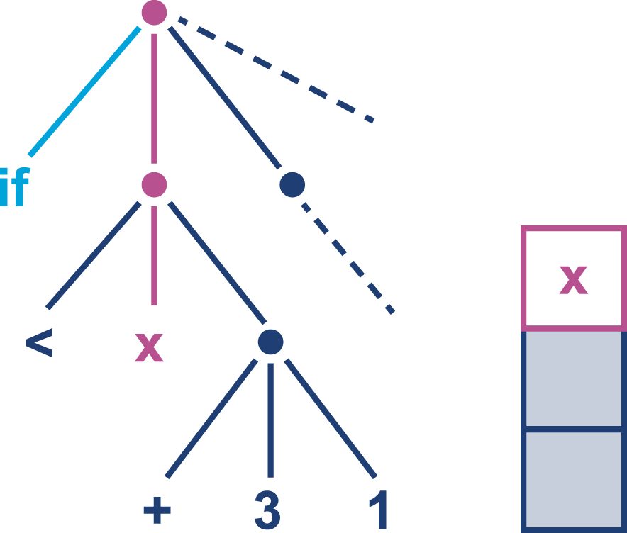
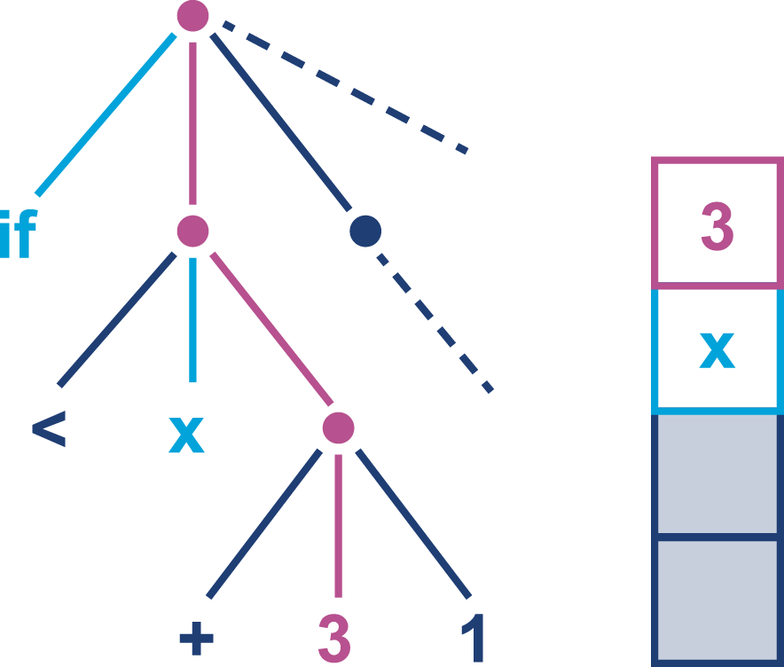
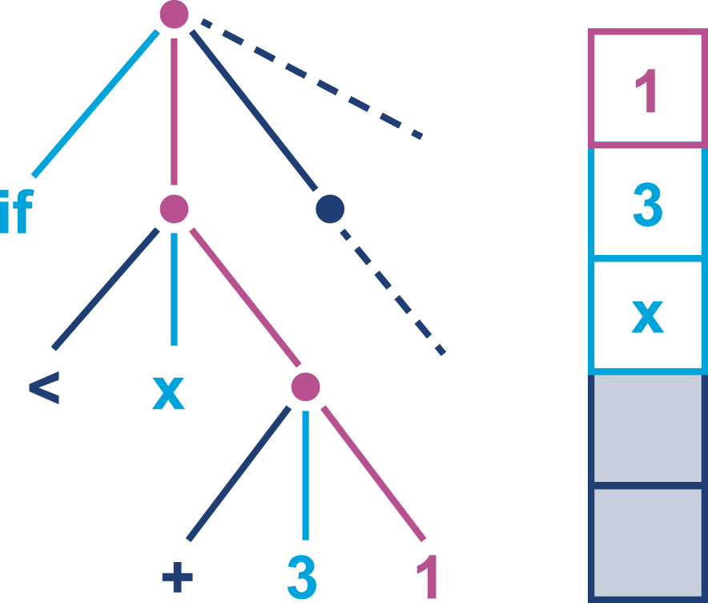
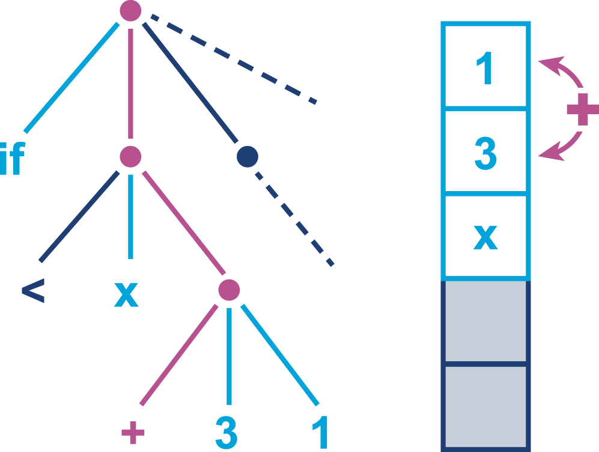
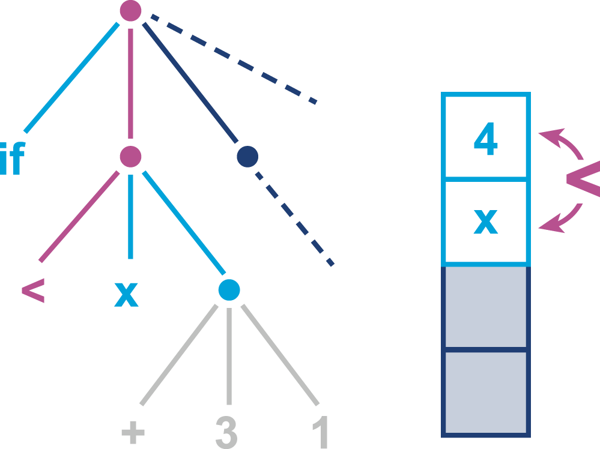
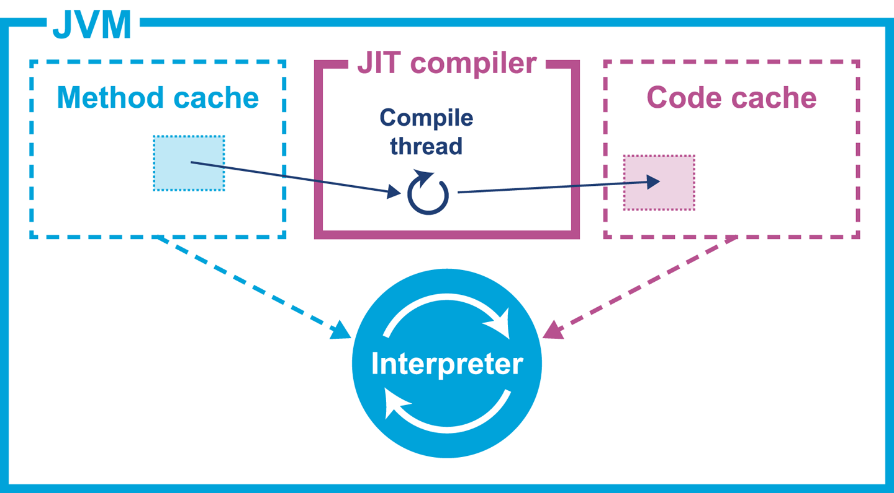

### Chapter 9: Code Execution on the JVM - Summary

This chapter explores the second primary service of the JVM: code execution. It begins by explaining the fundamentals of the JVM as a **stack-based interpreter** for platform-independent **bytecode**. The chapter provides a detailed overview of the major bytecode categories (load/store, arithmetic, flow control, method invocation), explaining how Java source code constructs are represented at the VM level. A key focus is the `invoke` family of opcodes, culminating in an explanation of `invokedynamic`, which was introduced in Java 7 and is now crucial for implementing modern language features like lambdas.

The chapter then contrasts simple interpreter designs with the sophisticated **template interpreter** used by HotSpot, which includes private, VM-specific bytecodes for optimization. The core of the chapter is a deep dive into **Just-in-Time (JIT) compilation**, the mechanism that gives Java its high performance. It compares the **Ahead-of-Time (AOT)** compilation model (used by C/C++) with HotSpot's **Profile-Guided Optimization (PGO)** approach, arguing that JIT's ability to use live runtime data allows for superior optimizations that are impossible for an AOT compiler.

Finally, it details the specifics of HotSpot's JIT implementation, including its two compilers (**C1** and **C2**), the **tiered compilation** model that uses both, the **code cache** where compiled native code is stored, and the mechanism of **pointer swizzling** to activate compiled code. The chapter concludes with a simple, effective strategy for JIT tuning: ensure the code cache is large enough that the JIT compiler never runs out of space and stops compiling hot methods.

---

### Overview of Bytecode Interpretation

The JVM executes bytecode using a stack-based model, not a register-based one like a physical CPU.
*   **Data Areas:**
    1.  **Evaluation Stack:** A per-method stack for holding intermediate values for computation.
    2.  **Local Variables:** A per-method array for storing temporary results.
    3.  **Object Heap:** The shared memory area for all objects.
*   **Execution Flow:** Opcodes manipulate values on the evaluation stack. For example, to compute `x == (3 + 1)`, the values `x`, `3`, and `1` are pushed onto the stack, `iadd` replaces `3` and `1` with `4`, and `if_icmp` compares `x` and `4`.







---

### Introduction to JVM Bytecode

Each operation for the stack machine is a 1-byte opcode, hence the name **bytecode**.
*   **Typed Instructions:** Instructions are typed (e.g., `iadd` for integers, `dadd` for doubles).
*   **Big-Endian:** Bytecode is big-endian for platform portability.
*   **Opcode Categories:**

Some opcode families, such as load, have shortcut forms. This allows the argument to be omitted, which saves the cost of the argument bytes in the class file. In particular, aload_0 puts the current object (i.e., this) on the top of the stack. As that is such a common operation, this results in a considerable savings in class file size.

c1 indicates a 2-byte constant pool index, whereas i1 indicates a local variable in the current method. The parentheses indicate that the family has some opcodes that are shortcut forms.


**Table 9-1. Load and store category**

| Family name | Arguments | Description                                      |
| ----------- | --------- | ------------------------------------------------ |
| `load`      | (i1)      | Loads value from local variable onto the stack.  |
| `store`     | (i1)      | Stores top of stack into local variable.         |
| `ldc`       | c1        | Loads value from constant pool onto the stack.   |
| `const`     |           | Loads simple constant (`null`, `0`, `-1`) onto the stack. |
| `getfield`  | c1        | Loads a field value from an object onto the stack. |
| `putfield`  | c1        | Stores a value from the stack into an object field. |

The ldc bytecode loads a constant from the constant pool of the current class. This holds strings, primitive constants, class literals, and other (internal) constants needed for the program to run.⁠1

The const opcodes, on the other hand, take no parameters and are concerned with loading a finite number of true constants, such as aconst_null, dconst_0, and iconst_m1 (the latter of which loads -1 as an int).

**Table 9-2. Arithmetic category**

| Family name | Description                                  |
| ----------- | -------------------------------------------- |
| `add`       | Adds top two values from stack.              |
| `sub`       | Subtracts top two values from stack.         |
| `(cast)`    | Casts value at top of stack to a new type.   |

**Table 9-3. Flow control category**

| Family name | Arguments | Description                             |
| ----------- | --------- | --------------------------------------- |
| `if`        | (i1)      | Conditional branch.                     |
| `goto`      | i1        | Unconditional branch.                   |

**Table 9-4. Method invocation category**

| Opcode name       | Description                                                 |
| ----------------- | ----------------------------------------------------------- |
| `invokevirtual`   | Standard virtual dispatch for instance methods.             |
| `invokespecial`   | "Special" dispatch for private methods, constructors, `super` calls. |
| `invokeinterface` | Dispatch for methods on an interface reference.             |
| `invokestatic`    | Dispatch for `static` methods.                               |
| `invokedynamic`   | Dynamically looks up and executes a method (used for lambdas). |

JVM bytecode uses some specialist terminology; we speak of a call site, which is a place within a method (the caller) where another method (the callee) is called. Not only that, but in the case of a nonstatic method call, there is always some object that we resolve the method upon

**Table 9-5. Platform opcodes category**

| Opcode name    | Description                            |
| -------------- | -------------------------------------- |
| `new`          | Allocates space for an object.         |
| `newarray`     | Allocates space for a primitive array. |
| `monitorenter` | Locks an object's monitor.             |
| `monitorexit`  | Unlocks an object's monitor.           |

#### `invokedynamic` and Lambdas
Java 8+ uses `invokedynamic` to implement lambda expressions. Instead of generating an anonymous inner class at compile time, `javac` emits an `invokedynamic` instruction. At runtime, this instruction calls a bootstrap method that creates the lambda object on the fly.

```java
// Trivial lambda expression
public class LambdaExample {
    private static final String HELLO = "Hello";
    public static void main(String[] args) throws Exception {
        Runnable r = () -> System.out.println(HELLO);
        Thread t = new Thread(r);
        t.start();
        t.join();
    }
}

// Disassembled bytecode for main()
// The lambda is created by the invokedynamic call at line 0.
public static void main(java.lang.String[]) throws java.lang.Exception;
  Code:
     0: invokedynamic #2,  0  // InvokeDynamic #0:run:()Ljava/lang/Runnable;
     5: astore_1
     6: new           #3      // class java/lang/Thread
     9: dup
    10: aload_1
    11: invokespecial #4      // Method java/lang/Thread.
                              //          "<init>":(Ljava/lang/Runnable;)V
    14: astore_2
    15: aload_2
    16: invokevirtual #5      // Method java/lang/Thread.start:()V
    19: aload_2
    20: invokevirtual #6      // Method java/lang/Thread.join:()V
    23: return
```

---

### HotSpot-Specific Details

HotSpot's interpreter is a sophisticated **template interpreter**, not a simple `while-switch` loop. It is built dynamically at startup and uses a significant amount of assembly code for performance.
*   **Private Bytecodes:** HotSpot uses internal, non-standard bytecodes to handle special cases efficiently.
*   **`final` methods:** `javac` compiles calls to `final` methods as `invokevirtual`, not `invokespecial`. This is to maintain binary compatibility and the Liskov Substitution Principle if the `final` keyword is later removed. The HotSpot interpreter, however, can use a private, faster bytecode for the dispatch because it knows at runtime that the method cannot be overridden.

---

### AOT and JIT Compilation

*   **AOT (Ahead-of-Time) Compilation:** (e.g., C, C++)
    *   **Pros:** Simple to understand; no startup overhead.
    *   **Cons:** A single chance to optimize. The compiler has no knowledge of the runtime environment, so it must make conservative choices, often leaving performance on the table. Binaries are platform-specific.
*   **JIT (Just-in-Time) Compilation:** (e.g., HotSpot)
    * A method need to pass some invocations threshold to be compiled
    *   **Pros:** Uses **Profile-Guided Optimization (PGO)** to analyze the code *as it runs* and makes highly aggressive, speculative optimizations based on live data. Can adapt to new hardware without recompiling source.
    *   **Cons:** Incurs a "warmup" period of lower performance at application startup. Consumes CPU and memory for profiling and compilation.

HotSpot discards all profiling data at shutdown, requiring a fresh warmup on every application start. This is a deliberate design choice, as application behavior can vary dramatically between runs (e.g., on a high-traffic trading day vs. a quiet one), making saved profiles potentially suboptimal.

Targeting processor-specific features during AOT compilation will produce an executable that is compatible only with that processor. This can be a useful technique for low-latency or extreme performance use cases; building on the exact same hardware as the application will run on ensures that the compiler can take advantage of all available processor optimizations.

---

### HotSpot JIT Basics

*   **Unit of Compilation:** The JIT compiles whole methods. For hot loops within cold methods, it uses **On-Stack Replacement (OSR)**.
*   **Pointer Swizzling:** When a method is compiled, the JIT updates the entry in the class's vtable to point from the interpreter entry to the new native code. This is called "pointer swizzling." New calls will use the compiled version.
    
*   **Logging JIT Activity:**
    *   `-XX:+PrintCompilation`: Prints a line to standard out for each compilation event, showing what was compiled and when.
    *   `-XX:+UnlockDiagnosticVMOptions -XX:+LogCompilation`: Produces a verbose XML log (`hotspot.log`) with deep details about compilation decisions. This can be analyzed with tools like JITWatch.

#### Compilers Within HotSpot: C1 and C2
HotSpot has two JIT compilers:
*   **C1 (Client Compiler):** Compiles quickly but performs fewer, simpler optimizations.
*   **C2 (Server Compiler):** Takes longer to compile but produces highly optimized native code.

The compilation process proceeds by first creating an internal representation of the method. Next, optimizations are applied that take into account profiling information that has been collected during the interpreted phase.

#### Tiered Compilation
Since Java 6, HotSpot uses a multi-level tiered compilation model (default since Java 8) to get the best of both worlds.
*   **Execution Levels:**
    *   Level 0: Interpreter
    *   Level 1-3: Various levels of C1 compilation with different amounts of profiling.
    *   Level 4: C2 compilation.
*   **Typical Pathway:** A method starts in the interpreter (Level 0), gets C1-compiled with full profiling (Level 3), and finally, if it's very hot, gets C2-compiled (Level 4). This provides quick initial speedup from C1 while C2 works on the ultimate optimization in the background.

**Table 9-6. Compilation pathways**

| Pathway   | Description                                                     |
| --------- | --------------------------------------------------------------- |
| `0-3-4`   | Standard: Interpreter -> C1 with full profiling -> C2           |
| `0-2-3-4` | C2 is busy, so method gets a quick C1 compile first, then full C1, then C2. |
| `0-3-1`   | The method is identified as "trivial" and C2 would offer no benefit. |
| `0-4`     | Tiered compilation is off; method goes straight from interpreter to C2. |

---

### The Code Cache

Compiled native code is stored in a fixed-size memory area called the **code cache**.
*   **Exhaustion:** If the code cache fills up, the JIT compiler stops, a warning is printed to the console, and any further hot methods will run in the slow interpreter for the lifetime of the application.
*   **Tuning:** The size is controlled by `-XX:ReservedCodeCacheSize`. The default in Java 8 is 240MB with tiered compilation enabled.
*   **Fragmentation:** In Java 8 and earlier, the code cache could become fragmented as C1-compiled methods were replaced by C2-compiled ones, potentially leading to premature exhaustion even if total free space was available.

The code cache is implemented as a heap containing an unallocated region and a linked list of freed blocks. Each time native code is removed, its block is added to the free list. A process called the sweeper is responsible for recycling blocks.

When a new native method is to be stored, the free list is searched for a block large enough to store the compiled code. If none is found, then subject to the code cache having sufficient free space, a new block will be created from the unallocated space.

Native code can be removed from the code cache when:
* It is deoptimized (an assumption underpinning a speculative optimization turned out to be false).
* It is replaced with another compiled version (in the case of tiered compilation).
* The class containing the method is unloaded.

#### Simple JIT Tuning Strategy
The simplest and most effective tuning is to ensure the code cache never fills up.
1.  Run the application with `-XX:+PrintCompilation`.
2.  Monitor the output or check the logs for the message "CodeCache is full. The compiler has been disabled."
3.  If the cache is full, increase its size with `-XX:ReservedCodeCacheSize=<n>`.
4.  Rerun and confirm that more methods are being compiled and the "full" message is gone.

---

### Actionable Tips from Chapter 9

> **1. Don't Worry About Bytecode Details.** Understand the concepts, but trust `javac` and the JIT to handle the specifics. The mapping from Java code to bytecode is a stable, well-understood process.

> **2. Be Aware of `invokedynamic`.** Recognize that modern Java features like lambdas and string concatenation are no longer simple compile-time transformations but rely on this powerful runtime mechanism.

> **3. Embrace Profile-Guided Optimization.** Understand that JIT compilation's power comes from its ability to observe the application at runtime. This means performance is dynamic, and a "warmup" period is an inherent and necessary part of the execution model.

> **4. Monitor JIT Compilation.** Use `-XX:+PrintCompilation` as a simple, standard way to see what your application is spending time compiling. This is the first step in any JIT-related investigation.

> **5. Ensure the Code Cache Is Never Full.** This is the most critical and basic aspect of JIT tuning. A full code cache means performance will fall off a cliff. Give it enough space so the compiler can always do its job.

> **6. Understand Tiered Compilation.** Know that a method's performance can change over time as it moves up the compilation tiers from interpreted to C1 to C2. This is normal and expected behavior.
