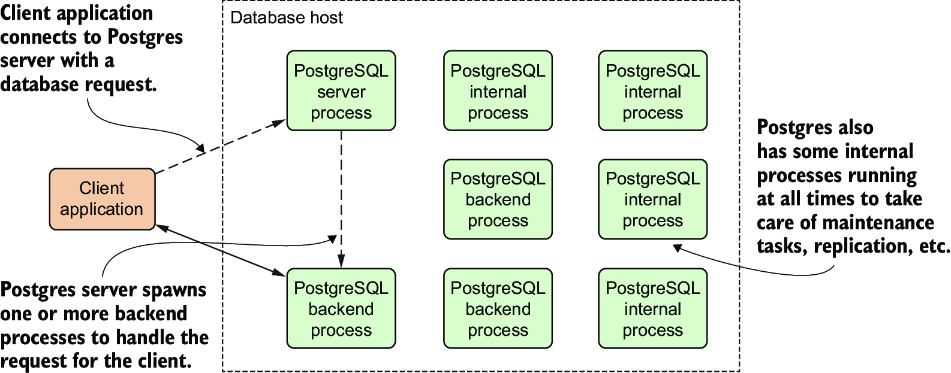

Something useful to always keep in mind is that PostgreSQL is a client-server and multiprocess database management system. Consequently, any client application connects to the database server (or Postgres server) running inside a single host to run queries and retrieve data. This connection is handled by one or more Postgres backend processes running inside the server. Postgres includes other internal processes that may not directly interact with the client. The multiprocess design allows parallelization and utilization of all available CPUs but behaves in some ways that are different from multithreaded database systems. Figure 1.1 shows what this model looks like

