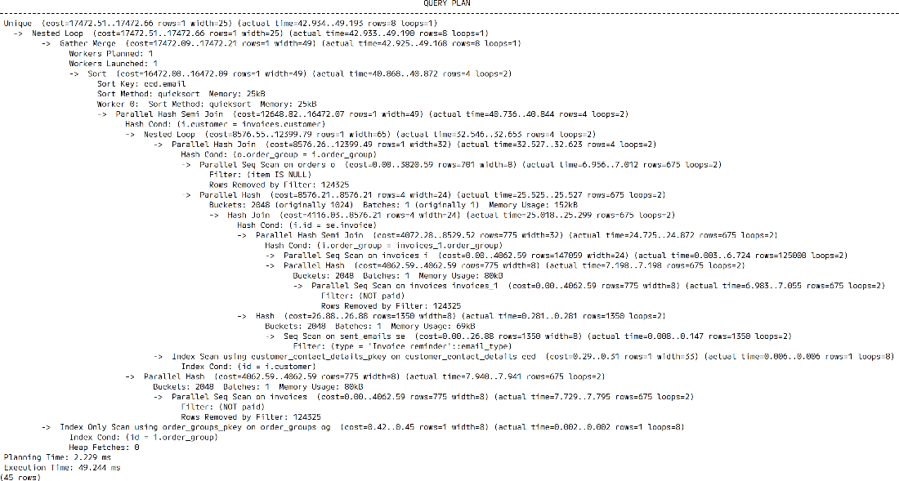
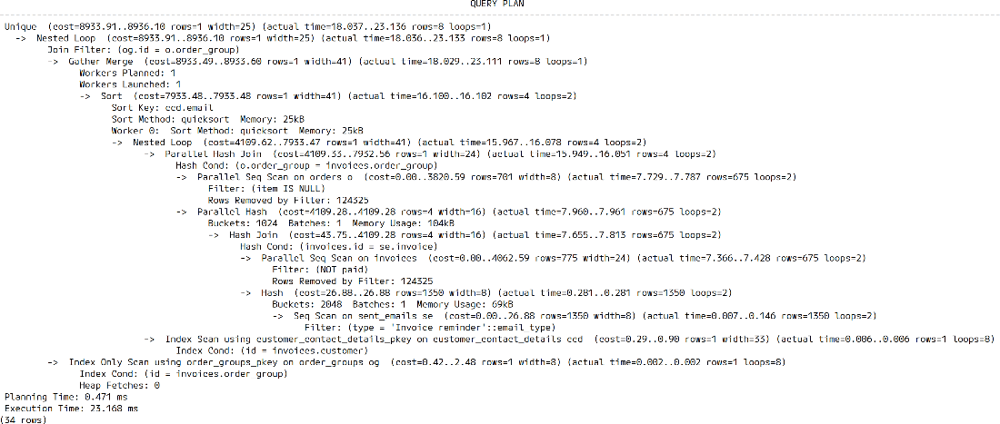

# Chapter 8: Avoiding SQL Pitfalls

---

## 2. Bad SQL Usage

Let's begin our journey into the land of PostgreSQL mistakes. This chapter covers:
*   Avoiding SQL pitfalls
*   Exercising due care with your query results
*   Improving performance of complex queries
*   Checking your queries for correctness

Postgres is very particular about the way it wants queries to be written and follows a strict interpretation of the SQL Standard. As a result, you need to be careful about the way you construct those queries.

### 2.1 Using `NOT IN` to Exclude
Often we need to specify a condition with a negative expression using `NOT`.
*   **Predicate**: A conditional expression that resolves to `TRUE` or `FALSE` (e.g., in a `WHERE` clause).
*   **`NOT IN`**: Useful for excluding a small list of values.

#### Example: Basic Usage
```sql
SELECT * FROM (VALUES ('Harper', 'salesperson'), 
                      ('Parker', 'driver'), 
                      ('Skyler', 'manager')) AS t(name, job)
WHERE job NOT IN ('manager');
-- Result: Harper (salesperson), Parker (driver)
```

### The `NOT IN` Trap with `NULL`
Suppose we want to find customers in states where we **do not** have a supplier.
*   **Customer Table**: Has customers in 'NY', 'KS'.
*   **Supplier Table**: Has suppliers in 'MI', 'JP', and one with `NULL` state.

**The Naive Query**:
```sql
SELECT email 
FROM erp.customer_contact_details 
WHERE state NOT IN (SELECT state FROM erp.suppliers);
```
**Result**: `0 rows`. (Unexpected!)

**Why?**
*   If the subquery returns even **one** `NULL` value, the predicate `state NOT IN (..., NULL)` becomes "Unknown".
*   Logic: `NOT (state IN ('MI', NULL))` -> `NOT (state = 'MI' OR state = NULL)`.
*   Since `state = NULL` is "Unknown", the whole expression is "Unknown", effectively False for the `WHERE` clause.
*   **Rule**: `NOT IN` can **never** return `TRUE` if the list contains a `NULL`.

### 2.1.1 Performance Implications
Queries using `NOT IN (SELECT ...)` are historically hard to optimize for Postgres.
*   It often creates a **Hashed Subplan** (good for small sets) or a **Plain Subplan** (very slow O(N*M)).
*   It **cannot** easily be converted into an **Anti-Join** by the optimizer in all cases.

### 2.1.2 The Alternative: `NOT EXISTS` or `LEFT JOIN / IS NULL`
To safely and efficiently exclude rows, use `NOT EXISTS`. This handles `NULL`s intuitively (they just don't match) and allows the optimizer to use an **Anti-Join**.

**Correct Query**:
```sql
SELECT ccd.email
FROM erp.customer_contact_details ccd
WHERE NOT EXISTS (
    SELECT 1 FROM erp.suppliers s 
    WHERE ccd.state = s.state
)
AND ccd.state IS NOT NULL;
```
**Result**: Correct list of emails.

### 2.1.3 Understanding Anti-Joins
**What is an Anti-Join?**
An **Anti-Join** is a relational algebra operation that returns rows from the left table (`A`) that match **no rows** in the right table (`B`).
*   It is the optimization strategy used for `NOT EXISTS` and `LEFT JOIN ... WHERE NULL` queries.
*   In Execution Plans, you will see it as `Hash Anti Join` or `Merge Anti Join`.

**Execution Plan**:
```text
Hash Anti Join  (cost=19.45..319.48 rows=2 width=25)
  Hash Cond: (ccd.state = s.state)
  -> Seq Scan on customer_contact_details ccd
  -> Hash
     -> Seq Scan on suppliers s
```
*   **Benefit**: The plan uses a **Hash Anti Join**, which is significantly faster and semantically correct even if the subquery source has NULLs.

**Alternative (Left Join)**:
```sql
SELECT ccd.email
FROM erp.customer_contact_details ccd
LEFT JOIN erp.suppliers s USING (state)
WHERE s.state IS NULL;
```

> **Takeaway**: Be extremely careful with `NOT IN` when the subquery might return `NULL`. Prefer `NOT EXISTS` for better correctness and performance.

### 2.2 Selecting Ranges with `BETWEEN`

`BETWEEN` is a convenient SQL shorthand for selecting a range of values.
*   **Syntax**: `WHERE col BETWEEN x AND y`
*   **Meaning**: `WHERE col >= x AND col <= y`

**Example**:
```sql
SELECT * FROM erp.customers WHERE id BETWEEN 1 AND 100;
-- Returns IDs 1 through 100 (Inclusive).
```

### The Inclusivity Trap (Closed Intervals)
The fact that `BETWEEN` is **inclusive** on both ends (a **Closed Interval**) can lead to double-counting, especially with **Timestamps**.

**Scenario**:
We want to calculate total payments for "Yesterday".
*   Current Date: 2024-05-28
*   Yesterday Start: 2024-05-27 00:00:00
*   Today Start: 2024-05-28 00:00:00

**The Bad Query**:
```sql
WITH t(today) AS (SELECT CURRENT_DATE::timestamptz)
SELECT sum(amount)
FROM erp.payments, t
WHERE tstamp BETWEEN t.today - INTERVAL '1 day' AND t.today;
```

**The Problem**:
*   The query selects records where `tstamp` is `>= 2024-05-27 00:00:00` **AND** `<= 2024-05-28 00:00:00`.
*   A payment made exactly at midnight on `2024-05-28 00:00:00` will be included in "Yesterday's" total.
*   If we run a similar query for "Today", that same midnight payment will be included **again**.

**Proof**:
```sql
-- Max timestamp from "Yesterday" query:
2024-05-28 00:00:00+01

-- Min timestamp from "Today" query:
2024-05-28 00:00:00+01
```
*   **Result**: The same row is counted twice!

### The Solution: Explicit Ranges `[)`
To avoid overlapping, use **Half-Open Intervals** (Inclusive Start, Exclusive End).
*   **Logic**: `Start <= x < End`

**The Correct Query**:
```sql
WITH t(today) AS (SELECT CURRENT_DATE::timestamptz)
SELECT sum(amount)
FROM erp.payments, t
WHERE tstamp >= t.today - INTERVAL '1 day' -- Inclusive
  AND tstamp < t.today;                    -- Exclusive (No Equals)
```

**Verification**:
*   **Bad Query Count**: 86401 rows (Double counts midnight).
*   **Correct Query Count**: 86400 rows (Clean separation).

> **Takeaway**: Avoid `BETWEEN` for continuous data like Timestamps or Floats where boundaries matter. Use explicit `>=` and `<` operators to define clean, non-overlapping ranges.

### 2.3 Not Using CTEs (Common Table Expressions)
**Common Table Expressions (CTEs)**, or `WITH` syntax, are syntactic sugar that allow you to tidy up complex queries.
*   **Readability**: Breaks massive SQL into digestible, named chunks.
*   **Reuse**: Define once, reference multiple times.

#### The "Unreadable" Query (Nested Joins & Subqueries)
Imagine finding email addresses for customers with unpaid invoices for service orders.
A naive approach might use multiple `JOIN`s mixed with `IN (SELECT ...)` subqueries.

```sql
SELECT DISTINCT email
FROM erp.customer_contact_details ccd
JOIN erp.invoices i ON i.customer = ccd.id
JOIN erp.order_groups og ON i.order_group = og.id
JOIN erp.sent_emails se ON se.invoice = i.id
JOIN erp.orders o ON o.order_group = og.id
WHERE ccd.id IN (SELECT customer FROM erp.invoices WHERE paid = false)
  AND i.order_group IN (SELECT order_group FROM erp.invoices WHERE paid = false)
  AND se.email_type = 'Invoice reminder'
  AND o.item IS NULL;
```
*   **Problem**: Hard to read, hard to debug, and potentially harder for the optimizer to execute efficiently due to repeated subquery logic.
*   **Execution**: Often results in a complex plan that effectively repeats work.



#### The "Clean" Query (Using CTEs)
We can rewrite this by isolating the logic into two named parts: `unp` (Unpaid Invoices) and `ni` (No Items/Services).

```sql
WITH 
unp AS (
    -- Unpaid Invoices
    SELECT id, customer c, order_group AS og
    FROM erp.invoices
    WHERE paid = false
),
ni AS (
    -- Service Orders (Item IS NULL)
    SELECT og.id
    FROM erp.order_groups og
    JOIN erp.orders o ON o.order_group = og.id
    WHERE o.item IS NULL
)
SELECT DISTINCT email
FROM erp.customer_contact_details ccd
JOIN unp ON unp.c = ccd.id
JOIN ni ON ni.id = unp.og
JOIN erp.sent_emails se ON se.invoice = unp.id
AND se.email_type = 'Invoice reminder';
```
*   **Result**: The main query is now just a simple series of joins between named logical blocks.
*   **Optimization**: Postgres **Inlines** the CTEs (merges them into the main query plan) to find the optimal join order. By applying filters early (low selectivity), it improves performance.



#### Advanced: `MATERIALIZED` CTEs
Sometimes you want to force Postgres to calculate a CTE once and store the result, preventing it from inlining logic repeatedly.
*   **Syntax**: `WITH cte_name AS MATERIALIZED (...)`
*   **Use Case**: Expensive functions or calculations that are reused multiple times in the main query.

> **Warning**: Do not name CTEs the same as existing tables! The CTE name overrides the table name within the query scope, completely hiding the original table.

### 2.4 Using Uppercase Identifiers
By default, PostgreSQL **lowercases** every identifier. `SELECT * FROM Customers` searches for a table named `customers`.
*   **Habit**: Users from other databases (Oracle, SQL Server) often use `UPPER_CASE` or `CamelCase`.
*   **Result**: Postgres silently converts it to `lower_case`... unless you use quotes.

#### The Problem: Quoted Identifiers (`"Table"`)
If you force strict casing by using double quotes, you create **Case-Sensitive** identifiers. This causes a permanent usability headache.

**Example**:
```sql
CREATE TABLE "Invoices" (
    "Invoice ID" bigint GENERATED ALWAYS AS IDENTITY,
    "Amount" numeric
);
```
Now, you **MUST** always quote it exactly like that.
```sql
SELECT count(amount) FROM Invoices;       -- ERROR: relation "invoices" does not exist
SELECT count("Amount") FROM "Invoices";   -- Works
```

#### Best Practice
1.  **Avoid Quoted Identifiers**: Stick to `snake_case` (lowercase with underscores) for all tables and columns. It effectively makes SQL case-insensitive.
2.  **Use Aliases for Reports**: If business users want "Entry Date" instead of `entry_date`, use aliases in the query, not the schema.

```sql
SELECT 
    reconc_amt AS "Reconciliation Amount", 
    entry_date AS "Entry Date"
FROM financials;
```
> **Rule**: Don't pollute your database schema with presentation concerns (formatting). Keep the schema clean (snake_case) and format the output using aliases.

### 2.5 Dividing INTEGERs
Integer division in SQL can be tricky because it **truncates** the result towards zero.
*   **Math**: `10 / 4 = 2.5`
*   **SQL (Integer)**: `10 / 4 = 2`

#### The Problem: Zero Results
If you try to calculate a percentage by dividing a part by a total (where part < total), the result is always 0.
```sql
-- Integer Division
SELECT 248650 / 250000;
-- Result: 0 (Truncated from 0.9946)
```

#### The Solution: Casting to Float/Numeric
To get fractional results, at least **one** operand must be a floating-point type. Postgres will then automatically cast the other.
```sql
SELECT 
    10 / 4 AS "Integer",                  -- 2
    10::float / 4 AS "Float",             -- 2.5
    10 / 4::numeric AS "Numeric";         -- 2.5000...
```

**Correct Percentage Query**:
```sql
SELECT 
   round((part::numeric / total * 100), 1) AS "Percent"
FROM data;
```

#### Handling Division by Zero
Dividing by zero causes an error: `ERROR: division by zero`.
*   **Fix**: Use `NULLIF` to turn the zero into `NULL`. `x / NULL` yields `NULL`, avoiding the crash.

```sql
SELECT 10 / NULLIF(zero_count, 0)
FROM table;
```
*   **Advanced**: Use `COALESCE` to default the result if it becomes NULL.
    *   `COALESCE(10 / NULLIF(val, 0), 0)` -> Returns 0 instead of crashing or returning NULL.

> **Takeaway**: Always cast one side of a division to `float` or `numeric` if you want decimals. Guard against zero denominators with `NULLIF`.

### 2.6 COUNTing NULL Values
A classic mistake when aggregating data is confusing `count(*)` with `count(column_name)`.
*   **`count(*)`**: Counts **all rows**, regardless of content (including NULLs).
*   **`count(column)`**: Counts only rows where `column` is **NOT NULL**.

#### The Pitfall: Accidental Undercounting
Suppose we want to count total orders. Some are for **items** (physical goods), others are for **services** (where `item` is NULL).

**The Wrong Query**:
```sql
SELECT count(item) FROM erp.orders;
-- Result: 198,908
```
*   **Why?** It ignores all service-only orders where `item` is NULL.

**The Correct Query**:
```sql
SELECT count(*) FROM erp.orders;
-- Result: 200,000
```
*   **Why?** It counts every row in the table, giving the true total.

#### The Trick: Intentional Null Counting
You can exploit this behavior to calculate the percentage of rows that have a value in a specific column without a `WHERE` clause.

**Example: Permission Frequency**
Calculate percentage of orders that are for **Services**.

```sql
SELECT 
    round(count(service)::numeric / count(*)::numeric * 100, 1) AS "Service %"
FROM erp.orders;
```
*   `count(service)`: Counts only rows with a service (non-Null).
*   `count(*)`: Counts everything.
*   **Result**: `0.5%` (Correctly ignores item-only orders in the numerator but includes them in the denominator).

### 2.7 Querying Indexed Columns with Expressions
A major performance killer is "hiding" an indexed column inside a function call or expression within the `WHERE` clause. This makes the condition **Non-SARGable** (Search ARGument ABLE), preventing the use of the index.

#### The Problem: Index Blindness
Imagine you have an index on `payments(tstamp)`.

**Super Fast Query (Index Scan)**:
```sql
SELECT * FROM erp.payments WHERE tstamp = '2023-10-18 03:40:34';
```
*   **Plan**: `Index Scan`. Fast and direct.

**Slow Query (Seq Scan)**:
We want to find all payments within a specific *second*, so we round the column.
```sql
SELECT * FROM erp.payments 
WHERE date_trunc('s', tstamp) = '2023-10-18 03:40:34';
```
*   **Plan**: `Seq Scan` (Full Table Scan).
*   **Why?** The index stores raw `tstamp` values. It does not store `date_trunc('s', tstamp)`. Postgres must calculate the function for **every row** in the table to see if it matches.

#### Solution 1: Rewrite the Predicate (Range Query)
Move the transformation to the *right* side of the operator (the user input), leaving the indexed column "naked" on the left.

```sql
SELECT * FROM erp.payments
WHERE tstamp >= '2023-10-18 03:40:34'
  AND tstamp <  '2023-10-18 03:40:34'::timestamptz + INTERVAL '1 second';
```
*   **Plan**: `Index Scan`.
*   **Benefit**: Postgres can now search the index for the range.

#### Solution 2: Functional Indexes
If you frequently query by a specific logic (e.g., "all payments in a minute"), create an index for *that expression*.

```sql
CREATE INDEX idx_payments_minute 
ON erp.payments ( date_trunc('m', tstamp AT TIME ZONE 'UTC+1') );
```

**Query**:
```sql
SELECT * FROM erp.payments
WHERE date_trunc('m', tstamp AT TIME ZONE 'UTC+1') = '2023-10-18 03:40' AT TIME ZONE 'UTC+1';
```
*   **Warning**: This index is **only** used if the query matches the expression **exactly**. It is less flexible than a standard column index.

> **Rule**: Keep indexed columns "naked" in your `WHERE` clauses. Reformulate your logic to compare Ranges vs. Transformations.

### 2.8 Upserting NULLs in a Composite Unique Key
An **Upsert** (`INSERT ... ON CONFLICT DO UPDATE`) requires a **unique index** (or constraint) to detect the conflict.
Problems arise when that unique key is **Composite** (multiple columns) and includes `NULL` values.

#### The Problem: NULLs are Unique snowflakes
In SQL, `NULL != NULL`.
*   Standard Unique Index: `(product_id, warehouse_id, area)`
*   Row 1: `(99, 1, NULL)`
*   Row 2: `(99, 1, NULL)`
*   **Result**: Postgres treats these as **distinct rows**.
*   **Consequence**: The Upsert fails to detect a conflict and inserts a **Duplicate Row** instead of updating the existing one.

**Example Failure**:
```sql
INSERT INTO inventory (id, warehouse, area, qty) VALUES (99, 1, NULL, 5)
ON CONFLICT (id, warehouse, area) DO UPDATE ...;
-- Result: INSERT 0 1 (Creates first row)

INSERT INTO inventory (id, warehouse, area, qty) VALUES (99, 1, NULL, 7)
ON CONFLICT (id, warehouse, area) DO UPDATE ...;
-- Result: INSERT 0 1 (Creates SECOND row! Valid conflict not detected)
```

#### The Solution (Postgres 15+): `NULLS NOT DISTINCT`
Postgres 15 introduced a clause for indexes to treat `NULL`s as equal for uniqueness purposes.

```sql
CREATE UNIQUE INDEX idx_inventory_unique 
ON inventory (product_id, warehouse_id, area)
NULLS NOT DISTINCT;
```

**With this Index**:
*   Row 1: `(99, 1, NULL)`
*   Incoming Row: `(99, 1, NULL)`
*   **Result**: Conflict Detected! The Upsert `DO UPDATE` clause fires correctly.

> **Takeaway**: If your unique keys must allow NULLs (e.g., for "Default Area"), strictly use `NULLS NOT DISTINCT` to ensure data integrity and correct Upsert behavior. Ideally, avoid NULLs in keys by using sentinel values (e.g., 'common_area').

### 2.9 Selecting and Fetching All Data (`SELECT *`)
One of the most common (and costly) habits is using `SELECT *` when you only need a specific column (e.g., an ID).
**The Cost**:
1.  **Database**: Reads more data from disk (Heap fetches).
2.  **Network**: Transfers unnecessary bytes.
3.  **Application**: Marshals/Deserializes objects you immediately discard.

#### Benchmark: SELECT * vs SELECT id
Using Python (`psycopg`) to fetch 10,000 rows.

**1. Fetching Everything (`*`)**
```python
cur.execute("SELECT * FROM tickets WHERE status = 10")
# Result: 0.24 seconds
```

**2. Fetching Only What is Needed (`id`)**
```python
cur.execute("SELECT id FROM tickets WHERE status = 10")
# Result: 0.09 seconds
```
*   **Result**: Fetching only the ID is **>2.5x faster**.

#### The "App-Side Filtering" Disaster
A worse pattern seen in the wild is fetching the **entire table** and filtering in code "to avoid writing SQL".
```python
# DON'T DO THIS
cur.execute("SELECT * FROM tickets") # Fetch 1M rows
for row in cur:
    if row['status'] == 10: ...      # Filter in Python
# Result: 6 minutes 41 seconds
```
> **Rule**: Use the database for what it's good at: **Filtering** and **Retrieval**. Postgres optimization is 30 years ahead of your `if` statement.

#### Optimization: Index-Only Scans
There is a deeper database reason to avoid `SELECT *`.

*   **Scenario**: You have an index on `tickets(status, id)`.
*   **Query 1**: `SELECT id FROM tickets WHERE status = 10`
    *   **Plan**: **Index-Only Scan**. The DB reads *only* the index. It never touches the Table (Heap). **Extremely Fast.**
*   **Query 2**: `SELECT * FROM tickets WHERE status = 10`
    *   **Plan**: **Index Scan**. The DB uses the index to find the row, *then* jumps to the Table (Heap) to fetch the other columns (`description`, `date`, etc.). **Slower.**

> **Takeaway**: Only SELECT what you need. It reduces network IO and unlocks powerful optimizations like **Index-Only Scans**.

### 2.10 Not Taking Advantage of Checkers, Linters, or LLMs
Modern tools can catch errors before they hit production. Relying solely on your own eyes is effectively working without a safety net.

#### 2.10.1 Static Analysis Tools (Linters)

**1. SQLFluff (The Formatter/Linter)**
*   **Role**: Enforces style guides (indentation, casing) and catches syntax errors.
*   **Usage**:
    ```bash
    $ pip install sqlfluff
    $ sqlfluff lint test.sql --dialect postgres
    ```
*   **Catchable Errors**: Trailing whitespace, bad indentation, missing spaces around operators.

**2. plpgsql_check (The Logic Checker)**
*   **Role**: Analyzes PL/pgSQL function bodies for errors that standard `CREATE FUNCTION` checks might miss (like referencing missing columns).
*   **Mechanism**: It uses the Postgres internal parser to validate code paths without executing them.
*   **Example**:
    ```sql
    CREATE EXTENSION plpgsql_check;
    SELECT * FROM plpgsql_check_function_tb('my_function()');
    ```
    *   *Result*: Can report "record 'r' has no field 'c'" even if the function is syntactically valid SQL.

**3. Squawk (The Migration Safety Check)**
*   **Role**: Scans migration files (DDL) for operations that cause locking or downtime issues.
*   **Example Warning**:
    ```text
    warning: require-concurrent-index-creation
    note: Creating an index blocks writes.
    help: Create the index CONCURRENTLY.
    ```
    *   *Value*: Prevents accidental production outages caused by locking tables during updates.

#### 2.10.2 Large Language Models (LLMs)
Generative AI (ChatGPT, Claude, Gemini) can be powerful assistants but require **vigilance**.


**The Good**:
*   Great for brainstorming queries.
*   Quickly generating boilerplate schema definitions.
*   Explaining complex error messages.

**The Bad (Hallucinations)**:
*   **Inaccuracy**: They essentially "predict the next word". They can write SQL that *looks* correct but uses non-existent functions or assumes Foreign Keys that don't exist.
*   **Subtle Bugs**: An LLM might write a query using `NOT IN` (Section 2.1) without warning you about the `NULL` trap.

**The Ugly (Security & poisoning)**:
*   **Data Leakage**: Pasting your proprietary schema into a public chatbot uploads it to a third-party server.
*   **"Poisoning the Well"**: As the web fills with AI-generated content, future models trained on that data may degrade in quality.

> **Takeaway**: Use **Linters** for deterministic correctness and style. Use **LLMs** for inspiration, but **verify everything** they produce. Never paste sensitive production schemas into public AI tools.
