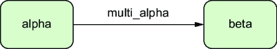
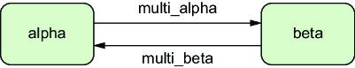

# Chapter 5: Configuration Mistakes

---

## 5. Configuration Mistakes

This chapter covers:
*   Selecting `SQL_ASCII` as the encoding.
*   (More sections to be added).

### 5.1 Selecting `SQL_ASCII` as the encoding
Character encoding defines how text is stored as bytes. A common mistake is using the default `SQL_ASCII` encoding, which acts as a "Wild West" for data.

#### The Problem: What is `SQL_ASCII`?
*   **It is NOT an encoding**: It effectively means "No Encoding".
*   **Behavior**:
    *   Bytes 0-127 are treated as ASCII.
    *   Bytes 128-255 are **ignored** and stored as-is without validation.
*   **The Trap**: It allows you to mix different encodings (e.g., store Greek `windows-1253` in one row and Japanese `shift_jis` in another) without error.
*   **The Crash**: When you try to read this data back, your application (expecting UTF-8) will crash or display "mojibake" (garbled text) because it cannot decode the mixed byte soup.

#### Example Scenario
1.  **Insert**: Python script inserts Greek text (encoded as ISO-8859-7) into `SQL_ASCII` DB. Postgres accepts it blindly.
2.  **Select**: App tries to read it as UTF-8.
    *   `UnicodeDecodeError: 'utf-8' codec can't decode...`
    *   The database cannot help you convert it because it doesn't know what encoding it is stored in!

#### The Solution: Always use `UTF8`
*   **Universal**: `UTF8` supports almost all human languages.
*   **Validation**: Postgres validates that all data entering the DB is valid UTF-8. It rejects invalid byte sequences immediately, preventing corruption.
*   **Conversion**: Postgres can automatically convert client encodings (e.g., a legacy Windows app using `WIN1252`) into `UTF8` storage automatically.

**How to Fix a Legacy DB**:
You cannot change a database's encoding involved. You must **dump and reload**.
1.  Create new DB: `CREATE DATABASE new_db ENCODING 'UTF8';`
2.  Migrate data, converting raw bytes to UTF-8 using `convert_from()` if you know the source encoding.
    ```sql
    -- Example recovering ISO-8859-1 data
    SELECT convert_from(content::bytea, 'ISO-8859-1') ...
    ```

> **Takeaway**: `SQL_ASCII` is dangerous because it disables validation. Always explicitly set `ENCODING 'UTF8'` when creating a database.

### 5.2 CREATE RULE
The PostgreSQL Rule System allows you to define rewrite rules for queries (e.g., "When you try to delete from table A, do nothing instead"). While powerful, `CREATE RULE` is notoriously difficult to get right and often behaves counter-intuitively compared to Triggers.

#### The Trap: Side Effects & Double Execution
Rules do not "execute code"; they **rewrite the SQL query**. This distinction causes bugs when Volatile functions (like `nextval()` or `clock_timestamp()`) are involved.

**Scenario**: You want to log every insert into `audit_log`.
```sql
CREATE RULE log_insert AS ON INSERT TO orders
DO ALSO
INSERT INTO audit_log (id, ...) VALUES (NEW.id, ...);
```

**The Bug**:
*   User runs: `INSERT INTO orders (id) VALUES (nextval('seq'));`
*   Postgres rewrites this into **TWO** queries:
    1.  `INSERT INTO orders (id) VALUES (nextval('seq'));`
    2.  `INSERT INTO audit_log (id) VALUES (nextval('seq'));`
*   **Result**: The `audit_log` records a **different ID** (the next sequence value) than the `orders` table because `nextval()` was called twice!

#### The Trap: "WHERE" Clause Confusion
You try to prevent updates to old orders using a rule:
```sql
CREATE RULE prevent_old_update AS ON UPDATE TO orders
WHERE old.updated_at < now() - interval '1 year'
DO INSTEAD NOTHING;
```

**The Expectation**: "If I update an old row, nothing happens."
**The Reality**: The rule **adds** the condition to your update query.
*   Your Update: `UPDATE orders SET status = 'X' WHERE updated_at < '2024-01-01'`
*   Rewritten Query logic: "Update rows that match the query **AND** do NOT match the rule condition".
*   **Result**: It updates rows that are *moderately* old but not *very* old, which is often logically overlapping and confusing. It does not simply "stop" the query.

#### The Solution: Use TRIGGERS
For almost all business logic (logging, validation, side effects), use **Triggers** (`CREATE TRIGGER`).
*   **Safety**: Triggers execute consistently on the row data *after* values are generated.
*   **Clarity**: Procedural code (`PL/pgSQL`) is easier to debug than query rewriting rules.

#### Function Volatility Labels
Understanding why Rules fail requires understanding Function Volatility. Postgres functions are labeled:

1.  **`VOLATILE`** (e.g., `random()`, `nextval()`, `clock_timestamp()`):
    *   Can do anything, including modifying the DB.
    *   **Rule Behavior**: Re-evaluated at *every* appearance in the rewritten query (hence the double execution bug).
2.  **`STABLE`** (e.g., `now()`, `current_date`):
    *   Cannot modify the DB.
    *   Returns the same result within a single statement.
3.  **`IMMUTABLE`** (e.g., `2 + 2`, `upper()`):
    *   Cannot check the DB.
    *   Always returns the exact same result for the same arguments forever. Critical for Indexes.

> **Takeaway**: Avoid `CREATE RULE`. It is a complex macro system that causes "Heisenbugs" with volatile functions. Use **Triggers** instead. (Exception: Rules are fine for making complex Views writable).

### 5.3 Relational JSON
Since Postgres introduced `JSONB`, developers often dump everything into JSON columns to act like a NoSQL store. This is known as the **"Relational JSON" Anti-Pattern**.

#### The Trap: Using JSON for Relational Data
You create tables like this:
```sql
CREATE TABLE accounts (json_data JSONB);
CREATE TABLE sales (json_data JSONB);
```
And then you try to **JOIN** them:
```sql
SELECT ...
FROM accounts a
JOIN sales s ON (s.json_data->>'account_id')::int = (a.json_data->>'id')::int
```

**Why this fails**:
1.  **No Referential Integrity**: You cannot have Foreign Keys between JSON fields. You effectively lose data consistency guarantees.
2.  **Performance Disaster**:
    *   The optimizer rarely picks efficient nested loops for complex JSON joins.
    *   It often resorts to Merge Joins or Hash Joins that require sorting/hashing massive JSON blobs.
3.  **Ugly Queries**: Casting types (`::int`, `::numeric`) inside JOIN conditions is brittle and unreadable.

#### The Solution: Hybrid Approach
Use Relational Tables for the **Skeleton** (IDs, Foreign Keys, Searchable Fields) and JSONB for the **Flesh** (Attributes).

**Better Design**:
```sql
CREATE TABLE accounts (
    id SERIAL PRIMARY KEY,              -- Relational ID
    name TEXT NOT NULL,                 -- Frequently searched
    data JSONB                          -- Flexible attributes
);

CREATE TABLE sales (
    id SERIAL PRIMARY KEY,
    account_id INT REFERENCES accounts, -- Proper Foreign Key!
    amount NUMERIC NOT NULL,
    data JSONB
);
```

> **Takeaway**: Don't use JSONB to avoid designing a schema. If you need `JOIN`s or `FOREIGN KEY`s, that data **belongs in a column**, not inside a JSON blob. Use JSONB for true semi-structured data (e.g., product attributes, logs) *attached* to relational records.

### 5.4 Putting UUIDs Everywhere
UUIDs (128-bit identifiers) are popular for keys, but blanket usage ("just stick a UUID on everything") comes with heavy costs.

#### The Costs: UUID vs BigInt
Comparing `UUIDv4` vs `BIGINT` (Identity) on 100M rows:

| Metric | BigInt (Serial) | UUID (Random) | Difference |
| :--- | :--- | :--- | :--- |
| **Insert Time** | 01:23 | 06:28 | **367% Slower** |
| **Index Build** | 00:38 | 01:16 | **100% Slower** |
| **Index Size** | 2142 MB | 3008 MB | **40% Bigger** |
| **Key Size** | 8 bytes | 16 bytes | 2x Bigger |

**Why is UUID slower?**
*   **Sequential vs Random**: `BIGINT` appends to the right side of the B-Tree (fast). `UUIDv4` is random, causing insertions all over the B-Tree pages (Page Splitting, severe random I/O, cache thrashing).
*   **TOAST Pressure**: Larger keys mean fewer rows per page, potentially pushing other data to TOAST storage unnecessarily.

#### When to use UUIDs?
1.  **Distributed Systems**: Generating IDs on the client-side without coordinating with the DB (avoiding a central `nextval()` bottleneck).
2.  **Security Obscurity**: Hiding the total number of orders (ID `500` vs ID `9b287...`).

#### The Solution: Use the Right Tool
*   **Default**: Use `BIGINT GENERATED ALWAYS AS IDENTITY`. It is fast, efficient, and ordered.
*   **Distributed**: If you need UUIDs, look at **UUIDv7** (Sortable/Timestamp-based) or **Snowflake IDs**. These maintain locality for index performance while allowing distributed generation.

> **Takeaway**: Don't use UUIDs "just because". They kill Insert/Index performance. Default to `BIGINT`. If distributed IDs are needed, use sortable versions (UUIDv7 or Snowflake) to save your B-Trees.

### 5.5 Homemade Multi-Master Replication
"Can I write to any database node and have it sync everywhere?"
This is the dream of **Multi-Master Replication**. Trying to build it yourself using standard Logical Replication is a nightmare.

#### The Theory: Distributed Systems 101
Before attempting Multi-Master, you must understand the laws of physics governing distributed databases.

**1. The CAP Theorem (Brewer, 1998)**
You can only have **2 out of 3** guarantees:
*   **Consistency (C)**: Every read receives the most recent write or an error.
*   **Availability (A)**: Every request receives a response (even if data is stale).
*   **Partition Tolerance (P)**: The system continues to operate despite network failures (dropping messages between nodes).
*   *Reality Check*: In a distributed database, **P is non-negotiable**. Networks fail. You cannot choose CA. You must choose **CP** (Consistency, but downtime during splits) or **AP** (Uptime, but data drift during splits).

**2. The PACELC Theorem (Abadi, 2010)**
Since network partitions are rare, what happens when the system is running normally?
*   If there is a Partition (**P**), you choose Availability (**A**) or Consistency (**C**).
*   **Else (E)** (Normal operation), you choose Latency (**L**) or Consistency (**C**).
*   *Postgres Context*: Synchronous Replication chooses **Consistency** (wait for ack), sacrificing **Latency** (slower writes). Asynchronous Replication chooses **Latency** (fast writes), sacrificing **Consistency** (potential data loss on crash).

#### Postgres Internals: How Replicas Work
Postgres uses a **Primary-Replica** (Active-Passive) model by default.

**1. The Write-Ahead Log (WAL)**
*   **Concept**: Every change (Insert, Update, Delete) is first written to a sequential append-only log file called the WAL.
*   **Purpose**: Durability. If the server crashes, Postgres replays the WAL to restore the data files to a consistent state.
*   **Replication**: To replicate, the Primary streams this WAL to the Replica. The Replica replays the WAL bytes, effectively mirroring the Primary's disk.

**2. Physical Streaming Replication**
*   **Mechanism**: Streams raw WAL blocks (byte-for-byte copy).
*   **Pros**: Extremely fast, exact clone, simple to setup.
*   **Cons**: Replicas are Read-Only. Cannot replicate a subset of tables. Schema must be identical. Version must be identical.

**3. Logical Replication**
*   **Mechanism**: The "Logical Decoding" plugin reads the WAL and translates it back into logical changes (e.g., "INSERT ROW ID=1 into Table users").
*   **Pros**: Can replicate between different OS/Versions. Can be bi-directional. Can replicate single tables.
*   **Cons**: Slower than Physical. Complex conflict handling.

#### The DIY Trap: Homemade Bi-Directional Replication
You try to set up Node A (Alpha) replicating logically to Node B (Beta), and vice-versa.

**Step 1: On Node Alpha**
```sql
-- Allow Beta to read changes
CREATE PUBLICATION pub_alpha FOR ALL TABLES;

-- Subscribe to changes from Beta
CREATE SUBSCRIPTION sub_beta 
CONNECTION 'host=beta dbname=db' 
PUBLICATION pub_beta 
WITH (origin=NONE); -- Dangerous attempt to stop recursion
```


**Step 2: On Node Beta**
```sql
-- Allow Alpha to read changes
CREATE PUBLICATION pub_beta FOR ALL TABLES;

-- Subscribe to changes from Alpha
CREATE SUBSCRIPTION sub_alpha 
CONNECTION 'host=alpha dbname=db' 
PUBLICATION pub_alpha 
WITH (origin=NONE);
```



This creates a cycle. Now let's see why it blows up.

**Problem 1: The Infinite Loop (Ping-Pong)**
*   A write on A sends WAL to B.
*   B applies the write, generates its own WAL, and sends it *back* to A.
*   **Result**: Infinite feedback loop filling up disk.
*   *Fix*: `origin=NONE` (filters out replicated data), but it's tricky.

**Problem 2: Primary Key Collisions**
*   Node A inserts ID `1`. Node B inserts ID `1`.
*   Replication cross-syncs.
*   **Result**: `Unique Constraint Violation`. Replication crashes.
*   *Fix*: You must partition sequences (Node A uses 1,3,5; Node B uses 2,4,6) or use UUIDs.

**Problem 3: Schema (DDL) Changes**
*   You rename a column on Node A.
*   User writes to Node A (succeeds).
*   Replication tries to write to Node B (which still has the old name).
*   **Result**: **Replication breaks**. The worker crashes and loops forever.

#### The Verdict
**Do NOT build your own Multi-Master**.
*   It requires solving hard distributed system problems (Conflict Resolution, DDL Sync, Quorums).
*   **Use Existing Solutions**: If you truly need Multi-Master (e.g., Geo-Distribution), use proven extensions like **pgEdge (Spock)** or **EDB Postgres Distributed (BDR)**.

> **Takeaway**: Standard Logical Replication is for Active-Passive (One Writer, Many Readers) or ETL. Trying to rig it for Active-Active (Multi-Writer) will result in data divergence and pain.

### 5.6 Homemade Distributed Systems (The Stale Read Trap)
Even with standard Active-Passive replication (One Primary, One Read Replica), you can destroy your data integrity by treating them as a single consistent unit. This is the **Stale Read** trap.

#### The Scenario: "Read from Replica, Write to Primary"
You have a bank app.
1.  **Read**: Check Balance from **Replica** (to save load).
    *   `SELECT balance FROM accounts WHERE id=1;` -> Returns **$100**.
2.  **Logic**: App adds $50 gift. New total = $150.
3.  **Write**: Update **Primary**.
    *   `UPDATE accounts SET balance = 150 WHERE id=1;`

#### The Bug: Replication Lag
Between Step 1 and 3, a **lag** occurs. The Replica is 100ms behind.
*   **Reality**: On the Primary, the user just spent $90. Real Balance is **$10**.
*   **The Overwrite**: The app (thinking balance is $100) blindly sets it to $150.
*   **The Constraint Violation**: You just erased a transaction. The user spent money, but you reset their balance higher. You violated **ACID Consistency** because your transaction spanned two nodes with different states.

#### Why 2PC (Two-Phase Commit) Won't Save You
You might think: "I'll use `PREPARE TRANSACTION` (2PC) to lock both nodes!"
*   **The Protocol**:
    1.  `PREPARE TRANSACTION 'foo'`: Locks resources on all nodes.
    2.  `COMMIT PREPARED 'foo'`: Finalizes it.
*   **High Latency**: It requires round-trips to all nodes. The slowest node bottlenecks everyone.
*   **The "Orphaned Lock" Trap**: If the App crashes after `PREPARE` but before `COMMIT`, the locks **stay forever**. This blocks other users and Vacuum processes until you manually intervene.
*   **Incompatibility**: You cannot run `PREPARE TRANSACTION` on a Read-Replica (it's Read-Only!).

#### The Distributed Serialization Anomaly (Conflict with Recovery)
**Scenario**: You run a long report on the Replica (Beta), while the Primary (Alpha) is busy.

1.  **Replica (Beta)**: Starts `SELECT sum(balance) ...` (Needs 5 minutes).
2.  **Primary (Alpha)**:
    *   `DELETE FROM accounts WHERE id < 1000;`
    *   `VACUUM accounts;` (Removes the dead versions physically).
3.  **Replica (Beta)**: The Vacuum changes arrive via replication stream.
4.  **The Crash**: The Replica sees that the Primary destroyed the row versions the Report is currently reading.
    *   **Error**: `ERROR: canceling statement due to conflict with recovery`
    *   **Detail**: `User query might have needed to see row versions that must be removed.`

**Why?** The Replica must honor the Primary's physical changes. It cannot keep "Old Data" alive forever just for your long query if the Primary has already Nuked it.

#### The Solution
1.  **Stick to the Primary**: For any logic involving *Writes*, perform the *Reads* on the Primary too.
2.  **Causal Consistency**: Use tracking tokens ("RW-Consistency") to ensure a Replica has caught up to a specific WAL position before reading from it.
3.  **Accept the Lag**: For non-critical reports (e.g., "Daily Stats"), replicas are fine. For "Money Transfer", never use a Replica.

> **Takeaway**: Reading from a Replica provides **Eventual Consistency**, not Strong Consistency. Never use a stale read to calculate a new write value.
