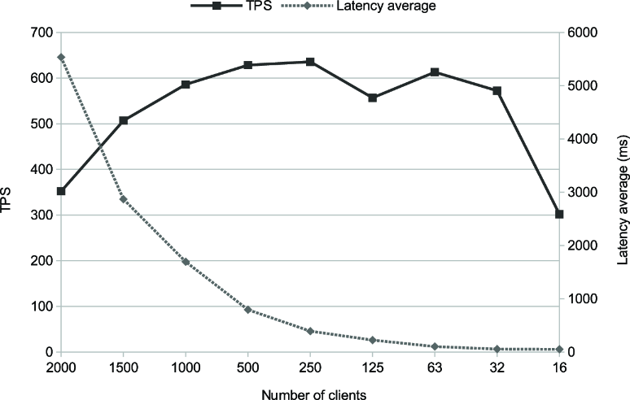
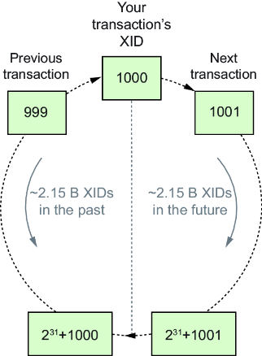

# Chapter 6: Performance Bad Practices

---

## 6. Performance Bad Practices

This chapter covers:
*   Going to production with the default PostgreSQL configuration.
*   (More sections to be added).

### 6.1 Default Configuration in Production
A common mistake is assuming that PostgreSQL's default configuration is "optimized for general use." It is not. It is optimized to **boot on anything** (including a Raspberry Pi or a 1990s server).

#### The Default Reality
*   **`shared_buffers`**: Default is often **128 MB**.
*   **`work_mem`**: Default is **4 MB**.
*   **Consequence**: On a server with 16GB+ RAM, the database is barely using the hardware. It relies heavily on the OS cache and spills large sorts/joins to disk unnecessarily.

#### Case Study: Typical Data Restore
Restoring a **10 GB** database dump (`pgbench` data).

**Scenario A: Default Config**
*   `real time`: **44m 15s**.

**Scenario B: Basic Tuning**
We adjust just 3 parameters for a 16 GB server:
```ini
shared_buffers = 3GB           # (Default: 128MB) - Memory for caching data blocks
work_mem = 128MB               # (Default: 4MB)   - Memory for Sorts/Hashes per operation
maintenance_work_mem = 512MB   # (Default: 64MB)  - Memory for VACUUM and CREATE INDEX
```
*   `real time`: **26m 17s**.
*   **Improvement**: **~40% Faster**.

#### Why?
*   **`shared_buffers`**: More data stays in Postgres' own cache, reducing expensive OS syscalls.
*   **`work_mem`**: Complex sorts and hash joins happen in RAM instead of spilling to slower temporary disk files.
*   **`maintenance_work_mem`**: Index creation (a huge part of Restore) and Vacuuming run much faster with more RAM.

> **Takeaway**: The default config is for compatibility, not performance. **Always tune these basics** before going to production. Use tools like `PGTune` to get a starting baseline for your hardware.

### 6.2 Improper Memory Allocation
While default settings are too low, **excessive settings are fatal**. A common mistake is treating memory settings like a video game slider ("Max it out for performance!").

#### The Trap: The Multiplier Effect of `work_mem`
`work_mem` is **not** a global pool. It is the limit **per operation** (Sort, Hash Join, Bitmap Heap Scan) within a single query plan.
*   **The Math**: `Total RAM Demand` ≈ `shared_buffers` + (`work_mem` × `Concurrent Active Queries` × `Nodes per Query`) + `maintenance_work_mem` + `OS Overhead`.
*   **The Danger**: A single complex query with 5 sorts and 3 joins can consume `8 * work_mem`. Multiply that by 50 concurrent users, and you have an explosion.

#### The Crash: The OOM Killer
**Scenario**: You have 16 GB RAM. You set `shared_buffers = 12GB` and `work_mem = 2GB`.
*   **What happens?**: When 10 users run a sort heavy query, Postgres asks for another 20GB.
*   **Linux Kernel**: Sees it is out of physical RAM. It invokes the **Out-Of-Memory (OOM) Killer**.
*   **The Target**: It picks the process with the highest "OOM Score" (usually the Postgres backend consuming the most RAM).
*   **The Result**: `kernel: Out of memory: Killed process 15255 (postgres)`.
    *   **Collateral Damage**: When one backend is SIGKILL'd, the Postgres Postmaster must **restart the entire cluster** to ensure shared memory consistency. **Everyone gets kicked off**.

#### The Unit Trap
Be careful with units in `postgresql.conf`.
*   `work_mem = 1024` -> Means **1024 kB** (1 MB).
*   `shared_buffers = 1024` -> Means **1024 Buffers** (1024 * 8kB = 8 MB).
*   **Advice**: Always specify units explicitly: `'1GB'`, `'64MB'`.

#### The Balanced Strategy
1.  **Shared Buffers**:
    *   **Rule of Thumb**: **25% - 40%** of total RAM.
    *   **Why not 100%?**: Postgres relies heavily on the **OS Page Cache** (filesystem cache). If you give all RAM to Shared Buffers, you starve the OS cache, causing "Double Buffering" inefficiencies.
2.  **Work Mem**:
    *   **Global Default**: Keep it low (e.g., `16MB` - `64MB`) to be safe for high concurrency.
    *   **Session Override**: For specific heavy reports (OLAP), boost it locally:
        ```sql
        SET work_mem = '1GB';
        SELECT ... complex report ...;
        ```
3.  **Maintenance Work Mem**:
    *   Safe to set higher (e.g., `1GB` or `2GB`) because only a few maintenance tasks (`VACUUM`, `CREATE INDEX`) run concurrently.

> **Takeaway**: Memory tuning is a balancing act. `work_mem` is a loaded gun. Start conservative globally and increase it only for the specific sessions that need it.

### 6.3 Having Too Many Connections
A widespread myth is "More Connections = Better Performance". In Postgres, the opposite is true.

#### The Architecture: Process-per-User
Postgres forks a **new OS process** for every single connection. This is expensive.
*   **RAM Overhead**: Each process needs its own memory stack.
*   **CPU Overhead**: The OS kernel must schedule thousands of processes (`Context Switching`).
*   **Coordination**: The more processes, the more contention for internal locks (`LWLocks`).

#### Case Study: 2000 Connections
We test a modest server with `max_connections = 2000`.

| Clients | Latency (avg) | Throughput (TPS) | Status |
| :--- | :--- | :--- | :--- |
| **2000** | **5535 ms** | **352** | Server Thrashing (Overloaded) |
| **1000** | 694 ms | 586 | Improving... |
| **32** | **5 ms** | **572** | **Optimal Performance!** |



**Wait, what?**
*   At **2000 clients**, the server spends almost all its time managing processes and switching contexts.
*   At **32 clients**, the server actually *finishes* work faster. It processes the queue sequentially rather than trying to juggle 2000 balls at once.
*   **Latency vs Throughput**: At 32 clients, latency is effectively zero (5ms). At 2000, users wait 5.5 seconds.

#### The Solution: Connection Pooling
You cannot just tell app developers "Only use 32 connections" if they have 500 web servers.
*   **The Tool**: **PgBouncer**.
*   **Concept**:
    *   **App Side**: 5000 idle connections open to PgBouncer.
    *   **DB Side**: PgBouncer maintains a small pool (e.g., 50) of active connections to Postgres.
    *   **Logic**: When an App connection performs a query, PgBouncer momentarily assigns it a DB connection, runs the query, and releases it back to the pool.

> **Takeaway**: Postgres is not designed for thousands of *active* connections. Limit `max_connections` (Rule of thumb: 4x CPU Cores) and put **PgBouncer** in front to handle the idle massive concurrency.

### 6.4 Deep Dive: Lightweight Lock Contention (LWLocks)
Why exactly does the server slow down when 2000 users connect? It's not necessarily "Disk I/O". It is often **LWLock Contention**.

#### What is an LWLock?
*   **Definition**: Lightweight Locks are internal "traffic lights" that protect Postgres's Shared Memory structures (e.g., The Buffer Cache, WAL Buffers).
*   **vs Heavyweight Locks**:
    *   **Heavyweight (SQL)**: `LOCK TABLE`, `SELECT FOR UPDATE`. User-visible, long duration, deadlock detection.
    *   **Lightweight (Internal)**: "I need to read this RAM page safely." Microsecond duration, no deadlock detection, high frequency.

#### The Physics of Contention
Imagine a Ticket Counter (Shared Memory) with one Clerk (CPU Core).

1.  **Low Concurrency (32 Clients)**:
    *   Clients form an orderly queue.
    *   Clerk spends 99% of time issuing tickets (Useful Work).
    *   **Result**: High Throughput.

2.  **High Concurrency (2000 Clients)**:
    *   Clients form a "Mosh Pit". Everyone shouts "Me! Me!".
    *   **Spinning**: Clients burn CPU just checking if the limit is free ("Spinlock").
    *   **Sleeping**: The OS puts 1999 processes to sleep, then wakes one up, then sleeps it again (**Context Switching**).
    *   Clerk spends 50% of time shouting "Quiet!", 40% waiting for the next person to wake up, and only 10% issuing tickets.
    *   **Result**: CPU is 100%, but Throughput drops to near zero.

#### How to Spot It?
Check `pg_stat_activity`:
```sql
SELECT wait_event_type, count(*) 
FROM pg_stat_activity 
WHERE state = 'active' 
GROUP BY 1;
```
*   **Healthy**: mostly `Client::ClientRead` or `IO::DataFileRead`.
*   **Sick**: High counts of `LWLock` (specifically `LWLock:buffer_mapping` or `LWLock:WALWrite`).

> **Takeaway**: LWLocks are why "Vertical Scaling" (adding CPUs) eventually fails if you don't fix the concurrency model. Using a **Connection Pooler** essentially turns the "Mosh Pit" back into an "Orderly Queue", eliminating LWLock contention.

### 6.5 Having Idle Connections
"Idle connections are harmless, right?" **Wrong**. In Postgres, 10,000 idle slightly-active connections can kill the performance of the 10 active ones.

#### The Problem: MVCC & Snapshot Contention
*   **MVCC (Multi-Version Concurrency Control)**: Postgres keeps multiple versions of rows. To know which version you are allowed to see, your transaction builds a **Snapshot** (a list of all other active Transaction IDs).
*   **The Cost**: To build a snapshot, Postgres must iterate over **ALL** connections to see their state.
*   **The Formula**: Snapshot Cost ∝ Number of Connections.
*   **The Impact**: If you have 10,000 connections (even if 9,990 are idle), every single active query has to scan that list of 10,000 slots to build its snapshot. This burns CPU and contends for `ProcArrayLock`.

#### The "Java Framework" Syndrome
Many frameworks keep a large pool of connections open (e.g., `min_pool_size=100`) on every app server.
*   100 App Servers * 100 Connections = **10,000 Connections**.
*   This creates massive "Snapshot Contention" even if traffic is low.

#### The Solution: Transaction pooling
Again, the answer is **PgBouncer**, but specifically in **Transaction Mode**.
*   **Session Mode**: 1 App Connection = 1 DB Connection (Good for Prepared Statements, bad for scale).
*   **Transaction Mode**: The DB connection is released back to the pool as soon as the *Transaction* finishes (not when the session closes).
*   **Result**: You can serve 50,000 App connections with just 50 DB connections, making Snapshot creation instant.

> **Takeaway**: Idle connections are **not free**. They slow down every single active query by increasing Snapshot computation time. Use a pooler to decouple "App Connections" from "DB Connections".

### 6.6 Allowing Long-Running Transactions
"Idle" connections are bad (Section 6.5), but **Idle in Transaction** connections are catastrophic.

#### What is "Idle in Transaction"?
*   **The State**: A client runs `BEGIN`, runs a query, and then... stops. It does not `COMMIT` or `ROLLBACK`. It just sits there, holding an open transaction.
*   **The Cause**: Typically buggy application code (e.g., waiting for User Input inside a transaction, or a crashed thread that never closed its handle).

#### The Trap: The Lock Queue
Postgres locks are a First-In-First-Out (FIFO) queue. One tiny lock can block the world.

**Scenario**:
1.  **Client A** (User): `BEGIN; SELECT * FROM users;` (Holds `ACCESS SHARE` lock). **Goes to Lunch**.
2.  **Client B** (Migration): `ALTER TABLE users ADD COLUMN age INT;`
    *   Needs `ACCESS EXCLUSIVE` lock.
    *   **Status**: BLOCKED by Client A.
3.  **Client C** (Website): `SELECT * FROM users;`
    *   Needs `ACCESS SHARE` lock.
    *   **Status**: BLOCKED by Client B!
    *   *Why?* Postgres queues Client C *behind* Client B to prevent starvation.
    *   **Result**: The Migration blocks the entire website.

#### The Vacuum & Bloat Hazard
*   **MVCC Rule**: VACUUM cannot delete dead rows if *any* active transaction is older than those rows.
*   **The Consequence**: A single rogue transaction left open for days prevents VACUUM from cleaning *any* table it touched (or sometimes the whole DB).
*   **Outcome**: Tables bloat massively (disk full), performance tanks, and you risk **Transaction ID Wraparound** (Database Shutdown).

#### The Solution
1.  **Fix the App**: Never leave transactions open while waiting for network/user I/O.
2.  **The Safety Net**: Set `idle_in_transaction_session_timeout`.
    *   Example: `idle_in_transaction_session_timeout = '60s'`.
    *   If a session sits `idle in transaction` for 60s, Postgres kills it, releasing locks and allowing Vacuum to proceed.

> **Takeaway**: A single "Idle in Transaction" session acts like an anchor, dragging down VACUUM and blocking DDL migrations. Set a timeout to cut the rope automatically.

### 6.7 Allowing Long-Running Queries
Even if a transaction is running (high CPU) rather than idle, it still causes damage if it runs for hours.

#### The Problem: The Snapshot Ceiling
Just like idle transactions, an active query holds a **Snapshot**.
*   **The Trap**: While your 4-hour `SELECT sum(...)` runs, `VACUUM` cannot delete *any* dead rows created or modified since that query started.
*   **Result**: The database bloats. If your system has high write volume, 4 hours of un-vacuumed dead rows can fill up your disk or cause performance degradation.

#### The Distributed Impact (Replication Lag)
If you use Synchronous Replication or Logical Replication:
1.  **Replication Lag**: A long transaction on the Primary effectively "pauses" replication commit confirmation (in sync mode) or delays logical decoding until the transaction commits.
2.  **Conflict on Replicas**: If you run the long query on a Replica, the Primary might clean up old rows that the Replica query needs (Detailed in Section 5.6 as "Conflict with Recovery"). The Replica query will be **cancelled**.

#### Killing the Beast
When you find a stuck query, how do you kill it?
1.  **Gentle**: `SELECT pg_cancel_backend(PID);`
    *   Sends `SIGINT` (Ctrl+C). The query stops, but the connection stays open. **Safe**.
2.  **Forceful**: `SELECT pg_terminate_backend(PID);`
    *   Sends `SIGTERM`. Closes the entire connection. use if Gentle fails.
3.  **Nuclear (Never Do This)**: `kill -9 PID` (OS Level).
    *   **Consequence**: Postgres detects a backend crash. It **panics** and restarts the **entire database cluster** to protect data integrity. **You will cause an outage**.

> **Takeaway**: Don't run overnight reports on your high-velocity OLTP Primary. Move them to an async Read Replica or an ETL warehouse. If you must kill a query, use SQL functions, **never** `kill -9`.

### 6.8 High Transaction Rate (The XID Time Bomb)
Burning through transactions at 10,000 TPS feels good, until you hit the **Postgres Time Limit**.

#### The Consumable Resource: Transaction IDs (XID)
*   **The Limit**: Postgres uses a **32-bit unsigned integer** for Transaction IDs.
*   **The Range**: ~4.2 Billion transactions.
*   **The Circle**: It is a circular buffer. After 4.2 Billion, it wraps back to 0.



#### The Apocalypse: XID Wraparound
*   **Problem**: If you write row X with ID `100` and then wrap around the circle and write row Y with ID `100`, Postgres can't tell which is older. It might think your ancient data is from the future (invisible).
*   **The Safety Mechanism**: To prevent data corruption, if you get within 10 million IDs of wraparound, Postgres **Stops Accepting Writes**.
    *   **Symptom**: `FATAL: database is not accepting commands to avoid wraparound data loss in database "postgres"`.
    *   **Fix**: You must restart in single-user mode and manually `VACUUM`. Downtime: Hours or Days.

#### The Solution: Freezing
Postgres runs `VACUUM` to "Freeze" old rows.
1.  **Freeze**: Takes an old row (XID `500`) and replaces the XID with a special "FrozenXID" flag.
2.  **Meaning**: "This row is older than everyone else forever".
3.  **Benefit**: It effectively removes the row from the circular timeline, reclaiming the XID for reuse.

#### The Danger Zone
If you have **High Throughput** (burning XIDs fast) AND **Long Running Transactions** (preventing Vacuum from freezing old data):
*   You are racing towards the cliff.
*   Autovacuum will eventually trigger an aggressive "Anti-Wraparound Vacuum" that consumes heavy I/O.
*   If that fails, the database shuts down.

> **Takeaway**: XIDs are a finite resource. Ensure `autovacuum` is running frequent "Freezes" (check `autovacuum_freeze_max_age`). Never let Long Transactions block Vacuum while running high-throughput workloads.

### 6.8.1 Burning through lots of XIDs
Just because Postgres *can* do 10,000 TPS doesn't mean you *should*. Burning 2 Billion XIDs in a week pushes you dangerously close to the Wraparound cliff constantly.

#### The Burn Rate Problem
Every `INSERT`, `UPDATE`, or `DELETE` consumes an XID.
*   **Scenario**: You ingest IoT sensor data.
*   **Bad Pattern**: A separate transaction for every single reading.
    *   10,000 sensors * 1 reading/sec = **10,000 XIDs/sec**.
    *   **Result**: You burn ~864 Million XIDs per day. You hit the 2 Billion limit every **2.5 days**. Vacuum has to run *constantly*.

#### The Fix: Batching
Stop committing every row individually.
*   **Strategy**: Accumulate 1,000 readings in the app, then `INSERT` them in **one transaction**.
    *   **Result**: 10,000 rows/sec now consumes only **10 XIDs/sec**.
    *   **Improvement**: **1000x reduction** in XID consumption and Vacuum pressure.

#### Other Mitigations
1.  **Tune Autovacuum**: Make it aggressive. Lower `autovacuum_freeze_max_age` to freeze rows sooner, smoothing out the I/O load rather than having a panic spike at the end.
2.  **Data Diet**: Do you need raw data?
    *   Instead of storing 1,000 raw points, calculate the **Average** in memory and store 1 row.
    *   Reduces Storage, I/O, and XID pressure simultaneously.

> **Takeaway**: Batch your writes. A high XID burn rate forces Vacuum to work overtime. Reducing transaction frequency (not necessarily data volume) saves your database maintenance overhead.

### 6.9 Turning Off Autovacuum
Some developers see the `autovacuum` process consuming CPU/IO and think: *"I'll turn it off to save resources!"*
**This is Suicide.**

#### What does Vacuum actually do?
It is not just about "cleaning space". It performs 4 critical tasks:
1.  **Garbage Collection**: Removing dead rows (reclaiming space).
2.  **Index Cleanup**: Removing references to dead rows from indexes.
3.  **Freezing**: Preventing XID Wraparound (See 6.8).
4.  **Statistics**: Running `ANALYZE` so the Query Planner knows that the table is large.

#### The "Death Spiral" of Disabling It
1.  **Phase 1 (The Mirage)**: You turn it off. CPU usage drops. Everything feels faster.
2.  **Phase 2 (The Bloat)**: Dead rows accumulate.
    *   `SELECT *` scans 1 Million live rows + 5 Million dead rows. Performance drops 5x.
    *   Index scans become slow because the index is full of pointers to dead tuples.
3.  **Phase 3 (The Confusion)**: Queries choose bad plans (Nested Loops instead of Hash Joins) because `ANALYZE` hasn't run.
4.  **Phase 4 (The Crash)**: You hit XID Wraparound limits. The DB forces a shutdown.
5.  **The Fix**: You must run `VACUUM FULL`.
    *   **Cost**: It locks the table exclusively. You are offline effectively.
    *   **Space**: It requires double the disk space to rebuild the table. If you are full, you can't even fix it.

#### The Correct Approach: Tune It Up
Instead of fighting Autovacuum, **make it faster**.
*   **Don't throttle it**: Default `autovacuum_vacuum_cost_delay` is 2ms (gentle). On SSD servers, decreased it or raise the Cost Limit to let it work harder.
*   **Per-Table Tuning**: If `large_table` is busy, set specific parameters for it:
    ```sql
    ALTER TABLE large_table SET (autovacuum_vacuum_scale_factor = 0.01);
    ```
    This tells Postgres: "Vacuum this table when 1% of rows change", not the default 20%.

> **Takeaway**: Autovacuum is your database's liver. Removing it doesn't make you faster; it poisons you. Tune it to match your workload's intensity.

### 6.10 Not Using EXPLAIN (ANALYZE)
"My query is slow."
"Can you show me the plan?"
"I don't know how."

This interaction is the bane of every DBA's existence. You cannot debug performance without `EXPLAIN`.

#### The Difference: EXPLAIN vs EXPLAIN ANALYZE
1.  **`EXPLAIN SELECT ...`**:
    *   **What it does**: Shows the *Theoretical* plan. "I think I will use Index A and it will cost 500 units."
    *   **Execution**: Does **NOT** run the query. Instant.
    *   **Use Case**: Checking if an index is used.
2.  **`EXPLAIN ANALYZE SELECT ...`**:
    *   **What it does**: Runs the query, captures actual timings, and compares them to estimates.
    *   **Execution**: **RUNS THE QUERY**.
    *   **Use Case**: Finding out *why* the query is slow (e.g., "Estimate said 10 rows, Reality was 1 Million rows").

#### The Trap: Data Modification
Because `EXPLAIN ANALYZE` executes the query, be terrifyingly careful with `UPDATE` or `DELETE`.
*   `EXPLAIN ANALYZE DELETE FROM users;` -> **Congratulations, you just deleted all your users.**

**The Safe Pattern**:
Wrap it in a transaction and Rollback!
```sql
BEGIN;
EXPLAIN ANALYZE DELETE FROM users WHERE id < 100;
ROLLBACK; -- Phew!
```

#### Automating with `auto_explain`
If you can't catch the slow query live, use the `auto_explain` extension.
*   **Config**: `auto_explain.log_min_duration = '5s'`.
*   **Result**: Any query taking longer than 5s will have its execution plan automatically printed to the Postgres logs.

> **Takeaway**: Stop guessing. Use `EXPLAIN ANALYZE` to see where the time is actually going. But remember: **ANALYZE = EXECUTE**. Wrap modifications in `ROLLBACK`.

### 6.11 Locking Explicitly
Developers sometimes treat the database like a single-threaded Java object, using locks to "synchronize" access.
*   **The Mistake**: `LOCK TABLE my_table IN ACCESS EXCLUSIVE MODE`.
*   **The Result**: You have effectively turned your multi-user database into a single-user file system. Every other transaction waits.

#### The Better Way: Isolation Levels
Instead of manually locking, use Postgres's advanced Isolation Levels.
*   **Standard**: `READ COMMITTED` (Default). Good for most things, but susceptible to "Lost Updates".
*   **Strong**: `REPEATABLE READ`. Sees a consistent snapshot. If data changes while you were reading, your update fails efficiently.
*   **Strictest**: `SERIALIZABLE`. Emulates single-threaded execution without actual blocking, using **Serializable Snapshot Isolation (SSI)**.
    *   **How it works**: It detects "Dangerous Structures" (cycles) in the dependency graph. If T1 and T2 conflict, it kills one.
    *   **Pros**: No locks, high concurrency.
    *   **Cons**: You must write your app to "Retry Transaction on Serialization Failure".

#### Application Locks: Advisor Locks
If you *must* lock something (e.g., "Only one cron job processing this specific user"), do **not** lock the data rows. Use **Advisory Locks**.
*   **Concept**: A lock on a "Number", not a table.
*   **Code**:
    ```sql
    -- Transaction A
    SELECT pg_try_advisory_lock(12345); -- Returns true if free
    -- Do work...
    SELECT pg_advisory_unlock(12345);
    ```
*   **Benefit**: It never blocks `SELECT`, `UPDATE`, or `VACUUM` on actual tables. It only blocks other apps checking lock `12345`.

> **Takeaway**: Explicit Table Locks are a sledgehammer. Use `SERIALIZABLE` for data consistency or `Advisory Locks` for app logic synchronization.

### 6.12 Having No Indexes
You'd think this is obvious, but it happens constantly.
**Common Trap**: "I created a Foreign Key, so Postgres automatically indexed it, right?"
**Answer**: **NO.** Postgres does *not* automatically index FK columns.

#### Case Study: The Hidden Seq Scan
We have `invoices` table referencing `customers`.
```sql
SELECT count(*) FROM invoices WHERE customer_id = 12345;
```

**Scenario A: No Index**
*   **Plan**: `Seq Scan on invoices`.
*   **Logic**: It reads the *entire table* (10GB) just to find the 5 rows for Customer 12345.
*   **Time**: 28ms (for a small table), but linearly degrades as the table grows.

**Scenario B: With Index**
```sql
CREATE INDEX ON invoices(customer_id);
```
*   **Plan**: `Index Only Scan`.
*   **Logic**: It jumps straight to the 5 entries in the B-Tree.
*   **Time**: 1.3ms.
*   **Result**: 20x Faster.

#### Why it matters for Deletes
If you delete a `customer`, Postgres must check `invoices` to ensure no orphans exist (Referential Integrity).
*   **Without Index**: Deleting **one** customer triggers a **Sequential Scan** of the massive `invoices` table.
*   **Symptom**: `DELETE FROM customers` takes 5 seconds!

> **Takeaway**: Always index your Foreign Keys. Postgres won't do it for you. Check your query plans for `Seq Scan` on filtered columns.

### 6.13 Having Unused Indexes
If "No Indexes" is bad (Section 6.12), is "Index Everything" the solution? **No.**
*   **The Cost**: Every `INSERT`, `UPDATE`, or `DELETE` must update the Table **PLUS** every single index on that table.
*   **Write Amplification**: If you have 10 indexes on a table, one `INSERT` becomes 11 writes. This destroys write throughput.

#### The Hoarder Mentality
Some developers think: *"I'll just index every column, then queries will always be fast!"*
*   **Reality**: You create a maintenance nightmare.
*   **Disk Space**: Indexes can easily become larger than the data itself.

#### Finding the Waste
Postgres tells you exactly which indexes are useless.
```sql
SELECT schemaname, relname, indexrelname, idx_scan, idx_tup_read, idx_tup_fetch 
FROM pg_stat_user_indexes 
WHERE idx_scan = 0;
```
*   **`idx_scan = 0`**: This index has **NEVER** been used by any query since the last stats reset.
*   **Action**: `DROP INDEX`.

#### The Duplicate Trap
Be careful with your migration scripts constraints.
*   **Trap**: Running `CREATE INDEX ON invoices(customer_id);` twice.
*   **Result**: Postgres creates **two identical indexes** (e.g., `invoices_customer_id_idx` and `invoices_customer_id_idx1`).
*   **Consequence**: You pay double the write cost and double the disk space for **zero** performance gain. Postgres will only use one.

> **Takeaway**: Indexes are not free. Periodically audit your database for `idx_scan = 0` and remove the dead weight to speed up your writes and save space.

### 6.14 Removing Indexes Used Elsewhere (The Replica Trap)
You checked `pg_stat_user_indexes` on the Primary. You saw `idx_scan = 0`. You dropped the index.
Suddenly, the Data Science team is screaming because their reports time out. **What happened?**

#### The Read Replica Blind Spot
*   **Scenario**: You have a **Primary** (Writes) and a **Standby** (Read Replica for Reporting).
*   **The Trap**:
    1.  The Primary only processes writes. It *never* reads that specific table for reports.
    2.  Therefore, on the Primary, `idx_scan` is **0**.
    3.  The Standby runs heavy reports all day. On the Standby, `idx_scan` is **Millions**.
*   **The Mechanism**:
    *   Index usage statistics are **Local**. They do not sync between nodes.
    *   DDL changes are **Global**. When you run `DROP INDEX` on the Primary, it replicates to the Standby and deletes the index there too.

#### The Result
You successfully cleaned up the Primary, but you accidentally nuked the critical performance optimization for your Read Replica.

> **Takeaway**: Before dropping an "unused" index, check `pg_stat_user_indexes` on **ALL** Standby nodes, not just the Primary. Your "unused" index might be the only thing keeping the Reporting system alive.
