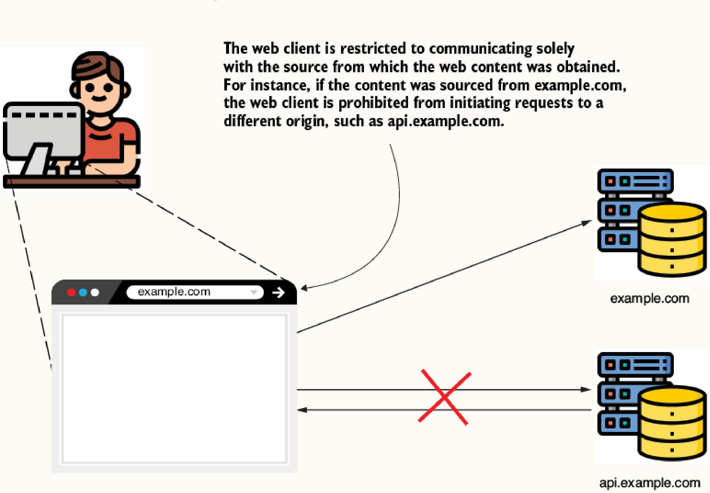
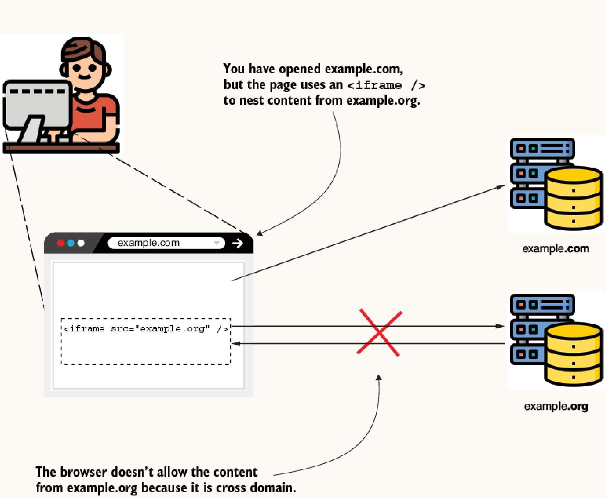
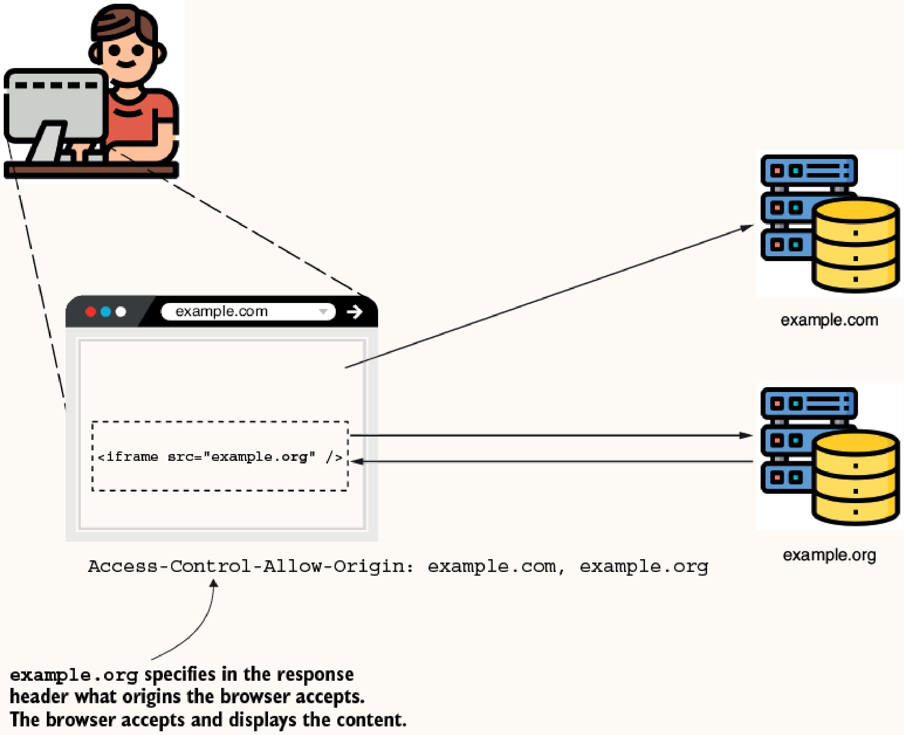
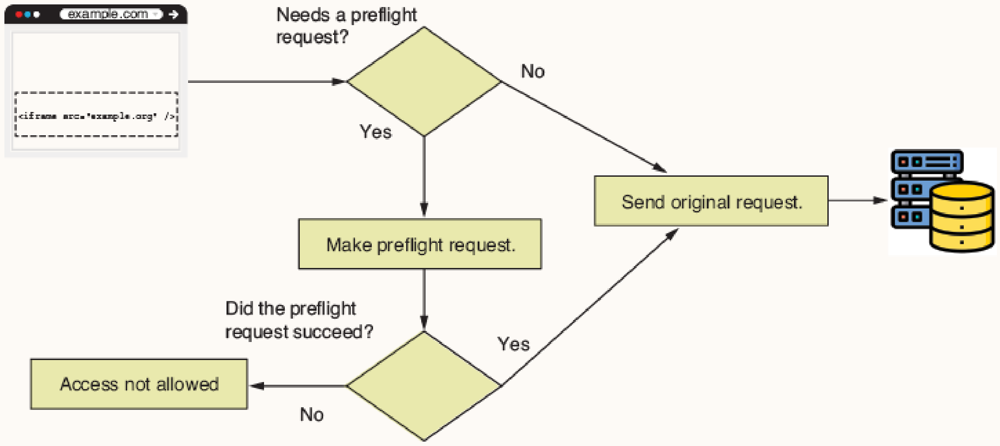

# Chapter 10: Configuring CORS

## Core Concepts

**Cross-Origin Resource Sharing (CORS)** is a mechanism that relaxes the strict same-origin policy implemented by web browsers. By default, browsers prevent web pages from making requests to a different domain than the one that served the web page.



This policy also applies to embedded content such as `iframe`s.



### How CORS Works

> [!NOTE]
> **Where are CORS headers actually put?**
> CORS headers are **never** attached to the original base HTML response (e.g., `http://frontend.com`). 
> Instead, they are attached exclusively to the **API responses** made by the backend server (`http://api.backend.com`) when the frontend's JavaScript makes cross-origin AJAX calls (like `fetch()` or `XMLHttpRequest`).
> 
> **The Flow:**
> 1. The user visits `http://frontend.com`. The browser requests the base HTML. This response has **no** CORS headers.
> 2. The HTML loads and executes its JavaScript.
> 3. The JavaScript attempts to make an AJAX call to `http://api.backend.com/data`.
> 4. The browser sees this is a cross-origin request and automatically attaches an `Origin: http://frontend.com` header to the outgoing API request.
> 5. The backend (`http://api.backend.com`) receives the request, validates the origin, and responds with the requested data *along with* the `Access-Control-Allow-Origin: http://frontend.com` header.
> 6. The browser receives the API response, verifies that the `Access-Control-Allow-Origin` header matches the frontend's domain, and finally allows the JavaScript to read the data.

The CORS mechanism works via specific HTTP headers added by the server to the response:

*   **`Access-Control-Allow-Origin`**: Specifies the allowed foreign domains (origins).
*   **`Access-Control-Allow-Methods`**: Specifies allowed HTTP methods (e.g., restricting access to only `HTTP GET`).
*   **`Access-Control-Allow-Headers`**: Specifies which HTTP headers can be used in the request.



### Preflight Requests

For certain requests, the browser first sends an `HTTP OPTIONS` request, known as a **preflight request**, to verify if the server permits the actual request. If the preflight fails, the original request is not sent. Simple `GET`, `POST`, or `OPTIONS` requests with basic headers often skip the preflight.



---

## Applying CORS Policies in Spring Security

By default, Spring Security does not add CORS headers to responses, causing cross-origin requests to be blocked by the browser. There are two primary strategies to configure CORS.

### Strategy 1: Using the `@CrossOrigin` Annotation

**How it works**:
The `@CrossOrigin` annotation is placed directly on the controller method (endpoint). It can be configured with specific origins, headers, and methods.

```java
@PostMapping("/test")
@ResponseBody
@CrossOrigin("http://localhost:8080") 
public String test() {
    return "HELLO";
}
```
*Note: Asterisks (`*`) can be used to allow all origins/headers, but this is strongly discouraged due to XSS and DDoS vulnerabilities.*

**When to use**:
Provides high transparency as the rule is visible directly at the endpoint definition. However, it can become repetitive (wordy) and poses a risk if a developer forgets to annotate a new endpoint.

### Strategy 2: Centralized Configuration using `CorsConfigurer`

**How it works**:
CORS rules are defined centrally within the Spring Security configuration class by utilizing `http.cors()` and defining a `CorsConfigurationSource`. You must explicitly specify both allowed origins and methods (methods are not configured by default).

```java
@Configuration
public class ProjectConfig {

    @Bean
    public SecurityFilterChain securityFilterChain(HttpSecurity http) throws Exception {
        http.cors(c -> {
            CorsConfigurationSource source = request -> {
                CorsConfiguration config = new CorsConfiguration();
                config.setAllowedOrigins(List.of("example.com", "example.org"));
                config.setAllowedMethods(List.of("GET", "POST", "PUT", "DELETE"));
                config.setAllowedHeaders(List.of("*"));
                return config;
            };
            c.configurationSource(source);
        });

        http.csrf(c -> c.disable());
        http.authorizeHttpRequests(c -> c.anyRequest().permitAll());

        return http.build();
    }
}
```
*Note: In production, the `CorsConfigurationSource` lambda should be extracted to a separate class for readability.*

**When to use**:
Best for real-world applications where a uniform CORS policy is applied across many endpoints. It prevents code duplication and ensures new endpoints automatically inherit the security constraints.
