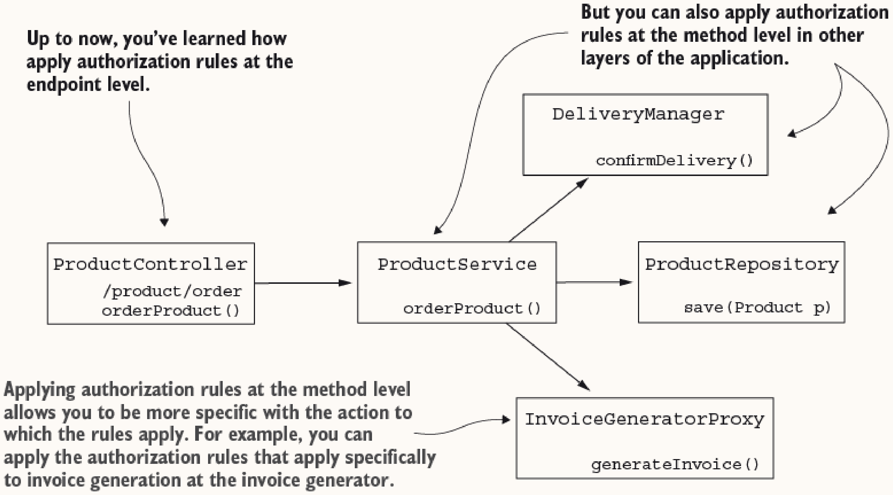
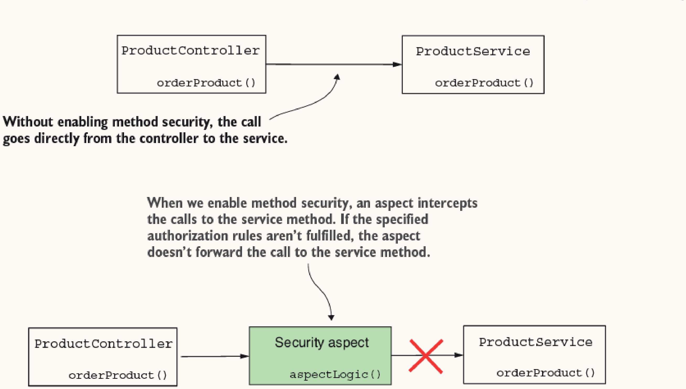
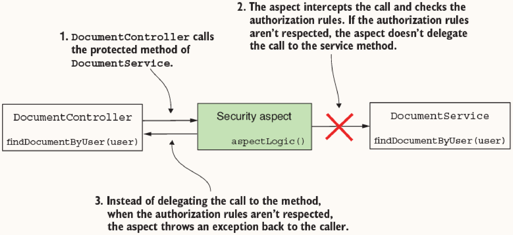
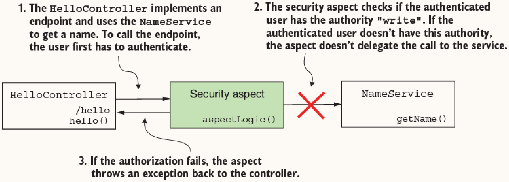
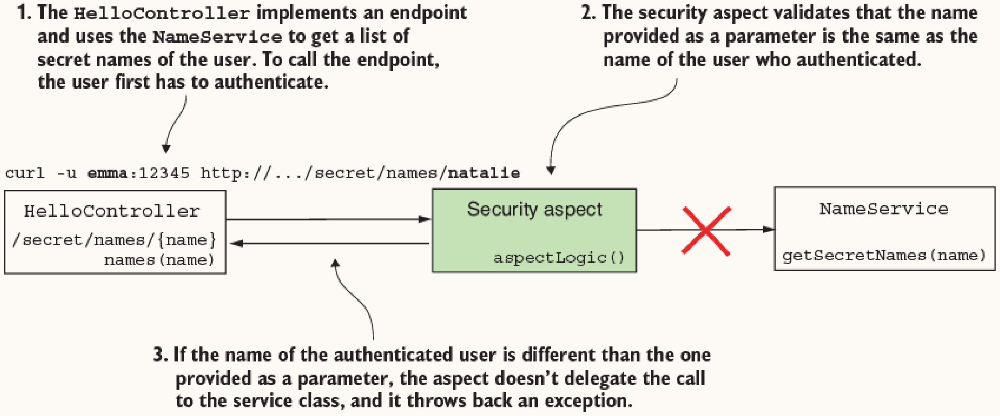
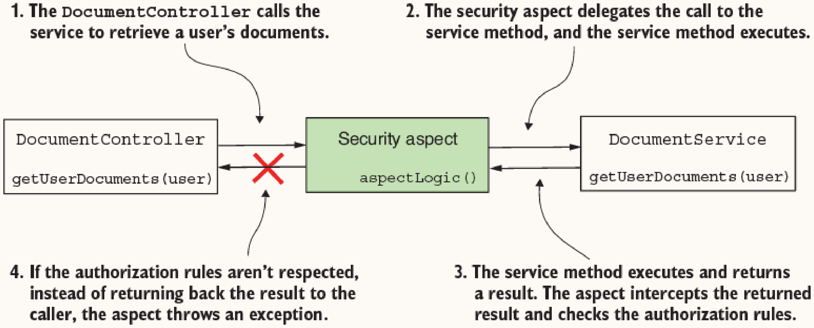
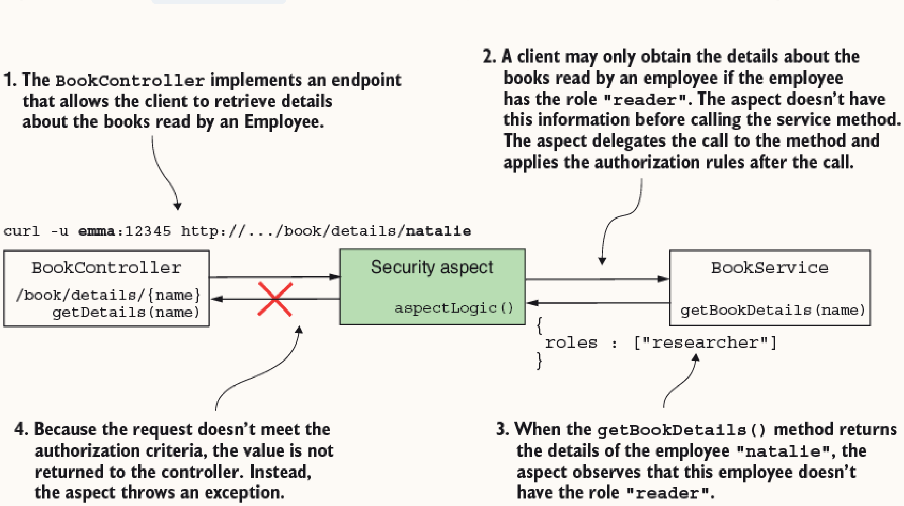

# Chapter 11: Implementing Authorization at the Method Level

Method security allows applying authorization rules at any application layer, providing more granularity than endpoint-level security. 



## 1. Enabling Method Security

Method security is disabled by default. It is enabled by annotating a configuration class with `@EnableMethodSecurity`.

> [!NOTE]
> **Legacy Spring Security Versions**
> In Spring Security versions older than 6, the `@EnableGlobalMethodSecurity` annotation was used instead. Additionally, preauthorization and postauthorization annotations were not enabled by default.

```java
@Configuration
@EnableMethodSecurity
public class ProjectConfig {
}
```

When enabled, a Spring Aspect intercepts method calls. Based on the authorization rules, it decides whether to forward the call to the method.



## 2. Call Authorization Strategies

Spring Security provides two primary approaches for call authorization: preauthorization and postauthorization.

### Preauthorization (`@PreAuthorize`)

**How it works:** A Spring Aspect intercepts the call and verifies the authorization rules defined in a Spring Expression Language (SpEL) expression *before* method execution. If rules are met, the method executes; otherwise, an `AccessDeniedException` is thrown.
**When to use:** Use when you want to completely restrict method invocation based on the caller's authorities or the parameters provided to the method. This is the most common approach.



**Examples:**

Restricting access based on authorities:
```java
@PreAuthorize("hasAuthority('write')")
public String getName() {
    return "Fantastico";
}
```

Restricting access based on method parameters (using `#parameterName`):



```java
@PreAuthorize("#name == authentication.principal.username")
public List<String> getSecretNames(String name) {
    return secretNames.get(name);
}
```

**Common SpEL Expressions for Authorization:**
- `hasAuthority()` — User must have the specified authority.
- `hasAnyAuthority()` — Specifies multiple authorities. The user must have at least one of these authorities to call the method.
- `hasRole()` — Specifies a role a user must have to call the method.
- `hasAnyRole()` — Specifies multiple roles. The user must have at least one of them to call the method.

### Postauthorization (`@PostAuthorize`)

**How it works:** The aspect delegates the call to the method, allowing it to execute. After execution, the authorization rules are verified against the returned result (accessed via `returnObject`). If rules are violated, an `AccessDeniedException` is thrown instead of returning the result. 
**When to use:** Use when authorization decisions depend on the data retrieved by the method. 
**Warning:** Because the method executes, any mutations performed by the method will persist even if authorization fails.

> [!WARNING]
> **Postauthorization & `@Transactional`**
> Even with the `@Transactional` annotation, a database change **isn’t rolled back** if postauthorization fails. The `AccessDeniedException` thrown by the postauthorization aspect happens *after* the transaction manager has already committed the transaction. Therefore, never use `@PostAuthorize` on methods that mutate state!




**Example:**
```java
@PostAuthorize("returnObject.roles.contains('reader')")
public Employee getBookDetails(String name) {
    return records.get(name);
}
```

> [!NOTE]
> You can use both `@PreAuthorize` and `@PostAuthorize` on the same method if your requirements dictate checking rules both before and after execution.

## 3. Implementing Complex Permissions (`PermissionEvaluator`)

For complex authorization logic, embedding long SpEL expressions reduces maintainability. Spring Security allows externalizing this logic into a separate class implementing the `PermissionEvaluator` interface.

**How it works:** You implement `PermissionEvaluator` and override its `hasPermission` methods. Then, you configure a `MethodSecurityExpressionHandler` bean to use your evaluator. Finally, you invoke `hasPermission()` inside your `@PreAuthorize` or `@PostAuthorize` annotations.
**When to use:** Use when authorization rules require complex business logic, database lookups, or multiple conditions that make SpEL expressions unreadable.

**Step 1: Implement `PermissionEvaluator`**
```java
@Component
public class DocumentsPermissionEvaluator implements PermissionEvaluator {
    @Override
    public boolean hasPermission(Authentication authentication, Object target, Object permission) {
        Document document = (Document) target;
        String p = (String) permission;
        
        boolean admin = authentication.getAuthorities().stream()
            .anyMatch(a -> a.getAuthority().equals(p));
            
        return admin || document.getOwner().equals(authentication.getName());
    }

    @Override
    public boolean hasPermission(Authentication authentication, Serializable targetId, String targetType, Object permission) {
        // Alternative approach using IDs instead of target objects
        String code = targetId.toString();
        Document document = documentRepository.findDocument(code);
        // ... permission logic ...
        return result;
    }
}
```

**Step 2: Register the Evaluator**
```java
@Configuration
@EnableMethodSecurity
public class ProjectConfig {
    @Bean
    protected MethodSecurityExpressionHandler createExpressionHandler(DocumentsPermissionEvaluator evaluator) {
        var expressionHandler = new DefaultMethodSecurityExpressionHandler();
        expressionHandler.setPermissionEvaluator(evaluator);
        return expressionHandler;
    }
}
```

> [!NOTE]
> We use the provided `DefaultMethodSecurityExpressionHandler`. It is also possible to implement a custom `MethodSecurityExpressionHandler` to define custom SpEL expressions for authorization rules, though this is rarely necessary.

**Step 3: Apply the Rule**

Using the object-based method (often with `@PostAuthorize`):
```java
@PostAuthorize("hasPermission(returnObject, 'ROLE_admin')")
public Document getDocument(String code) { ... }
```

Using the ID-based method (often with `@PreAuthorize`):
```java
@PreAuthorize("hasPermission(#code, 'document', 'ROLE_admin')")
public Document getDocument(String code) { ... }
```

> [!NOTE]
> Notice that you do not need to explicitly pass the `Authentication` object in the SpEL expression. Spring Security automatically provides it to the `hasPermission()` method from the `SecurityContext`.

## 4. Legacy Annotations (`@Secured` and `@RolesAllowed`)

While `@PreAuthorize` and `@PostAuthorize` are enabled by default when you use `@EnableMethodSecurity`, older annotations are not. 

**How it works:** 
The `@EnableMethodSecurity` annotation offers two specific attributes to enable these older annotations:
- `jsr250Enabled = true` enables the `@RolesAllowed` annotation.
- `securedEnabled = true` enables the `@Secured` annotation.

Unlike `@PreAuthorize`, these annotations **do not support SpEL expressions**. They only accept simple string arrays of authorities or roles. 

**When to use:** 
Rarely. Because they lack the power of SpEL expressions (e.g., you cannot evaluate method parameters or the returned object), the chances that you’ll find them in modern real-world scenarios are small. They are primarily maintained for legacy compatibility.

**Enabling both:**
```java
@EnableMethodSecurity(
    jsr250Enabled = true,
    securedEnabled = true
)
```

**Usage:**
```java
@Service
public class NameService {
    // Specifies that only users having the role ADMIN can call this
    @RolesAllowed("ADMIN")
    public String getName() {
        return "Fantastico";
    }

    // Similar to above, but using the Spring-specific legacy annotation
    @Secured("ROLE_ADMIN")
    public String getLegacyName() {
        return "Fantastico";
    }
}
```
