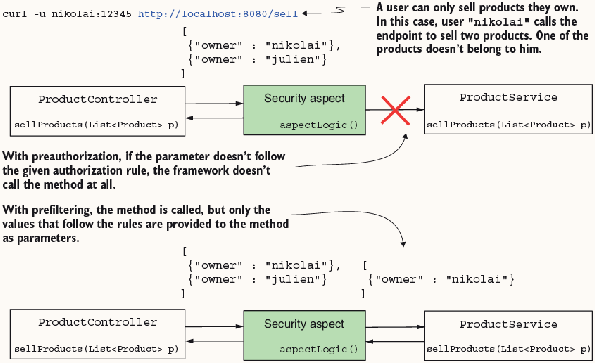
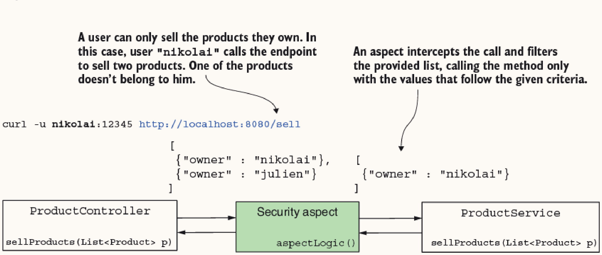
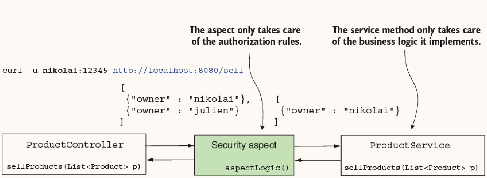
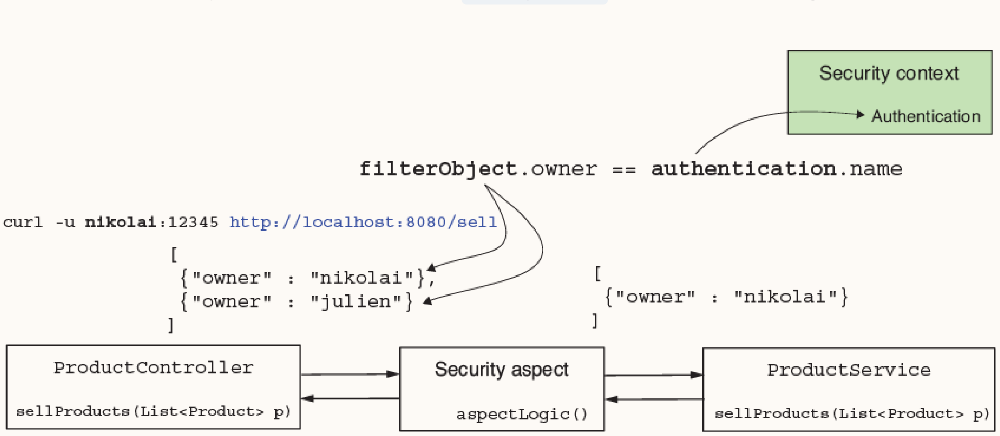
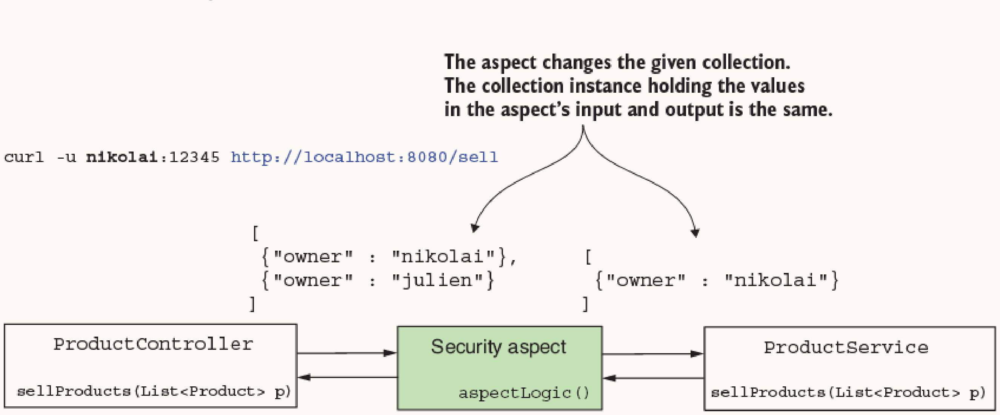
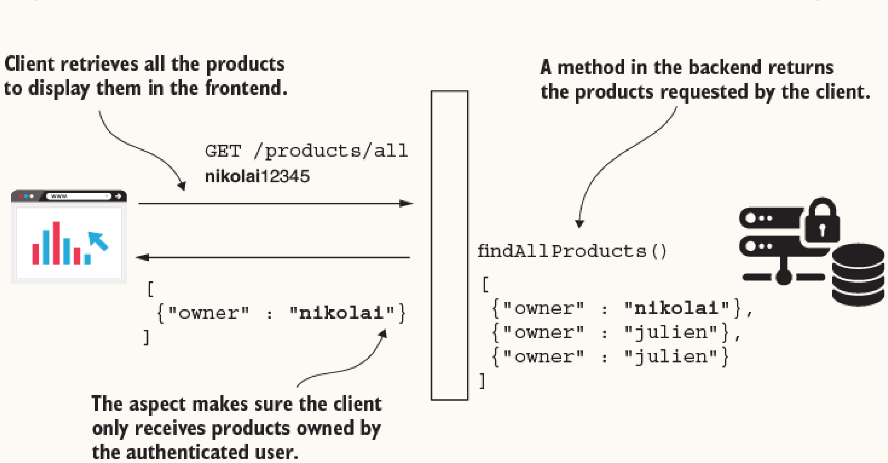
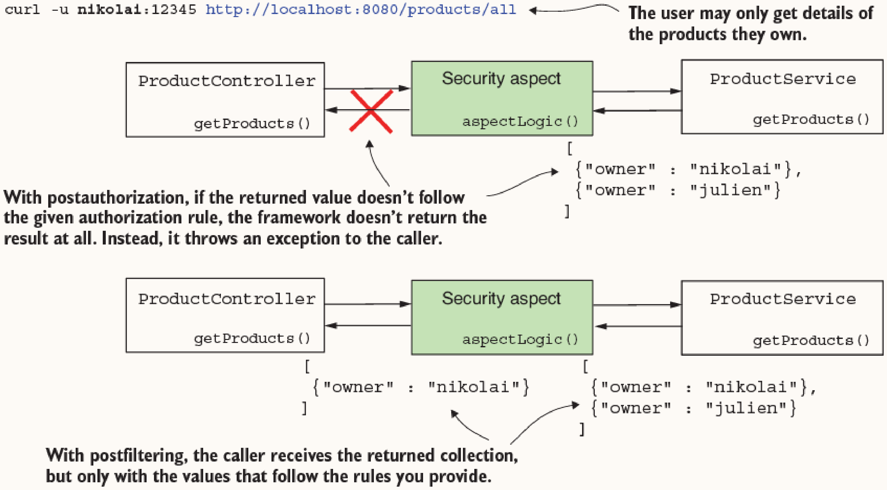
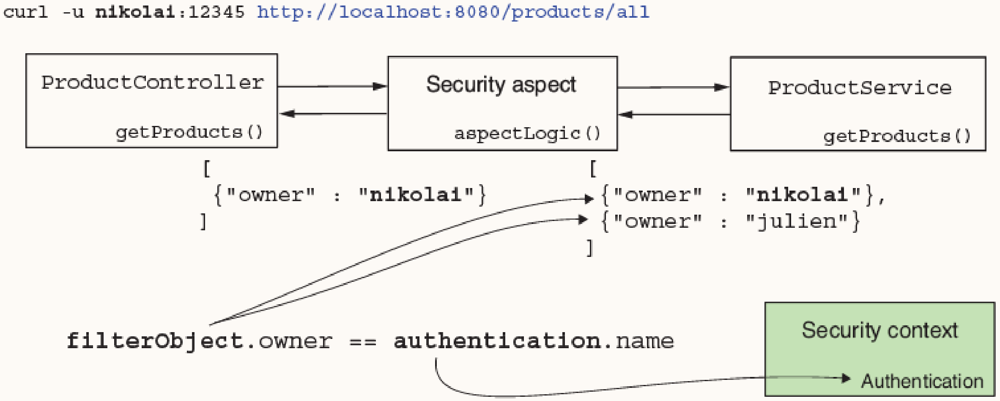
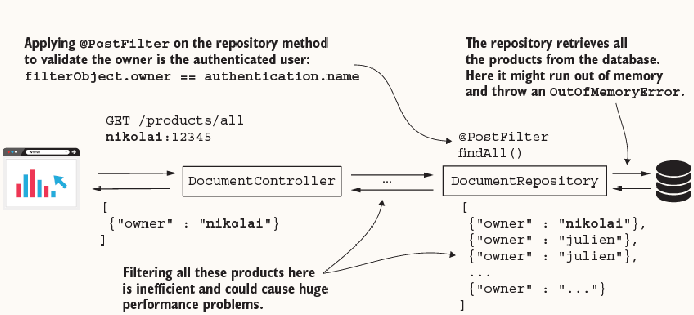
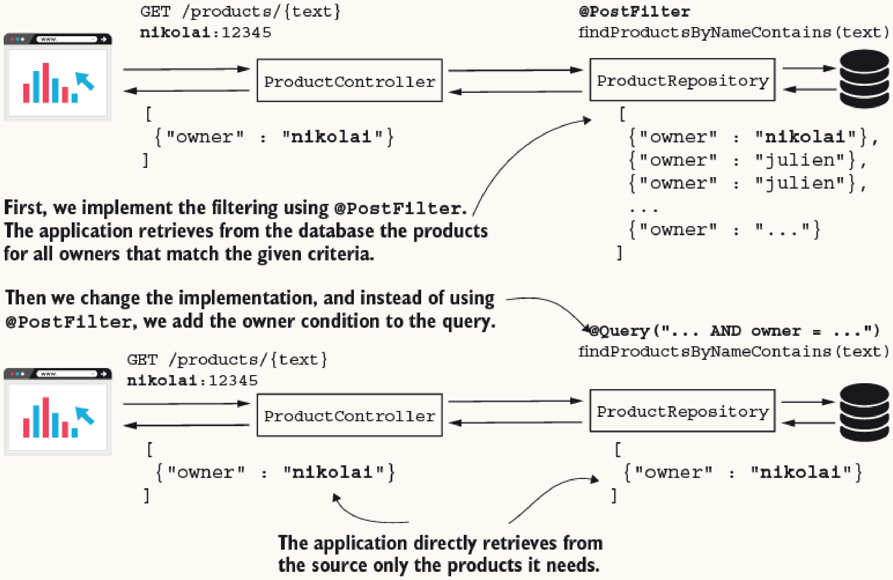

# Chapter 12: Implementing Filtering at the Method Level

This chapter covers how to apply method-level filtering in Spring Security to authorize data in collections and arrays, before or after method execution, and how to integrate filtering efficiently with Spring Data.

Unlike call authorization (e.g., `@PreAuthorize`), filtering allows method execution to proceed. Instead of throwing an exception when authorization fails, filtering silently removes elements from the input or output collections that do not satisfy the defined authorization rules.


*Figure 12.1: Call authorization vs. prefiltering mechanism.*

**Requirements**:
- Method parameters or return types must be **collections or arrays**.
- Method Security must be enabled using `@EnableMethodSecurity`.

---

## 12.1 Applying Prefiltering for Method Authorization

Prefiltering validates and restricts elements provided as parameters before they reach the method's business logic.


*Figure 12.2: Prefiltering intercepting the method call and sending only allowed values.*


*Figure 12.3: Decoupling authorization responsibility from business implementation.*

### How it works
Spring Security uses AOP (Aspect-Oriented Programming). An aspect intercepts calls to methods annotated with `@PreFilter`, iterating over the given collection and removing items that fail the condition.
- The condition is a SpEL (Spring Expression Language) expression.
- Use `filterObject` to reference the current element in the collection.
- Use `authentication` to reference the `Authentication` object from the `SecurityContext`.


*Figure 12.4: Prefiltering using `filterObject` and `authentication`.*

```java
@Service
public class ProductService {
    @PreFilter("filterObject.owner == authentication.name")
    public List<Product> sellProducts(List<Product> products) {
        return products;
    }
}
```

### When to use
Use prefiltering when a method processes batches of data (e.g., saving multiple records) and you want to ensure the caller only passes entities they are authorized to modify, without intermingling authorization logic with the core business logic.

> **CRITICAL CAVEAT**: The collection passed to a `@PreFilter`-annotated method **must be mutable**. The filtering aspect modifies the provided collection in place. Passing an immutable collection (like one created with `List.of()`) will result in a `java.lang.UnsupportedOperationException` at runtime.


*Figure 12.5: The aspect modifies the given parameter collection directly.*

---

## 12.2 Applying Postfiltering for Method Authorization

Postfiltering ensures that the method's caller only receives the parts of the returned collection they are authorized to see.


*Figure 12.6: Postfiltering scenario ensuring clients only receive data they own.*


*Figure 12.7: Postfiltering aspect intercepting the returned collection.*

### How it works
An aspect intercepts the method after it executes and returns. It iterates through the returned collection/array, evaluates the `@PostFilter` SpEL expression for each element, and removes those that fail the criteria before passing the filtered collection to the original caller.


*Figure 12.8: SpEL expression used for postfiltering authorization.*

```java
@Service
public class ProductService {
    @PostFilter("filterObject.owner == authentication.name")
    public List<Product> findProducts() {
        // retrieves products, aspect will filter the result
        return products;
    }
}
```

### When to use
Use postfiltering to ensure sensitive or unauthorized data within a retrieved dataset isn't leaked to the user. It works best when the dataset retrieved by the business logic is relatively small and can be easily kept in memory.

---

## 12.3 Using Filtering in Spring Data Repositories

When integrating Spring Security with Spring Data repositories, it's crucial to consider performance.

### Anti-Pattern: Using `@PostFilter` on Repository Methods

Technically, applying `@PostFilter` to a Spring Data repository method works, but it is an anti-pattern.


*Figure 12.9: The anatomy of a bad design with `@PostFilter`.*

**Why it's bad:**
The repository fetches *all* records from the database into application memory, and only then does the Spring Security aspect filter them. For large datasets, this severely impacts performance and often results in an `OutOfMemoryError`.

### Best Practice: Applying Filtering Directly within Queries

Instead of fetching everything and filtering in memory, integrate authorization rules directly into your database queries. This pushes the filtering down to the database layer, which is much more efficient.


*Figure 12.10: Comparing `@PostFilter` in-app filtering with direct query filtering.*

### How it works
You can expose the Spring Security context to Spring Data's SpEL engine to directly use security properties (like the authenticated username) in your JPQL/SQL queries.

1.  **Register `SecurityEvaluationContextExtension`**: Add this bean to your Spring configuration to allow Spring Data queries to access the `authentication` object.
    ```java
    @Bean
    public SecurityEvaluationContextExtension securityEvaluationContextExtension() {
        return new SecurityEvaluationContextExtension();
    }
    ```

2.  **Use SpEL in the `@Query`**: Write your repository query incorporating the SpEL expression to limit the retrieved records.
    ```java
    public interface ProductRepository extends JpaRepository<Product, Integer> {
        @Query("""
            SELECT p FROM Product p WHERE 
            p.name LIKE %:text% AND 
            p.owner=?#{authentication.name}
            """)
        List<Product> findProductByNameContains(String text);
    }
    ```

### When to use
Use this approach whenever you need to filter data retrieved from a database based on authorization rules. It drastically improves performance over `@PostFilter` and scales well with large datasets.
