# Chapter 16: Implementing an OAuth 2 client

## Overview
Backend applications often need to communicate with one another, especially in service-oriented architectures. While developers sometimes use HTTP Basic and API Key authentication methods for simplicity, when systems have authentication and authorization built over OAuth 2, using the **client credentials grant type** is the preferred and more secure option.

As illustrated in Figure 16.1, we previously discussed the authorization server and resource server; this chapter focuses on the client actor.
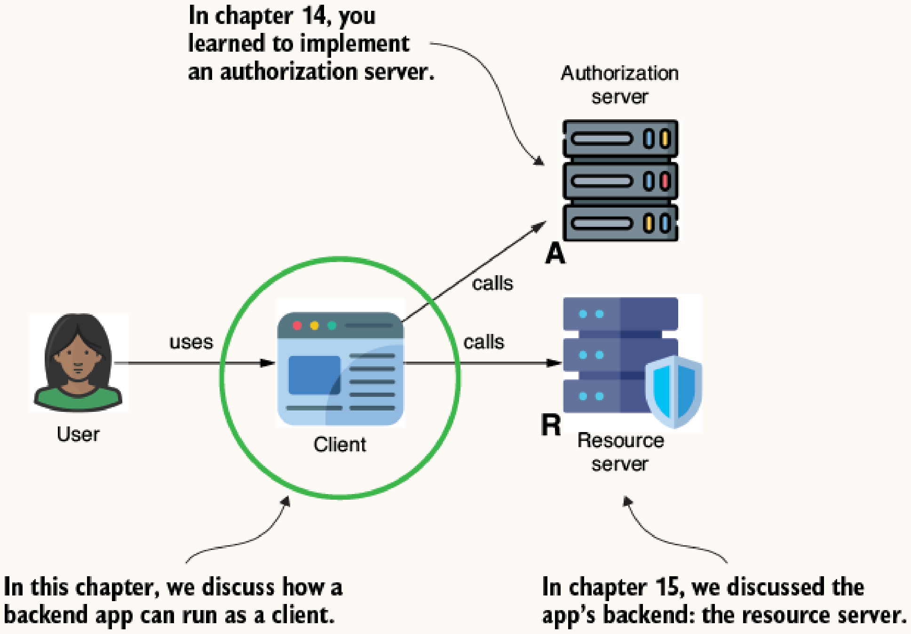

Figure 16.2 shows the specific case we'll discuss where a backend app becomes a client for another backend app, requiring us to build an OAuth 2 client.
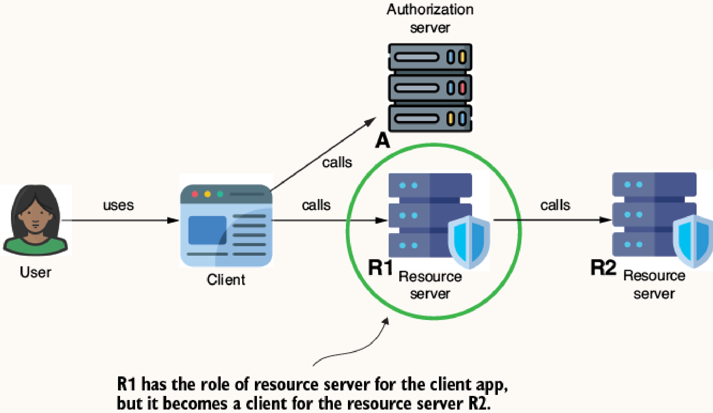

---

## 16.1 Implementing OAuth 2 login

Spring Boot provides auto-configuration to integrate OAuth 2 authentication smoothly.

### 16.1.1 Authentication with a Common Provider
Spring Security preconfigures details for common providers (Google, GitHub, Facebook, Okta) in the `CommonOAuth2Provider` class.

**How it works:**
1. Add the `spring-boot-starter-oauth2-client` dependency.
2. In the `SecurityFilterChain` bean, configure OAuth 2 login using `http.oauth2Login(Customizer.withDefaults())`.
3. Provide the specific provider's client credentials in `application.properties`. Because Spring Security knows the authorization URL, token URL, and other details for common providers, you only need to configure the client ID and secret.

**When to use:** 
When integrating login using an external authorization server supported by default in Spring Security.

```xml
<dependency>
    <groupId>org.springframework.boot</groupId>
    <artifactId>spring-boot-starter-oauth2-client</artifactId>
</dependency>
```

```java
@Configuration
public class SecurityConfig {
    @Bean
    public SecurityFilterChain securityFilterChain(HttpSecurity http) throws Exception {
        http.oauth2Login(Customizer.withDefaults());
        http.authorizeHttpRequests(c -> c.anyRequest().authenticated());
        return http.build();
    }
}
```

```properties
spring.security.oauth2.client.registration.google.client-id=790...
spring.security.oauth2.client.registration.google.client-secret=GOC...
```

Figure 16.3 shows how the app displays the Google login when properly configuring this well-known provider.
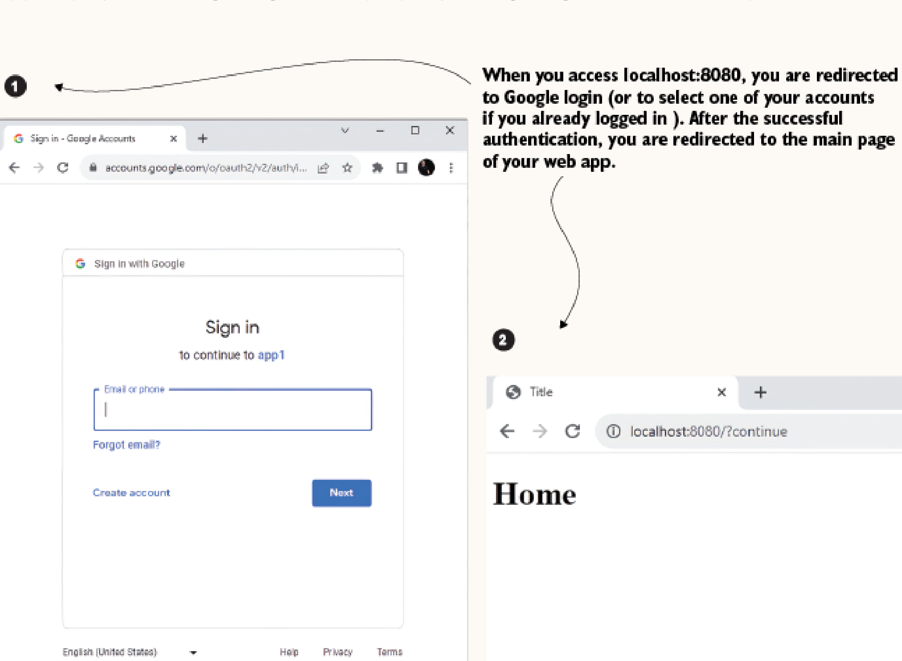


### 16.1.2 Multiple Authentication Providers
You can allow users to choose from multiple identity providers. This approach is advantageous because not all users have an account with a specific social network, and offering multiple options saves them from remembering supplementary credentials.

**How it works:** 
Configure multiple client credentials (e.g., both Google and GitHub) inside the `application.properties`. Spring Security will automatically present a selection page.

**When to use:** 
When aiming to broaden user access by supporting multiple social logins.

```properties
spring.security.oauth2.client.registration.github.client-id=03...
spring.security.oauth2.client.registration.github.client-secret=c5d...
```

As seen in Figure 16.4, before asking you to authenticate, the app provides options for the user to choose between GitHub and Google.
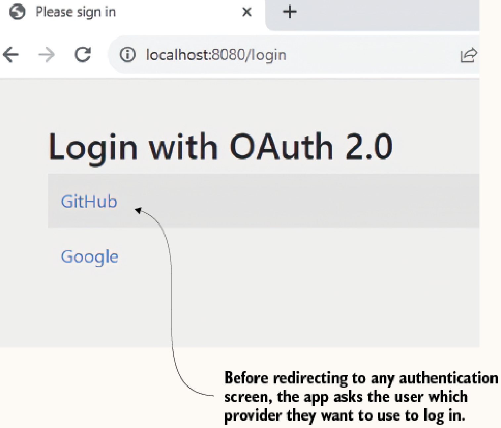


### 16.1.3 Using a Custom Authorization Server
For providers not found in `CommonOAuth2Provider` (like LinkedIn, Twitter, Yahoo, or custom self-hosted ones built in previous chapters), Spring Security requires explicit configuration of endpoint details.

**How it works:**
If the provider adheres strictly to OpenID Connect, you only need to configure the `issuer-uri`. Spring Security will use it to find the authorization, token, and key set URIs. Otherwise, explicitly define the authorization endpoint, token endpoint, and key set endpoint, along with the `ClientRegistration` configurations (provider name, authentication method, redirect URI, scope).

> [!TIP]
> **Networking Tip:** When running both a custom authorization server and the web app locally, accessing them from the same browser can cause session cookie conflicts. To avoid this, use `127.0.0.1` for one app and `localhost` for the other.

**When to use:** 
When authenticating against an in-house customized authorization server or a third-party not covered by default.

**Listing 16.3 The client details registered on the authorization server side**
To make the custom authorization server work with the client app, you first need to register the client on the authorization server:
```java
@Bean
public RegisteredClientRepository registeredClientRepository() {
    var registeredClient = RegisteredClient
        .withId(UUID.randomUUID().toString())
        .clientId("client")
        .clientSecret("secret")
        .clientAuthenticationMethod(ClientAuthenticationMethod.CLIENT_SECRET_BASIC)
        .authorizationGrantType(AuthorizationGrantType.AUTHORIZATION_CODE)
        .redirectUri("http://localhost:8080/login/oauth2/code/my_authorization_server")
        .scope(OidcScopes.OPENID)
        .build();
    return new InMemoryRegisteredClientRepository(registeredClient);
}
```

> **Wait, does this replace Keycloak?**
> **Yes!** Keycloak *is* an Authorization Server. When you use `RegisteredClientRepository` in a Spring Boot app, you are literally building your own custom, mini version of Keycloak from scratch using the Spring Authorization Server framework. 
> - `InMemoryRegisteredClientRepository` is **not** a reference to a client created in Keycloak. It is the actual "database" (held in RAM) for *your own* Authorization Server.
> - If you were actually using Keycloak, you would **not** write the Java code in Listing 16.3. Instead, you would open the Keycloak Admin Web UI, click "Clients -> Create", type in `client` and `secret`, and Keycloak would save it in its own underlying database. 
> - By writing this Java code, you are bypassing third-party tools and acting as your own Identity Provider (IdP).

**Client Side Properties:**
```properties
# Specifying the Custom Issuer URI
spring.security.oauth2.client.provider.my_authorization_server.issuer-uri=http://127.0.0.1:7070

# Client Registration
spring.security.oauth2.client.registration.my_authorization_server.client-id=client
spring.security.oauth2.client.registration.my_authorization_server.client-name=Custom
spring.security.oauth2.client.registration.my_authorization_server.client-secret=secret
spring.security.oauth2.client.registration.my_authorization_server.provider=my_authorization_server
spring.security.oauth2.client.registration.my_authorization_server.client-authentication-method=client_secret_basic
spring.security.oauth2.client.registration.my_authorization_server.redirect-uri=http://localhost:8080/login/oauth2/code/my_authorization_server
spring.security.oauth2.client.registration.my_authorization_server.scope[0]=openid
```

Figure 16.5 analyzes the anatomy of the standard redirect URI format, which ends with the provider's name.
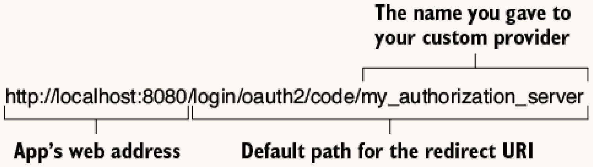

Once configured, Figure 16.6 shows that the custom provider now appears in the providers list and can be selected by the user.
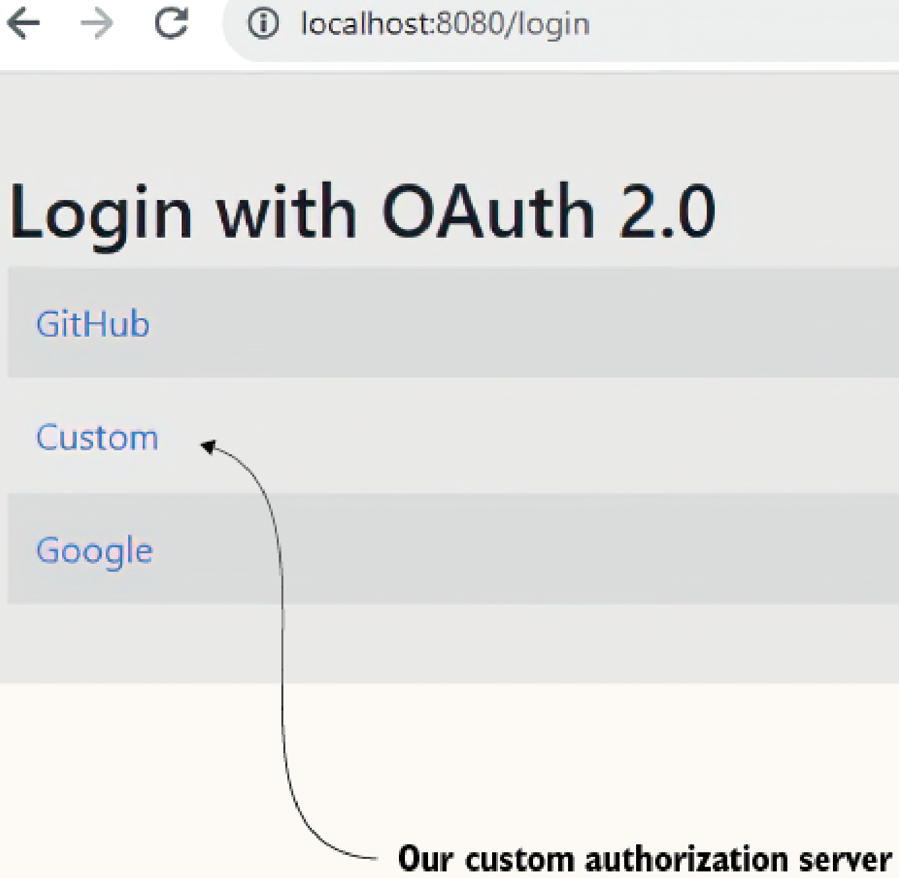


### 16.1.4 Adding Flexibility via ClientRegistrationRepository
Properties files don't allow for dynamic configurations (e.g., dynamically changing credentials without redeployment, or loading providers from a database). To customize what happens behind the scenes, you need to understand two main interfaces: `ClientRegistration` and `ClientRegistrationRepository`.

**How it works:**
1. Construct `ClientRegistration` objects containing the required provider details (credentials, redirect URI, etc.).
2. Provide a custom `ClientRegistrationRepository` bean implementation (such as `InMemoryClientRegistrationRepository` or a custom database-backed one) to tell your app where to get client registrations.

**When to use:** 
When the application must dynamically load, modify, or toggle OAuth 2 client registrations at runtime without redeployment.

```java
@Bean
public ClientRegistrationRepository clientRegistrationRepository() {
    return new InMemoryClientRegistrationRepository(this.googleClientRegistration());
}

private ClientRegistration googleClientRegistration() {
    return CommonOAuth2Provider.GOOGLE.getBuilder("google")
        .clientId(clientId) // Injected from properties or DB
        .clientSecret(clientSecret)
        .build();
}
```

### 16.1.5 Managing Authorization for an OAuth 2 Login
Post-authentication, Spring Security saves the user context exactly like other authentication methods (`httpBasic()`, `formLogin()`, etc.). Using `oauth2Login()` doesn't differ in this regard.

**How it works:**
Extract context data using `OAuth2AuthenticationToken` which defines the `Authentication` contract implementation. It can be injected directly into controller parameters or accessed globally via `SecurityContextHolder.getContext().getAuthentication()`. While `OAuth2AuthenticationPrincipal` defines the specific contract implementation for OAuth 2, it's recommended to rely on the standard `Authentication` contract for maintainability where possible.

**When to use:** 
When authorization rules or user-specific displays are necessary in the app logic following an OAuth 2 login.

As illustrated in Figure 16.7, successful authentication ends with the app adding the details of the authenticated principal to the security context.
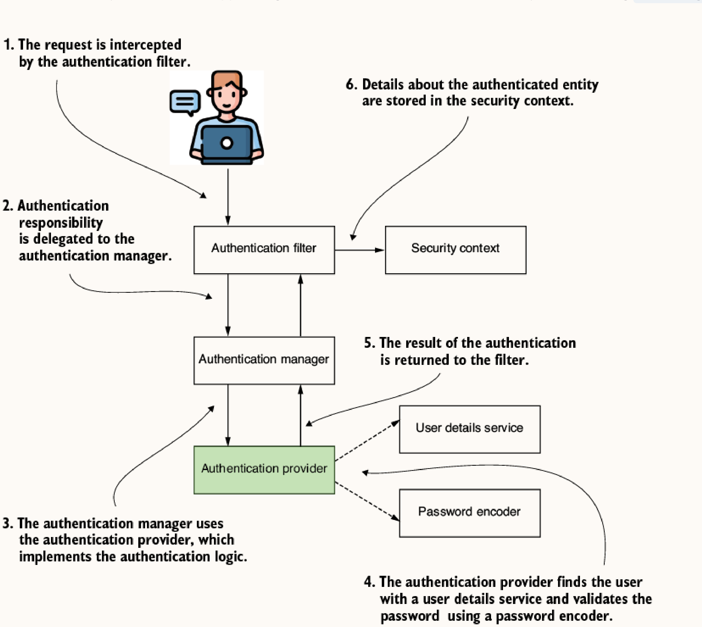

```java
@GetMapping("/")
public String home(OAuth2AuthenticationToken authentication) {
    // extract principal and process authentication details
    return "index.html";
}
```

---

## 16.2 Implementing an OAuth 2 client

Backend services calling other protected backend services act as pure OAuth 2 clients. In service-oriented systems, if we implement authentication over OAuth 2, the app typically uses the **client credentials grant type** to obtain an access token. Because this grant type doesn't imply a user, you don't need a redirect URI or an authorization URI.

> **Architectural Rule: Microservices & Multiple Clients**
> If you have a system with 5 different backend applications, **each of those 5 applications must be registered as its own unique client** on the Authorization Server (e.g., Keycloak). They should *never* share a single `client_id` and `client_secret`.
> - **Identity & Auditing**: The Authorization Server needs to know exactly which app is asking for the token so you can audit or revoke a compromised app's credentials without affecting the others.
> - **Least Privilege**: App A might only need `read:billing` scopes, while App B needs `write:inventory`. Registering them separately allows the Auth Server to restrict the specific scopes granted to each app.

**How it works:**
1. Ensure the authorization server accepts `AuthorizationGrantType.CLIENT_CREDENTIALS`.
2. App 1 sets `http.oauth2Client()` in `SecurityFilterChain`.
3. App 1 exposes a `ClientRegistrationRepository` using the `CLIENT_CREDENTIALS` grant type.
4. Define a `OAuth2AuthorizedClientManager` bean to handle the request logic. This object implements the logic for executing a specific grant type to get an access token.
5. Extract the access token using `clientManager.authorize(request)`.

**When to use:** 
For service-to-service communication requiring automated authentication with no end-user involvement.

Figure 16.8 reminds you of the client credentials grant type flow where the client authenticates against the token endpoint.
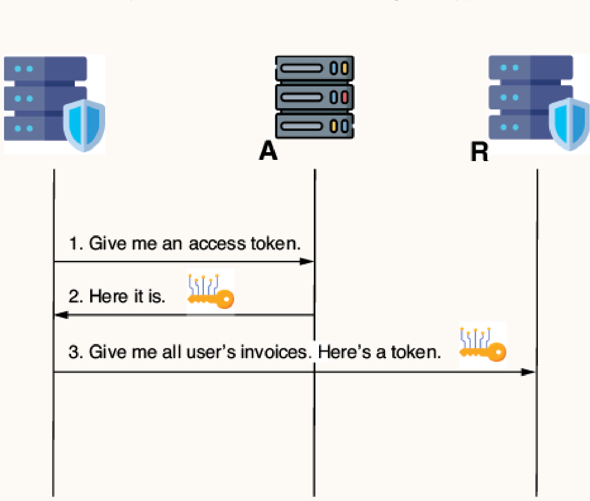

To prove that the app correctly retrieved the access token, Figure 16.9 demonstrates a simple flow where the app returns the token value in response to a demo endpoint call.
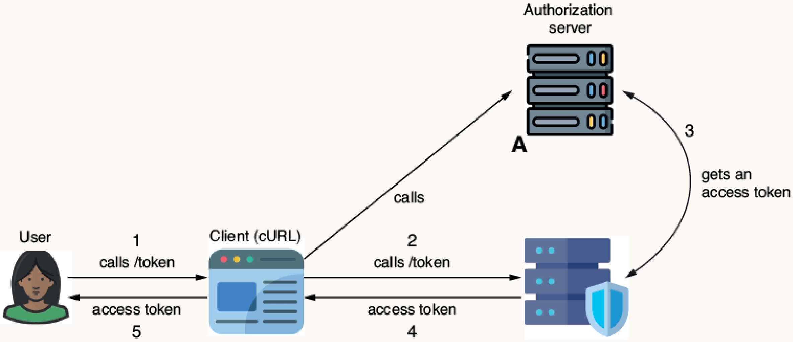

As shown in Figure 16.10, the controller uses a client manager to get the access token from the authorization server. 
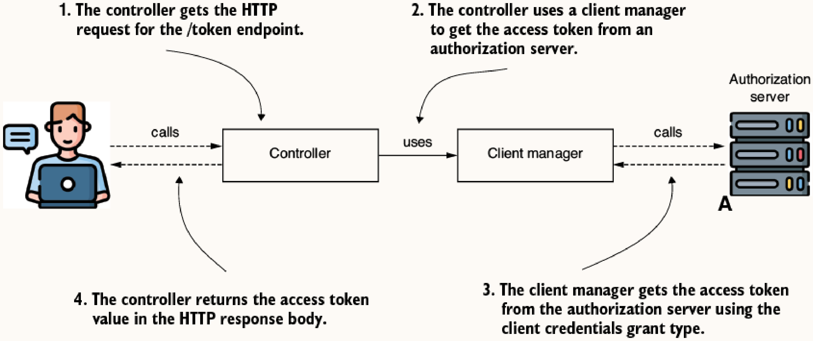

In a real-world app with correctly segregated responsibilities, the client manager would likely be used by a proxy object instead of directly by the controller, as depicted in Figure 16.11.
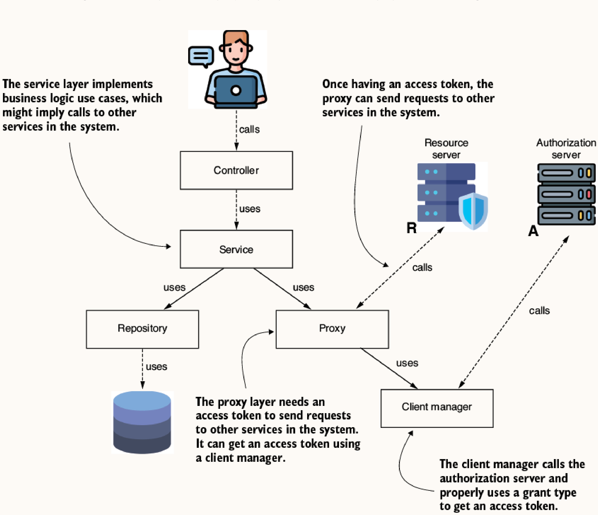

### Code Implementation

**1. Configuring OAuth 2 Client Security:**
```java
@Bean
public SecurityFilterChain securityFilterChain(HttpSecurity http) throws Exception {
    http.oauth2Client(Customizer.withDefaults()); // Designates the app as a client
    http.authorizeHttpRequests(c -> c.anyRequest().permitAll());
    return http.build();
}
```

**2. Configuring the Client Registration (Grant Type: Client Credentials):**
```java
@Bean
public ClientRegistrationRepository clientRegistrationRepository() {
    ClientRegistration c1 = ClientRegistration.withRegistrationId("1")
        .clientId("client")
        .clientSecret("secret")
        .authorizationGrantType(AuthorizationGrantType.CLIENT_CREDENTIALS)
        .clientAuthenticationMethod(ClientAuthenticationMethod.CLIENT_SECRET_BASIC)
        .tokenUri("http://localhost:7070/oauth2/token")
        .scope(OidcScopes.OPENID)
        .build();
    return new InMemoryClientRegistrationRepository(c1);
}
```

**3. Defining the Authorized Client Manager:**
```java
@Bean
public OAuth2AuthorizedClientManager oAuth2AuthorizedClientManager(
        ClientRegistrationRepository clientRegistrationRepository,
        OAuth2AuthorizedClientRepository auth2AuthorizedClientRepository) {
    
    var provider = OAuth2AuthorizedClientProviderBuilder.builder()
        .clientCredentials()
        .build();
        
    var cm = new DefaultOAuth2AuthorizedClientManager(
        clientRegistrationRepository,
        auth2AuthorizedClientRepository);
        
    cm.setAuthorizedClientProvider(provider);
    return cm;
}
```

**4. Obtaining the Access Token:**
```java
@RestController
public class DemoController {
    private final OAuth2AuthorizedClientManager clientManager;

    // constructor injected...

    @GetMapping("/token")
    public String token() {
        OAuth2AuthorizeRequest request = OAuth2AuthorizeRequest
            .withClientRegistrationId("1")
            .principal("client")
            .build();
            
        var client = clientManager.authorize(request);
        return client.getAccessToken().getTokenValue(); // Yields the requested token
    }
}
```
