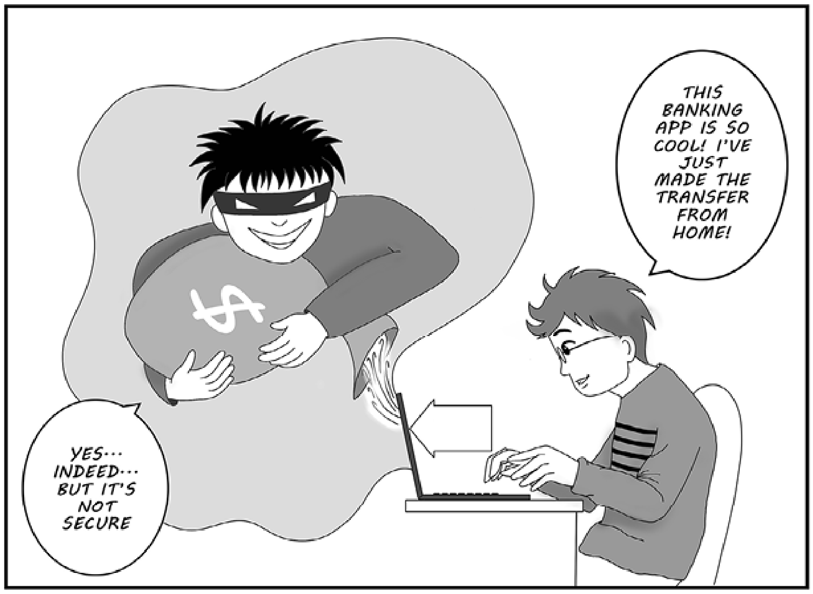
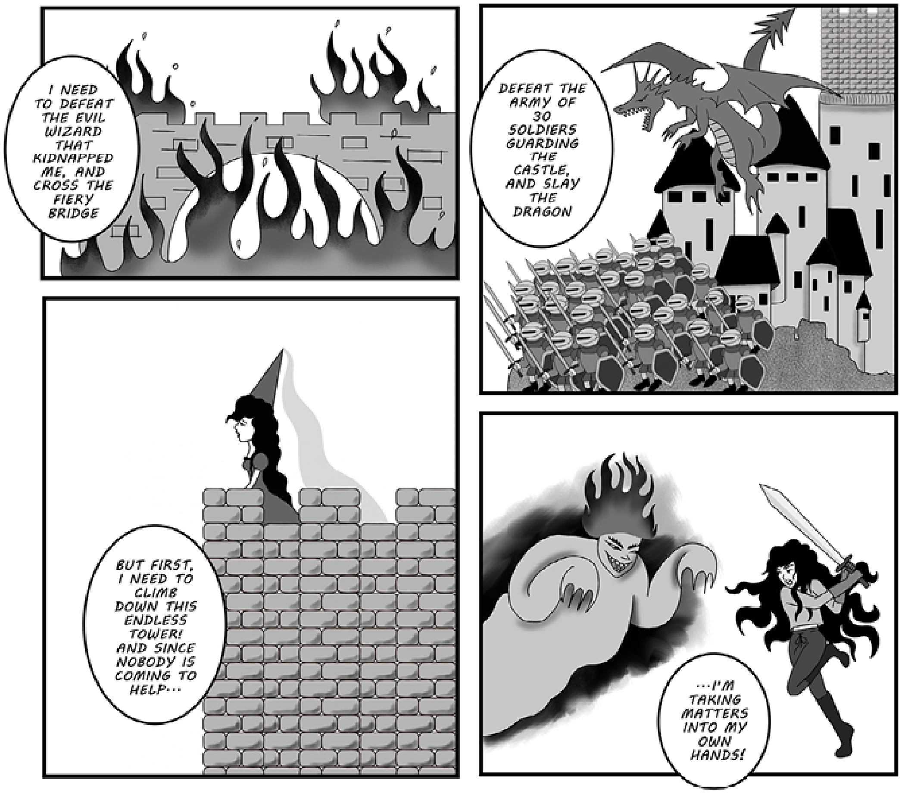
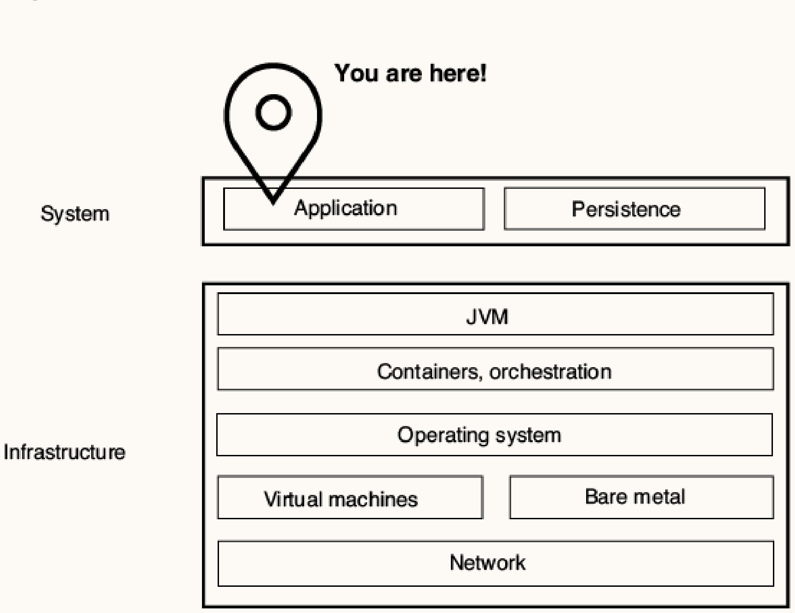
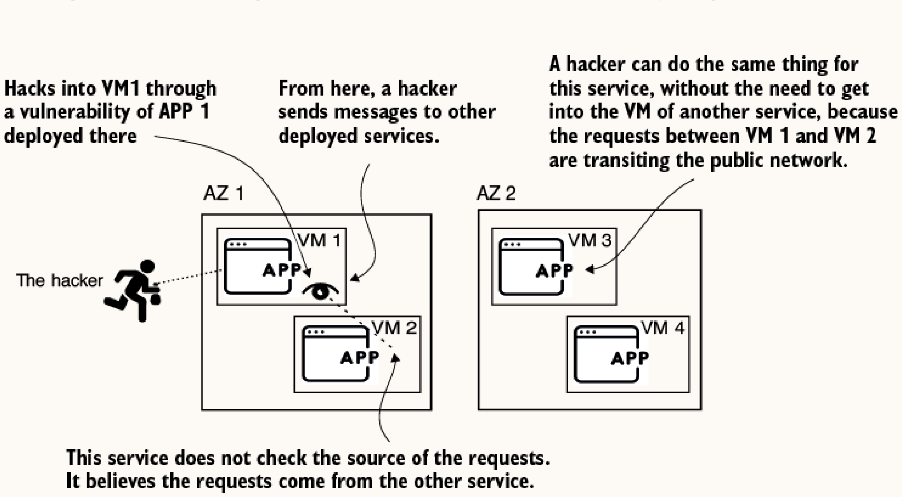

# 1 Security Today

## 1.1 Discovering Spring Security

- **Overview**: A powerful, highly customizable framework (Apache 2.0 license) for implementing application-level authentication, authorization, and protection against attacks in Spring applications.
- **How it works**: Leverages the Spring context, beans, annotations, and SpEL to define security components. It intercepts requests to validate permissions, apply encryption/hashing, and secure data transit. Spring Security intercepts calls between different parts of the system and can act on the data (e.g. encrypting or hashing).
- **Zero Trust & Data Transit**: In real-world implementations, communicating components often do not trust each other. Spring Security provides components that validate communication before the application uses any received data.
- **Alternatives**: Apache Shiro is a lighter option, but Spring Security is the de facto choice due to its extensive feature set and deep Spring integration.
- **Supported Apps & Versions**: Spring Security can be used for standard web servlets, reactive applications, and non-web apps. This book uses Java 21, Spring 6, and Spring Boot 3 (also compatible with Java 17).

## 1.2 What is Software Security?

- **Defense in Depth (Security in Layers)**: Security must be applied across multiple layers (network, deployment, storage), requiring a hacker to bypass several obstacles.

- **Application-Level Security**: Refers to everything an application should do to protect its execution environment and the data it processes/stores. Spring Security focuses on this top layer.
- **Sensitive Data & GDPR**: Applications often manage private user data. The General Data Protection Regulation (GDPR) in Europe mandates strict data protection, imposing severe penalties on systems that fail to secure user data.

- **Microservices & Availability Zones**: In distributed systems, if one application lacks security, a compromised virtual machine (VM) can be used to exploit other apps. Traffic between data centers (Availability Zones) often goes across public networks and needs special attention.
- **Authentication**: The process of identifying a user or system.
- **Authorization**: The process of deciding if an identified entity is allowed to perform an action or access specific data. Sometimes this is applied at the method level (method security) to restrict subsets of data or operations.
- **Data Protection**:
  - **Data at rest**: Persisted data. Must be secured (e.g., encrypted/hashed), especially secrets (credentials/keys) which should be in vaults.
  - **Data in transit**: Exchanged data. Must be validated and secured against interception or tampering.
  - **In-memory**: Sensitive data kept in the heap can be exposed via heap dumps; memory footprint of secrets must be minimized.

## 1.3 Why is Security Important?
- **Consequences**: Breaches lead to financial loss, ruined brand reputation, trust issues, and legal penalties (e.g., GDPR).
- **Proactive vs. Reactive**: The cost of a successful attack far exceeds the investment required to implement strong security upfront.
- **Common Risks**: Even minor mistakes like broken authentication, CSRF, or logging sensitive data can cause catastrophic vulnerabilities.

## 1.4 What will you learn in this book?
- The architecture and basic components of Spring Security.
- Authentication and authorization, including OAuth 2 and OpenID Connect flows for production-ready apps.
- Implementing security across different application layers.
- Configuration styles and best practices.
- Using Spring Security for reactive applications.
- Testing security implementations.

## Summary
- Apply security in layers (defense in depth).
- Security is a cross-cutting concern to be integrated from day one.
- Spring Security is the standard for securing Spring applications.
