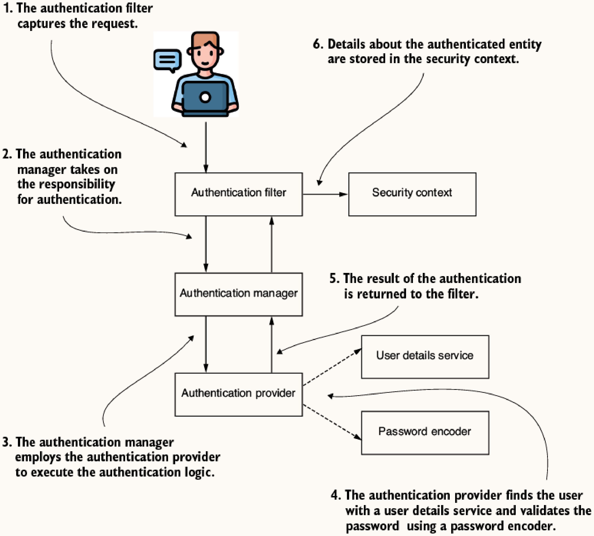
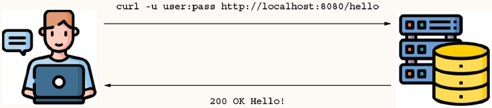
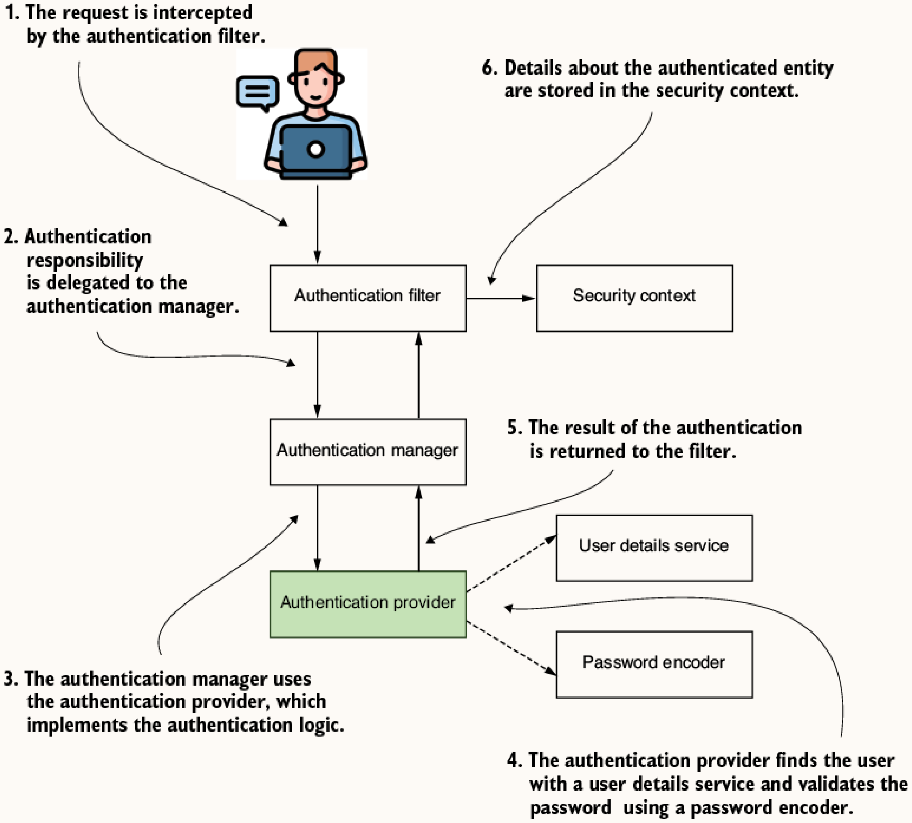

# Chapter 2: Hello, Spring Security

## Core Components

- **`Authentication Filter`**: Intercepts the request and delegates it to the `AuthenticationManager`. Based on the response, it configures the `SecurityContext`.
- **`AuthenticationManager`**: Uses the `AuthenticationProvider` to process authentication.
- **`AuthenticationProvider`**: Implements the actual authentication logic. It delegates finding the user to a `UserDetailsService` and verifying the password to a `PasswordEncoder`.
- **`UserDetailsService`**: Manages user details (username, password, authorities). Predefined implementation: `InMemoryUserDetailsManager`.
- **`PasswordEncoder`**: Hashes passwords and verifies matches. (e.g., `NoOpPasswordEncoder` for plain text - not for production).
- **`SecurityContext`**: Holds authentication data after a successful process. The security context will hold the data until the action ends.
- **`SecurityFilterChain`**: Configures endpoint authorization, authentication methods (e.g., HTTP Basic), and security rules (e.g., CSRF, CORS).

## Default Behavior

To test the default behavior, create a simple REST controller:

```java
@RestController
public class HelloController {

    @GetMapping("/hello")
    public String hello() {
        return "Hello!";
    }
}
```


- Adding `spring-boot-starter-security` enables default security.
- Secures all endpoints.
- Auto-generates a `user` with a random UUID password printed to the console on startup.
- Uses **HTTP Basic** and **Form Login** by default.
- **HTTP Basic**: The most straightforward access authentication method. It requires the client to send a username and password in the HTTP `Authorization` header, prefixed by `Basic ` and encoded in Base64. Note that Base64 is only an encoding, not encryption; HTTPS is required for confidentiality.
  - You can manually encode the credentials: `echo -n user:password | base64`
  - And pass it via header: `curl -H "Authorization: Basic <base64>" localhost:8080/hello`

### HTTP vs. HTTPS

Because HTTP Basic sends credentials encoded in Base64, you should configure HTTPS. You can use OpenSSL to generate a self-signed certificate for testing:

```bash
openssl req -newkey rsa:2048 -x509 -keyout key.pem -out cert.pem -days 365
openssl pkcs12 -export -in cert.pem -inkey key.pem -out certificate.p12 -name "certificate"
```

Configure the Spring Boot application by adding the certificate to the `resources` folder and configuring `application.properties`:

```properties
server.ssl.key-store-type=PKCS12
server.ssl.key-store=classpath:certificate.p12
server.ssl.key-store-password=12345
```

When calling the endpoint via cURL, use `-k` to skip testing the certificate's authenticity: `curl -k -u user:password https://localhost:8080/hello`.

## Overriding Defaults

### Customizing User Management
Define beans for `UserDetailsService` and `PasswordEncoder`:

```java
@Configuration
public class ProjectConfig {

    @Bean
    public UserDetailsService userDetailsService() {
        var user = User.withUsername("john")
            .password("12345")
            .authorities("read")
            .build();
        return new InMemoryUserDetailsManager(user);
    }

    @Bean
    public PasswordEncoder passwordEncoder() {
        return NoOpPasswordEncoder.getInstance();
    }
}
```

### Configuring Authorization and Authentication Methods
Use `SecurityFilterChain` bean to customize HTTP security:

```java
@Configuration
public class ProjectConfig {

    @Bean
    public SecurityFilterChain configure(HttpSecurity http) throws Exception {
        http.httpBasic(Customizer.withDefaults()); // Use HTTP Basic
        http.authorizeHttpRequests(
            c -> c.anyRequest().authenticated() // All requests require auth
            // c -> c.anyRequest().permitAll() // Allow all requests without auth
        );
        return http.build();
    }
}
```

### Alternative Configuration Styles

Instead of defining `UserDetailsService` and `PasswordEncoder` as beans, you can register them directly inside the `SecurityFilterChain` bean:

```java
@Configuration
public class ProjectConfig {

    @Bean
    public SecurityFilterChain configure(HttpSecurity http) throws Exception {
        http.httpBasic(Customizer.withDefaults());
        http.authorizeHttpRequests(c -> c.anyRequest().authenticated());

        var user = User.withUsername("john")
            .password("12345")
            .authorities("read")
            .build();
        var userDetailsService = new InMemoryUserDetailsManager(user);
        
        http.userDetailsService(userDetailsService);

        return http.build();
    }

    @Bean
    public PasswordEncoder passwordEncoder() {
        return NoOpPasswordEncoder.getInstance();
    }
}
```

### Custom Authentication Logic

Implement `AuthenticationProvider` to replace standard `UserDetailsService`/`PasswordEncoder` delegation. The `AuthenticationProvider` is loosely coupled, allowing custom logic if default implementations don't fit application requirements:

```java
@Component
public class CustomAuthenticationProvider implements AuthenticationProvider {

    @Override
    public Authentication authenticate(Authentication authentication) throws AuthenticationException {
        String username = authentication.getName();
        String password = String.valueOf(authentication.getCredentials());

        if ("john".equals(username) && "12345".equals(password)) {
            return new UsernamePasswordAuthenticationToken(username, password, Arrays.asList());
        } else {
            throw new AuthenticationCredentialsNotFoundException("Error!");
        }
    }

    @Override
    public boolean supports(Class<?> authenticationType) {
        return UsernamePasswordAuthenticationToken.class.isAssignableFrom(authenticationType);
    }
}
```

Register the custom provider in configuration:

```java
@Configuration
public class ProjectConfig {

    private final CustomAuthenticationProvider authenticationProvider;

    public ProjectConfig(CustomAuthenticationProvider authenticationProvider) {
        this.authenticationProvider = authenticationProvider;
    }

    @Bean
    public SecurityFilterChain configure(HttpSecurity http) throws Exception {
        http.httpBasic(Customizer.withDefaults());
        http.authenticationProvider(authenticationProvider);
        http.authorizeHttpRequests(c -> c.anyRequest().authenticated());
        return http.build();
    }
}
```

### Multiple Configuration Classes
For maintainability, split configurations by responsibility:

**`UserManagementConfig`**: Defines `UserDetailsService` and `PasswordEncoder` beans.
```java
@Configuration
public class UserManagementConfig {

    @Bean
    public UserDetailsService userDetailsService() {
        var userDetailsService = new InMemoryUserDetailsManager();
        var user = User.withUsername("john")
            .password("12345")
            .authorities("read")
            .build();
        userDetailsService.createUser(user);
        return userDetailsService;
    }

    @Bean
    public PasswordEncoder passwordEncoder() {
        return NoOpPasswordEncoder.getInstance();
    }
}
```

**`WebAuthorizationConfig`**: Defines `SecurityFilterChain` bean for HTTP rules.
```java
@Configuration
public class WebAuthorizationConfig {

    @Bean
    public SecurityFilterChain configure(HttpSecurity http) throws Exception {
        http.httpBasic(Customizer.withDefaults());
        http.authorizeHttpRequests(c -> c.anyRequest().authenticated());
        return http.build();
    }
}
```
