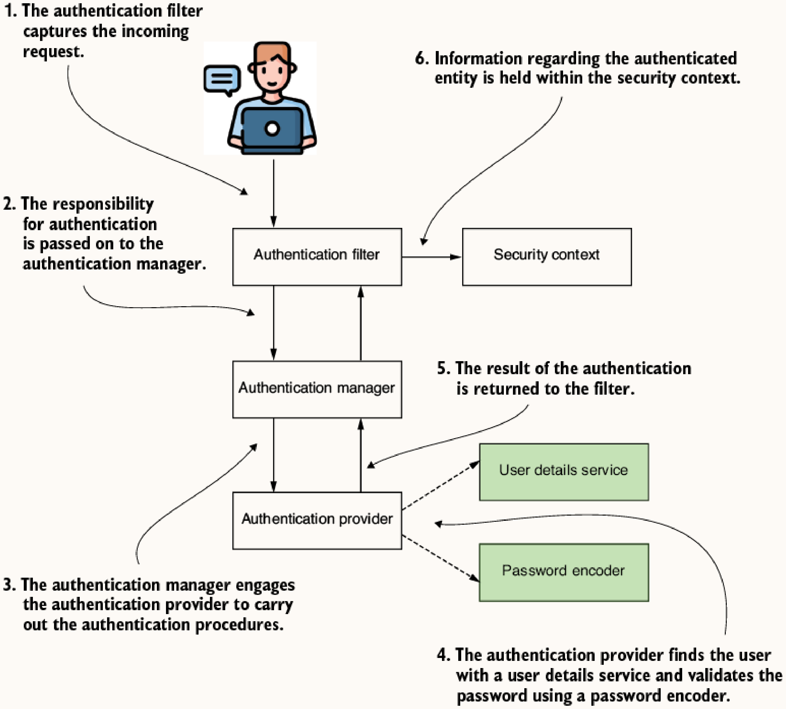
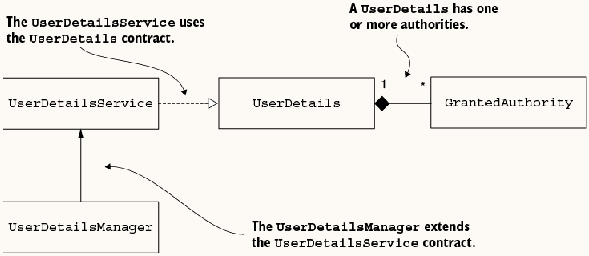
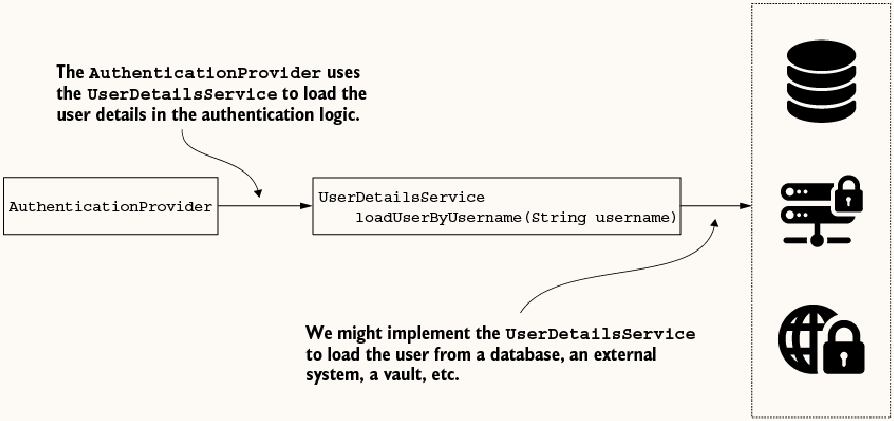
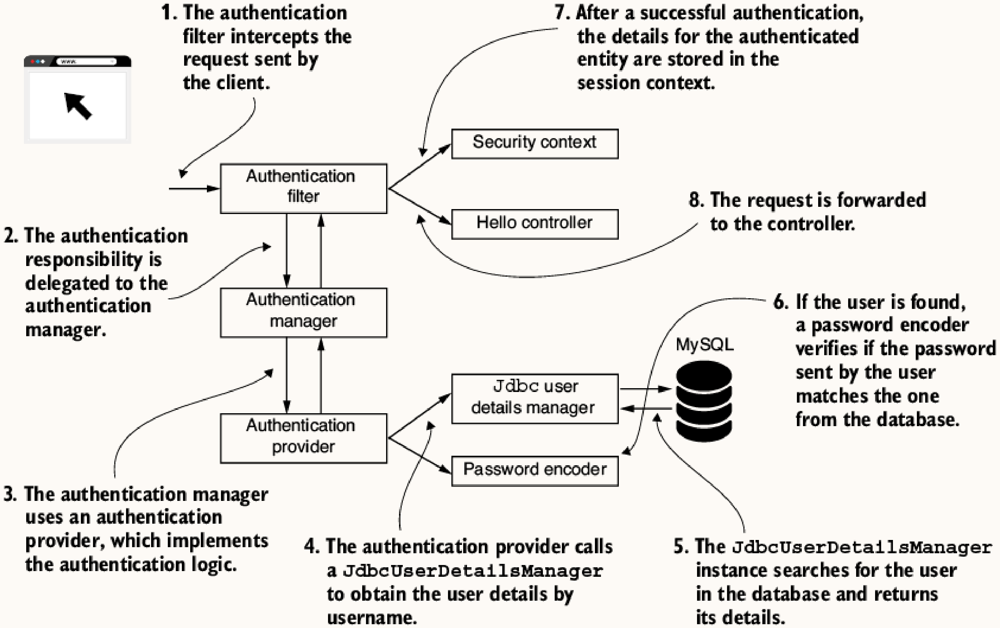

# 3 Managing users

## Core Interfaces
* `UserDetails`: Describes a user.
* `GrantedAuthority`: Defines actions/privileges a user can execute.
* `UserDetailsService`: Retrieves a user by username for authentication.
* `UserDetailsManager`: Extends `UserDetailsService` with create/update/delete operations.

## 3.1 Implementing authentication in Spring Security
**Authentication Flow**: `AuthenticationFilter` -> `AuthenticationManager` -> `AuthenticationProvider` -> uses `UserDetailsService` and `PasswordEncoder`.



As part of user management, `UserDetailsService` and `UserDetailsManager` illustrate the **Interface Segregation Principle**. If an app only needs to authenticate users, implementing `UserDetailsService` is enough. For adding/modifying/deleting users, `UserDetailsManager` is required.



## 3.2 Describing the user

### 3.2.1 UserDetails Contract
```java
public interface UserDetails extends Serializable {
  String getUsername();
  String getPassword();
  Collection<? extends GrantedAuthority> getAuthorities();
  boolean isAccountNonExpired();
  boolean isAccountNonLocked();
  boolean isCredentialsNonExpired();
  boolean isEnabled();
}
```

**Note**: The four boolean methods relate to authorizing the user based on account status. They are designed to return `true` for a successful/positive scenario, even if the names sound like double negations.

### 3.2.2 GrantedAuthority Contract
Represents a privilege granted to a user (e.g., READ, WRITE). A user must have at least one authority.
```java
public interface GrantedAuthority extends Serializable {
  String getAuthority();
}
```
Implementation examples:
```java
GrantedAuthority g1 = () -> "READ";
GrantedAuthority g2 = new SimpleGrantedAuthority("READ");
```

### 3.2.3 & 3.2.4 UserDetails Implementation & Builder
Custom implementation example:
```java
public class SimpleUser implements UserDetails {
  private final String username;
  private final String password;
  
  public SimpleUser(String username, String password) {
    this.username = username;
    this.password = password;
  }
  
  @Override public String getUsername() { return this.username; }
  @Override public String getPassword() { return this.password; }
  // ... implement remaining boolean methods (usually return true)
}
```
Using the Spring Security `User` Builder:
```java
UserDetails u = User.withUsername("bill")
  .password("12345")
  .authorities("read", "write")
  .accountExpired(false)
  .disabled(true)
  .build();
```

### 3.2.5 Combining Multiple Responsibilities
To decouple persistence from security, use a wrapper class:
```java
@Entity
public class User { // JPA entity only
  @Id private int id;
  private String username;
  private String password;
  private String authority;
  // Getters/setters
}

public class SecurityUser implements UserDetails { // Security only
  private final User user;
  public SecurityUser(User user) { this.user = user; }
  @Override public String getUsername() { return user.getUsername(); }
  @Override public String getPassword() { return user.getPassword(); }
  @Override public Collection<? extends GrantedAuthority> getAuthorities() { 
    return List.of(() -> user.getAuthority()); 
  }
}
```

## 3.3 Instructing Spring Security on how to manage users

### 3.3.1 & 3.3.2 UserDetailsService Contract & Implementation
```java
public interface UserDetailsService {
  UserDetails loadUserByUsername(String username) throws UsernameNotFoundException;
}
```

The `UsernameNotFoundException` extends `AuthenticationException`, which is a `RuntimeException`.



Example in-memory implementation:
```java
public class InMemoryUserDetailsService implements UserDetailsService {
  private final List<UserDetails> users;
  public InMemoryUserDetailsService(List<UserDetails> users) { this.users = users; }
  
  @Override
  public UserDetails loadUserByUsername(String username) throws UsernameNotFoundException {
    return users.stream()
      .filter(u -> u.getUsername().equals(username))
      .findFirst()
      .orElseThrow(() -> new UsernameNotFoundException("User not found"));
  }
}
```

Configuration to register this service:
```java
@Configuration
public class ProjectConfig {
  @Bean
  public UserDetailsService userDetailsService() {
    UserDetails u = new User("john", "12345", "read");
    List<UserDetails> users = List.of(u);
    return new InMemoryUserDetailsService(users);
  }
}
```

### 3.3.3 UserDetailsManager Contract
```java
public interface UserDetailsManager extends UserDetailsService {
  void createUser(UserDetails user);
  void updateUser(UserDetails user);
  void deleteUser(String username);
  void changePassword(String oldPassword, String newPassword);
  boolean userExists(String username);
}
```

#### InMemoryUserDetailsManager

**How it works**: Stores and manages user details directly in application memory. It is non-persistent; any changes made at runtime are lost when the application restarts.
**When to use**: Primarily for rapid prototyping, testing, or very simple applications where users are static and hardcoded on startup.

#### JdbcUserDetailsManager

**How it works**: Manages users in a relational SQL database via JDBC. Defaults to expecting `users` (username, password, enabled) and `authorities` (username, authority) tables.
**When to use**: Ideal for standard web applications with a dedicated relational database where user accounts need to be persistent, securely managed, and frequently updated at runtime.

Default table schemas expected by `JdbcUserDetailsManager`:
```sql
CREATE TABLE IF NOT EXISTS `users` (
  `id` INT NOT NULL AUTO_INCREMENT,
  `username` VARCHAR(45) NOT NULL,
  `password` VARCHAR(45) NOT NULL,
  `enabled` INT NOT NULL,
  PRIMARY KEY (`id`));

CREATE TABLE IF NOT EXISTS `authorities` (
  `id` INT NOT NULL AUTO_INCREMENT,
  `username` VARCHAR(45) NOT NULL,
  `authority` VARCHAR(45) NOT NULL,
  PRIMARY KEY (`id`));
```



Configuration:
```java
@Bean
public UserDetailsService userDetailsService(DataSource dataSource) {
  var userDetailsManager = new JdbcUserDetailsManager(dataSource);
  // Optionally override default queries
  userDetailsManager.setUsersByUsernameQuery("select username, password, enabled from users where username = ?");
  userDetailsManager.setAuthoritiesByUsernameQuery("select username, authority from spring.authorities where username = ?");
  return userDetailsManager;
}
```

#### LdapUserDetailsManager

**How it works**: Manages users in an external LDAP directory.
**What is LDAP?**: LDAP (Lightweight Directory Access Protocol) is an open, vendor-neutral protocol for accessing and maintaining distributed directory information services. It operates as a hierarchical, tree-like structure (similar to a file system) rather than a relational database. This makes it highly optimized for read-heavy operations like looking up user credentials. Large enterprises use LDAP (such as Microsoft Active Directory) for central identity management, allowing an employee to use a single set of credentials to authenticate across their workstation, email, intranet portals, and external applications.
**When to use**: When your application is deployed in a corporate environment that already utilizes a centralized directory service (like Active Directory or OpenLDAP) for user management and authentication.

To use an embedded LDAP server, add the following dependencies:
```xml
<dependency>
  <groupId>org.springframework.security</groupId>
  <artifactId>spring-security-ldap</artifactId>
</dependency>
<dependency>
  <groupId>com.unboundid</groupId>
  <artifactId>unboundid-ldapsdk</artifactId>
</dependency>
```

And in `application.properties`:
```properties
spring.ldap.embedded.ldif=classpath:server.ldif
spring.ldap.embedded.base-dn=dc=springframework,dc=org
spring.ldap.embedded.port=33389
```

An example `server.ldif` file defines the entities:
```ldif
dn: dc=springframework,dc=org
objectclass: top
objectclass: domain
objectclass: extensibleObject
dc: springframework

dn: ou=groups,dc=springframework,dc=org
objectclass: top
objectclass: organizationalUnit
ou: groups

dn: uid=john,ou=groups,dc=springframework,dc=org
objectclass: top
objectclass: person
objectclass: organizationalPerson
objectclass: inetOrgPerson
cn: John
sn: John
uid: john
userPassword: 12345
```

Configuration:
```java
@Bean
public UserDetailsService userDetailsService() {
  var cs = new DefaultSpringSecurityContextSource("ldap://127.0.0.1:33389/dc=springframework,dc=org");
  cs.afterPropertiesSet();
  
  var manager = new LdapUserDetailsManager(cs);
  manager.setUsernameMapper(new DefaultLdapUsernameToDnMapper("ou=groups", "uid"));
  manager.setGroupSearchBase("ou=groups");
  return manager;
}
```
