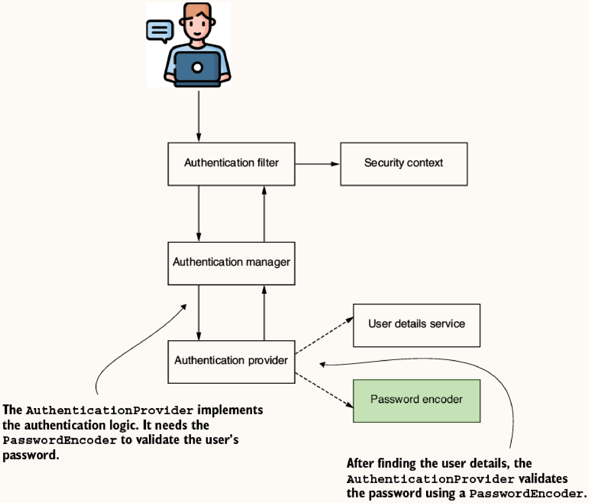
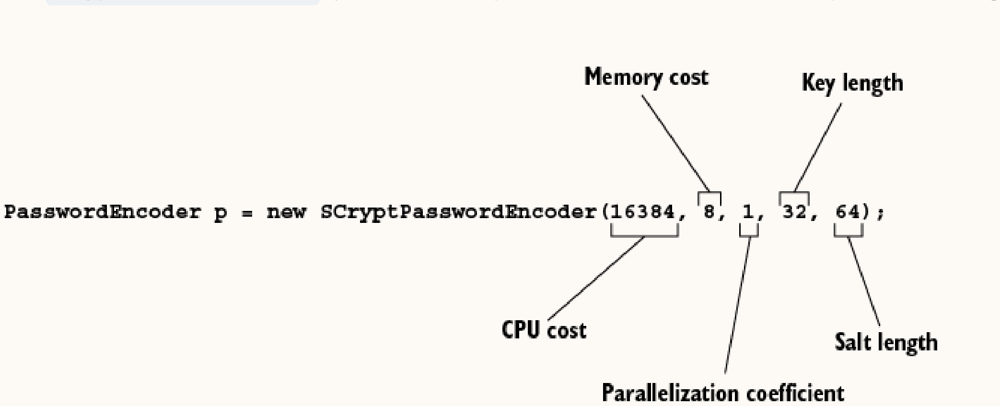
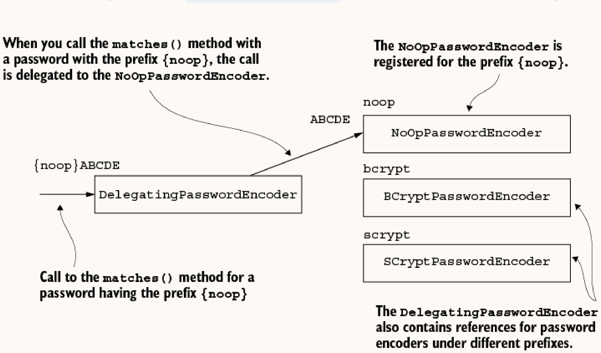
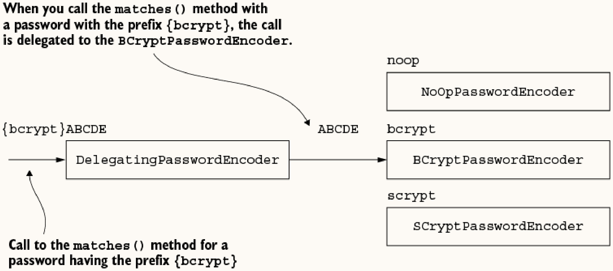

# Chapter 4: Managing Passwords

## 4.1 Using Password Encoders
The `PasswordEncoder` interface dictates how passwords are encrypted/hashed and validated.



### 4.1.1 The PasswordEncoder Contract
```java
public interface PasswordEncoder {
    String encode(CharSequence rawPassword);
    boolean matches(CharSequence rawPassword, String encodedPassword);
    default boolean upgradeEncoding(String encodedPassword) { return false; }
}
```
- `encode()`: Transforms (hashes/encrypts) the raw password.
- `matches()`: Verifies a raw password against an encoded password.
- `upgradeEncoding()`: Indicates if an encoded password needs re-encoding for better security.

### 4.1.2 Implementing your PasswordEncoder
You can create a custom `PasswordEncoder` by implementing the interface (e.g., overriding `encode()` and `matches()`). For example, you might create a `PlainTextPasswordEncoder` that returns the raw string, or a `Sha512PasswordEncoder` using `MessageDigest`. However, Spring Security already provides excellent implementations out of the box.

### 4.1.3 Provided PasswordEncoder Implementations
Spring Security provides several implementations. Here is how they work and when you should use them:

- **`NoOpPasswordEncoder`**
  - **How it works**: It applies no encoding whatsoever, treating passwords as plain text.
  - **When to use**: **Never in production.** Use this exclusively for quick prototypes, demos, or isolated tests where security is irrelevant.

- **`StandardPasswordEncoder`**
  - **How it works**: Uses the SHA-256 hashing algorithm.
  - **When to use**: **Never.** It is deprecated and obsolete. Simple SHA-256 is too fast and completely vulnerable to modern GPU brute-force attacks.

- **`BCryptPasswordEncoder`**
  - **How it works**: Implements the bcrypt algorithm. It automatically generates a random salt and incorporates a "work factor" (log rounds). The computational cost scales exponentially as `2^log_rounds` (valid from 4 to 31), intentionally slowing down the hashing process to thwart brute-force attacks.
  - **When to use**: **This is the recommended default choice.** It is highly secure, thoroughly tested, and perfectly balances performance with protection for the vast majority of applications.
  ```java
  PasswordEncoder p = new BCryptPasswordEncoder(4); // 2^4 iterations
  ```

- **`Pbkdf2PasswordEncoder`**
  - **How it works**: Uses Password-Based Key Derivation Function 2 (PBKDF2). It repeatedly hashes the password (using algorithms like `PBKDF2WithHmacSHA256` or `SHA512`) thousands of times to derive a cryptographic key, eating up CPU time.
  - **When to use**: Use this if your organization or government contract strictly requires **FIPS-compliant** algorithms. (Bcrypt is not FIPS-approved, whereas PBKDF2 usually is).

- **`SCryptPasswordEncoder`**
  - **How it works**: Uses the scrypt algorithm. Unlike bcrypt or PBKDF2 which only scale computationally (CPU time), scrypt scales in **memory consumption** (RAM) as well. You configure the CPU cost, memory cost, parallelization, and key length.
  - **When to use**: Use this when you need extreme protection against custom-built password cracking hardware (like ASICs or GPU clusters). The memory-hard nature of scrypt severely limits how fast these specialized machines can guess passwords.



### 4.1.4 DelegatingPasswordEncoder
Delegates to different encoders based on a prefix in the encoded password (e.g., `{bcrypt}12345`). Useful for migrating hashing algorithms without invalidating existing credentials. If a password doesn't have a prefix, it uses a configured default encoder.




```java
@Bean
public PasswordEncoder passwordEncoder() {
    Map<String, PasswordEncoder> encoders = new HashMap<>();
    encoders.put("noop", NoOpPasswordEncoder.getInstance());
    encoders.put("bcrypt", new BCryptPasswordEncoder());
    return new DelegatingPasswordEncoder("bcrypt", encoders); // 'bcrypt' is default
}
```

**Convenience Factory:**
Spring Security offers a convenient way to create a `DelegatingPasswordEncoder` with a map to all standard provided implementations (defaulting to bcrypt):
```java
PasswordEncoder passwordEncoder = PasswordEncoderFactories.createDelegatingPasswordEncoder();
```

**Cryptography Terms:**
- **Encoding**: Any transformation of input (e.g., reversing a string).
- **Encryption**: Two-way transformation using keys. Represented as `(x, k) -> y` (encryption) and `(y, k) -> x` (decryption).
  - *Symmetric*: Same key `k` is used for both operations.
  - *Asymmetric*: Uses a key pair. A public key `k1` encrypts `(x, k1) -> y`, and a private key `k2` decrypts `(y, k2) -> x`.
- **Hashing**: One-way transformation `x -> y`. Cannot reverse to get `x`. Matching is done via `(x, y) -> boolean`.
  - *Salt*: A random value added to the input `(x, salt) -> y` to make reverse-engineering harder.

**Table 4.1: Main Authentication Contracts**
| Contract | Description |
| :--- | :--- |
| `UserDetails` | Represents the user as seen by Spring Security. |
| `GrantedAuthority` | Defines an action allowable to the user (read, write, etc.). |
| `UserDetailsService` | Retrieves user details by username. |
| `UserDetailsManager` | Mutates users (extends `UserDetailsService`). |
| `PasswordEncoder` | Specifies how the password is encrypted/hashed and validated. |

## 4.2 Spring Security Crypto Module (SSCM)
Provides out-of-the-box cryptographic utilities without extra dependencies.

### 4.2.1 Key Generators
Generates keys for hashing/encryption algorithms.
- **`StringKeyGenerator`**: Returns keys as hex strings (often used for salts).
  ```java
  String salt = KeyGenerators.string().generateKey();
  ```
- **`BytesKeyGenerator`**: Returns keys as `byte[]`.
  ```java
  BytesKeyGenerator secure = KeyGenerators.secureRandom(16); // Unique keys
  BytesKeyGenerator shared = KeyGenerators.shared(16);       // Same key every call
  ```

### 4.2.2 Encryptors
Encrypts and decrypts data.
- **`BytesEncryptor`**: Handles `byte[]`.
  - `Encryptors.standard(password, salt)`: 256-bit AES CBC.
  - `Encryptors.stronger(password, salt)`: 256-bit AES GCM.
- **`TextEncryptor`**: Handles `String`.
  - `Encryptors.text(password, salt)`: Uses standard AES CBC.
  - `Encryptors.delux(password, salt)`: Uses stronger AES GCM.
  - `Encryptors.noOpText()`: Dummy encryptor (no encryption).
