# 5 A web app's security begins with filters

In Spring Security, HTTP filters delegate different responsibilities to an HTTP request. They generally manage each responsibility that must be applied to the request, forming a chain of responsibilities. A filter receives a request, executes its logic, and eventually delegates the request to the next filter in the chain.

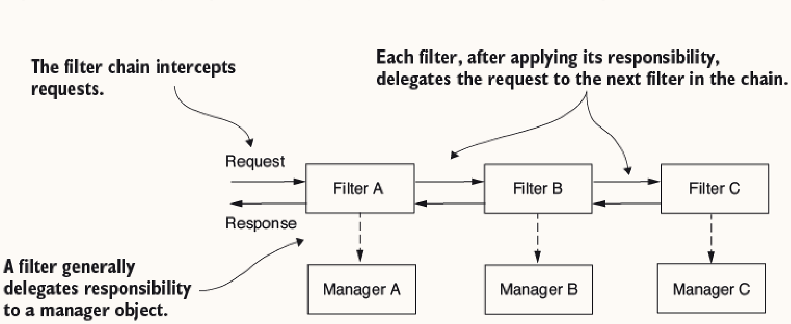

This is similar to going through airport security, where you pass through multiple checkpoints (ticket, passport, security) before boarding.

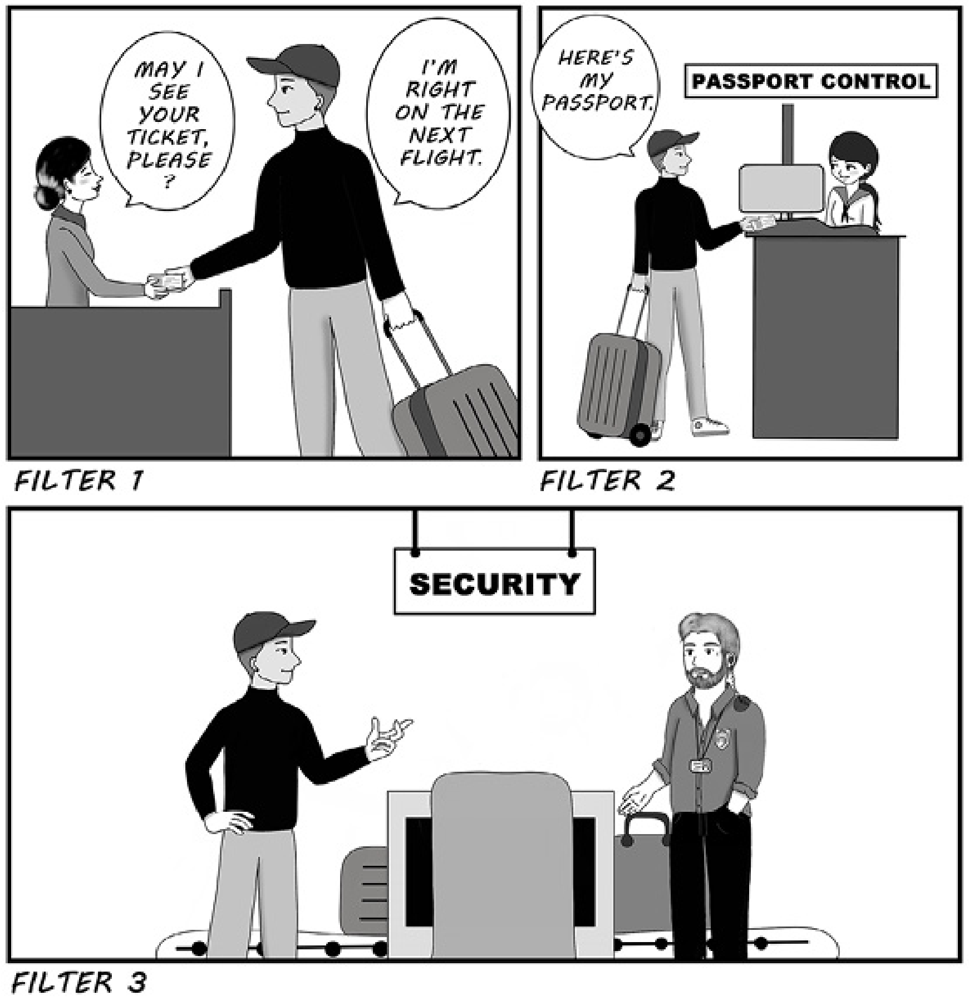

Filters implement the `Filter` interface from the `jakarta.servlet` package. (**Note**: Starting with Spring Boot 3, Jakarta EE replaces the old Java EE specification, so these types moved from `javax.servlet` to `jakarta.servlet`). As for any other HTTP filter, you need to override the `doFilter()` method to implement its logic. This method receives `ServletRequest` (details about the request), `ServletResponse` (alters the response), and `FilterChain` (forwards request to next filter).

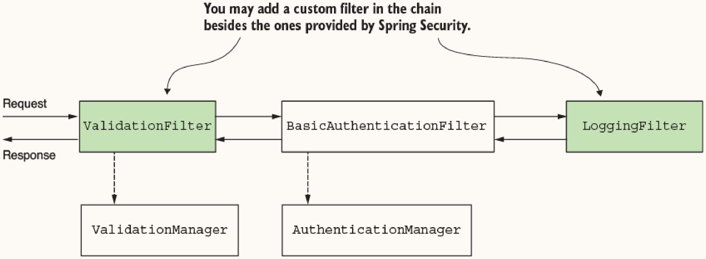

Core filters provided:
* `BasicAuthenticationFilter`: Handles HTTP Basic authentication.
* `CsrfFilter`: CSRF protection.
* `CorsFilter`: CORS authorization rules.

Filter ordering can be seen in the `SecurityWebFiltersOrder` enum. You add a new filter to the chain relative to another one, or you can add a filter either before, after, or at the position of a known filter. Each position is an index (a number), also referred to as "the order."

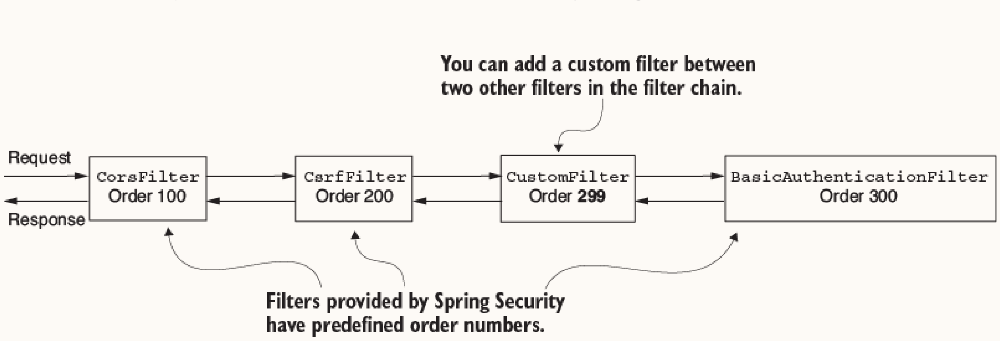

**Note**: You can add two or more filters in the same position. If multiple filters have the same position, the order in which they are called is not defined. Spring Security doesn't guarantee the order in which they will act.

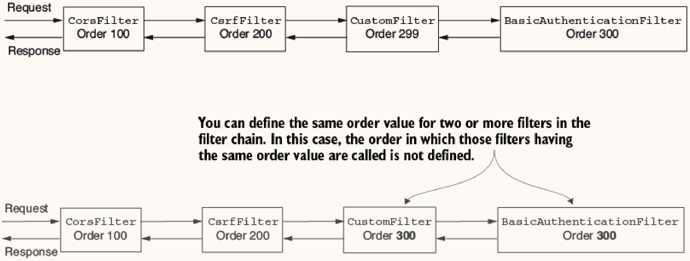

## Custom Filters

### 1. Adding a Filter Before an Existing One

**How it works:**  
You insert your custom filter into the filter chain before a specified target filter class using `HttpSecurity.addFilterBefore()`. Your custom filter will receive the request, execute its logic, and then (if it doesn't block the request) pass it to the target filter.

**When to use:**  
This approach is useful when you want to execute certain logic or checks before the next filter (often an authentication filter) performs its expensive or critical work. 

**Real-world architectural scenario:**  
- **Token Extraction:** Placing a custom authentication token extractor before the standard auth filter so that the standard filter receives a pre-processed token.
- **Request Validation:** Validating mandatory headers, schema, or structural requirements before authentication. If the format isn't valid, you reject the request early to save resource-consuming actions (e.g., database lookups during auth).
- **Rate Limiting or IP Filtering:** Dropping requests from blocked IPs or rate-limiting users before attempting any authentication or processing.

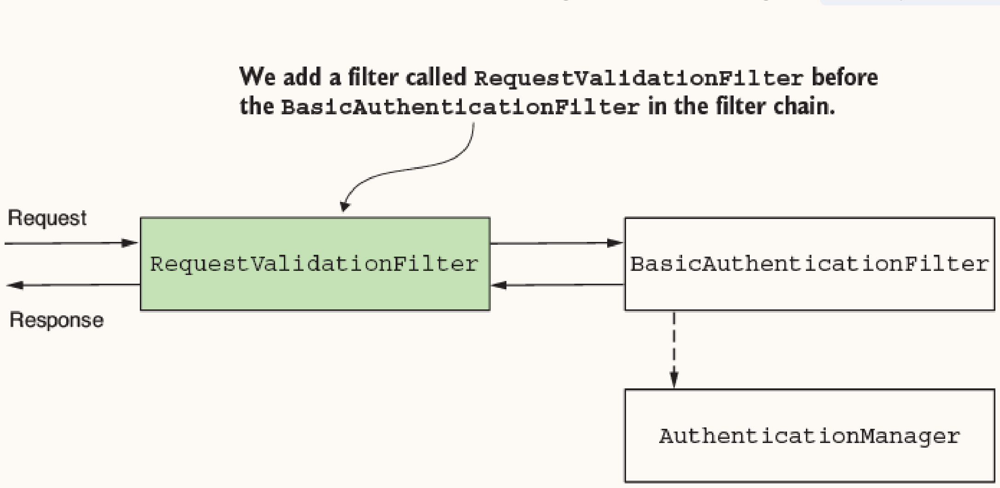
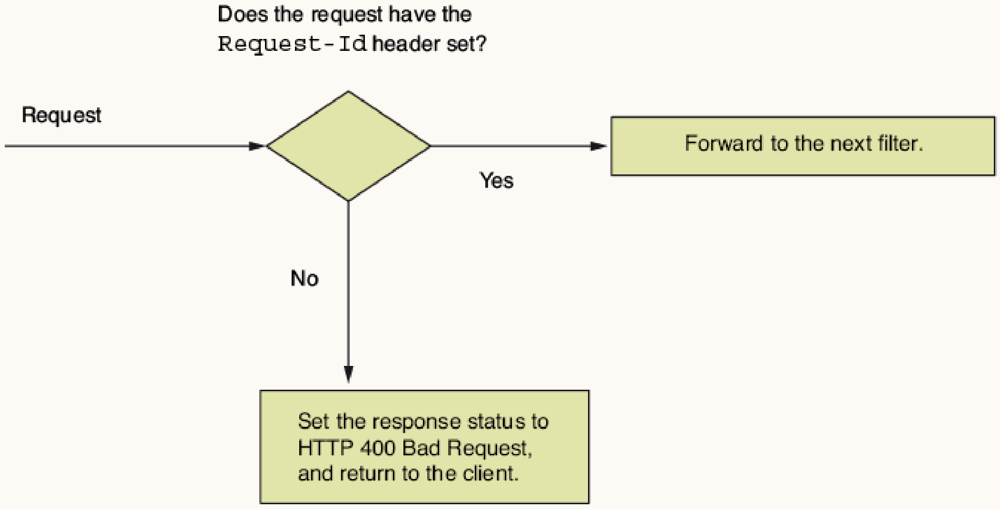

Example: Validating a mandatory header before authentication.

```java
public class RequestValidationFilter implements Filter {
  @Override
  public void doFilter(ServletRequest request, ServletResponse response, FilterChain filterChain) throws IOException, ServletException {
    var httpRequest = (HttpServletRequest) request;
    var httpResponse = (HttpServletResponse) response;
    String requestId = httpRequest.getHeader("Request-Id");

    if (requestId == null || requestId.isBlank()) {
      httpResponse.setStatus(HttpServletResponse.SC_BAD_REQUEST);
      return; // Stop filter chain
    }
    filterChain.doFilter(request, response); // Proceed
  }
}

@Configuration
public class ProjectConfig {
  @Bean
  public SecurityFilterChain securityFilterChain(HttpSecurity http) throws Exception {
    http.addFilterBefore(new RequestValidationFilter(), BasicAuthenticationFilter.class)
        .authorizeRequests(c -> c.anyRequest().permitAll());
    return http.build();
  }
}

To test this functionality, we can define a simple controller:

```java
@RestController
public class HelloController {
  @GetMapping("/hello")
  public String hello() {
    return "Hello!";
  }
}
```

### 2. Adding a Filter After an Existing One

**How it works:**  
You insert your custom filter into the filter chain after a specified target filter class using `HttpSecurity.addFilterAfter()`. It will receive the request only after the target filter has successfully completed its processing and called `doFilter()`.

**When to use:**  
This approach is used when you want to execute logic that depends on the successful execution of the preceding filter. For instance, if you want to perform actions only on requests that have passed authentication successfully.

**Real-world architectural scenario:**  
- **Audit Logging:** Placing an audit logger after the standard auth filter to record successful authentications, including user details and request metadata for tracing or compliance purposes.
- **Notifications:** Notifying a different system or metrics aggregator about successful authentication events.
- **Token Augmentation:** Adding claims to a custom security context or transforming user roles right after the primary authentication has validated the credentials.

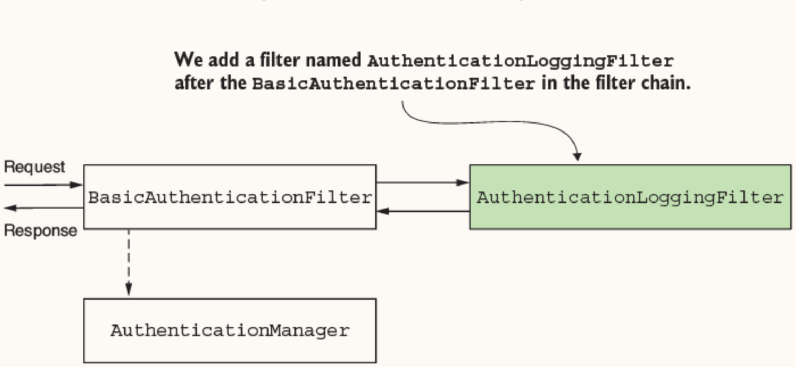

Example: Logging successful authentications.

```java
public class AuthenticationLoggingFilter implements Filter {
  private final Logger logger = Logger.getLogger(AuthenticationLoggingFilter.class.getName());

  @Override
  public void doFilter(ServletRequest request, ServletResponse response, FilterChain filterChain) throws IOException, ServletException {
    var httpRequest = (HttpServletRequest) request;
    logger.info("Successfully authenticated request with id " + httpRequest.getHeader("Request-Id"));
    filterChain.doFilter(request, response);
  }
}

// In SecurityFilterChain config:
http.addFilterAfter(new AuthenticationLoggingFilter(), BasicAuthenticationFilter.class)
```

### 3. Adding a Filter at an Existing Position

**How it works:**  
You insert your custom filter at the exact same position as a standard Spring Security filter using `HttpSecurity.addFilterAt()`. 

**Caution:** Adding a filter at a specific position does NOT replace the existing filter at that position. Spring Security doesn't guarantee the order in which multiple filters at the same position will execute. If you are replacing a standard filter, make sure to disable the standard filter in your configuration (e.g., omitting `httpBasic()`).

**When to use:**  
This approach is used when providing a completely different implementation for a responsibility that is typically assumed by one of the standard Spring Security filters.

**Real-world architectural scenario:**  
- **Custom Authentication Mechanism:** Replacing HTTP Basic auth with something tailored to your architecture. For example:
  - Identification based on a static header value (useful for simple backend-to-backend calls in a private network).
  - Using a symmetric/asymmetric key to verify signed requests.
  - Using a one-time password (OTP) mechanism or custom multi-factor authentication layer.
  - A legacy token validation system that doesn't fit standard OAuth2 or JWT filters.

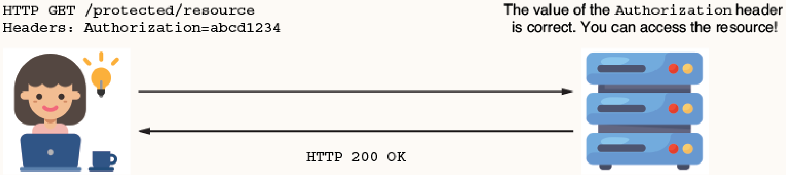
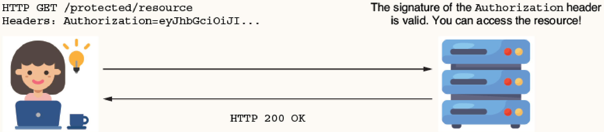
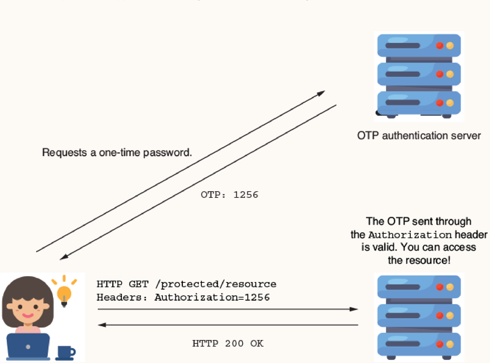

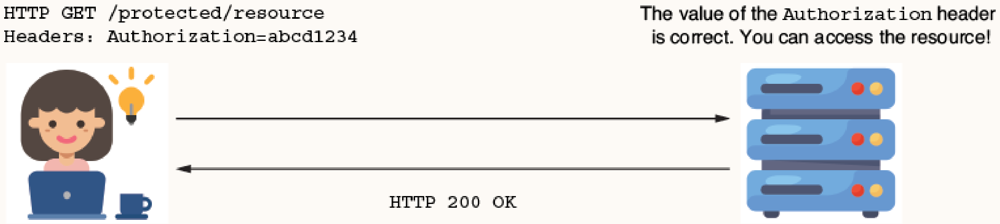
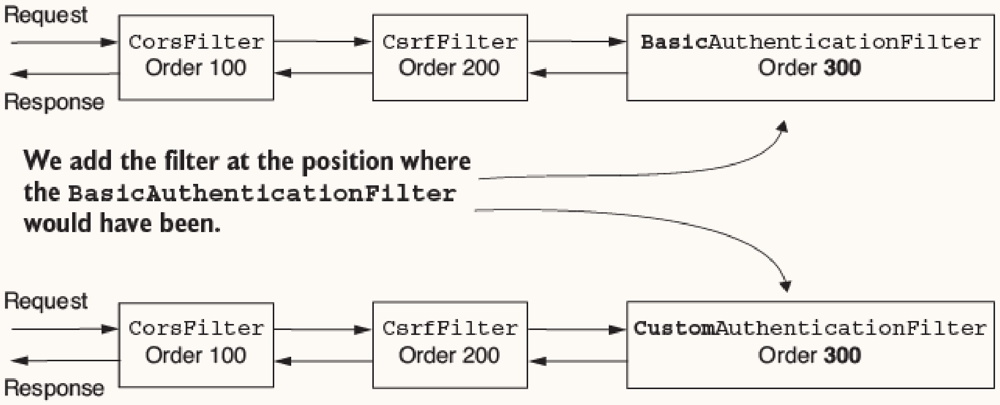

Commonly used to provide a custom authentication mechanism (e.g., static header key). Note that in the configuration, you shouldn't call `httpBasic()` if you don't want `BasicAuthenticationFilter` to be added.

```java
@Component
public class StaticKeyAuthenticationFilter implements Filter {
  @Value("${authorization.key}")
  private String authorizationKey;

  @Override
  public void doFilter(ServletRequest request, ServletResponse response, FilterChain filterChain) throws IOException, ServletException {
    var httpRequest = (HttpServletRequest) request;
    var httpResponse = (HttpServletResponse) response;
    String authentication = httpRequest.getHeader("Authorization");

    if (authorizationKey.equals(authentication)) {
      filterChain.doFilter(request, response);
    } else {
      httpResponse.setStatus(HttpServletResponse.SC_UNAUTHORIZED);
    }
  }
}

// In config, do not call httpBasic() to avoid adding BasicAuthenticationFilter:
http.addFilterAt(filter, BasicAuthenticationFilter.class)
```

**Note**: The static key value is injected from `application.properties` (e.g., `authorization.key=SD9cICjl1e`). Storing passwords or keys in a properties file is never a good idea for a production application; you should use a secrets vault.

Also, since we aren't using a `UserDetailsService` in this static key scenario, we can disable Spring Boot's automatic configuration of a default `UserDetailsService` by using the `exclude` attribute on `@SpringBootApplication` on the main class:

```java
@SpringBootApplication(exclude = {UserDetailsServiceAutoConfiguration.class})
```

## Spring Security Filter Classes
Spring Security offers abstract classes that implement the `Filter` interface. These add functionality your implementations could benefit from. However, if you don't need their extra features, it's recommended to simply implement `Filter` to keep things simple.

* `GenericFilterBean`: Allows use of initialization parameters that you would define in a `web.xml` descriptor file.
* `OncePerRequestFilter`: Extends `GenericFilterBean`. When adding a filter to the chain, the framework doesn't guarantee it will be called only once per request. `OncePerRequestFilter` guarantees `doFilterInternal()` executes only once per request.
  * **Characteristics of `OncePerRequestFilter`**:
    * Supports only HTTP requests (parameters are cast to `HttpServletRequest` and `HttpServletResponse`).
    * You can implement logic to bypass the filter for certain requests by overriding `shouldNotFilter(HttpServletRequest)`.
    * By default, doesn't apply to asynchronous or error dispatch requests (can be overridden via `shouldNotFilterAsyncDispatch()` and `shouldNotFilterErrorDispatch()`).

```java
public class AuthenticationLoggingFilter extends OncePerRequestFilter {
  @Override
  protected void doFilterInternal(HttpServletRequest request, HttpServletResponse response, FilterChain filterChain) throws ServletException, IOException {
    String requestId = request.getHeader("Request-Id");
    // Logging logic...
    filterChain.doFilter(request, response);
  }
}
```
