# Chapter 6: Implementing Authentications

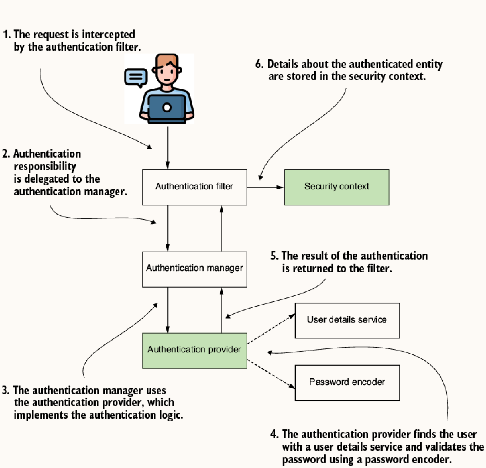

## 6.1 AuthenticationProvider
- Responsible for core authentication logic.

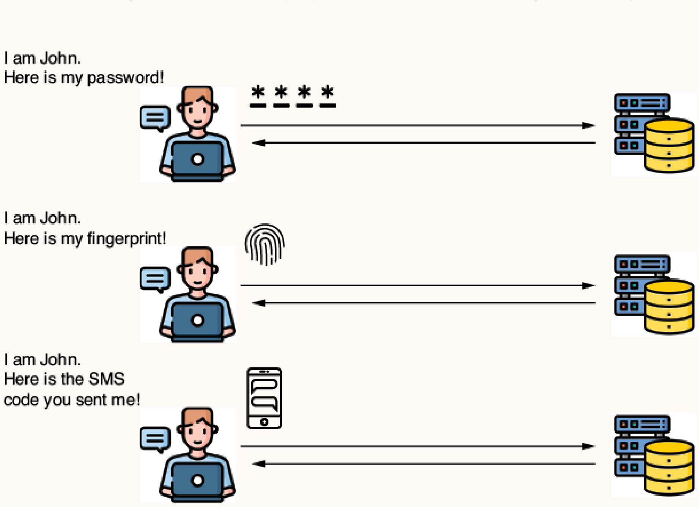
- Evaluates an `Authentication` request and returns a fully authenticated `Authentication` object or throws an `AuthenticationException`.

### `Authentication` Interface

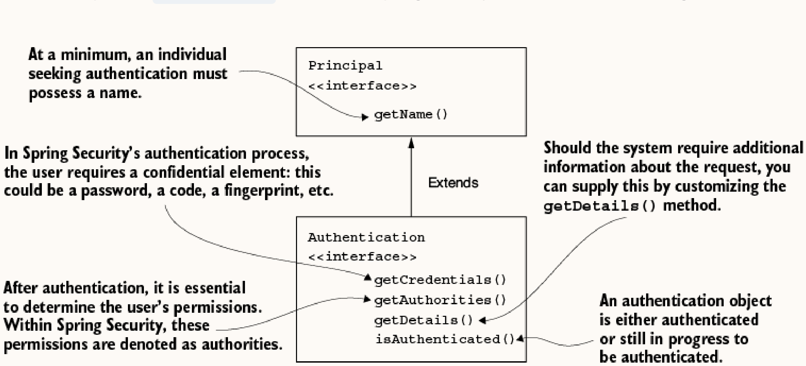

- Represents the authentication request and the authenticated principal.
- Extends `java.security.Principal`.
- **Key Methods**:
  - `isAuthenticated()`: Returns `true` if authentication is complete.
  - `getCredentials()`: Returns the password/secret.
  - `getAuthorities()`: Returns the collection of granted authorities.
  - `getPrincipal()`: Returns the authenticated entity (usually the username or `UserDetails`).
  - `getDetails()`: Returns additional details about the authentication request (e.g., IP address).

### `AuthenticationProvider` Contract
```java
public interface AuthenticationProvider {
    Authentication authenticate(Authentication authentication) throws AuthenticationException;
    boolean supports(Class<?> authentication);
}
```
- `supports(Class<?>)`: Verifies if the provider handles the given `Authentication` type.
- `AuthenticationManager` delegates the request to the first `AuthenticationProvider` that supports it.
  - The `AuthenticationManager` is like a smart lock that delegates to different providers (cards vs. keys).
  - If a provider recognizes an authentication type but cannot validate it, it returns `null`.
  - If it recognizes and rejects it as invalid, it throws an `AuthenticationException` (e.g., HTTP 401 Unauthorized).

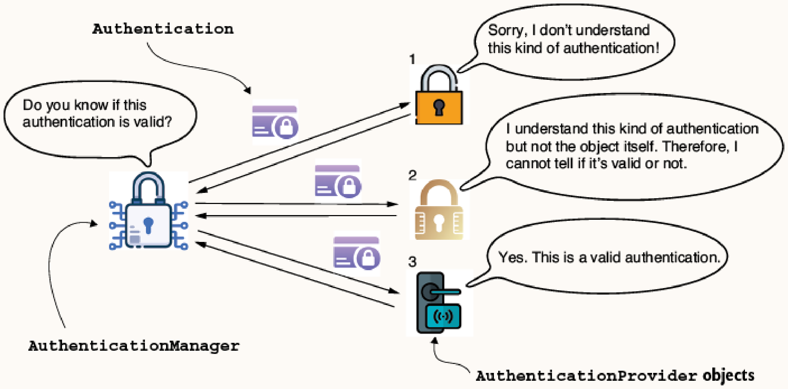

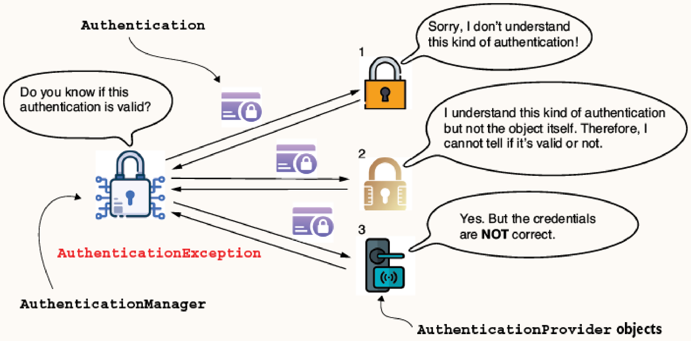

### Custom AuthenticationProvider Example

> [!WARNING]
> **Architectural Pitfall: How to Fail in Application Design**
> A common anti-pattern is completely bypassing Spring Security's backbone architecture (e.g., `AuthenticationManager` and `AuthenticationProvider`) and instead writing massive custom security logic directly inside a servlet filter. 
> - This leads to unmaintainable code that is incredibly difficult to customize or scale.
> - Before claiming the framework is "too hard to customize," ensure you are actually utilizing its intended contracts. Most custom authentication requirements can (and should) be met by simply implementing a clean `AuthenticationProvider` rather than reinventing the wheel in the filter chain.

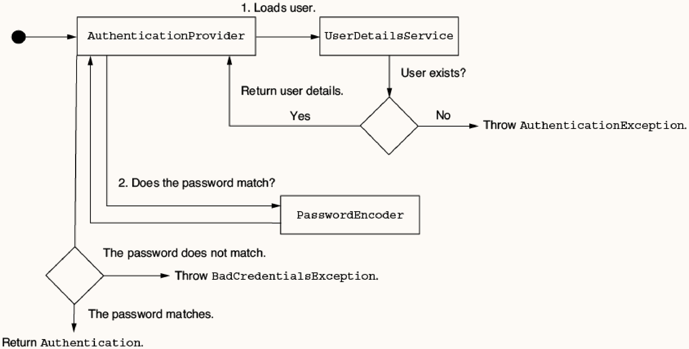
```java
@Component
public class CustomAuthenticationProvider implements AuthenticationProvider {
    private final UserDetailsService userDetailsService;
    private final PasswordEncoder passwordEncoder;

    @Override
    public boolean supports(Class<?> authenticationType) {
        return authenticationType.equals(UsernamePasswordAuthenticationToken.class);
    }

    @Override
    public Authentication authenticate(Authentication authentication) {
        String username = authentication.getName();
        String password = authentication.getCredentials().toString();
        UserDetails u = userDetailsService.loadUserByUsername(username);

        if (passwordEncoder.matches(password, u.getPassword())) {
            return new UsernamePasswordAuthenticationToken(username, password, u.getAuthorities());
        } else {
            throw new BadCredentialsException("Bad credentials");
        }
    }
}
```
**Listing 6.5 Registering the AuthenticationProvider in the configuration class**
```java
@Configuration
public class ProjectConfig {

    @Autowired
    private CustomAuthenticationProvider authenticationProvider;

    @Bean
    public SecurityFilterChain securityFilterChain(HttpSecurity http) throws Exception {
        http.httpBasic(Customizer.withDefaults());
        http.authenticationProvider(authenticationProvider);
        http.authorizeHttpRequests(c -> c.anyRequest().authenticated());
        return http.build();
    }
}
```

## 6.2 SecurityContext

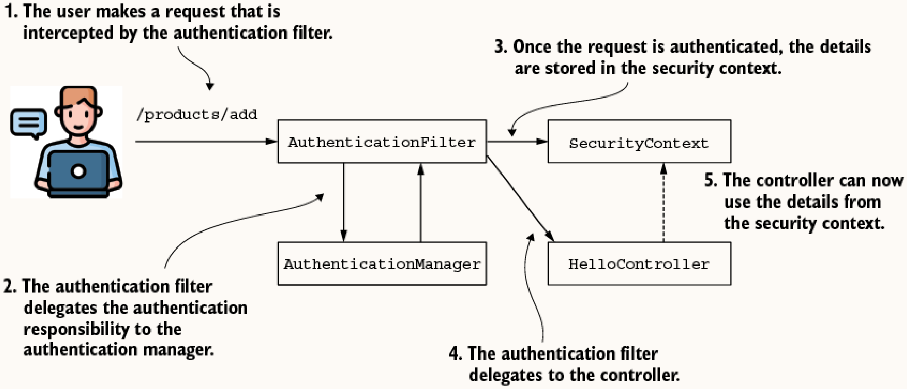

- Stores the `Authentication` object after a successful login.
- **Manual Access**: `SecurityContextHolder.getContext().getAuthentication()`
- **Controller Injection**: Spring automatically injects the `Authentication` object into `@GetMapping` parameter signatures.

### Holding Strategies
Configure via `SecurityContextHolder.setStrategyName()` or JVM property `spring.security.strategy`:

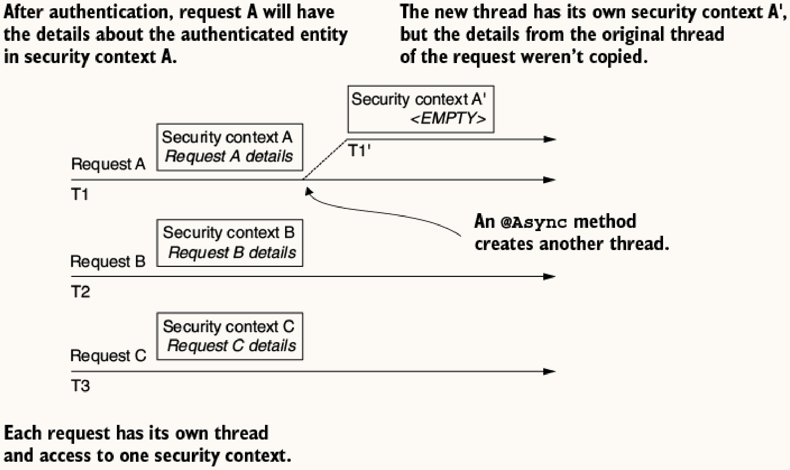

1. `MODE_THREADLOCAL` (Default):
   - **How it works**: The context is stored in a `ThreadLocal` object. It is isolated per thread, meaning each thread has its own security context. Context is **not** copied to new threads (e.g., `@Async`).
   - **When to use**: This is the default and is perfect for standard synchronous Spring web applications where one request is handled by a single thread from start to finish.

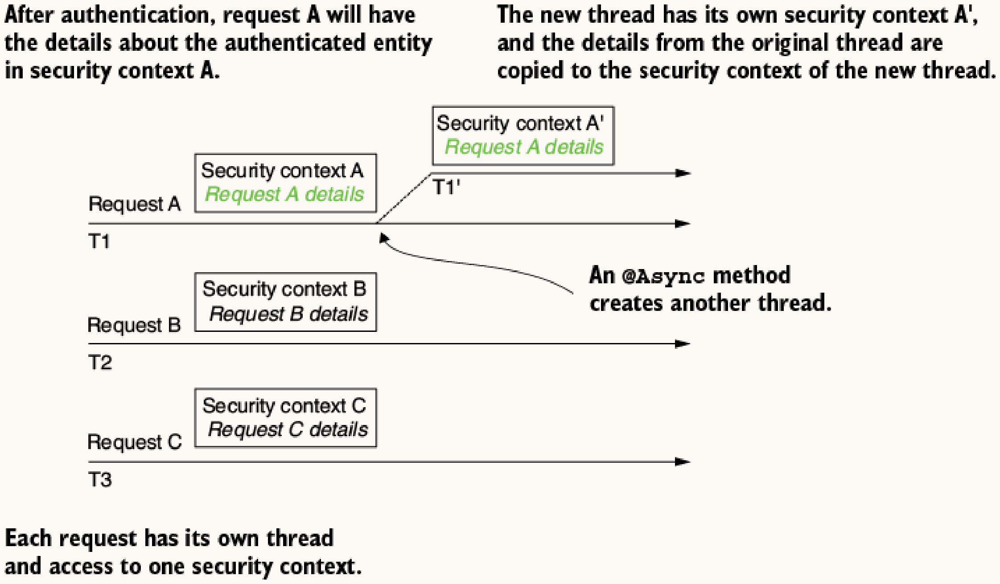

2. `MODE_INHERITABLETHREADLOCAL`:
   - **How it works**: Uses an `InheritableThreadLocal` to copy the context from the parent thread to any new threads created by Spring (e.g., via `@Async`).
   - **When to use**: Use this when you have a web application that spawns asynchronous tasks (like `@Async` methods) that still need access to the security context of the user who initiated the request.

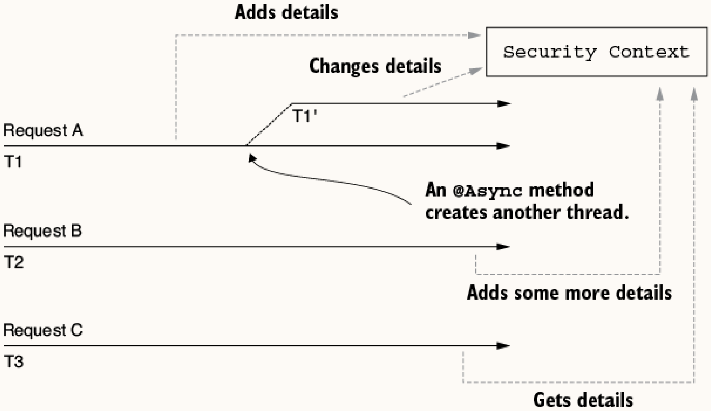

3. `MODE_GLOBAL`:
   - **How it works**: The context is stored in a static variable, sharing the exact same `SecurityContext` instance across all threads in the JVM.
   - **When to use**: Use only in standalone, non-web applications (like desktop apps) where there is inherently only one user of the application.

### Context Propagation in Self-Managed Threads
If your code manually spawns threads, Spring doesn't auto-propagate the context. Use Spring Security's concurrency decorators:
- **Tasks**: `DelegatingSecurityContextRunnable`, `DelegatingSecurityContextCallable`
- **Executors**: `DelegatingSecurityContextExecutor`, `DelegatingSecurityContextExecutorService`, `DelegatingSecurityContextScheduledExecutorService`

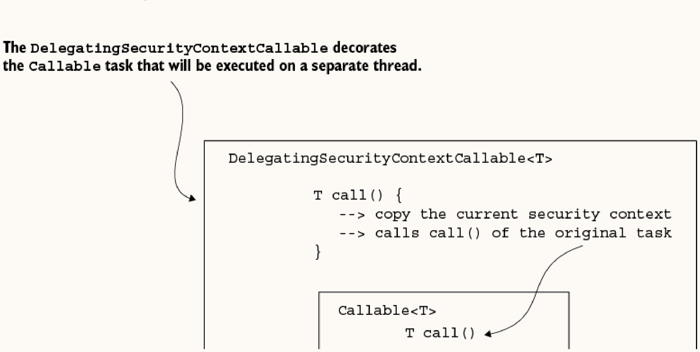

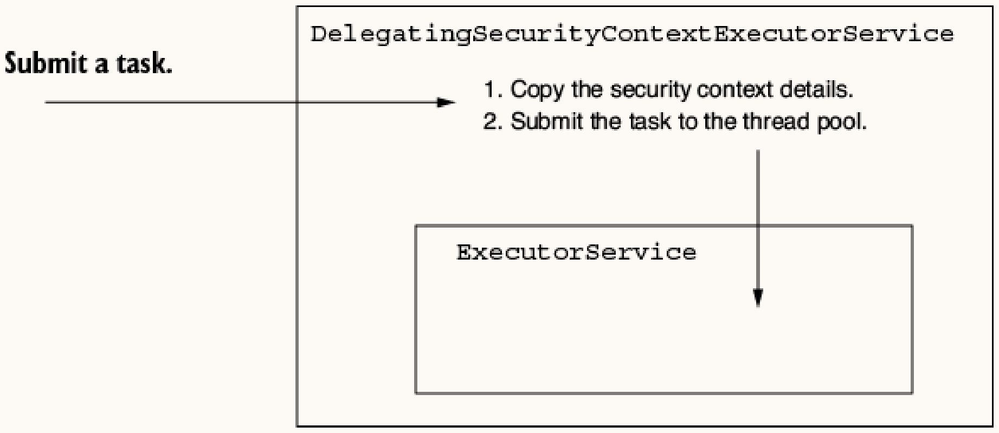

Example using `DelegatingSecurityContextExecutorService`:
```java
Callable<String> task = () -> SecurityContextHolder.getContext().getAuthentication().getName();
ExecutorService e = new DelegatingSecurityContextExecutorService(Executors.newCachedThreadPool());
e.submit(task);
```

## 6.3 HTTP Basic and Form-Based Login

### HTTP Basic
- **How it works**: The client sends credentials (username and password) encoded in Base64 in the `Authorization` HTTP header with every single request. The server validates these credentials for each request. It does not maintain a session by default.
- **When to use**: Best for stateless REST APIs, machine-to-machine communication, or simple internal applications where a full login UI isn't necessary.

### HTTP Basic Customization
- **The Responsibility of `AuthenticationEntryPoint`**: Its primary job is to *commence* the authentication process when an unauthenticated client attempts to access a protected resource. If a request is rejected because it lacks credentials, the `ExceptionTranslationFilter` catches the resulting `AuthenticationException` and delegates to the `AuthenticationEntryPoint`. 
- In the context of HTTP Basic, the default entry point is responsible for returning a `401 Unauthorized` HTTP status and setting the `WWW-Authenticate` header. This specific header is what triggers web browsers to pop up their native username/password dialog box.
- You can provide a custom `AuthenticationEntryPoint` to override this behavior (e.g., if you are building a REST API and want to return a JSON error payload instead of triggering a browser dialog).
```java
http.httpBasic(c -> {
    c.realmName("CUSTOM_REALM");
    c.authenticationEntryPoint((req, res, e) -> {
        res.addHeader("X-Auth-Failed", "true");
        res.sendError(HttpStatus.UNAUTHORIZED.value());
    });
});
```

### Form-Based Login

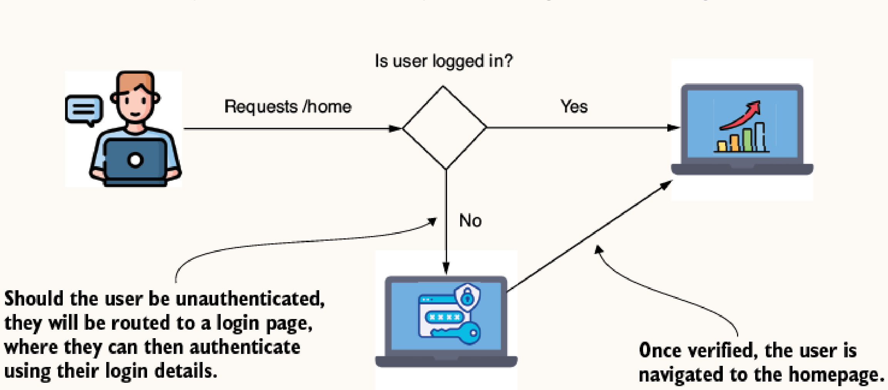

- **How it works**: The user submits credentials via an HTML form. Upon success, the server creates a stateful session (usually stored in memory) and returns a session ID cookie (e.g., `JSESSIONID`). Subsequent requests send this cookie instead of credentials.
- **When to use**: Ideal for human-facing web applications accessed via browsers, where you want a custom login UI, remember-me functionality, and session management.

- Replaces Basic Auth with an HTML login form, generating a server-side session.
- Setup: `http.formLogin(Customizer.withDefaults());` (auto-generates `/login` and `/logout`).


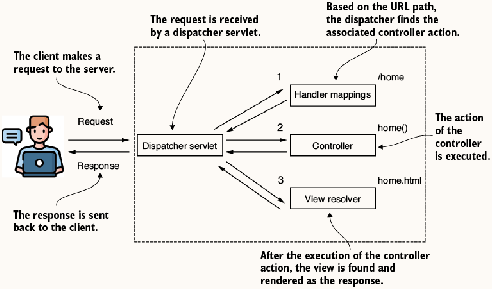


- Customize redirects and logic using `AuthenticationSuccessHandler` (method `onAuthenticationSuccess()`) and `AuthenticationFailureHandler` (method `onAuthenticationFailure()`).
- **Combining Methods**: You can configure both `httpBasic()` and `formLogin()` together in the same `SecurityFilterChain` to support both authentication methods simultaneously.
```java
http.formLogin(c -> c
    .defaultSuccessUrl("/home", true)
    .successHandler((req, res, auth) -> {
        // Custom logic based on roles
        res.sendRedirect("/home");
    })
    .failureHandler((req, res, e) -> {
        res.setHeader("X-Error", "Failed");
        res.sendRedirect("/error");
    })
);
```
