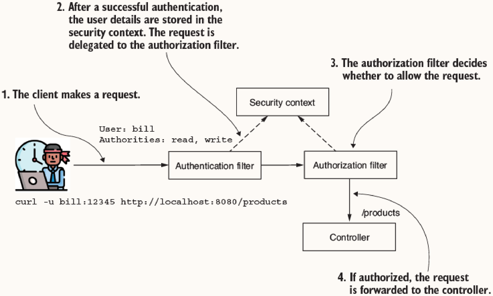
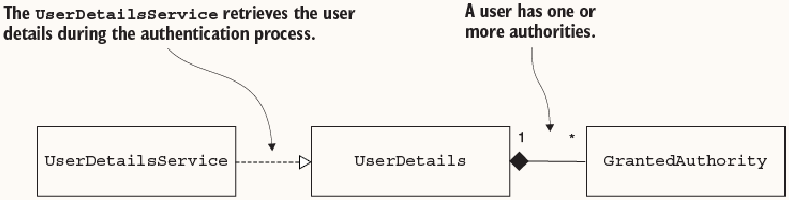
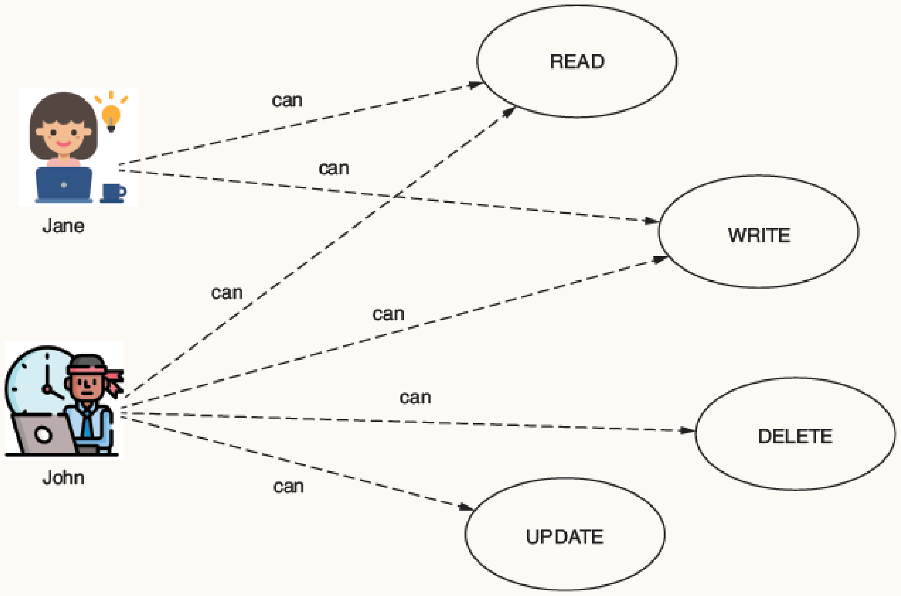
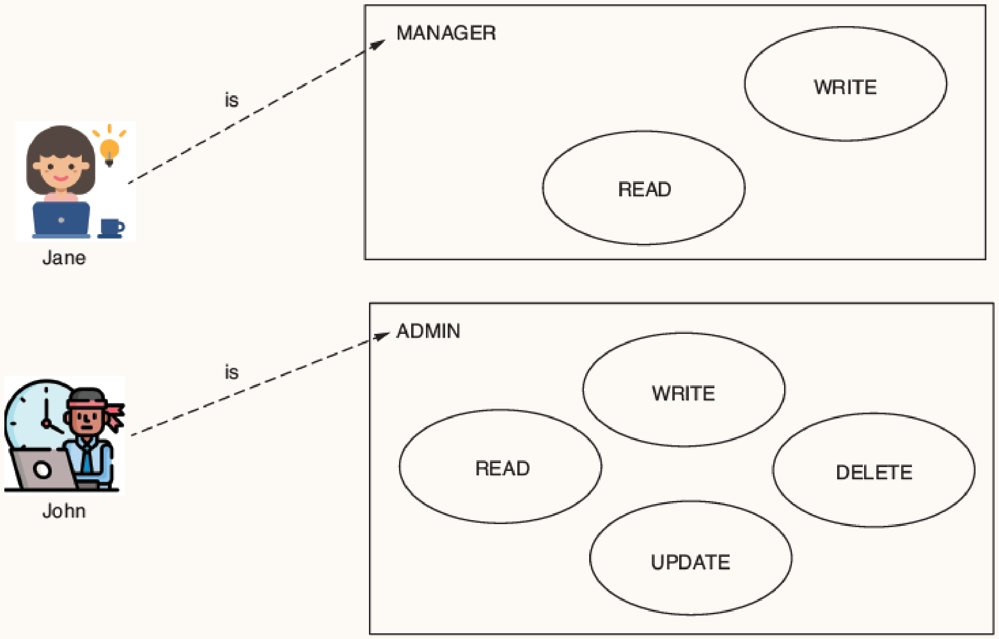
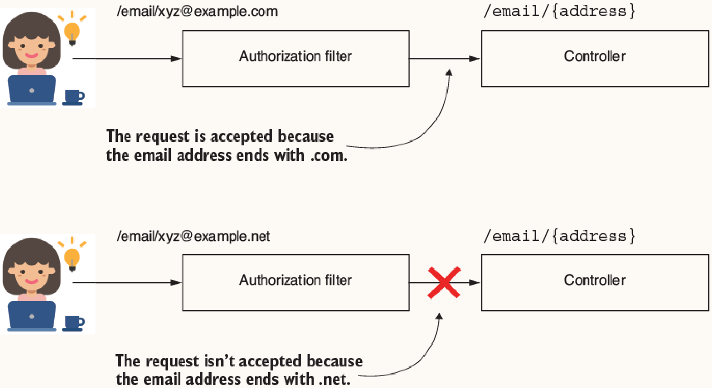
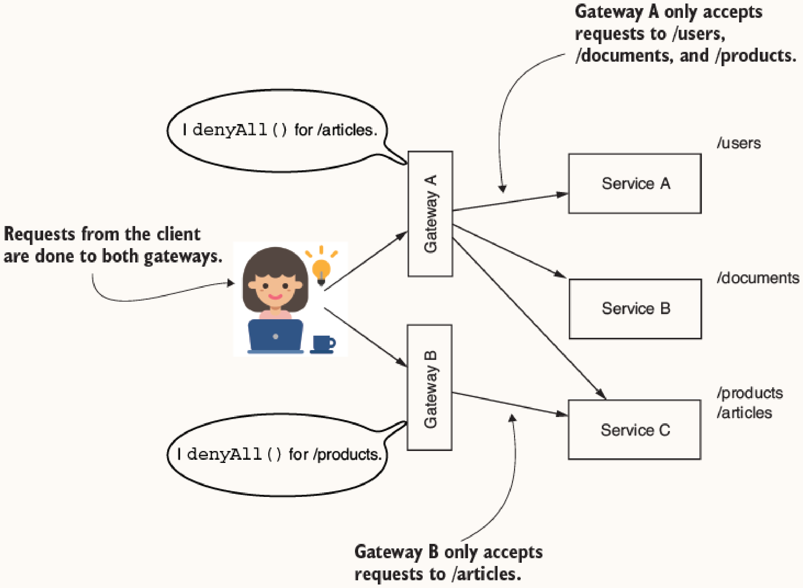

# Chapter 7: Configuring Endpoint-Level Authorization: Restricting Access

## Core Concepts

**Authorization** is the process where the application determines if an authenticated client has permission to access a requested resource. It always occurs after authentication.


In Spring Security, after the authentication flow finishes, the request is delegated to an authorization filter. This filter allows or rejects the request based on the configured authorization rules using the user information stored in the security context.



## 7.1 Restricting Access Based on Authorities and Roles

Spring Security manages application privileges via **authorities** and **roles**. 

### The `GrantedAuthority` Contract

An authority represents a fine-grained action a user can perform with a system resource (e.g., `READ`, `WRITE`, `DELETE`).



```java
public interface GrantedAuthority extends Serializable {
    String getAuthority();
}
```

The user contract (`UserDetails`) exposes a collection of these granted privileges:

```java
public interface UserDetails extends Serializable {
    Collection<? extends GrantedAuthority> getAuthorities();
    // Omitted code
}
```

### 7.1.1 Restricting Access for All Endpoints Based on User Authorities



To enforce access rules based on authorities, Spring Security provides the following configuration strategies:

#### 1. `hasAuthority()`
*   **How it works**: Receives a single authority name as a parameter. The system restricts the endpoint exclusively to users possessing this exact authority.
*   **When to use**: Use when an endpoint requires a single, specific privilege.

```java
http.authorizeHttpRequests(c -> c.anyRequest().hasAuthority("WRITE"));
```

#### 2. `hasAnyAuthority()`
*   **How it works**: Receives multiple authority names (varargs). The system grants access if the user has at least one of the specified authorities.
*   **When to use**: Use when an endpoint should be accessible to users holding any one of a set of distinct privileges.

```java
http.authorizeHttpRequests(c -> c.anyRequest().hasAnyAuthority("WRITE", "READ"));
```

#### 3. `access()`
*   **How it works**: Receives an `AuthorizationManager` implementation. Commonly utilized with `WebExpressionAuthorizationManager` to evaluate Spring Expression Language (SpEL) expressions.
*   **When to use**: Use only when authorization rules are complex and cannot be implemented using `hasAuthority()` or `hasAnyAuthority()` (e.g., logical `and`/`or` conditions).

> [!TIP]
> **More on the access() method**
> The `access()` method is completely generic; it does not *have* to evaluate authorities or roles. Because `WebExpressionAuthorizationManager` accepts any valid SpEL expression, you can write arbitrary business rules directly into the security chain. 
> For example, you can restrict endpoint access so that it only opens after 12:00 PM:
> ```java
> String timeSpEL = "T(java.time.LocalTime).now().isAfter(T(java.time.LocalTime).of(12, 0))";
> http.authorizeHttpRequests(c -> c.anyRequest().access(new WebExpressionAuthorizationManager(timeSpEL)));
> ```
> *Note: While powerful, strive to keep syntax simple. Only complicate your configurations when you don't have another choice.*

```java
String expression = "hasAuthority('read') and !hasAuthority('delete')";
http.authorizeHttpRequests(c -> c.anyRequest()
    .access(new WebExpressionAuthorizationManager(expression)));
```

### 7.1.2 Restricting Access for All Endpoints Based on User Roles



**Authorities vs. Roles**
*   **Authorities**: Fine-grained privileges for specific actions (e.g., `READ`).
*   **Roles**: Coarse-grained privileges representing a badge or a group of actions (e.g., `ADMIN`, `MANAGER`).

At the implementation level, Spring Security represents roles using the same `GrantedAuthority` contract, differentiating them by enforcing a `ROLE_` prefix. 

When configuring a user using the `User` builder:
*   `.roles("ADMIN")`: Automatically prepends the `ROLE_` prefix behind the scenes.
*   `.authorities("ROLE_MANAGER")`: Requires you to explicitly include the `ROLE_` prefix.

```java
var user1 = User.withUsername("john")
    .password("12345")
    .roles("ADMIN") // Internally becomes "ROLE_ADMIN"
    .build();
```

#### Configuration Strategies

#### 1. `hasRole()`
*   **How it works**: Receives a role name as a parameter. The `ROLE_` prefix is implied and should **not** be included in the argument.
*   **When to use**: Use to restrict an endpoint to a single user role.

```java
http.authorizeHttpRequests(c -> c.anyRequest().hasRole("ADMIN"));
```

#### 2. `hasAnyRole()`
*   **How it works**: Receives multiple role names. Approves the request if the user has at least one of the roles.
*   **When to use**: Use when multiple roles are permitted to access the same endpoint.

#### 3. `access()`
*   **How it works**: Evaluates complex role-based SpEL expressions (e.g., `hasRole()` or `hasAnyRole()`).
*   **When to use**: Use for complex logical combinations of role requirements.

### 7.1.3 Restricting Access to All Endpoints

In addition to specifying permissions, you can unconditionally permit or deny access.

#### 1. `permitAll()`
*   **How it works**: Bypasses authorization restrictions, granting access to all matched requests regardless of authentication status.
*   **When to use**: Use for publicly accessible endpoints (e.g., login pages, health checks).

#### 2. `denyAll()`
*   **How it works**: Unconditionally rejects all requests to the matched endpoints.
*   **When to use**: Use in complex architectures (like an API gateway) to deny all traffic by default except for specific routed paths, or when restricting requests based on specific path variables.




```java
http.authorizeHttpRequests(c -> c.anyRequest().denyAll());
```
