# Chapter 9: Configuring CSRF Protection

## 9.1 How CSRF Protection Works in Spring Security

**Cross-Site Request Forgery (CSRF)** is a widespread attack where vulnerable applications force authenticated users to execute unwanted mutating actions on a web application.

### How it works
To mitigate CSRF vulnerabilities, Spring Security mandates that any request executing a mutating operation (e.g., POST, PUT, DELETE) must contain a unique CSRF token in its header. This token is generated when the user initially requests the page via a non-mutating method like GET. The server considers the token's presence as proof that the request originated from the legitimate application frontend, not a forged third-party script.

> [!NOTE]
> **The Anatomy of a CSRF Attack Script**
> A CSRF attack exploits the fact that browsers automatically attach session cookies to requests made to a domain, even if the request originates from a completely different, malicious domain. 
> 
> **What it looks like:** The attacker tricks the user into visiting their malicious site (e.g., via a phishing email). The attacker's webpage contains a hidden HTML form pointing to the vulnerable application, accompanied by a script that instantly submits it upon loading.
> ```html
> <!-- Hosted on attacker.com -->
> <form action="http://your-bank.com/transfer" method="POST" id="csrf-form">
>     <input type="hidden" name="toAccount" value="ATTACKER_ACCOUNT_ID">
>     <input type="hidden" name="amount" value="100000">
> </form>
> <script>
>     // The script automatically executes the moment the victim loads the page
>     document.getElementById("csrf-form").submit();
> </script>
> ```
> **Execution:** When the victim loads the page, the browser immediately fires the POST request to `your-bank.com`. Crucially, because the user is currently logged into the bank in another tab, their browser automatically attaches their `JSESSIONID` cookie to the request. The bank's server sees a valid session cookie and executes the transfer. 
> By requiring a unique CSRF token inside the POST body or header, the attack fails. The Same-Origin Policy prevents `attacker.com` from reading the token from the bank, meaning the forged request will lack the token and be rejected.

> [!TIP]
> **Why are GET endpoints safe, but POST/PUT/DELETE are not?**
> A CSRF attack allows an attacker to *send* a request on your behalf, but because of the browser's Same-Origin Policy (SOP), the attacker's script **cannot read the response**.
> - **GET (Safe)**: By definition, GET requests should only retrieve data. If an attacker forces your browser to `GET /account/balance`, the server returns your balance, but the attacker's script cannot read the resulting HTML/JSON to steal it. Therefore, a forced GET request is useless to the attacker.
> - **POST/PUT/DELETE (Mutating)**: These requests change the state of the application (e.g., transferring money, changing a password). The attacker doesn't care about reading the response; they only care that the action was successfully executed on the server.
> *Warning*: If you poorly design your API so that a GET request mutates state (e.g., `GET /transfer?amount=1000&to=attacker`), your application will be vulnerable to CSRF because Spring Security ignores GET requests by default!

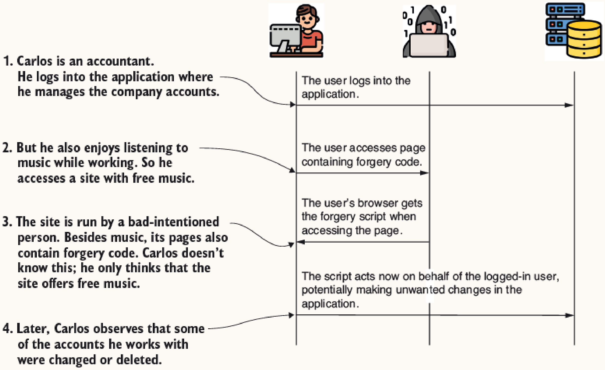
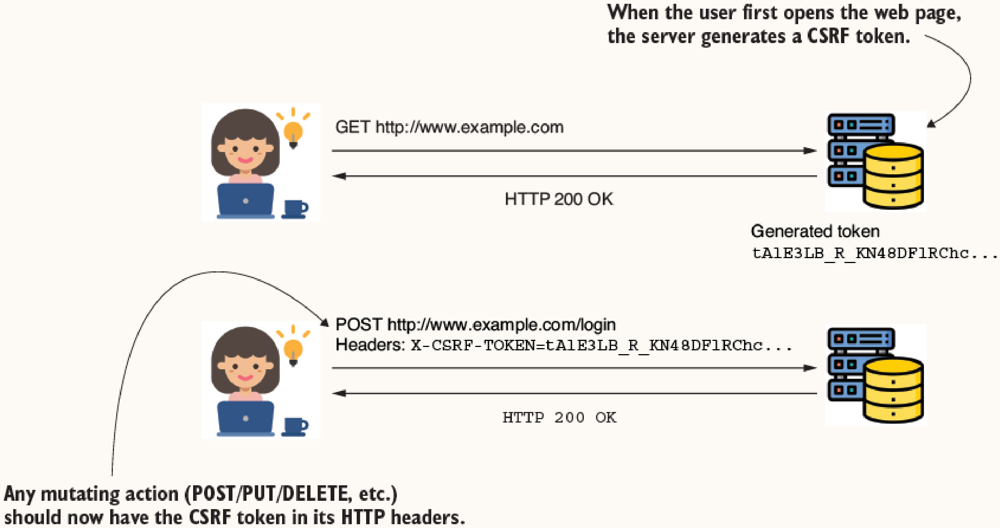

### Architecture Components
- **`CsrfFilter`**: The entry point for CSRF protection in the security filter chain. It allows GET, HEAD, TRACE, and OPTIONS requests to pass. For mutating methods, it mandates the presence of a valid CSRF token. If missing or invalid, it returns `HTTP 403 Forbidden`.
- **`CsrfTokenRepository`**: Used by `CsrfFilter` to manage, generate, store, and invalidate CSRF tokens. By default, it stores tokens in the HTTP session and generates them as random strings.

### Token Lifecycle: Creation and Delivery
- **Creation**: The CSRF token is generated server-side by the `CsrfTokenRepository` the very first time a client makes an HTTP request to the application (usually a safe GET request, like loading the homepage or login page). By default, Spring Security generates it as a secure random string and stores it in the user's `HttpSession`.
- **Delivery to the User**: The server must hand this token to the client's browser so it can be included in future POST requests. This is typically done by embedding it directly into the HTML response payload:
  - **Server-Side Rendered (e.g., Thymeleaf)**: Spring automatically injects the token as a hidden `<input>` field inside HTML `<form>` elements.
  - **Single Page Applications (e.g., React/Angular)**: The token is commonly injected into the HTML `<meta>` tags of the `index.html`. The frontend JavaScript then reads it from the DOM and attaches it as an HTTP header (e.g., `X-CSRF-TOKEN`) on subsequent AJAX requests. Alternatively, Spring can be configured to deliver it via a specific Cookie (like `XSRF-TOKEN`).

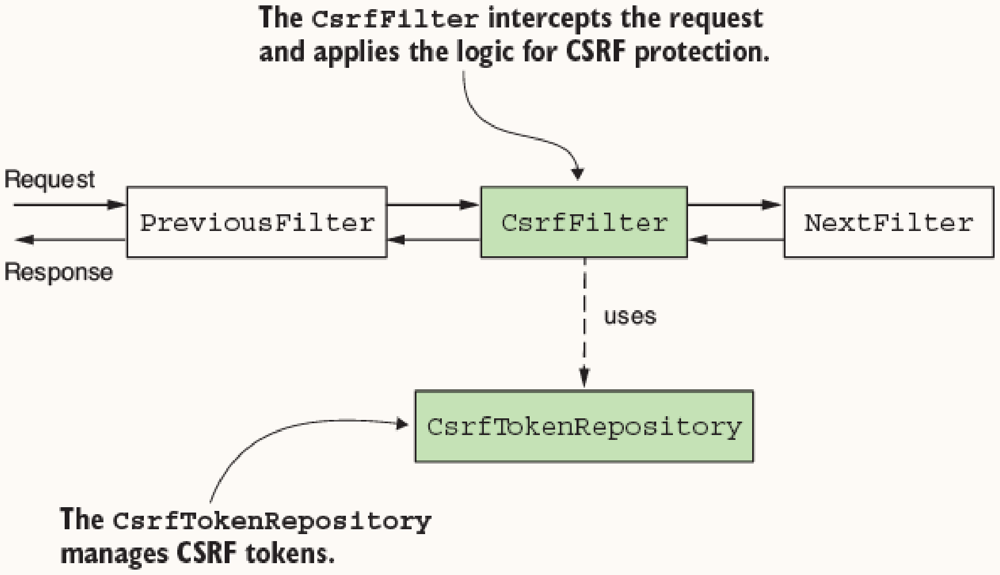
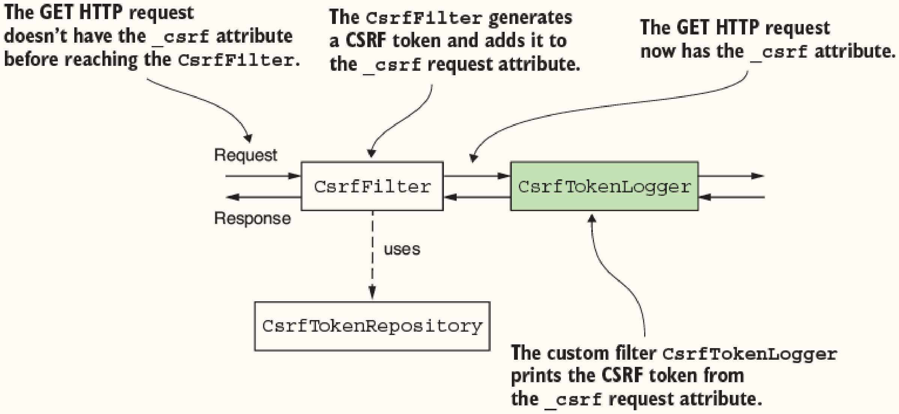

### Extracting the CSRF Token Programmatically
The `CsrfFilter` attaches the CSRF token to the HTTP request attribute named `_csrf`.

```java
// Listing 9.2: Custom filter to extract and log the CSRF token
public class CsrfTokenLogger implements Filter {
    private Logger logger = Logger.getLogger(CsrfTokenLogger.class.getName());

    @Override
    public void doFilter(ServletRequest request, ServletResponse response, FilterChain filterChain) throws IOException, ServletException {
        CsrfToken o = (CsrfToken) request.getAttribute("_csrf");
        logger.info("CSRF token " + o.getToken());
        filterChain.doFilter(request, response);
    }
}
```

## 9.2 Using CSRF Protection in Practical Scenarios

**When to use:** CSRF protection should be enabled for web apps running in a browser where the same server is responsible for both the frontend and backend. It is less suited for independent clients (like mobile apps or SPA frontends), where OAuth 2 or token-based authentication is preferred.

By default, Spring Security automatically incorporates CSRF protection into standard flows like form login. When building custom forms that use POST, PUT, or DELETE, you must explicitly include the CSRF token.

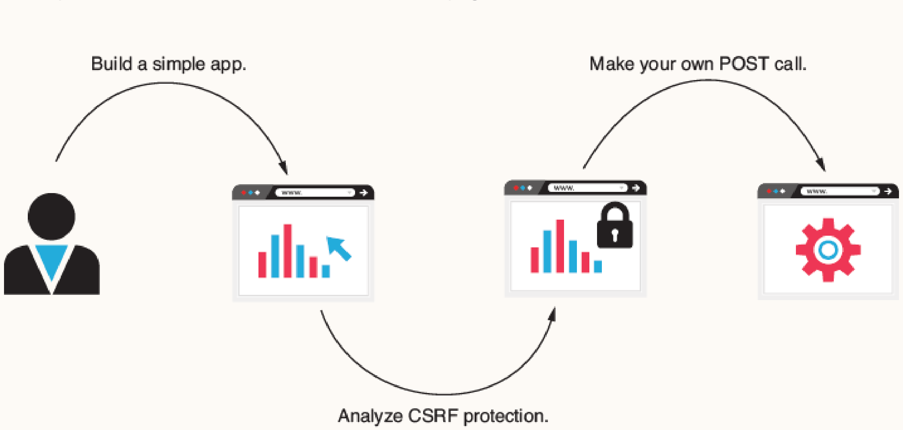
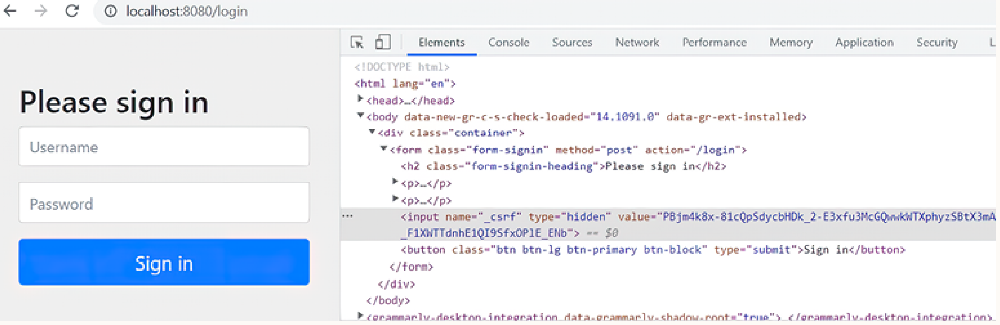
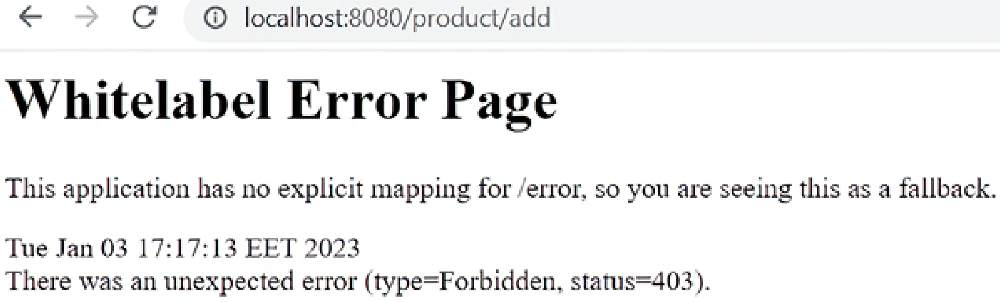
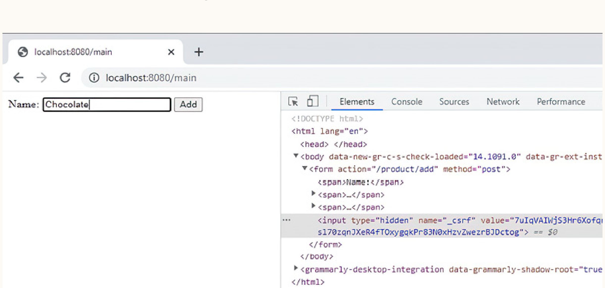

### Implementing CSRF in Forms (Thymeleaf Example)
To allow a server to accept a mutating request from a form, the CSRF token can be embedded as a hidden input.

```html
<!-- Listing 9.8: Adding the CSRF token to the request done through the form -->
<form action="/product/add" method="post">
    <span>Name:</span>
    <span><input type="text" name="name" /></span>
    <span><button type="submit">Add</button></span>
    
    <input type="hidden"
           th:name="${_csrf.parameterName}"
           th:value="${_csrf.token}" />
</form>
```

## 9.3 Customizing CSRF Protection

### 1. Excluding Specific Paths
**When to use:** When exposing certain endpoints (e.g., public APIs, webhooks) that do not require CSRF protection.

**How it works:** Utilize the `ignoringRequestMatchers()` method on the `CsrfConfigurer` to exempt specific path patterns or regex matchers from CSRF validation.

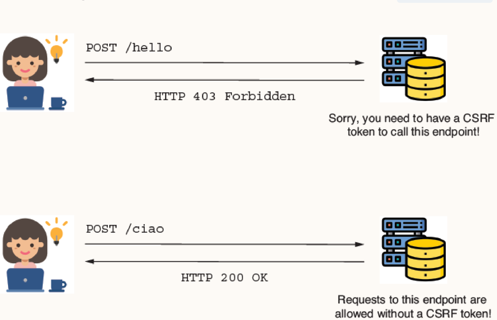

```java
// Listing 9.10: A Customizer object for the configuration of CSRF protection
@Bean
public SecurityFilterChain securityFilterChain(HttpSecurity http) throws Exception {
    http.csrf(c -> {
        c.ignoringRequestMatchers("/ciao"); // Disables CSRF for /ciao
    });
    http.authorizeHttpRequests(c -> c.anyRequest().permitAll());
    return http.build();
}
```

### 2. Custom Token Management (Database Storage)
**When to use:** When scaling horizontally. The default HTTP session storage is stateful and hinders scalability. Storing tokens in a centralized database resolves this.

**How it works:** You must implement three core interfaces:
1. `CsrfToken`: Describes the token (header name, parameter name, token value).
2. `CsrfTokenRepository`: Manages generation, persistence, and loading of the token.
3. `CsrfTokenRequestHandler`: Determines how the generated token is bound to the HTTP request.

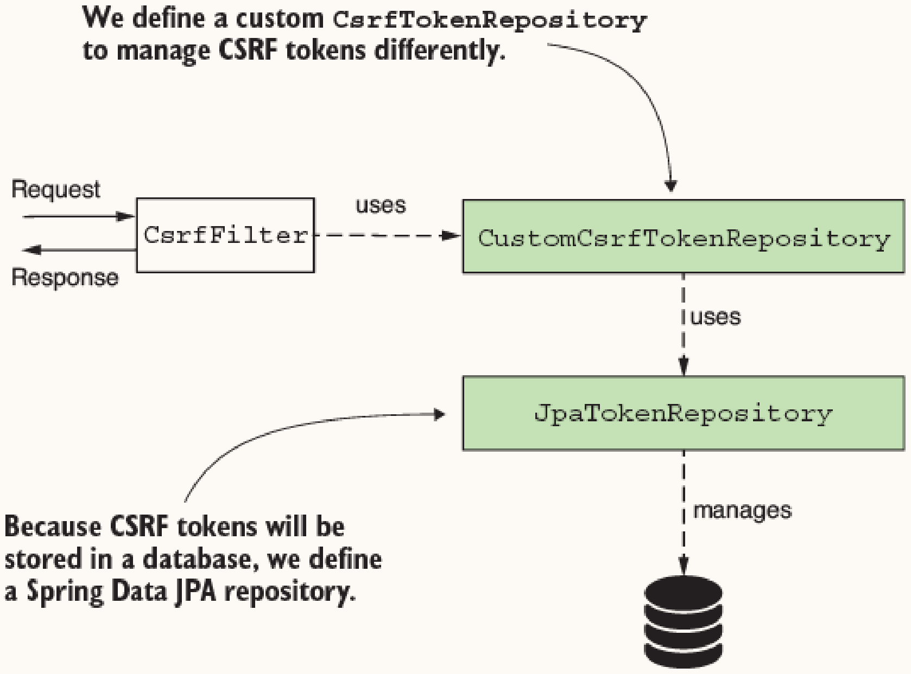

#### Implementing a Custom `CsrfTokenRepository`
In this approach, tokens are persisted to a database via Spring Data JPA based on a unique client identifier instead of a session ID.

```java
// Listings 9.15, 9.16, 9.17: Implementation of custom CsrfTokenRepository methods
@Component
public class CustomCsrfTokenRepository implements CsrfTokenRepository {
    private final JpaTokenRepository jpaTokenRepository;

    // Constructor omitted

    @Override
    public CsrfToken generateToken(HttpServletRequest request) {
        String uuid = UUID.randomUUID().toString();
        return new DefaultCsrfToken("X-CSRF-TOKEN", "_csrf", uuid);
    }

    @Override
    public void saveToken(CsrfToken csrfToken, HttpServletRequest request, HttpServletResponse response) {
        String identifier = request.getHeader("X-IDENTIFIER");
        Optional<Token> existingToken = jpaTokenRepository.findTokenByIdentifier(identifier);
        
        if (existingToken.isPresent()) {
            Token token = existingToken.get();
            token.setToken(csrfToken.getToken());
        } else {
            Token token = new Token();
            token.setToken(csrfToken.getToken());
            token.setIdentifier(identifier);
            jpaTokenRepository.save(token);
        }
    }

    @Override
    public CsrfToken loadToken(HttpServletRequest request) {
        String identifier = request.getHeader("X-IDENTIFIER");
        Optional<Token> existingToken = jpaTokenRepository.findTokenByIdentifier(identifier);
        
        if (existingToken.isPresent()) {
            Token token = existingToken.get();
            return new DefaultCsrfToken("X-CSRF-TOKEN", "_csrf", token.getToken());
        }
        return null;
    }
}
```

#### Configuring the Custom Components
The custom repository and request handler must be wired into the `HttpSecurity` configuration.

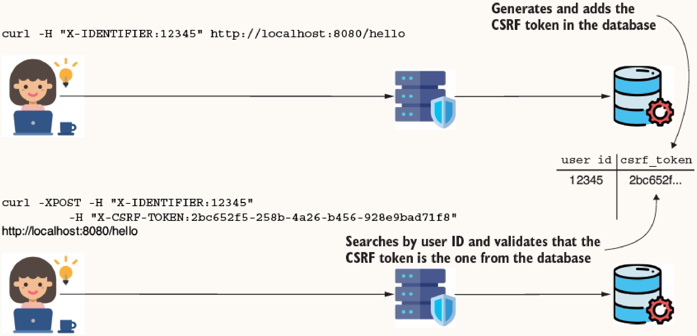

```java
// Listing 9.19: Configuration class for the custom CsrfTokenRepository
@Configuration
public class ProjectConfig {
    private final CustomCsrfTokenRepository customTokenRepository;

    // Constructor omitted

    @Bean
    public SecurityFilterChain securityFilterChain(HttpSecurity http) throws Exception {
        http.csrf(c -> {
            c.csrfTokenRepository(customTokenRepository);
            // Plugs in a simple handler to place the generated token onto the HTTP request
            c.csrfTokenRequestHandler(new CsrfTokenRequestAttributeHandler());
        });
        http.authorizeHttpRequests(c -> c.anyRequest().permitAll());
        return http.build();
    }
}
```
