# Appendix 1: Rules of Normalization

> **"Relational database design isn't a mystery—it's a set of mathematical rules designed to make your data 'mistake-proof'."**

Normalization is the process of organizing data to reduce redundancy and ensure data integrity. Before we even get to "Normal Forms" (1NF, 2NF, etc.), we must define what makes a table a **Relation**.

---

## 1.1 What does "Relational" actually mean?
Common misconception: "Relational" refers to relationships *between* tables (Foreign Keys).
**The Truth**: It refers to the **Relation** itself—the relationship between columns *within* a single table.

Mathematically, a relation is a subset of all possible pairings across domains.
*   **Domain A**: Baseball Team names.
*   **Domain B**: Cities.
*   **The Relation**: Only the valid pairings (e.g., *Boston* + *Red Sox*).

---

## 1.2 The 5 Criteria of a Proper Relation
For a table to be considered "relational" and ready for normalization, it must meet these five criteria:

### 1. Rows Have No Vertical Order
In a true relation, there is no "first" or "last" row.
*   **The Reality**: SQL returns data in an unpredictable order unless you use `ORDER BY`.
*   **The Rule**: The data's meaning must not depend on its position in the table.

### 2. Columns Have No Horizontal Order
Asking for "Bug ID and then Summary" should be logically identical to asking for "Summary and then Bug ID."
*   **The Antipattern Link**: This is why **Chapter 19: Implicit Columns** (`SELECT *` or `INSERT` without column names) is dangerous—it treats column order as significant.

### 3. Duplicate Rows are Forbidden
Once a fact is stated, repeating it adds no new information.
*   **The Solution**: Every relation **must** have a **Primary Key** or a **Unique Key (NOT NULL)**. 
*   **The Rule**: If you can't tell two rows apart, you don't have a relation; you have a "bag" of data.

### 4. Atomic Values and Consistent Types
Every column must have a defined type, and every row in that column must contain exactly one value of that type.
*   **Breaking the Rule**: 
    *   **Chapter 6: EAV**: Violates this by putting dates, strings, and IDs in a single `value` column.
    *   **Chapter 7: Polymorphic Associations**: Violates this by letting an ID point to different parent tables, meaning the ID doesn't have a consistent meaning.

### 5. No Hidden Components
Rows should be identifiable by their data, not by "magic" physical storage indicators.
*   **The Legend**: Things like Oracle's `ROWNUM` or PostgreSQL's `OID` are internal storage details, not part of the logical relation.
*   **The Antipattern Link**: **Chapter 22: Pseudokey Neat-Freak** teaches us that IDs are identifiers, not row numbers or physical locations.

---

*   **The Analogy**: If a medicine didn't work for 20% of people, you wouldn't call the problem "too esoteric." You would fix the medicine. Understanding higher normal forms is the key to fixing that 20% of hidden bugs.

---

## 1.4 The Objectives of Normalization
Why go through the effort?
1.  **Modeling Reality**: To represent facts in a way people can understand.
2.  **Integrity**: To prevent inconsistent data (anomalies).
3.  **Efficiency (Data)**: To reduce redundant storage.

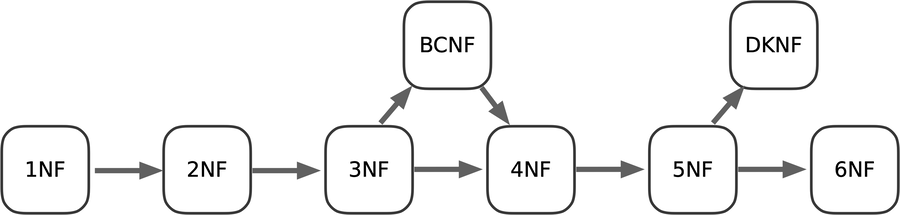

---

## 1.5 The Journey of Normal Forms
Each normal form solves a specific type of redundancy. If a table satisfies a higher form, it automatically satisfies all the lower ones.

### First Normal Form (1NF): Atomic Values
**The Rule**: No "repeating groups" (lists) inside a column.
*   **Fail**: **Chapter 2: Jaywalking** (comma-separated IDs) or **Chapter 8: Multicolumn Attributes** (`Tag1`, `Tag2`, `Tag3`).
*   **Solution**: Create a separate table where each value gets its own row.

Bad:
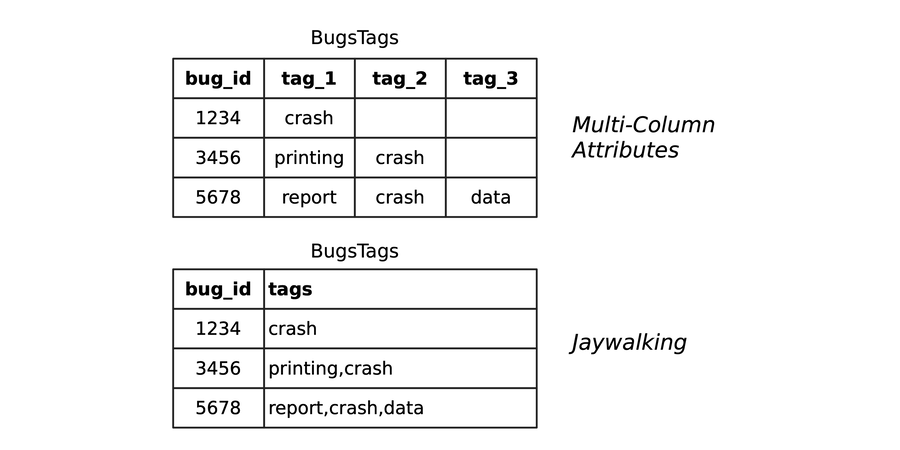

Good:


---

### Second Normal Form (2NF): No Partial Dependencies
**The Rule**: If you have a compound primary key `(A, B)`, every other column must depend on **both** `A` and `B`, not just one.
*   **Fail**: A `BugsTags` table keyed by `(bug_id, tag)` that also stores the `tag_coiner` (the person who first created the tag). The coiner depends on the **tag**, not the **bug**. Someone might create an anomaly by changing the identity of the coiner on one row for a given tag (crash) without changing all rows for the same tag.

Bad SQL:
```sql
​CREATE​ ​TABLE​ BugsTags (
​ 	  bug_id  ​BIGINT​ ​UNSIGNED​ ​NOT​ ​NULL​,
​ 	  tag     ​VARCHAR​(20) ​NOT​ ​NULL​,
​ 	  tagger  ​BIGINT​ ​UNSIGNED​ ​NOT​ ​NULL​,
​ 	  coiner  ​BIGINT​ ​UNSIGNED​ ​NOT​ ​NULL​,
​ 	  ​PRIMARY​ ​KEY​ (bug_id, tag),
​ 	  ​FOREIGN​ ​KEY​ (bug_id) ​REFERENCES​ Bugs(bug_id),
​ 	  ​FOREIGN​ ​KEY​ (tagger) ​REFERENCES​ Accounts(account_id),
​ 	  ​FOREIGN​ ​KEY​ (coiner) ​REFERENCES​ Accounts(account_id)
​ 	);
```

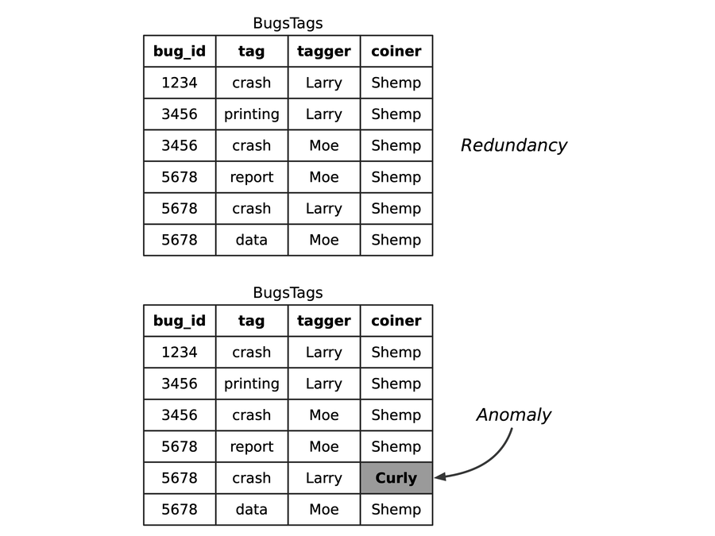


*   **Solution**: Move `tag_coiner` to a separate `Tags` table.
```sql
-- Normal 2NF Solution
	​CREATE​ ​TABLE​ Tags (
​ 	  tag     ​VARCHAR​(20) ​PRIMARY​ ​KEY​,
​ 	  coiner  ​BIGINT​ ​UNSIGNED​ ​NOT​ ​NULL​,
​ 	  ​FOREIGN​ ​KEY​ (coiner) ​REFERENCES​ Accounts(account_id)
​ 	);
​ 	
​ 	​CREATE​ ​TABLE​ BugsTags (
​ 	  bug_id  ​BIGINT​ ​UNSIGNED​ ​NOT​ ​NULL​,
​ 	  tag     ​VARCHAR​(20) ​NOT​ ​NULL​,
​ 	  tagger  ​BIGINT​ ​UNSIGNED​ ​NOT​ ​NULL​,
​ 	  ​PRIMARY​ ​KEY​ (bug_id, tag),
​ 	  ​FOREIGN​ ​KEY​ (bug_id) ​REFERENCES​ Bugs(bug_id),
​ 	  ​FOREIGN​ ​KEY​ (tag) ​REFERENCES​ Tags(tag),
​ 	  ​FOREIGN​ ​KEY​ (tagger) ​REFERENCES​ Accounts(account_id)
​ 	);
```

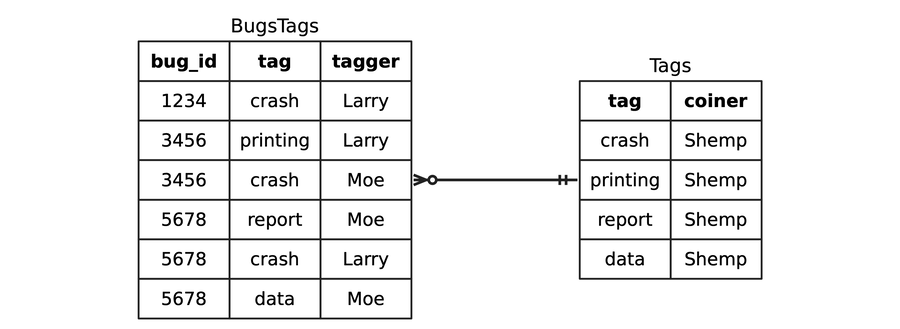

---

### Third Normal Form (3NF): No Transitive Dependencies
**The Rule**: Non-key columns must not depend on other non-key columns. "The key, the whole key, and nothing but the key."
*   **Fail**: Storing `assigned_email` in the `Bugs` table. The email belongs to the **Engineer**, not the **Bug**. If the engineer changes their email, you'd have to update every bug they ever touched.

Bad SQL:
```sql
	​CREATE​ ​TABLE​ Bugs (
​ 	  bug_id ​SERIAL​ ​PRIMARY​ ​KEY​,
​ 	  ​-- . . .​
​ 	  assigned_to ​BIGINT​ ​UNSIGNED​,
​ 	  assigned_email ​VARCHAR​(100),
​ 	  ​FOREIGN​ ​KEY​ (assigned_to) ​REFERENCES​ Accounts(account_id)
​ 	);
```

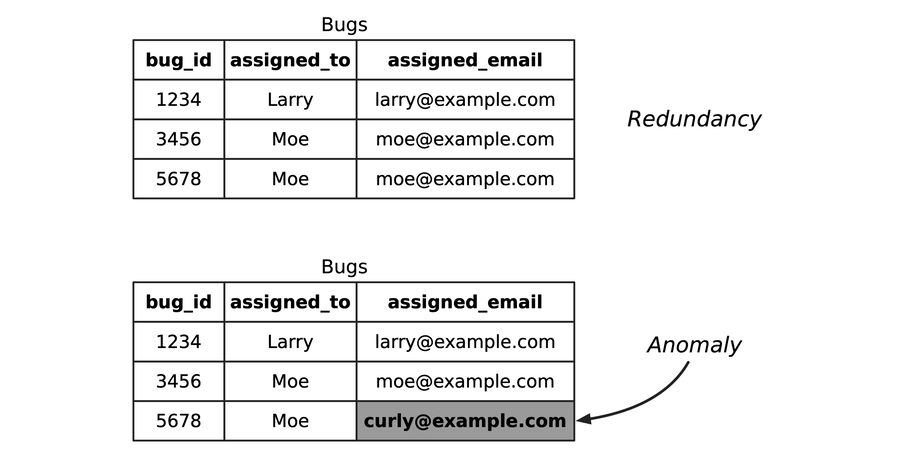

*   **Solution**: Email belongs in the `Accounts` table.

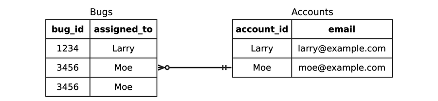

---

### Boyce-Codd Normal Form (BCNF): Determinant Rule
**The Rule**: Every determinant must be a candidate key. This is a stricter version of 3NF for tables with multiple overlapping unique keys.
*   **Fail**: A table tracking Bug Tags where each bug can have only one tag of a specific **type** (e.g., Impact, Subsystem). 

The following illustrates an example of a table that is in third normal form but not Boyce-Codd normal form.
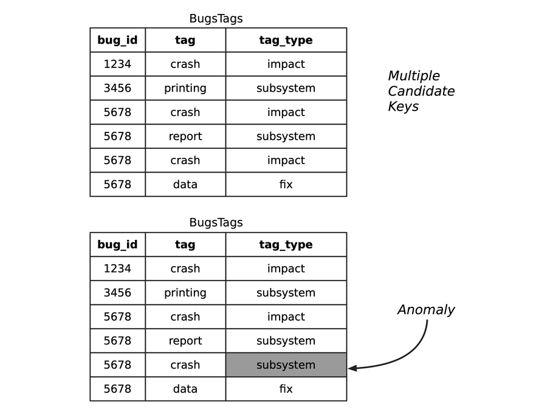


*   **Solution**: Refactor the relationship so metadata about the `tag` (like its `type`) stays in the `Tags` table.

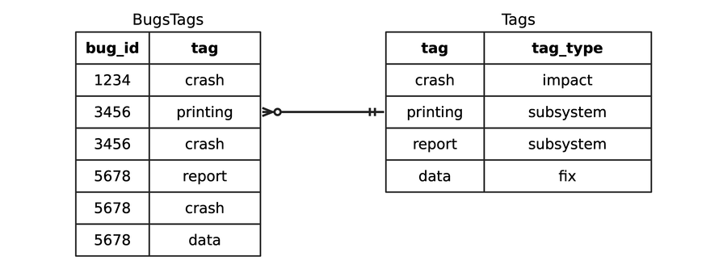

---

### Fourth Normal Form (4NF): No Multivalued Dependencies
**The Rule**: Don't use a single "Double-Duty" or "Triple-Duty" intersection table to store independent many-to-many relationships.
*   **Fail**: A `BugsAccounts` table carrying `reported_by`, `assigned_to`, and `verified_by` in one row. To add a second "assigned engineer" without adding a second "reporter," you'd have to duplicate data or leave nulls.

Bad SQL:
```sql
	​CREATE​ ​TABLE​ BugsAccounts (
​ 	  bug_id       ​BIGINT​ ​UNSIGNED​ ​NOT​ ​NULL​,
​ 	  reported_by  ​BIGINT​ ​UNSIGNED​,
​ 	  assigned_to  ​BIGINT​ ​UNSIGNED​,
​ 	  verified_by  ​BIGINT​ ​UNSIGNED​,
​ 	  ​FOREIGN​ ​KEY​ (bug_id) ​REFERENCES​ Bugs(bug_id),
​ 	  ​FOREIGN​ ​KEY​ (reported_by) ​REFERENCES​ Accounts(account_id),
​ 	  ​FOREIGN​ ​KEY​ (assigned_to) ​REFERENCES​ Accounts(account_id),
​ 	  ​FOREIGN​ ​KEY​ (verified_by) ​REFERENCES​ Accounts(account_id)
​ 	);
```

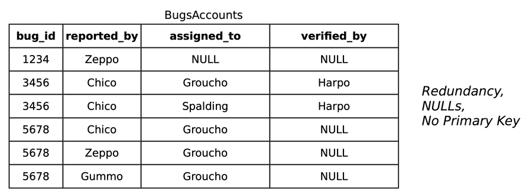

*   **Solution**: Split into three tables: `BugsReported`, `BugsAssigned`, and `BugsVerified`.

```sql
	​CREATE​ ​TABLE​ BugsReported (
​ 	  bug_id       ​BIGINT​ ​NOT​ ​NULL​,
​ 	  reported_by  ​BIGINT​ ​NOT​ ​NULL​,
​ 	  ​PRIMARY​ ​KEY​ (bug_id, reported_by),
​ 	  ​FOREIGN​ ​KEY​ (bug_id) ​REFERENCES​ Bugs(bug_id),
​ 	  ​FOREIGN​ ​KEY​ (reported_by) ​REFERENCES​ Accounts(account_id)
​ 	);
​ 	
​ 	​CREATE​ ​TABLE​ BugsAssigned (
​ 	  bug_id       ​BIGINT​ ​NOT​ ​NULL​,
​ 	  assigned_to  ​BIGINT​ ​NOT​ ​NULL​,
​ 	  ​PRIMARY​ ​KEY​ (bug_id, assigned_to),
​ 	  ​FOREIGN​ ​KEY​ (bug_id) ​REFERENCES​ Bugs(bug_id),
​ 	  ​FOREIGN​ ​KEY​ (assigned_to) ​REFERENCES​ Accounts(account_id)
​ 	);
​ 	
​ 	​CREATE​ ​TABLE​ BugsVerified (
​ 	  bug_id       ​BIGINT​ ​NOT​ ​NULL​,
​ 	  verified_by  ​BIGINT​ ​NOT​ ​NULL​,
​ 	  ​PRIMARY​ ​KEY​ (bug_id, verified_by),
​ 	  ​FOREIGN​ ​KEY​ (bug_id) ​REFERENCES​ Bugs(bug_id),
​ 	  ​FOREIGN​ ​KEY​ (verified_by) ​REFERENCES​ Accounts(account_id)
​ 	);
```

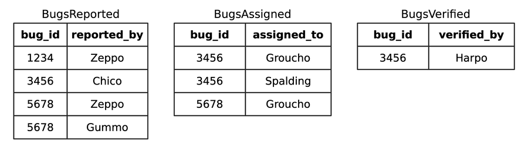

---

### Fifth Normal Form (5NF): The Sharding Rule
**The Rule**: Isolate all independent many-to-many relationships. A table is in 5NF if every join dependency is a consequence of candidate keys.
*   **Fail**: Trying to store "Which engineer works on which product" in a `BugsAssigned` table.

```sql
	​CREATE​ ​TABLE​ BugsAssigned (
​ 	  bug_id       ​BIGINT​ ​UNSIGNED​ ​NOT​ ​NULL​,
​ 	  assigned_to  ​BIGINT​ ​UNSIGNED​ ​NOT​ ​NULL​,
​ 	  product_id   ​BIGINT​ ​UNSIGNED​ ​NOT​ ​NULL​,
​ 	  ​PRIMARY​ ​KEY​ (bug_id, assigned_to),
​ 	  ​FOREIGN​ ​KEY​ (bug_id) ​REFERENCES​ Bugs(bug_id),
​ 	  ​FOREIGN​ ​KEY​ (assigned_to) ​REFERENCES​ Accounts(account_id),
​ 	  ​FOREIGN​ ​KEY​ (product_id) ​REFERENCES​ Products(product_id)
​ 	);
```

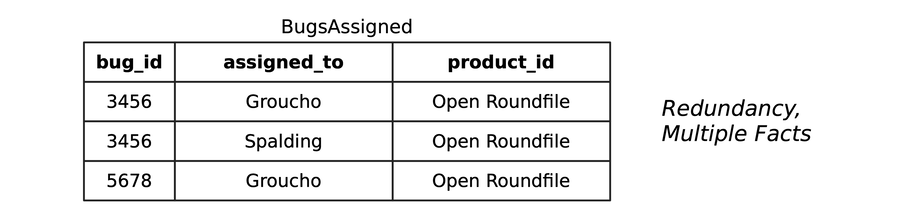

*   **Solution**: Create a dedicated `EngineerProducts` table separate from the `BugsAssigned` table. This allows you to know an engineer is available for a product even if they aren't currently working on a bug for it.

```sql
CREATE​ ​TABLE​ BugsAssigned (
​ 	  bug_id       ​BIGINT​ ​UNSIGNED​ ​NOT​ ​NULL​,
​ 	  assigned_to  ​BIGINT​ ​UNSIGNED​ ​NOT​ ​NULL​,
​ 	  ​PRIMARY​ ​KEY​ (bug_id, assigned_to),
​ 	  ​FOREIGN​ ​KEY​ (bug_id) ​REFERENCES​ Bugs(bug_id),
​ 	  ​FOREIGN​ ​KEY​ (assigned_to) ​REFERENCES​ Accounts(account_id)
​ 	);
​ 	
​ 	​CREATE​ ​TABLE​ EngineerProducts (
​ 	  account_id   ​BIGINT​ ​UNSIGNED​ ​NOT​ ​NULL​,
​ 	  product_id   ​BIGINT​ ​UNSIGNED​ ​NOT​ ​NULL​,
​ 	  ​PRIMARY​ ​KEY​ (account_id, product_id),
​ 	  ​FOREIGN​ ​KEY​ (account_id) ​REFERENCES​ Accounts(account_id),
​ 	  ​FOREIGN​ ​KEY​ (product_id) ​REFERENCES​ Products(product_id)
​ 	);
```

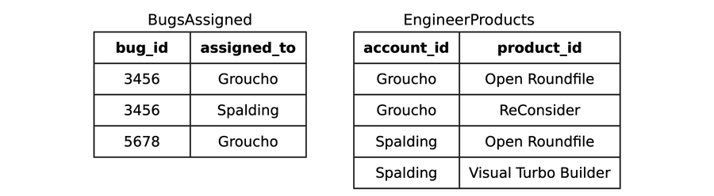

---

## 1.6 Further Normal Forms
*   **Domain-Key Normal Form (DKNF)**: The "Ultimate" normal form. Every constraint is a direct consequence of the table's domains and keys. 

For example, you may decide that a bug that has a status of NEW or DUPLICATE has resulted in no work, so there should be no hours logged, and also it makes no sense to assign a quality engineer in the verified_by column. You might implement these constraints with a trigger or a CHECK constraint. These are constraints between non-key columns of the table, so they don’t meet the criteria of DKNF.

*   **Sixth Normal Form (6NF)**: Eliminates all join dependencies. Every non-key attribute gets its own table.
    *   **Use Case**: Temporal databases and data warehousing (e.g., **Anchor Modeling**) where you need to track exactly how every single column changed over time. It's overkill for most apps but perfect for "Time Travel" queries.

> **Final Thought**: If you find yourself writing complex loops or `WHERE` clauses just to parse a single column, you've likely violated a Normal Form. **Normalize for integrity; index for speed.**

---

## 1.3 Common myths about Normalization 

In many development circles, "normalization" is treated as a dirty word. Let’s debunk the most common myths:

### Myth 1: "Normalization makes the database slow."
**False.** The common argument is that joins are expensive. While denormalization *can* speed up a single, specific query by avoiding a join, it often makes every other operation (inserts, updates, and other query types) slower and more complex.
*   **The Reality**: Normalization ensures that data is only stored once. This makes updates fast and prevents the "Jaywalking" or "Multicolumn Attribute" problems where queries become incredibly convoluted and slow.
*   **Pro Tip**: Normalize first. Only denormalize if you have measured a specific, persistent performance bottleneck that cannot be solved with indexing.

### Myth 2: "Normalization requires Pseudokeys."
**False.** Using an auto-incrementing `id` or a `UUID` is a design choice for convenience, storage efficiency, or performance. It has absolutely nothing to do with whether a table is normalized or not. A table can be perfectly normalized while using a composite natural key.

### Myth 3: "Normalization means separating every attribute (like EAV)."
**False.** Developers often misuse the term to imply that data should be split into a "flexible" key-value soup. As we saw in **Chapter 6: Entity-Attribute-Value**, EAV is actually the *opposite* of a relational design. Normalization is about ensuring that every attribute is in the right table based on its dependency, not about making data unreadable.

### Myth 4: "No one needs to go past Third Normal Form (3NF)."
**False.** While many developers stop at 3NF, research shows that roughly **20% of business databases** contain violations of Fourth Normal Form (4NF). These violations cause subtle data loss and integrity bugs.
*   **The Analogy**: If a medicine didn't work for 20% of people, you wouldn't call the problem "too esoteric." You would fix the medicine. Understanding higher normal forms is the key to fixing that 20% of hidden bugs.
