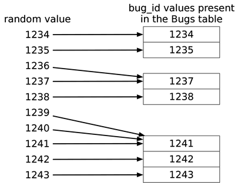

# Chapter 16: Random Selection

> **"I need a random row. I'll just sort by `RAND()` and take the first one."**

This is the **Random Selection** antipattern. It occurs when developers use `ORDER BY RAND()` (or `NEWID()`, `RANDOM()`) to fetch a sample from a large dataset.

---

## 16.1 The Objective: Fetch a Sample Row
You need a random sample from the database.
*   **Rotation**: Displaying a random ad banner.
*   **Auditing**: Checking 1% of transactions for fraud.
*   **Balancing**: Assigning a new lead to a random sales rep.

---

## 16.2 The Antipattern: Sort Data Randomly
You use the database's random function in the `ORDER BY` clause.

### SQL Implementation
```sql
SELECT * FROM Bugs ORDER BY RAND() LIMIT 1;
```
*   **MySQL**: `RAND()`
*   **Postgres**: `RANDOM()`
*   **SQL Server**: `NEWID()`
*   **Oracle**: `dbms_random.value`

### Why it fails (The Sorting Cost)
1.  **No Index Usage**:
    *   The function `RAND()` is **Non-Deterministic**. It returns a new value for every row, every time.
    *   Therefore, the database **cannot use an index**. An index is a pre-sorted tree of values. Since the values change every time definitionally, the index is useless.

2.  **The Full Table Scan & Sort**:
    *   To sort by `RAND()`, the database must:
        1.  Fetch **every single row** in the table (Load 100% of data).
        2.  Generate a random number for every row.
        3.  **Sort** the entire dataset by that random number (using a temporary file/table).
        4.  Pick the top 1.
        5.  Discard the rest.
    *   **Cost**: `O(N log N)` (for the sort).
    *   **Result**: If you have 100k rows, it's fast. If you have 10M rows, your server crashes.

### Legitimate Uses of the Antipattern
*   **Tiny Datasets**: If you have 50 US States, `ORDER BY RAND()` is fine.
*   **Once-a-Day Jobs**: If the query runs at 3 AM and takes 2 minutes, maybe it's okay.

## 16.3 The Solution: In No Particular Order...
Avoid the sort. Use a primary key or an offset.

### Solution 1: Choose Random Key (Min to Max)
Pick a random number between MIN and MAX ID, and try to find that exact row.
```sql
SELECT * FROM Bugs WHERE bug_id = FLOOR(RAND() * (MAX_ID - MIN_ID) + MIN_ID);
```
*   **Pros**: Fast lookup.
*   **Cons**: **Gaps**. If ID 5 is deleted, and the random number is 5, you get **Empty Result**.

### Solution 2: Choose Next Higher Key Value
To fix the empty result, ask for the *next available* ID.



```sql
SELECT MIN(bug_id), MAX(bug_id) INTO @min_bug_id, @max_bug_id FROM Bugs;

SELECT * FROM Bugs
WHERE bug_id >= ROUND(RAND() * (@max_bug_id - @min_bug_id)) + @min_bug_id
ORDER BY bug_id LIMIT 1;
```
*   **Pros**: Always returns a row (if table isn't empty). Fast.
*   **Cons**: **Bias**. If you have a huge gap (IDs: 1, 100), the random numbers 2...99 will all map to 100.
    *   ID 1 chance: 1%
    *   ID 100 chance: 99%

### Solution 2: Get List of Keys (App Side)
Fetch all keys, pick one in your app, then fetch the row.
```python
# 1. Get all IDs (Fast, just the index)
ids = db.query("SELECT bug_id FROM Bugs")
# 2. Pick one
random_id = random.choice(ids)
# 3. Fetch row
row = db.query("SELECT * FROM Bugs WHERE bug_id = ?", random_id)
```
*   **Pros**: Perfectly random. Zero bias.
*   **Cons**: If you have 10M rows, transferring 10M integers (40MB) to the app is slow/memory-intensive.

### Solution 3: Random Offset
Count the rows, pick a random number $R$ between 0 and Count, then `OFFSET`.
```python
count = db.query("SELECT COUNT(*) FROM Bugs")
offset = random.randint(0, count)
row = db.query("SELECT * FROM Bugs LIMIT 1 OFFSET ?", offset)
```
*   **Pros**: Perfectly uniform distribution.
*   **Cons**: `OFFSET` gets slower the further you go (Scanning 1M rows to return the 1,000,001st is slow).

### Solution 4: Proprietary (`TABLESAMPLE`)
Oracle, SQL Server, and Postgres support sampling.
```sql
-- SQL Server / Postgres
SELECT * FROM Bugs TABLESAMPLE SYSTEM (1); -- Get ~1% of rows
```
*   **Pros**: Blazing fast (reads random pages, not rows).
*   **Cons**: Probabilistic. You might get 0 rows or 20 rows.

### Solution 5: Reduce, Recycle, Reuse (Caching)
Do you *really* need a new random row for **every single request**?
*   **Strategy**: Fetch one random row, cache it for 5 minutes, serve it to 10,000 users.
*   **Logic**: Users don't know everyone else is seeing the same Ad.
*   **Impact**: Reduces DB load by 99.9%.
```python
@lru_cache(ttl=300)
def get_random_ad():
    return db.query("SELECT * FROM Ads ORDER BY RAND() LIMIT 1") 
    # This slow query runs only once every 5 minutes!
```

> **Takeaway**: 
> *   **Small Data**: `ORDER BY RAND()` is fine.
> *   **Fast & Good Enough**: `WHERE id >= RAND() * MAX_ID`.
> *   **Perfect Randomness**: Pick an ID in the App.

### Mini-Antipattern: Query for Multiple Random Rows
**"I need 5 random rows."**

*   **The Naive Query**:
    ```sql
    SELECT * FROM Bugs ORDER BY RAND() LIMIT 5;
    ```
    *   **Cost**: Still $O(N \log N)$ (Sorts the whole table).

*   **The Optimized Approach**:
    *   Run the "Random Key Query" (Solution 1 or 2) **5 times**.
    *   $5 \times O(1)$ is massively faster than sorting 1,000,000 rows.

*   **Caveats**:
    1.  **Duplicates**: Randomness allows picking the same ID twice. Your app code must check for duplicates and retry.
    2.  **Infinite Loops**: If the table has 4 rows and you ask for 5 unique ones, your retry loop will never finish.

**Trade-off**: Do you want **Performance** (Complex app logic) or **Simplicity** (Slow Sort)?
