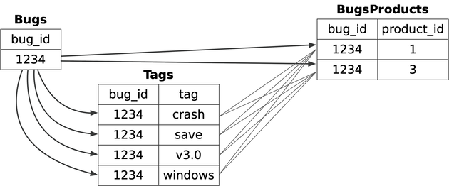

# Chapter 18: Spaghetti Query

> **"I need to count bugs, products, and comments. I'll just do it all in one query. Fewer queries = Faster, right?"**

This is the **Spaghetti Query** antipattern. It occurs when developers try to solve complex problems with a single method, often producing Cartesian Products (inflated counts) and unmaintainable code.

---

## 18.1 The Objective: Decrease SQL Queries
You want to reduce "Chattiness" between the Application and the Database.
*   **The Intent**: "One query is better than ten."
*   **The Trap**: "One *monster* query is better than three simple ones."
*   **The Goal**: Calculate multiple unrelated statistics (e.g., Number of Comments per Bug AND Number of Products per Bug).

---

## 18.2 The Antipattern: Solve a Complex Problem in One Step
You write a single query joining multiple child tables (`Tags`, `Products`) to a parent table (`Bugs`), and then try to count them.

```sql
SELECT b.bug_id,
  COUNT(t.tag_id) AS count_tags,
  COUNT(bp.product_id) AS count_products
FROM Bugs b
LEFT JOIN Tags t ON b.bug_id = t.bug_id
LEFT JOIN BugsProducts bp ON b.bug_id = bp.bug_id
GROUP BY b.bug_id;
```

### Why it fails (The Cartesian Product)



1.  **The Explosion**:
    *   Bug 1234 has **2 Tags** (`Crash`, `Data`).
    *   Bug 1234 affects **3 Products** (`Mac`, `Windows`, `Linux`).
    *   The `JOIN` creates a cross product: `2 * 3 = 6 rows`.
    *   Rows:
        1. (Crash, Mac)
        2. (Crash, Windows)
        3. (Crash, Linux)
        4. (Data, Mac)
        5. (Data, Windows)
        6. (Data, Linux)

2.  **The Result**:
    *   `COUNT(tag_id)` returns **6** (Expected 2).
    *   `COUNT(product_id)` returns **6** (Expected 3).
    *   **Your numbers are wrong.**

3.  **The Band-Aid (`DISTINCT`)**:
    *   `COUNT(DISTINCT t.tag_id)` *might* fix the number, but the database still had to generate and process the inflated intermediate result set.
    *   If you join 3 tables with 10 rows each, you generate 1,000 intermediate rows.
    *   If you join 5 tables with 100 rows each, you generate **10 Billion** intermediate rows. The server crashes.

### The Complexity Cost
*   **Hard to Read**: 50-line queries are impossible to debug.
*   **Hard to Optimize**: The Query Optimizer gives up on joins exceeding 5-7 tables.
*   **Hard to Maintain**: Adding one more statistic requires rewriting the entire logic.

> **Takeaway**: **Complexity is not a virtue.** Writing "One Big Query" is usually a premature optimization that leads to incorrect data.

### Legitimate Uses of the Antipattern
*   **BI Tools**: Some reporting tools (Tableau, Crystal Reports) require a single "Flat Datasource". You have no choice but to write a monster query (or View).
*   **Sorted Results**: If you need combined data sorted by the DB, a single query is often better than sorting in the App.

### Is there a legitimate use for a Cartesian product?
Yes! Use `CROSS JOIN` to generate data (e.g., sequences of dates or numbers).

**Example: Generating 0-99 with SQL**
```sql
CREATE TABLE Digits (num INT);
INSERT INTO Digits VALUES (0), (1), (2), (3), (4), (5), (6), (7), (8), (9);

-- 10 * 10 = 100 Rows
SELECT d1.num + (d2.num * 10) as sequence
FROM Digits d1 CROSS JOIN Digits d2
ORDER BY sequence;
```
### 18.3 The Solution: Divide and Conquer
The Law of Parsimony: "The simpler explanation is usually better."

**1. One Step at a Time**
Instead of one monster query, run three simple ones. What this means to SQL is that when you have a choice between two queries that produce the same result set, choose the simpler one.


```sql
-- Query 1: Get Tags
SELECT b.bug_id, COUNT(t.tag_id) FROM Bugs b LEFT JOIN Tags t USING (bug_id) GROUP BY b.bug_id;

-- Query 2: Get Products
SELECT b.bug_id, COUNT(bp.product_id) FROM Bugs b LEFT JOIN BugsProducts bp USING (bug_id) GROUP BY b.bug_id;
```
*   **Pros**:
    1.  **Accuracy**: No Cartesian Product means correct counts.
    2.  **Debugging**: If "Tags" are wrong, you debug Query 1. You don't break Query 2.
    3.  **Speed**: Database engines optimize simple joins much better than 10-table joins.

**2. Writing SQL with SQL (Code Generation)**
Sometimes you can't write a single `UPDATE` to fix everything.
*   **Strategy**: Write a `SELECT` that generates a script of 1,000 simple `UPDATE` statements.
```sql
SELECT CONCAT('UPDATE Inventory SET last_used = ''', MAX(usage_date), ''' WHERE id = ', id, ';')
FROM ComputerUsage
GROUP BY id;
```
*   **Result**: 1,000 simple statements you can run as a batch.

> **Takeaway**: Don't build a House of Cards. If a query feels too complex, it probably is. **Break it down.**
