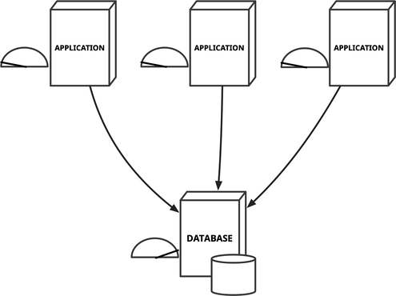

# Chapter 25: Standard Operating Procedures

> **"We use stored procedures for everything because that's how we've always done it."**

This is the **Follow the Leader** antipattern. It occurs when teams use database features (like Stored Procedures) not because they solve a specific technical problem, but because of legacy habit or a "standard operating procedure" from a previous era or different technology stack.

---

## 25.1 The Objective: Use Stored Procedures
Stored procedures allow you to put custom code into the database itself.
*   **Encapsulation**: Hide complex SQL behind a simple `CALL MyProc(id)`.
*   **Consistency**: Ensure every application (Web, Mobile, Reporting) applies the same rules.
*   **Logic Consolidation**: Historically used when developers weren't SQL experts and DBAs wrote all the logic.

---

## 25.2 The Antipattern: Follow the Leader
The real antipattern is using a technology feature just because a predecessor or "The Founder" said so, without considering the costs.

### The Problem: Load Imbalance (The Bottleneck)
In a modern architecture, you have 10-20 **Application Servers** (PHP, Java, Node) and 1 **Database Server**.
*   **The Mistake**: Putting business logic in Stored Procedures forces all calculations to run on that **single** DB server.
*   **The Result**: The DB server runs at 100% CPU and becomes a system-wide bottleneck, while your expensive application servers sit idle at 5% CPU.

---

## 25.3 Why it Fails (The Hidden Costs)

### 1. Vendor Lock-in (Portability)
Stored procedure languages (PL/SQL, T-SQL, pgSQL) are highly proprietary. If you move from Oracle to MySQL, you have to rewrite **every single procedure**. It’s the ultimate "sticky" feature that prevents you from ever leaving a vendor.

### 2. Development & Deployment Friction
*   **No Debuggers**: Most modern IDEs (VS Code, IntelliJ) have world-class debuggers for app code, but primitive or non-existent tools for SQL procedures.
*   **Deployment Deadlocks**: Updating a procedure with `CREATE OR REPLACE` on a busy server can block all incoming requests until existing transactions finish. You can't "roll out" a procedure update across a cluster like you can with app code.
*   **Testing**: Unit testing a Java class is easy. Unit testing a MySQL stored procedure requires complex setup, mock data, and specialized frameworks.

### 3. Fighting the "Skill Gap"
Your team is likely composed of expert Java, Python, or PHP developers, not SQL procedure specialists.
*   **Legacy Language**: Stored procedure syntax often feels like legacy procedural languages (Pascal or Algol). 
*   **The "One Guy" Problem**: Logic often becomes so complex that only the person who wrote it understands it, creating a single point of failure in the staff.

### 4. The Optimization Paradox
While procedures *can* be faster (pre-compiled), they often hide problems from the database itself.
*   **Stale Execution Plans**: A stored procedure might be optimized for data as it existed a year ago. If your index or data distribution changes, the stored plan might become horribly inefficient.
*   **Opaque Logic**: The database engine often treats a stored procedure as a "black box," making it harder for the query optimizer to see "into" the procedure to find global optimizations.

### 5. Scalability Concerns
The database is often the hardest part of an application to scale. Stored procedures make this even harder.
*   **Horizontal vs. Vertical**: Application servers are easy to scale **horizontally** (just add more cheap nodes). The database typically scales **vertically** (adding more CPU/RAM to one expensive box).
*   **The Sharding Wall**: Stored procedures execute within a single server. They cannot easily access data across shards without complex and fragile "linked server" configurations that invite network failures and performance drops.
*   **Resource Contention**: Every CPU cycle spent on procedural logic (loops, string building) is a cycle stolen from the DB’s core mission: indexing and retrieving data. This turns your DB into a permanent bottleneck.

## 25.4 Legitimate Uses
Stored procedures are not an antipattern in themselves; they are powerful tools when used for the right reasons:

*   **Network Latency**: If your task requires dozens of small interim queries, a stored procedure eliminates the latency of multiple network round-trips by running them all on the server.
*   **Database Administration**: Tasks like auditing privileges, clearing logs, or running scheduled maintenance are often best kept inside the DB.
*   **Security & Least Privilege**: You can grant a user permission to run a `CloseTicket` procedure without giving them `UPDATE` access to the entire `Tickets` table. This provides a strict, prescribed API for sensitive operations.
*   **Data Integrity (PII/SPI)**: Processing sensitive data entirely within the DB server reduces the risk of intercepting that data over the network.

## 25.5 The Solution: Adopt Modern Application Architecture
Don't use a hammer for every problem. Approach your architecture like an engineer, not a traditionalist.

### 1. Shift Logic to the Application Layer
Develop your business logic in languages like **Go, Python, Java, or PHP**.
*   **Scale Out**: It is easier to scale 20 app servers than one massive DB server.
*   **Productivity**: Use the debuggers, testing frameworks (mocking), and IDEs your team already knows.
*   **Deployment**: Modern CI/CD allows "Blue/Green" or "Canary" deployments of app code with zero downtime. You can't do that with a monolithic stored procedure.

### 2. Balance the Load
The goal is to move the "processing" of data to the app layer while the DB focuses on "storage and retrieval."

*   **Result**: CPU usage is distributed. Your app servers work harder (but they can scale), and your DB server stays responsive for everyone.

### 3. Choose the Right Tool
Stored procedures are for **data-centric** tasks; Application code is for **logic-centric** tasks. If you find yourself writing `WHILE` loops and complex string parsing in SQL, you’ve probably used the wrong tool.

> **Takeaway**: **Scalability happens in the Application, not the Database.** Don't turn your DB server into a bottleneck by forcing it to be an application server too.
