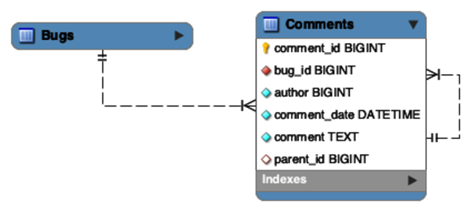
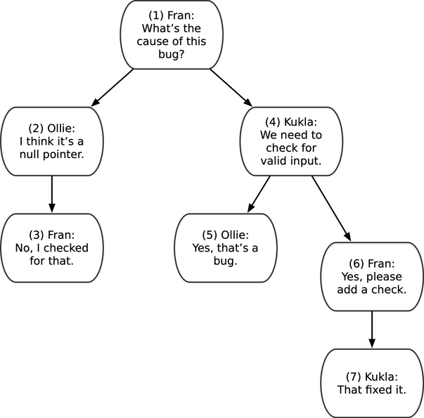
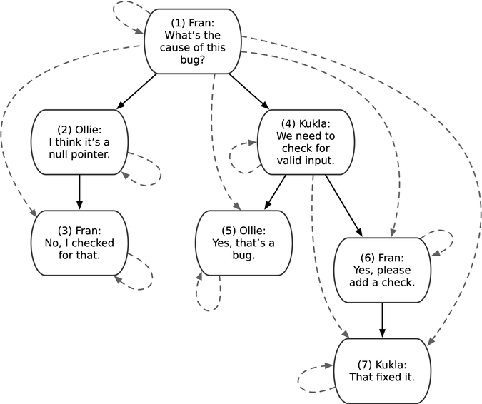

# Chapter 3: Naive Trees (Adjacency List)

> **"Just add a `parent_id` column found recursive queries."**

Storing hierarchies (like comment threads, org charts, or simple folder structures) in a relational database is a common requirement. The **Naive Tree** (or Adjacency List) is the default approach for most developers, but it fails spectacularly when you need to query deep hierarchies.

---

## 3.1 The Objective: Store and Query Hierarchies
You have a threaded discussion board.
*   **The Structure**: Comment A has a reply B, which has a reply C, and so on.
*   **The Naive Approach (Adjacency List)**:
    ```sql
    CREATE TABLE Comments (
        comment_id SERIAL PRIMARY KEY,
        parent_id  BIGINT REFERENCES Comments(comment_id), -- The simplistic link
        comment    TEXT
    );
    ```

---

## 3.2 The Antipattern: Adjacency List (For Deep Queries)
The design works fine for "Get immediate parent" or "Get immediate children". It breaks for "Get Logic".





### Why it fails
1.  **Querying Descendants (The Join Nightmare)**
    *   To get a thread 4 levels deep, you need 4 self-joins.
        ```sql
        SELECT * 
        FROM Comments c1
        LEFT JOIN Comments c2 ON c2.parent_id = c1.comment_id
        LEFT JOIN Comments c3 ON c3.parent_id = c2.comment_id
        LEFT JOIN Comments c4 ON c4.parent_id = c3.comment_id;
        ```
    *   **The Limit**: You cannot query an arbitrary depth (e.g., "Get full thread") with a single standard SQL query. You are limited by the number of joins you write.

2.  **Aggregation**:
    *   "Count all replies to this comment" is impossible without fetching all data to the application layer or writing a complex stored procedure.

3.  **App-Side Recursion**:
    *   Developers often resort to: `SELECT * FROM Comments` (Fetch everything) and build the tree in Java/Python/Node.
    *   **Result**: Massive memory usage and network waste.

4.  **Deleting Subtrees**:
    *   To delete a comment and all its replies, you must find them all first (iteratively) or rely on `ON DELETE CASCADE` (which works but is dangerous if you wanted to *move* them instead).

---

## 3.3 The Solutions: Alternative Tree Models
There are four better ways to handle trees in SQL, depending on your read/write needs.

### Solution 1: Recursive CTEs (The Modern Standard)
Since SQL:1999, databases support `WITH RECURSIVE`. This allows you to use the simple Adjacency List model but query it efficiently. **This is usually the best default choice.**

```sql
WITH RECURSIVE CommentTree AS (
    -- Base Case: The Root
    SELECT comment_id, parent_id, comment, 0 as depth
    FROM Comments
    WHERE comment_id = 9876
  UNION ALL
    -- Recursive Step: The Children
    SELECT c.comment_id, c.parent_id, c.comment, ct.depth + 1
    FROM Comments c
    JOIN CommentTree ct ON c.parent_id = ct.comment_id
)
SELECT * FROM CommentTree;
```
*   **Pros**: Uses standard schema, supports unlimited depth.
*   **Cons**: Syntax can be intimidating.

### Solution 2: Path Enumeration (The Unix Path)
Store the chain of ancestors as a string attribute of each node, like a directory path: `1/4/6/7/`.

#### Implementation
```sql
CREATE TABLE Comments (
  comment_id   SERIAL PRIMARY KEY,
  path         VARCHAR(1000), -- The breadcrumb trail
  author       VARCHAR(100),
  comment      TEXT
);
```

#### Insertion (Tricky)
To insert a reply to Comment #7, you copy its path and append the new ID.
```sql
-- 1. Insert the comment
INSERT INTO Comments (author, comment) VALUES ('Ollie', 'Good job!');
-- 2. Update the path (e.g., parent path '1/4/6/7/')
UPDATE Comments 
SET path = CONCAT((SELECT path FROM Comments WHERE comment_id = 7), LAST_INSERT_ID(), '/')
WHERE comment_id = LAST_INSERT_ID();
```

#### Querying
*   **Find Ancestors of #7** (`1/4/6/7/`):
    ```sql
    SELECT * FROM Comments 
    WHERE '1/4/6/7/' LIKE CONCAT(path, '%');
    -- Matches '1/%', '1/4/%', '1/4/6/%'
    ```

*   **Find Descendants of #4** (`1/4/`):
    ```sql
    SELECT * FROM Comments 
    WHERE path LIKE '1/4/%';
    -- Matches '1/4/6/', '1/4/6/7/', etc.
    ```

*   **Count Replies**:
    ```sql
    SELECT COUNT(*) FROM Comments WHERE path LIKE '1/4/%';
    ```

#### Pros & Cons
*   **Pros**:
    *   **Breadcrumbs**: Perfect for UI navigation bars ("Home > Electronics > Laptops").
    *   **Fast Reads**: Very efficient string matching.
*   **Cons**:
    *   **Fragile**: No database validation. You can insert path `1/9999/` even if node 9999 doesn't exist.
    *   **Length Limit**: `VARCHAR(1000)` eventually fills up.
    *   **Maintenance**: Moving a subtree requires massive string updates.

### Solution 3: Nested Sets (The Math Approach)
Store `nsleft` and `nsright` numbers for each node, representing a range.
*   **Concept**: Think of folders. A parent folder "contains" its children.
*   **The Rule**: `Parent.Left < Child.Left` AND `Parent.Right > Child.Right`.


#### Implementation
```sql
CREATE TABLE Comments (
  comment_id SERIAL PRIMARY KEY,
  nsleft     INTEGER NOT NULL,
  nsright    INTEGER NOT NULL,
  comment    TEXT
);
-- Example Data:
-- Root: (1, 14)
--   Child A: (2, 5)  -> Grandchild A1: (3, 4)
--   Child B: (6, 13) -> ...
```

#### Querying (Super Fast)
*   **Find Descendants of #4**:
    ```sql
    SELECT child.* 
    FROM Comments parent
    JOIN Comments child ON child.nsleft BETWEEN parent.nsleft AND parent.nsright
    WHERE parent.comment_id = 4;
    ```
*   **Find Ancestors of #6**:
    ```sql
    SELECT parent.*
    FROM Comments child
    JOIN Comments parent ON child.nsleft BETWEEN parent.nsleft AND parent.nsright
    WHERE child.comment_id = 6;
    ```
*   **Calculate Depth/Level (Tricky)**:
    Count how many ancestors you have.
    ```sql
    SELECT child.comment_id, COUNT(parent.comment_id) as depth
    FROM Comments child
    JOIN Comments parent ON child.nsleft BETWEEN parent.nsleft AND parent.nsright
    GROUP BY child.comment_id;
    ```

#### Insertion (The Nightmare)
To insert a new node, you must "make space" by renumbering everything to the right.
```sql
-- Insert a child under Parent #5 (Right boundary=8)
-- 1. Shift existing nodes to make a gap of 2
UPDATE Comments SET nsright = nsright + 2 WHERE nsright >= 8;
UPDATE Comments SET nsleft = nsleft + 2 WHERE nsleft >= 8;
-- 2. Insert new node into the gap (8, 9)
INSERT INTO Comments (nsleft, nsright, comment) VALUES (8, 9, 'New Reply');
```

#### Pros & Cons
*   **Pros**:
    *   **Read Performance**: Blazing fast. Fetching a subtree is a single range scan.
    *   **No Recursion**: Works on ancient SQL databases.
*   **Cons**:
    *   **Write Performance**: **Terrible**. Inserting one comment might require updating 50% of the table rows (renumbering).
    *   **Complexity**: Very hard to visualize and debug manually.
    *   **No Referential Integrity**: If numbers get messed up, the tree is broken.

### Solution 4: Closure Table (The Normalized Way)



Create a separate table storing *every* ancestor-descendant relationship, not just immediate parents.
*   **Concept**: If A is the parent of B, and B is the parent of C, store: `(A,A)`, `(B,B)`, `(C,C)` (Self), `(A,B)`, `(B,C)` (Direct), AND `(A,C)` (Indirect).

#### Implementation
```sql
CREATE TABLE Comments (
  comment_id SERIAL PRIMARY KEY,
  comment    TEXT
);

CREATE TABLE TreePaths (
  ancestor   BIGINT REFERENCES Comments(comment_id),
  descendant BIGINT REFERENCES Comments(comment_id),
  depth      INT,
  PRIMARY KEY (ancestor, descendant)
);
```

#### Querying
*   **Find Descendants of #4**:
    ```sql
    SELECT c.*
    FROM Comments c
    JOIN TreePaths t ON c.comment_id = t.descendant
    WHERE t.ancestor = 4;
    ```
*   **Find Ancestors of #6**:
    ```sql
    SELECT c.*
    FROM Comments c
    JOIN TreePaths t ON c.comment_id = t.ancestor
    WHERE t.descendant = 6;
    ```
*   **Find Immediate Children of #4**:
    ```sql
    SELECT * FROM TreePaths WHERE ancestor = 4 AND depth = 1;
    ```

#### Insertion (The Clever Part)
To insert a new child (Node #8) under Parent #5:
1.  **Add Self-Reference**: `(8, 8, 0)`
2.  **Copy Parent's Ancestors**: Find everyone who is an ancestor of #5, and make them an ancestor of #8 too (incrementing depth).
```sql
INSERT INTO TreePaths (ancestor, descendant, depth)
SELECT t.ancestor, 8, t.depth + 1
FROM TreePaths t
WHERE t.descendant = 5
UNION ALL
SELECT 8, 8, 0;
```

#### Deleting a Subtree
Simply delete all rows in `TreePaths` where the `descendant` is part of the target subtree.
```sql
DELETE FROM TreePaths 
WHERE descendant IN (SELECT descendant FROM TreePaths WHERE ancestor = 4);
```

#### Moving a Subtree (e.g., Move Node #6 from under #4 to under #3)
This is a two-step process:
1.  **Disconnect** from old ancestors: Delete paths that link the Subtree (#6+) to ancestors of #6 (excluding the subtree itself).
    ```sql
    DELETE FROM TreePaths
    WHERE descendant IN (SELECT descendant FROM TreePaths WHERE ancestor = 6)
      AND ancestor IN (SELECT ancestor FROM TreePaths WHERE descendant = 6 AND ancestor != descendant);
    ```
2.  **Reconnect** to new ancestors: Cross Join the New Ancestors (#3's ancestors) with the Subtree (#6's descendants).
    ```sql
    INSERT INTO TreePaths (ancestor, descendant, depth)
    SELECT supertree.ancestor, subtree.descendant, supertree.depth + subtree.depth + 1
    FROM TreePaths AS supertree
    CROSS JOIN TreePaths AS subtree
    WHERE supertree.descendant = 3
      AND subtree.ancestor = 6;
    ```

#### Optimization: Path Length
Adding a `depth` column (as shown above) makes queries much easier.
*   **Self-Reference**: `depth = 0` (The node itself).
*   **Immediate Child**: `depth = 1`.
*   **Grandchild**: `depth = 2`.

Without this column, differentiating between a "direct parent" and a "distant ancestor" requires complex joins. With it, finding the immediate parent of Node #6 is trivial:
```sql
SELECT ancestor FROM TreePaths WHERE descendant = 6 AND depth = 1;
```

#### Pros & Cons
*   **Pros**:
    *   **Versatile**: Fast reads, fast writes (no renumbering).
    *   **Normalized**: Uses standard FKs.
    *   **Flexible**: Can even model "Graphs" (multiple parents) easily.
*   **Cons**:
    *   **Storage**: Requires O(N^2) rows in the worst case (deep trees). A tree with 1000 nodes might have 10,000 path rows.
    *   **Complexity**: You must maintain a second table.

---

## Summary Comparison

| Design | Tables | Query Child | Query Tree | Insert | Delete | Integrity |
| :--- | :--- | :--- | :--- | :--- | :--- | :--- |
| **Adjacency List** | 1 | Easy | Hard (w/o CTE) | Easy | Easy | Yes |
| **Recursive CTE** | 1 | Easy | Easy | Easy | Easy | Yes |
| **Path Enum** | 1 | Easy | Easy | Easy | Easy | **No** |
| **Nested Sets** | 1 | Hard | Easy | **Hard** | **Hard** | **No** |
| **Closure Table** | 2 | Easy | Easy | Easy | Easy | Yes |

> **Takeaway**: Use **Adjacency List + Recursive CTEs** for most general-purpose trees (like comments). Use **Closure Table** for deep, complex hierarchies needing high read performance. Use **Nested Sets** only for static read-heavy data `Categories`.
