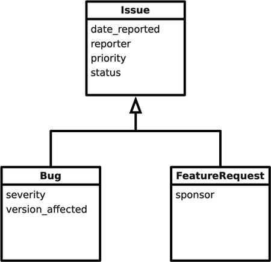
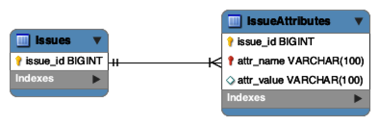

# Chapter 6: Entity-Attribute-Value (EAV)

> **"We need a flexible schema so users can add custom fields without changing the database structure."**

This is the **Entity-Attribute-Value (EAV)** antipattern. It occurs when developers try to make a relational database "schemaless" by storing data in a generic key-value format rather than in dedicated columns.

---

## 6.1 The Objective: Support Variable Attributes
You want to support different types of `Issues` (Bugs, Feature Requests) that share some fields but have unique ones.
*   **Common**: `date_reported`, `reporter`, `priority`.
*   **Bug Specific**: `severity`, `version_affected`.
*   **Feature Specific**: `sponsor`, `budget`.

The goal is extensibility: Allow new attributes (like `browser_version`) to be added at runtime without running `ALTER TABLE`.


---

## 6.2 The Antipattern: The Generic Attribute Table
Instead of columns, you create a table that looks like this:

```sql
CREATE TABLE IssueAttributes (
  issue_id    BIGINT REFERENCES Issues(id),
  attr_name   VARCHAR(100), -- The Key
  attr_value  VARCHAR(100)  -- The Value
);
```


### The Data
| issue_id | attr_name | attr_value |
| :--- | :--- | :--- |
| 1234 | date_reported | 2023-10-25 |
| 1234 | severity | HIGH |
| 5678 | sponsor | Acme Corp |

### Why it fails
1.  **Data Type Chaos**:
    *   Everything is a string (`VARCHAR`).
    *   Dates? Numbers? Enums? You lose all DB validation.
    *   Query: `WHERE attr_value > 10` compares strings (`"10" < "2"` because 1 < 2).

2.  **Mandatory Joins**:
    *   To get "Bug 1234's date and severity", you can't just `SELECT date, severity`.
    *   You must join the table to itself **for every single attribute**.
    ```sql
    SELECT i.id, 
           attr1.attr_value AS date, 
           attr2.attr_value AS severity
    FROM Issues i
    LEFT JOIN IssueAttributes attr1 
      ON i.id = attr1.issue_id AND attr1.attr_name = 'date_reported'
    LEFT JOIN IssueAttributes attr2 
      ON i.id = attr2.issue_id AND attr2.attr_name = 'severity';
    ```
    *   If you have 10 attributes, that's 10 Joins. Performance collapses.

3.  **Loss of Integrity**:
    *   Attributes are not mandatory. You can't say `severity IS NOT NULL` because the column doesn't effectively exist.
    *   Attribute names are just strings. `verison` vs `version` typos are common.

### Legitimate Uses of the Antipattern
*   **Truly Dynamic Fields**: If users define their own fields at runtime (e.g., a custom survey builder).
*   **Sparse Data**: If you have 10,000 possible attributes but each row has only 5.
*   **Warning**: If you need this, consider **NoSQL** (MongoDB, DynamoDB) or **Postgres JSONB** instead of EAV.

## 6.3 The Solutions: Model the Subtypes
If you have a finite set of types (Bug, Feature), use standard SQL modeling.

### Solution 1: Single Table Inheritance (STI)
Store all attributes in one big table. Add a `issue_type` column.
```sql
CREATE TABLE Issues (
  id           SERIAL PRIMARY KEY,
  issue_type   VARCHAR(10), -- 'BUG' or 'FEATURE'
  -- Common
  reported_by  BIGINT, 
  -- Bug Only
  severity     VARCHAR(20),
  version      VARCHAR(20),
  -- Feature Only
  sponsor      VARCHAR(50), 
  budget       DECIMAL(10,2)
);
```
*   **Pros**: Simple. Fast queries.
*   **Cons**: Sparse table (lots of NULLs). Can't enforce `NOT NULL` on subtype-specific columns easily.

### Solution 2: Concrete Table Inheritance
One table per type. No base table.
```sql
CREATE TABLE Bugs (
  id SERIAL PRIMARY KEY,
  severity VARCHAR(20) NOT NULL,
  ...
);
CREATE TABLE Features (
  id SERIAL PRIMARY KEY,
  sponsor VARCHAR(50) NOT NULL,
  ...
);
```
*   **Pros**: Strong types (`NOT NULL` works). No NULLs.
*   **Cons**: Hard to query "All Issues" (Requires `UNION`). Redundant definitions of common columns.

### Solution 3: Class Table Inheritance
Normalized approach. One base table + extension tables.
```sql
CREATE TABLE Issues (
  id SERIAL PRIMARY KEY, -- Base ID
  reported_by BIGINT
);

CREATE TABLE Bugs (
  issue_id BIGINT PRIMARY KEY REFERENCES Issues(id),
  severity VARCHAR(20)
);

CREATE TABLE Features (
  issue_id BIGINT PRIMARY KEY REFERENCES Issues(id),
  sponsor VARCHAR(50)
);
```
*   **Pros**: Normalized. Enforces 1:1 relationship. Efficient storage.
*   **Cons**: Requires Joins to fetch full data.

### Solution 4: Semi-Structured Data (JSONB)
The modern alternative to EAV. Use a `JSONB` column for dynamic fields.
```sql
CREATE TABLE Issues (
  id SERIAL PRIMARY KEY,
  common_attr_1 TEXT,
  extra_attributes JSONB -- {"severity": "HIGH", "browser": "Chrome"}
);
```
*   **Pros**: Flexible. queryable (in Postgres). No Schema changes.
*   **Cons**: Weaker data integrity than columns.

### Solution 5: Post-Processing (If you are stuck)
If you inherit an EAV database, don't try to Join. **Query the rows and reassemble in the App.**
```sql
SELECT * FROM IssueAttributes WHERE issue_id = 1234;
```
*   Get the 5 rows -> Map them to an Object in Python/Java.
*   **Why**: It's faster than 5 SQL Joins.

> **Takeaway**: Use **Single Table Inheritance** for simple cases. Use **Class Table Inheritance** for complex strict models. Use **JSONB** for true flexibility. **Avoid EAV**.
