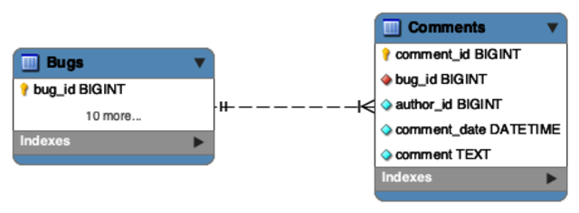
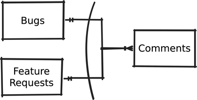
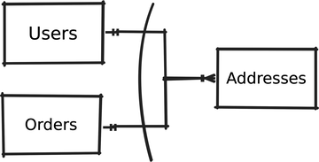
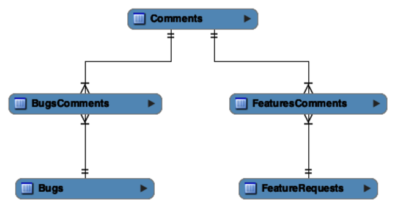
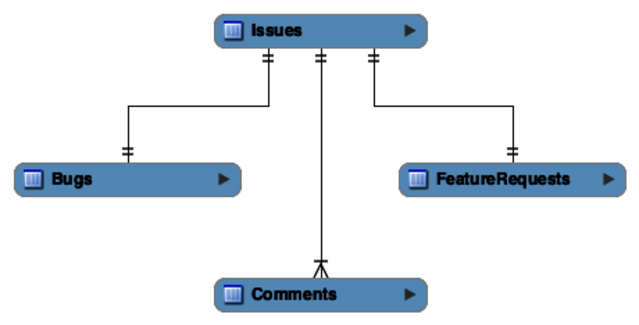

# Chapter 7: Polymorphic Associations (Promiscuous Foreign Keys)

> **"I want a comment to link to either a Bug OR a Feature, so I'll just store the ID and the Table Name."**

This is the **Polymorphic Association** antipattern. It occurs when a child table (e.g., `Comments`) tries to reference multiple possible parent tables (`Bugs`, `Features`) using a single foreign key column pair: `(parent_id, parent_type)`.

---

## 7.1 The Objective: Reference Multiple Parents
You want a unified `Comments` table.
*   A comment can belong to a `Bug`.
*   A comment can *also* belong to a `FeatureRequest`.
*   A comment can *also* belong to a `Task`.

The goal is code reuse: One comments module for everything.



---

## 7.2 The Antipattern: Dual-Purpose Foreign Key
Also called a "Promiscuous Association" because the foreign key is not faithful to one parent.



### Defining the Association
You must add a string column to name the parent table.
```sql
CREATE TABLE Comments (
  id           SERIAL PRIMARY KEY,
  issue_type   VARCHAR(20),   -- "Bugs" or "FeatureRequests"
  issue_id     BIGINT,        -- The ID (Could be Bug #1 or Feature #1)
  comment      TEXT
);
```
**The Trap**: Since `issue_id` can't rely on a single table, you skip the `FOREIGN KEY` constraint.

### Why it fails
1.  **Impossible Referential Integrity**:
    *   You can insert `issue_id = 99999` (non-existent).
    *   You can insert `issue_type = 'Banana'`.
    *   **Result**: The database cannot enforce correctness. It relies 100% on app code.

2.  **Querying is a Nightmare**:
    *   To get the parent's summary, you must outer join *every possibly parent*.
    ```sql
    SELECT c.*, 
           COALESCE(b.summary, f.summary) AS summary
    FROM Comments c
    LEFT OUTER JOIN Bugs b 
      ON c.issue_id = b.id AND c.issue_type = 'Bugs'
    LEFT OUTER JOIN FeatureRequests f 
      ON c.issue_id = f.id AND c.issue_type = 'FeatureRequests';
    ```
    *   If you add a 3rd parent (`Tasks`), you must rewrite every query in your app.

3.  **Non-Object-Oriented Logic**:
    *   Consider `Addresses` linking to `Users` OR `Orders`.
    *   Does an Order "Ship To" the same address ID as a User "Lives At"?
    *   You can't enforce "Billing Address" vs "Shipping Address" rules easily.



---

## 7.3 The Solutions: Simplify the Relationship
It’s better to redesign your database to avoid the weaknesses of Polymorphic Associations.

### Solution 1: Reverse the Reference (Intersection Tables)
Polymorphic Associations are backwards. Instead of `Comments` pointing to `Bugs`, make `Bugs` utilize `Comments` via a mapping table.
*   Create `BugsComments` (Bug ID, Comment ID).
*   Create `FeaturesComments` (Feature ID, Comment ID).



```sql
CREATE TABLE BugsComments (
  issue_id   BIGINT REFERENCES Bugs(id),
  comment_id BIGINT REFERENCES Comments(id),
  PRIMARY KEY (issue_id, comment_id)
);
-- FeaturesComments is similar...
```
*   **Querying**: To get comments for a bug, join `Bugs -> BugsComments -> Comments`.
*   **Pros**: Referential integrity is enforced. No `parent_type` column needed.
*   **Cons**: slightly more tables to manage.

### Solution 2: Create a Common Super-Table
Use "Class Table Inheritance" (see Chapter 6). Make `Bugs` and `Features` share a common ancestor table, e.g., `Issues`.
*   `Comments` now references `Issues(id)`.
*   Since every Bug is also an Issue, the FK works perfectly.



```sql
CREATE TABLE Issues (id SERIAL PRIMARY KEY); 

CREATE TABLE Bugs (
  issue_id BIGINT PRIMARY KEY REFERENCES Issues(id), -- Inherits ID
  severity VARCHAR(20)
);

CREATE TABLE Comments (
  id       SERIAL PRIMARY KEY,
  issue_id BIGINT NOT NULL REFERENCES Issues(id), -- Simple FK
  comment  TEXT
);
```
*   **Querying**: `JOIN Comments c ON b.issue_id = c.issue_id`.
*   **Pros**: The cleanest, most "Object-Oriented" database design.
*   **Cons**: Requires re-architecting existing tables to inherit from a base.

### Solution 3: Exclusive Arcs (Multiple Nullable FKs)
Explicitly link to each possible parent in the `Comments` table.
```sql
CREATE TABLE Comments (
  id          SERIAL PRIMARY KEY,
  bug_id      BIGINT REFERENCES Bugs(id),
  feature_id  BIGINT REFERENCES Features(id),
  -- Constraint: Must have exactly ONE parent
  CHECK (
    (bug_id IS NOT NULL AND feature_id IS NULL) OR
    (bug_id IS NULL AND feature_id IS NOT NULL)
  )
);
```
*   **Pros**: Enforces FK integrity without extra tables.
*   **Cons**: Need to add a column+check for every new parent type.

> **Takeaway**: Polymorphic Associations (like Rails uses) essentially disable your database's integrity features. Use **Exclusive Arcs** or a **Super-Table** to keep your data safe and clean.
