### Chapter 10: Design a Notification System - Summary

This chapter covers the design of a large-scale, multi-channel notification system. The system must support sending millions of notifications daily across three formats: mobile push notifications (iOS and Android), SMS messages, and emails. The design prioritizes scalability, reliability, and extensibility, operating in a "soft real-time" manner where slight delays under high load are acceptable.

The high-level design evolves from a simple, monolithic server to a sophisticated, distributed, and decoupled architecture. The improved design uses **message queues** to separate the initial API request handling from the actual processing and sending of notifications. This allows for independent scaling of components and acts as a buffer during traffic spikes.

The core components include:
*   **Notification Servers:** A horizontally scalable set of servers that expose APIs for other microservices to trigger notifications.
*   **Message Queues:** A dedicated queue for each notification type (iOS, Android, SMS, Email) to isolate failures and allow for tailored processing.
*   **Workers:** A pool of consumers that pull notification jobs from the queues and communicate with third-party services.
*   **Third-Party Services:** The design leverages external providers for delivery, such as Apple's APNS, Google's FCM, Twilio for SMS, and SendGrid for email.

The deep dive focuses on crucial aspects like **reliability**, ensuring no notifications are lost by persisting them to a database and implementing a robust **retry mechanism**. To handle the "at-least-once" delivery nature of distributed systems, a **deduplication** step is introduced. The design is further enhanced with features like **notification templates** for consistency, user-configurable **notification settings**, API **security**, **rate limiting** to prevent spamming users, and comprehensive **monitoring and event tracking** for analytics and system health.

---

### 1. Understand the Problem and Establish Design Scope

The goal is to design a system to send notifications across multiple channels.

*   **Description**: This image displays three common types of notifications on a smartphone: a push notification from an app, an SMS message, and an email. It visually establishes the scope of the system.

#### Requirements:
*   **Notification Types:** Mobile Push (iOS, Android), SMS, and Email.
*   **Timeliness:** Soft real-time; low latency is desired, but minor delays are acceptable.
*   **Supported Devices:** iOS, Android, Desktop/Laptop.
*   **Triggers:** Can be initiated by other services or run as scheduled jobs.
*   **User Preferences:** Users must be able to opt-out of notifications.
*   **Scale:**
    *   10 million push notifications/day
    *   1 million SMS messages/day
    *   5 million emails/day

---

### 2. High-Level Design

#### Notification Delivery Mechanisms
The system will rely on third-party services for the actual delivery of notifications.
*   **iOS Push Notification:** Our service (the **Provider**) sends a request containing a **device token** and a JSON **payload** to the **Apple Push Notification Service (APNS)**, which then pushes it to the user's device.
    *   **Description**: This diagram illustrates the high-level architecture for sending an iOS push notification. It shows the three main components: the **Provider** (our server), the **APNS** (Apple's service), and the **iOS Device**. The Provider sends a notification request to APNS, which then forwards it to the target device.
    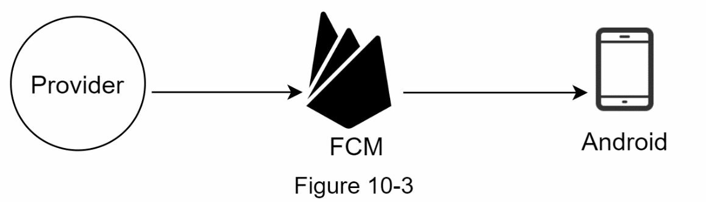
    *   **Payload Example:** The payload is a JSON dictionary containing the notification data. The `aps` dictionary holds Apple-defined keys.
    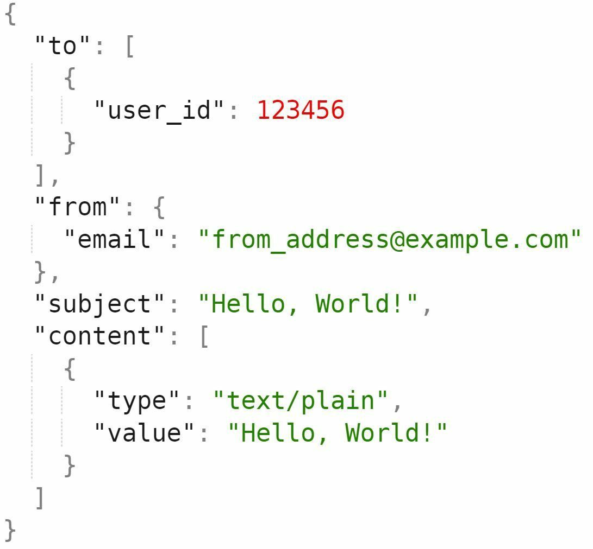
*   **Android Push Notification:** Similar to iOS, but uses **Firebase Cloud Messaging (FCM)**.
    *   **Description**: This diagram shows the Android push notification flow, which is conceptually similar to iOS. Our server sends the notification to **FCM (Firebase Cloud Messaging)**, which then delivers it to the Android device.
    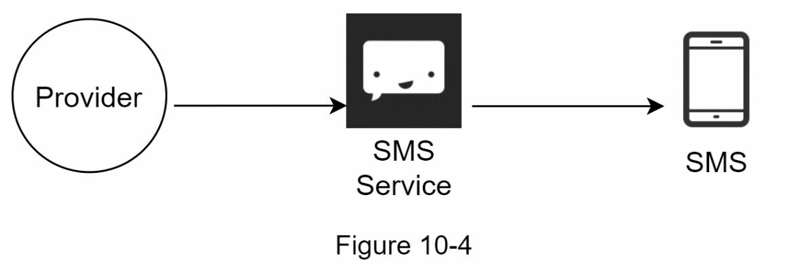
*   **SMS Message:** Uses third-party providers like **Twilio** or **Nexmo**.
    *   **Description**: This diagram illustrates how SMS messages are sent. Our server communicates with a **Third-Party SMS Service** (like Twilio), which handles the complex carrier integrations to deliver the message to the user's phone.
    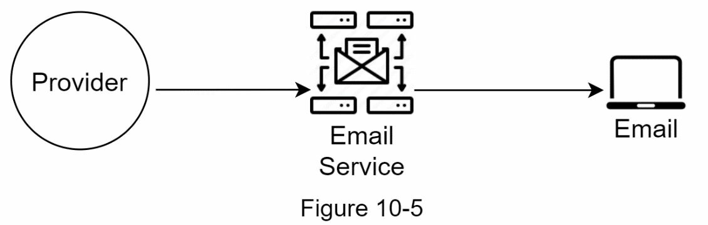
*   **Email:** Uses third-party providers like **SendGrid** or **Mailchimp** for better deliverability and analytics.

*   **Description**: This is a consolidated view showing how our Notification System integrates with various third-party services (APNS, FCM, SMS, and Email providers) to deliver notifications to different end devices.

#### Contact Info Gathering
To send notifications, the system must first collect user contact details (device tokens, phone numbers, emails). This happens when a user signs up or installs the app.

*   **Description**: This diagram shows the process of collecting a user's contact information. When a user signs up or installs the app, the client application sends their details (device token, email, phone number) to our API servers, which then store this information in a database.
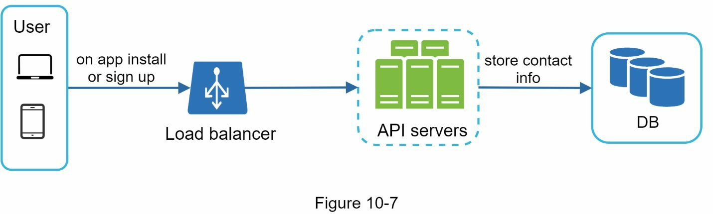
The data is stored in a database. A `user` table holds emails and phone numbers, while a `device` table links multiple device tokens to a single user.

*   **Description**: This image displays a simplified database schema for storing user contact information. A `users` table stores stable information like `user_id`, `email`, and `phone_number`. A separate `devices` table maps a `user_id` to one or more `device_tokens`, accommodating users with multiple devices.
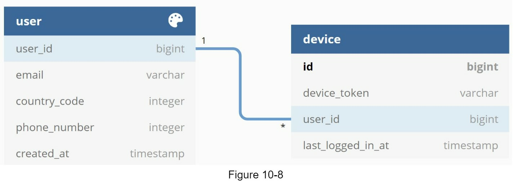

#### Notification Sending Flow (Initial vs. Improved)

**Initial Design:** A single notification server handles API requests, builds payloads, and sends them to third-party services.
*   **Description**: This shows a basic, monolithic design for the notification system. All logic—API handling, processing, and sending—is contained within a single server. This design is simple but has significant drawbacks like being a single point of failure (SPOF) and being difficult to scale.
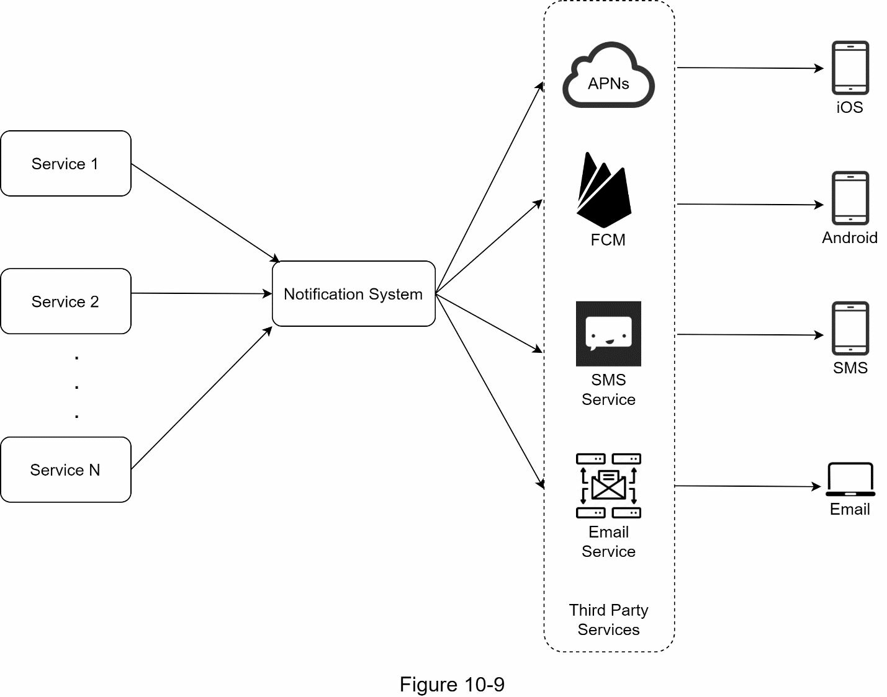
*   **Problems:** Single Point of Failure (SPOF), difficult to scale, and performance bottlenecks.

**Improved Design:** A decoupled architecture using message queues.
*   **Description**: This diagram presents a much-improved, distributed architecture. It decouples components using **Message Queues**. Notification Servers handle incoming API requests and place jobs into the queues. A separate fleet of **Workers** consumes these jobs, processing them in parallel and sending them to third-party services. This design is scalable, resilient, and avoids bottlenecks.
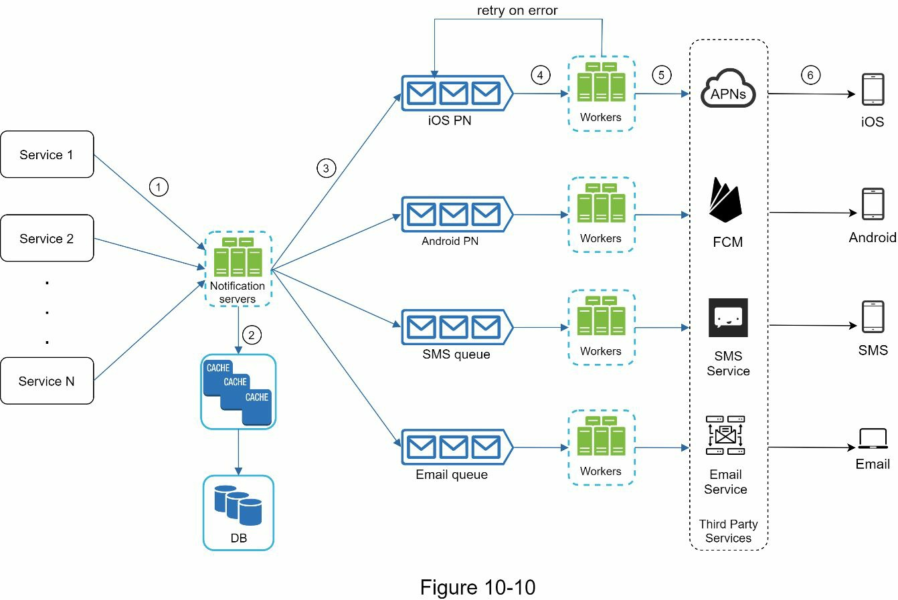
*   **Notification Servers:** A scalable tier of servers that provide an API for other services. They perform basic validation, fetch required data from a DB/cache, and then place a notification event into a message queue.
    *   **API Example:** The servers would expose an endpoint like `POST /v1/send_notification`. The request body would contain details about the recipient, sender, and content.
    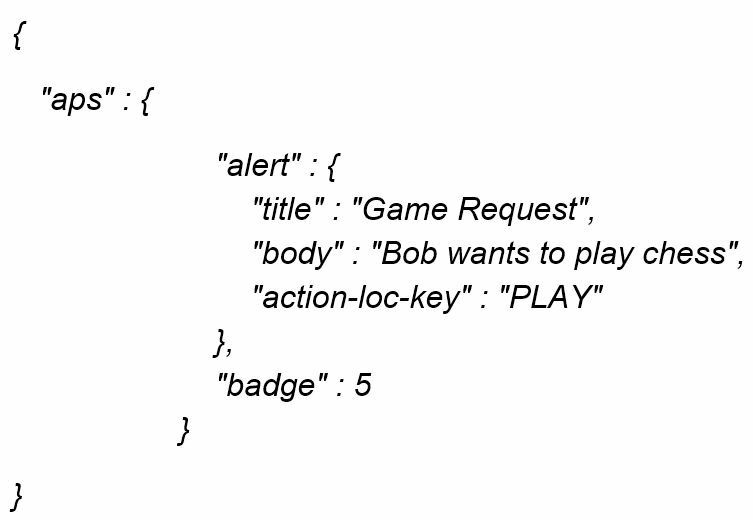
*   **Message Queues:** The system uses separate queues for each notification type (iOS, Android, SMS, Email). This isolates failures (e.g., an APNS outage won't stop SMS messages) and acts as a buffer.
*   **Workers:** A pool of servers that are the consumers of the message queues. They pull notification events, construct the final payload, and send it to the appropriate third-party service.

**Workflow:**
1.  A microservice calls the Notification Server API to send a notification.
2.  The Notification Server fetches user data from a cache or database.
3.  An event is constructed and placed into the appropriate queue (e.g., the SMS queue).
4.  A Worker from the SMS worker pool pulls the event from the queue.
5.  The Worker sends the notification to a third-party SMS service (e.g., Twilio).
6.  Twilio delivers the SMS to the user's device.

---

### 3. Design Deep Dive

#### Reliability

*   **Preventing Data Loss:** Before a notification event is placed in the message queue, its metadata is persisted to a **notification log database**. This ensures that if a server crashes or a message is lost from the queue, it can be resent.
    *   **Description**: This diagram illustrates the reliability mechanism. To prevent data loss, notification data is first persisted in a **Notification Log DB** before being sent to the message queue. This ensures that even if the message queue fails or a worker crashes, the notification can be recovered and retried from the database.
    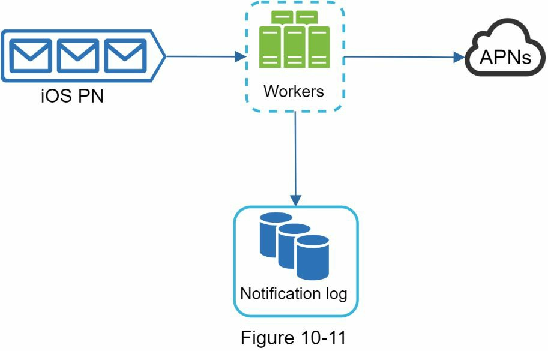
*   **"Exactly-Once" Delivery:** This is very difficult to achieve in a distributed system. The system should aim for "at-least-once" delivery and then implement a **deduplication** mechanism. When a worker processes a notification, it can check a database using the event's unique ID to see if it has already been processed.

#### Additional Components and Considerations

*   **Notification Template:** To ensure a consistent look and feel, and to avoid building notifications from scratch every time, the system uses templates. Workers fetch a template and then inject the specific parameters for a given notification.
*   **Notification Settings:** The system must respect user preferences. Before processing a notification, the worker must check a `notification_settings` table to see if the user has opted out of that specific channel.
*   **Rate Limiting:** To avoid spamming users, the notification servers should enforce a rate limit on how many notifications a single user can receive in a given time period.
*   **Retry Mechanism:** If a third-party service fails to send a notification (e.g., returns a 5xx error), the worker should place the event back into the queue to be retried later. A backoff strategy should be used. After several failed retries, an alert should be sent to developers.
*   **Security:** The Notification Server APIs must be secured. Only authenticated and authorized clients (other internal services) should be able to send notifications. This can be done using a service-to-service authentication scheme (e.g., using `appKey` and `appSecret`).
*   **Monitoring Queued Notifications:** A key health metric is the queue length. A consistently high or growing queue length indicates that the workers are not processing notifications fast enough, and the worker pool needs to be scaled up.
    *   **Description**: This is an example of a monitoring dashboard graph showing the number of messages in a queue over time. A rising trend in this graph is a key indicator that the workers are not keeping up with the rate of incoming notifications, signaling that the worker pool needs to be scaled up.
    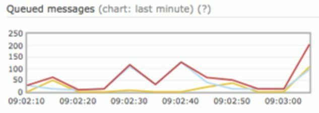
*   **Event Tracking:** To measure effectiveness, the system needs to track events like `notification_sent`, `notification_opened`, or `link_clicked`. The notification workers can send these events to an analytics service.
    *   **Description**: This diagram shows the flow of tracking data for analytics. The Notification System sends events (like `sent`, `opened`, `clicked`) to an **Analytics Service**, which processes and stores this data. This allows the business to understand user engagement with notifications.
    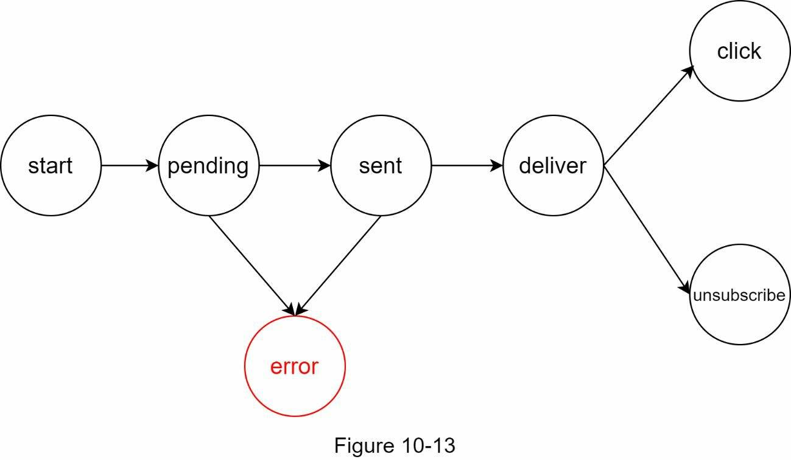

#### Updated Design

The final design incorporates all the components from the deep dive for a robust, scalable, and feature-rich system.

*   **Description**: This is the final, comprehensive system architecture diagram. It combines the improved high-level design with all the additional components from the deep dive, including **authentication**, **rate limiting**, a **retry mechanism**, **notification templates**, and integration with **monitoring and analytics** systems.

## Wrap up:

Notifications are indispensable because they keep us posted with important information. It
could be a push notification about your favorite movie on Netflix, an email about discounts
on new products, or a message about your online shopping payment confirmation.
In this chapter, we described the design of a scalable notification system that supports
multiple notification formats: push notification, SMS message, and email. We adopted
message queues to decouple system components.
Besides the high-level design, we dug deep into more components and optimizations.
• Reliability: We proposed a robust retry mechanism to minimize the failure rate.
• Security: AppKey/appSecret pair is used to ensure only verified clients can send
notifications.
• Tracking and monitoring: These are implemented in any stage of a notification flow to
capture important stats.
• Respect user settings: Users may opt-out of receiving notifications. Our system checks
user settings first before sending notifications.
• Rate limiting: Users will appreciate a frequency capping on the number of notifications
they receive.
Congratulations on getting this far! Now give yourself a pat on the back. Good job!

Reference materials
[1] Twilio SMS: https://www.twilio.com/sms
[2] Nexmo SMS: https://www.nexmo.com/products/sms
[3] Sendgrid: https://sendgrid.com/
[4] Mailchimp: https://mailchimp.com/
[5] You Cannot Have Exactly-Once Delivery: https://bravenewgeek.com/you-cannot-have-
exactly-once-delivery/
[6] Security in Push Notifications: https://cloud.ibm.com/docs/services/mobilepush?
topic=mobile-pushnotification-security-in-push-notifications
[7] RadditMQ: https://bit.ly/2sotIa6