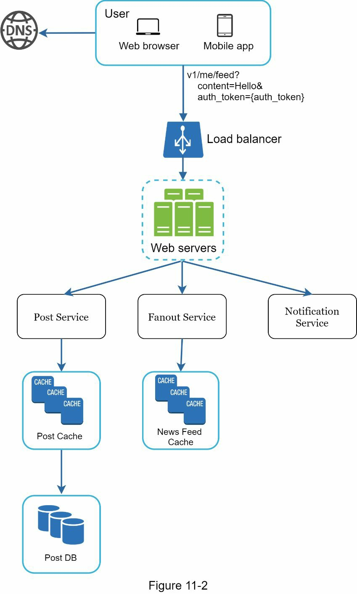
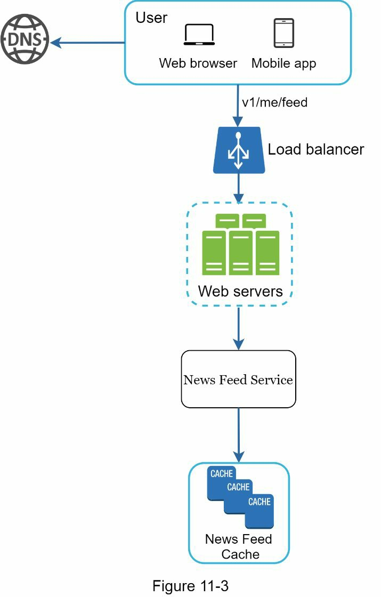
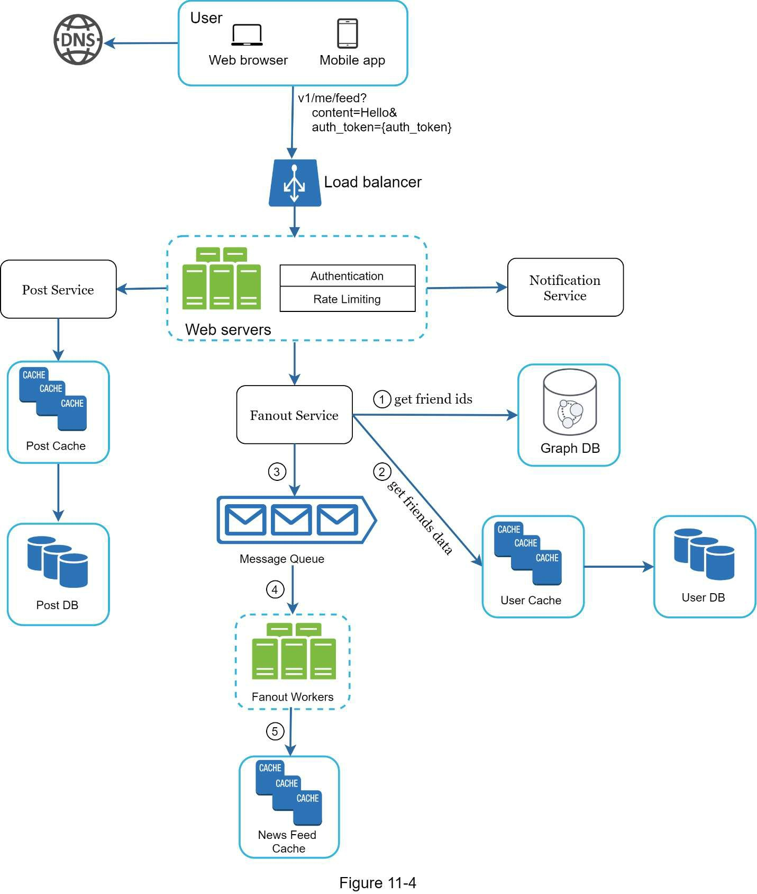
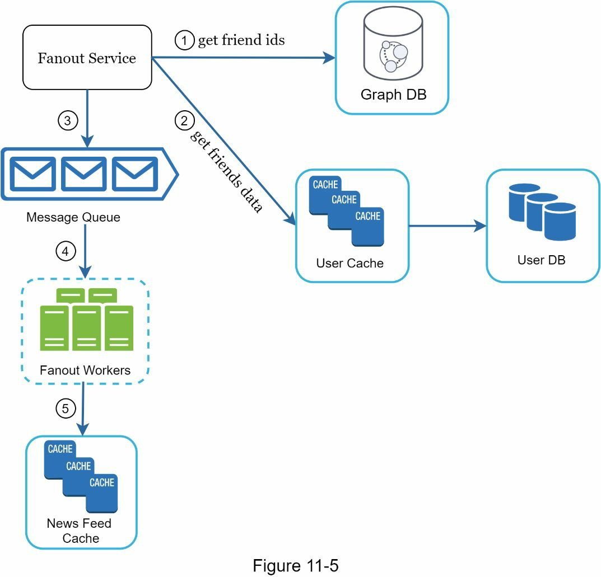
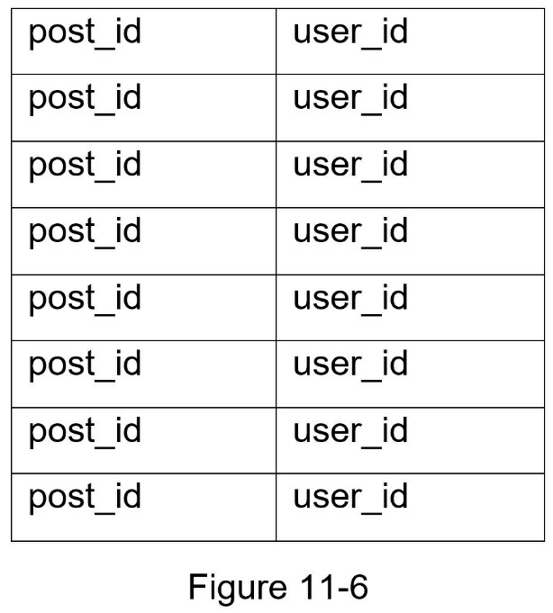
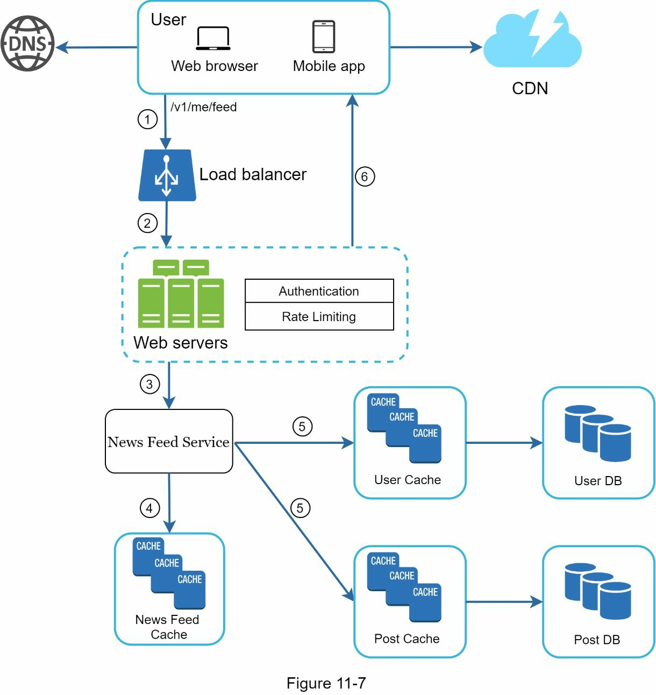
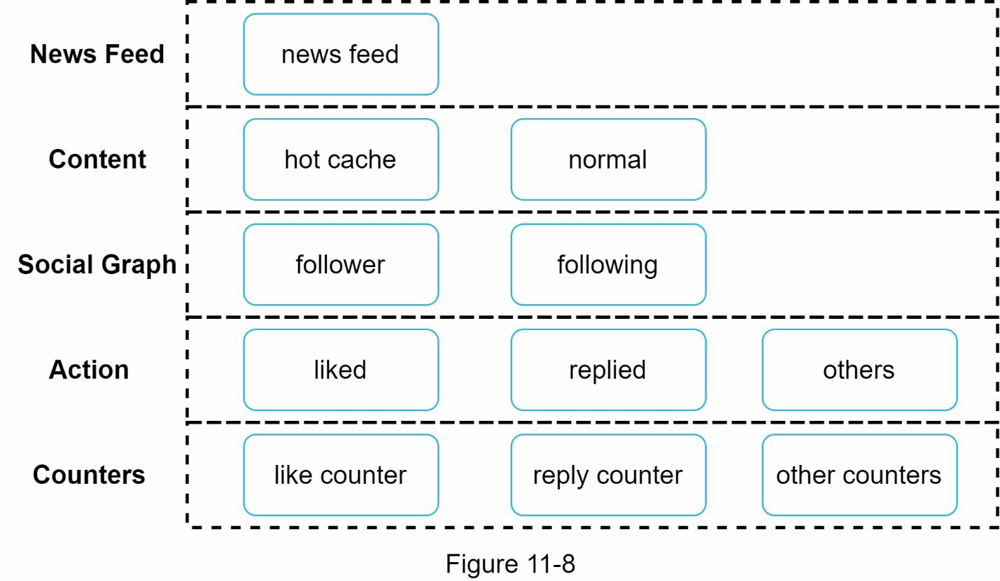

### Chapter 11: Design a News Feed System - Summary

This chapter walks through the design of a news feed system, a common interview problem similar to designing the Facebook, Instagram, or Twitter timeline. The process begins by establishing the scope: a system for both web and mobile that allows users to publish posts (including text, images, and video) and view a reverse-chronologically sorted feed of their friends' posts, designed to handle 10 million daily active users (DAU).

The core design is split into two main flows: **Feed Publishing** and **News Feed Retrieval**. The high-level architecture involves users interacting with load-balanced web servers that route requests to various backend services. For publishing, a **Post Service** persists the content, and a **Fanout Service** distributes it to friends' feeds. For retrieval, a **News Feed Service** fetches the pre-computed feed.

A deep dive explores the trade-offs between **"fanout on write" (push)** and **"fanout on read" (pull)** models for feed distribution. A hybrid model is chosen: a push model for most users to ensure fast feed loading, and a pull model for celebrities with millions of followers to prevent system overload (the "hotkey problem"). The detailed design showcases a multi-layered cache architecture, which is critical for performance, and a message-queue-based fanout system for reliability and decoupling. The chapter concludes by reinforcing key scalability principles like database sharding, stateless web tiers, and aggressive caching.

---

### 1. Requirements and Scope

*   **Platform:** Web and Mobile.
*   **Features:**
    *   Users can publish posts (text, images, videos).
    *   Users can see a news feed of their friends' posts.
*   **Feed Logic:** Sorted in reverse chronological order.
*   **Constraints:**
    *   Up to 5000 friends per user.
    *   10 million Daily Active Users (DAU).

---

### 2. High-Level Design & APIs

The system is broken down into two main processes: publishing a feed and building (retrieving) a feed.

#### APIs
*   **Feed Publishing API:** `POST /v1/me/feed`
    *   `content`: The text content of the post.
    *   `auth_token`: For user authentication.
*   **News Feed Retrieval API:** `GET /v1/me/feed`
    *   `auth_token`: For user authentication.

#### Feed Publishing Flow
When a user creates a new post, it is written to the database and cache, and then pushed out to the feeds of all their friends.

#### News Feed Building Flow
When a user requests their news feed, the system retrieves the already-prepared list of posts from a cache.

---

### 3. Deep Dive: Feed Publishing

The feed publishing flow is the "write path." It needs to be reliable and efficient at distributing a new post to potentially thousands of friends.

#### Fanout Service: Push vs. Pull Models

The core of publishing is the **fanout**—the process of delivering a post to all followers.

*   **Fanout on Write (Push Model):** The feed is pre-computed when a post is created. The new post is immediately written into the cached feed for every one of the author's friends.
    *   **Pros:** Feed retrieval is extremely fast because the work is already done.
    *   **Cons:** Can be slow for authors with millions of followers (hotkey problem). Wastes resources computing feeds for inactive users.

*   **Fanout on Read (Pull Model):** The feed is generated on-demand when a user requests it. The system must query all the people the user follows, find their latest posts, and merge them.
    *   **Pros:** No wasted work for inactive users. No hotkey problem on the write path.
    *   **Cons:** Feed retrieval is very slow and computationally expensive.

*   **Hybrid Approach (Chosen Solution):**
    *   Use **fanout on write** for the vast majority of users to ensure a fast, real-time experience.
    *   Use **fanout on read** for users with a very large number of followers (celebrities). When a normal user requests their feed, their friends' posts are already there (pushed), but they must execute a separate query to "pull" posts from any celebrities they follow.

#### Fanout Service Architecture

1.  **Get Friends:** The service fetches the author's friend list from a **social graph database/cache**.
2.  **Filter:** It filters the list based on privacy settings (e.g., a user has muted or blocked the author).
3.  **Queue Jobs:** The service pushes the new `post_id` and the list of `friend_ids` into a **message queue**. This decouples the initial request from the heavy fanout work.
4.  **Fanout Workers:** A pool of workers consumes from the message queue. For each `friend_id`, a worker inserts the `post_id` into the friend's news feed cache.
5.  **Store in Cache:** The news feed cache is a mapping from `user_id` to a list of `post_id`s. To save memory, only IDs are stored, not full post objects.

---

### 4. Deep Dive: News Feed Retrieval

The retrieval flow is the "read path." It must be extremely fast and efficient. The key is to assemble the full, user-visible feed from the list of IDs stored in the cache. This process is often called **hydration**.

**Workflow:**
1.  A user requests their feed via `GET /v1/me/feed`.
2.  The request is routed to the **News Feed Service**.
3.  The service fetches the list of `post_id`s from the **News Feed Cache** for that `user_id`.
4.  The service then "hydrates" this list by fetching the full data for each post and its author from other caches:
    *   Post content (text, media URLs) comes from the **Content Cache**.
    *   Author info (name, profile picture) comes from the **User Cache**.
    *   Engagement data (likes, comments) comes from the **Action and Counter Caches**.
    *   Media content itself (images, videos) is served from a **CDN**.
5.  The final, fully-formed data is returned to the client as a JSON response.

---

### 5. Cache Architecture

A multi-layered cache is essential for a high-performance news feed system.

*   **News Feed Cache:** `user_id -> List<post_id>`
*   **Content Cache:** `post_id -> Post Object (text, author_id, media_url)`
*   **Social Graph Cache:** `user_id -> List<friend_id>`
*   **Action Cache:** `post_id -> List<user_id who liked>, List<comment_id>`
*   **Counters Cache:** `post_id -> {like_count, comment_count}`

---

### 6. Wrap-up and Further Considerations

*   **Database Scaling:**
    *   Use master-slave replication to separate read/write traffic.
    *   Consider database sharding (e.g., by `user_id`) when data volume becomes too large for a single master.
*   **General Scalability:**
    *   Keep the web tier stateless.
    *   Cache everything possible.
    *   Use multiple data centers for availability and lower latency.
    *   Use message queues to decouple services and handle asynchronous tasks.
    *   **Monitor everything:** Key metrics include Posts per Second (writes), Feed Loads per Second (reads), and end-to-end latency for both publishing and retrieval.

Reference materials
[1] How News Feed Works:
https://www.facebook.com/help/327131014036297/
[2] Friend of Friend recommendations Neo4j and SQL Sever:
http://geekswithblogs.net/brendonpage/archive/2015/10/26/friend-of-friend-
recommendations-with-neo4j.aspx

