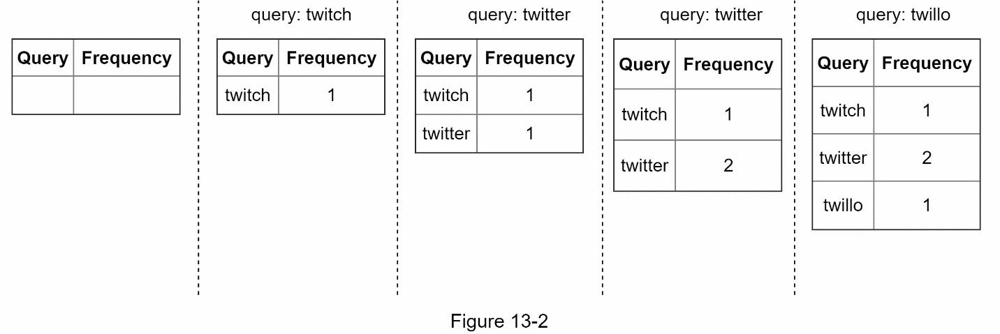
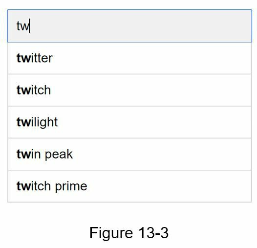
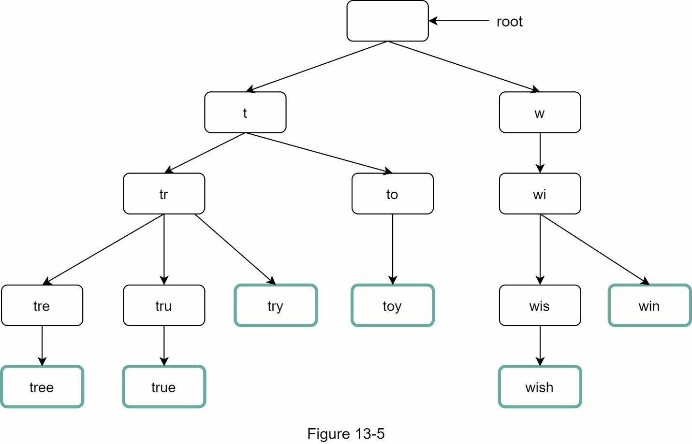
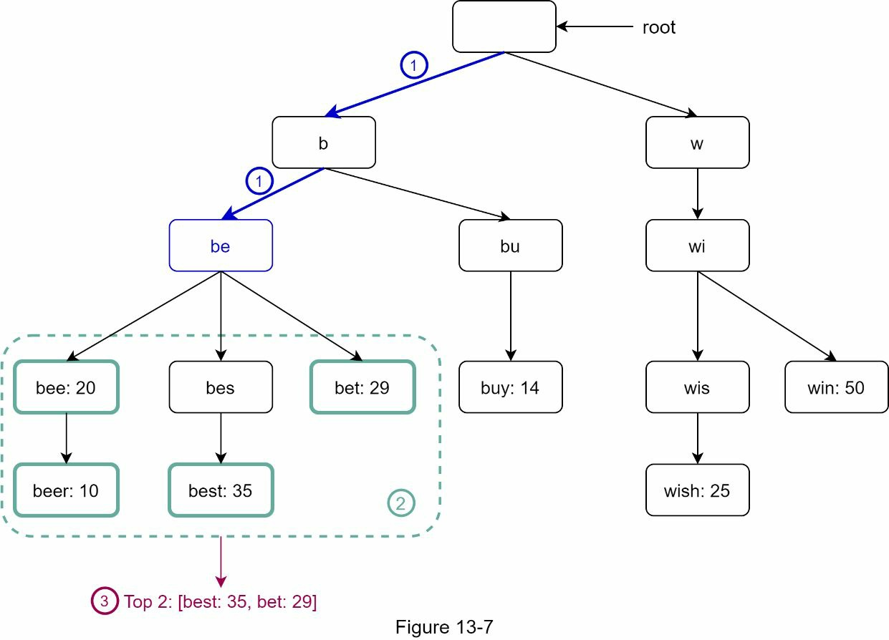
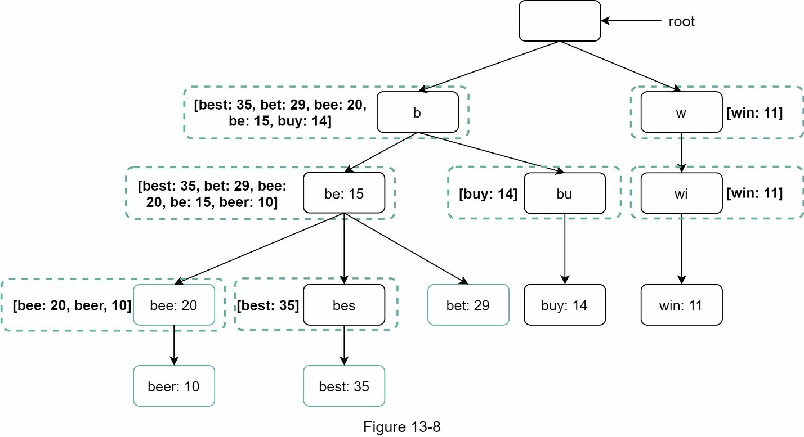
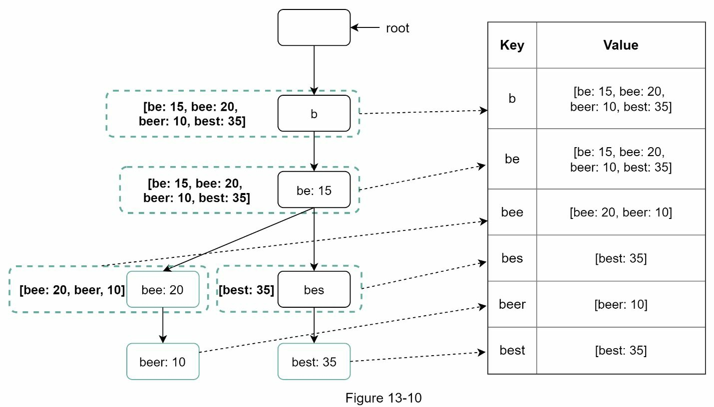
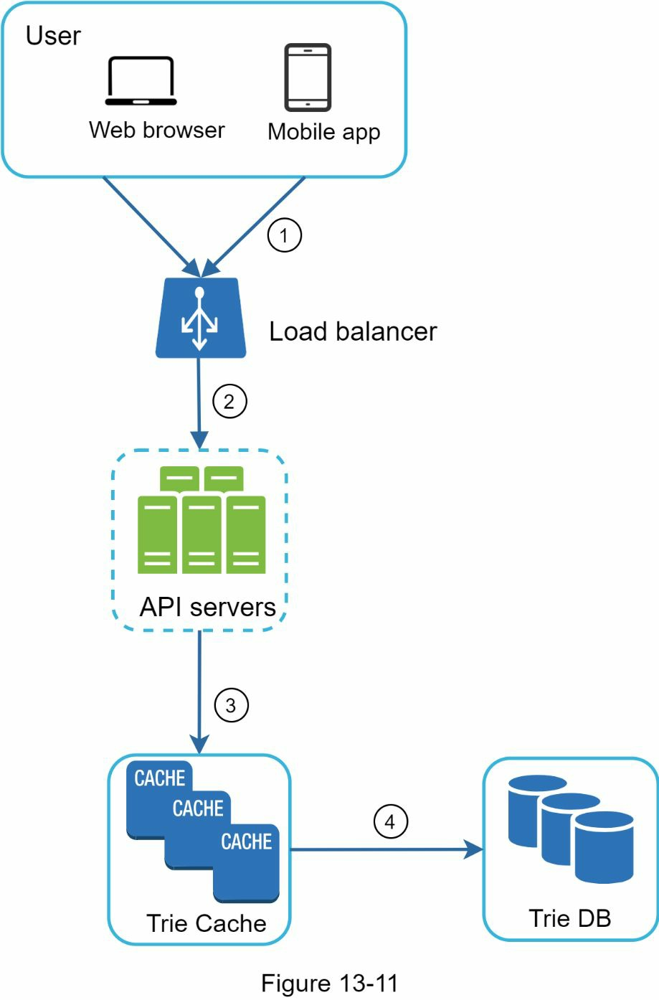
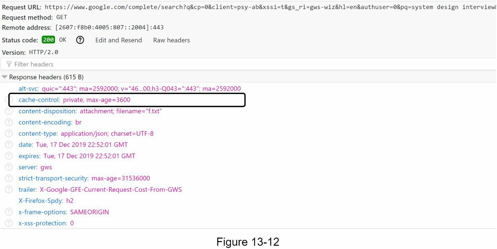
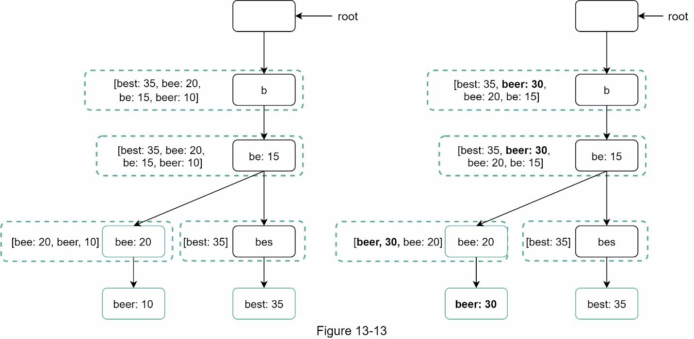
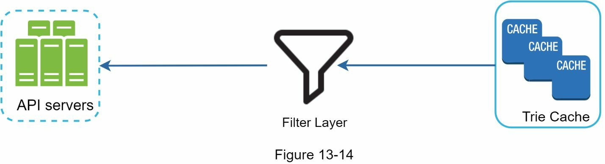

### Chapter 13: Design a Search Autocomplete System - Summary

This chapter details the design of a search autocomplete system (also known as typeahead or search-as-you-type), a feature that suggests popular search queries in real-time as a user types. The primary goal is to deliver 5 relevant, popularity-ranked suggestions within 100ms for a user base of 10 million DAU.

The core of the design is the **Trie (prefix tree)** data structure. A basic Trie is first introduced and then heavily optimized for speed by caching the top 5 most frequent queries at every single node. This crucial trade-off (using more memory to gain speed) allows the query time to be reduced to O(1).

The system is split into two main components:
1.  **Data Gathering Service:** This is an offline pipeline that collects raw search logs, aggregates them into frequency counts (e.g., weekly), and uses a set of workers to build the optimized Trie data structure. The final Trie is then stored in a persistent database (Trie DB) and pushed into a distributed cache (Trie Cache) for fast reads.
2.  **Query Service:** This is the real-time, user-facing service. When a user types a prefix, the service queries the Trie Cache, finds the node corresponding to the prefix, and immediately returns the pre-computed, cached list of top 5 suggestions.

The chapter also covers scalability challenges. To handle a Trie that is too large to fit on a single server, a smart **sharding** mechanism is proposed. Instead of naively sharding by the first letter (which leads to uneven data distribution), a **Shard Map Manager** is used to create balanced shards based on historical data patterns. Finally, it discusses extensions for multi-language support, regional results, and handling real-time trending queries using stream processing.

---

### 1. Requirements and Scope

*   **Core Functionality:** Return the top 5 most popular search queries that match a given prefix.
*   **Performance:** Must respond within **100ms**.
*   **Relevance:** Suggestions are based on historical search frequency.
*   **Scale:** 10 million Daily Active Users (DAU).
*   **Constraints:**
    *   Matching is only at the beginning of a query.
    *   No spell check.
    *   Queries are lowercase English letters.

#### Back-of-the-Envelope Estimation
*   **DAU:** 10 million
*   **Searches per user/day:** 10
*   **Requests per search:** ~20 (one for each character typed)
*   **QPS (Queries Per Second):** ~24,000
*   **Peak QPS:** ~48,000
*   **New data per day (20% of queries are new):** ~0.4 GB

---

### 2. High-Level Design (Initial Proposal)

The initial, simplified design consists of two parts.

*   **Data Gathering Service:** User queries are collected and their frequencies are stored in a frequency table.
    
*   **Query Service:** Given a prefix, the service queries a relational database to find the top 5 matching queries.
    *   Example query for prefix "tw":
        ```sql
        SELECT * FROM frequency_table WHERE query LIKE 'tw%' ORDER BY frequency DESC LIMIT 5;
        ```
    *   **Problem:** This is too slow for a large dataset. Database access will be a bottleneck.

*Table 13-1: Example Frequency Table*
| Query          | Frequency |
|----------------|-----------|
| twitch         | 100       |
| twitter        | 200       |
| google         | 500       |
| amazon         | 400       |
| facebook       | 800       |
| tripadvisor    | 150       |
| twitch prime   | 300       |
| twitter-search | 250       |



---

### 3. Deep Dive: Optimized Design

#### The Trie Data Structure

A Trie is a tree-like data structure perfect for storing strings and enabling efficient prefix searches.

*   **Basic Trie:** Each node represents a character. A path from the root to a node forms a prefix.
    

*   **Trie with Frequency:** To rank suggestions, we store the frequency of each complete query word in its terminal node.

*Table: Example Query Frequencies for Trie*
| Query | Frequency |
|-------|-----------|
| tree  | 10        |
| try   | 29        |
| true  | 35        |
| toy   | 12        |
| wish  | 25        |
| win   | 50        |


*   **The Problem with the Basic Trie:** Finding the top K suggestions is slow. You have to:
    1.  Find the prefix node: `O(p)` where `p` is prefix length.
    2.  Traverse the entire subtree from that node to find all possible queries. `O(c)` where `c` is number of child nodes.
    3.  Sort the results: `O(c log c)`.
    This is far too slow for the 100ms requirement.



#### Trie Optimization: Caching at Nodes

The key optimization is to pre-compute and **cache the top 5 suggestions at every node in the trie**.

*   **How it works:** Every node stores a list of the 5 most frequent words that can be formed from its prefix. For example, the node for "be" would store `[best, bet, bee, be, beer]`.
*   **Trade-off:** This uses significantly more memory, but it makes the query time incredibly fast. We trade space for time.



*   **Final Time Complexity:**
    1.  Find the prefix node: `O(p)`. We can cap the prefix length to make this `O(1)`.
    2.  Return the cached list: `O(1)`.
*   The total time complexity is now **O(1)**, which meets our performance requirement.

#### Data Gathering Service (Optimized)

Updating the trie in real-time is impractical. An offline batch process is much more scalable.


1.  **Analytics Logs:** Raw search queries are continuously logged. This is an append-only, large-scale data store.

*Table 13-3: Example Analytics Log*
| Query   | time                |
|---------|---------------------|
| twitch  | 2018-10-01 10:00:01 |
| twitter | 2018-10-01 10:00:02 |
| twitter | 2018-10-01 10:00:05 |
| twillo  | 2018-10-01 10:00:06 |

2.  **Aggregators:** A batch job (e.g., MapReduce) runs periodically (e.g., weekly) to process the raw logs and aggregate them into a frequency table.

*Table 13-4: Example Aggregated Data*
| time       | query   | frequency |
|------------|---------|-----------|
| 2018-09-24 | twitch  | 1000      |
| 2018-09-24 | twitter | 2500      |
| 2018-09-24 | twillo  | 300       |

3.  **Workers:** A set of servers that takes the aggregated frequency data and builds the optimized Trie data structure from scratch.
4.  **Trie DB:** A persistent database (e.g., a document store or key-value store) where the serialized Trie is stored.
5.  **Trie Cache:** A distributed cache (like Redis) that holds the entire Trie in memory for the Query Service to access with low latency. It is loaded from the Trie DB after each build cycle.



#### Query Service (Optimized)

This is the real-time read path.



1.  A user types a prefix, and the client sends an **AJAX request** to the API servers.
2.  The API server queries the **Trie Cache** for the node corresponding to the prefix.
3.  The pre-computed list of top 5 suggestions is retrieved from the node and returned to the client.
4.  The response includes a **browser caching** header (e.g., `cache-control: private, max-age=3600`) so that repeated requests for the same prefix within a short time are served from the browser's local cache.



#### Trie Operations and Maintenance

*   **Create:** The Trie is created from scratch by offline workers on a regular schedule (e.g., weekly).
*   **Update:** The simplest update strategy is to replace the old Trie with the newly built one at the end of each cycle. Updating individual nodes is complex because changes must be propagated up to all ancestor nodes.

*   **Delete:** To remove unwanted suggestions (e.g., offensive content), a **Filter Layer** is placed in front of the Trie Cache. This allows for immediate filtering of results before they are sent to the user. The actual physical deletion from the source logs happens asynchronously.


#### Scaling the Storage (Sharding)

If the Trie is too large for one server's memory, it must be sharded.

*   **Problem with Naive Sharding:** Sharding based on the first letter (e.g., Server 1 for 'a'-'m', Server 2 for 'n'-'z') leads to uneven distribution, as some letters are far more common prefixes than others.
*   **Smart Sharding Solution:** Use a **Shard Map Manager**. This component analyzes historical data to create a map that distributes prefixes evenly. For example, 's' might get its own shard, while 'u' through 'z' are grouped together on another shard. The API server consults the Shard Map Manager to know which shard to query for a given prefix.


---

### 4. Wrap-up and Further Considerations

*   **Multi-Language Support:** Use Unicode characters in the Trie nodes instead of just ASCII.
*   **Regional Results:** Build separate Tries for different regions/countries and use CDNs to host them closer to the users for lower latency.
*   **Trending/Real-Time Queries:** The weekly batch design cannot handle trending topics. A real-time system would require:
    *   A separate, smaller Trie for recent queries that is updated more frequently.
    *   A ranking model that gives more weight to recent queries.
    *   **Stream processing** technologies (like Kafka, Spark Streaming) to process a continuous flow of query data instead of batching it.
